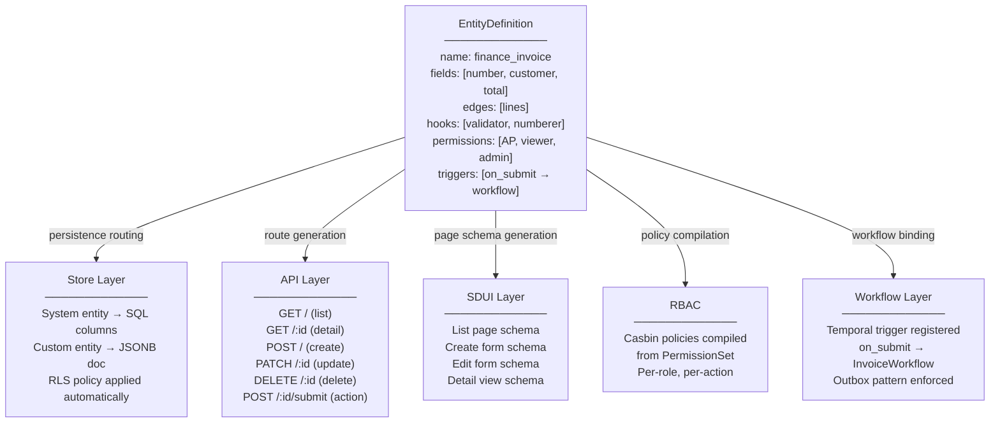
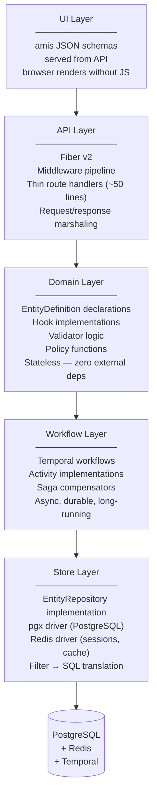
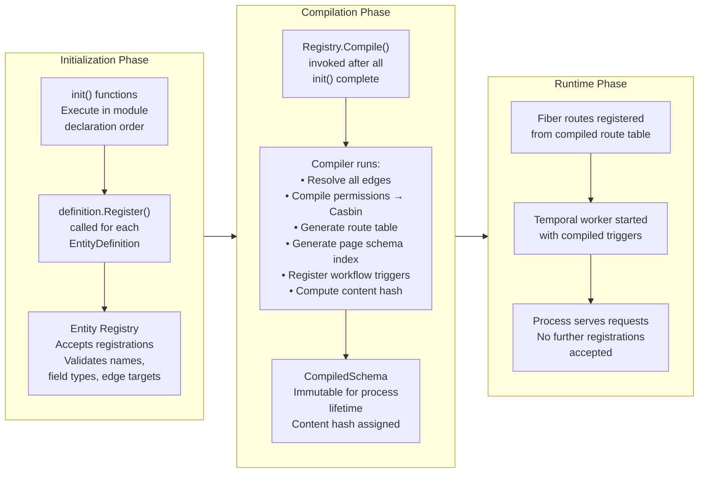
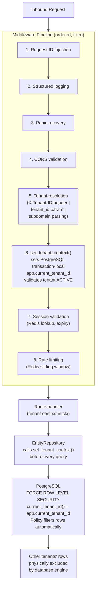
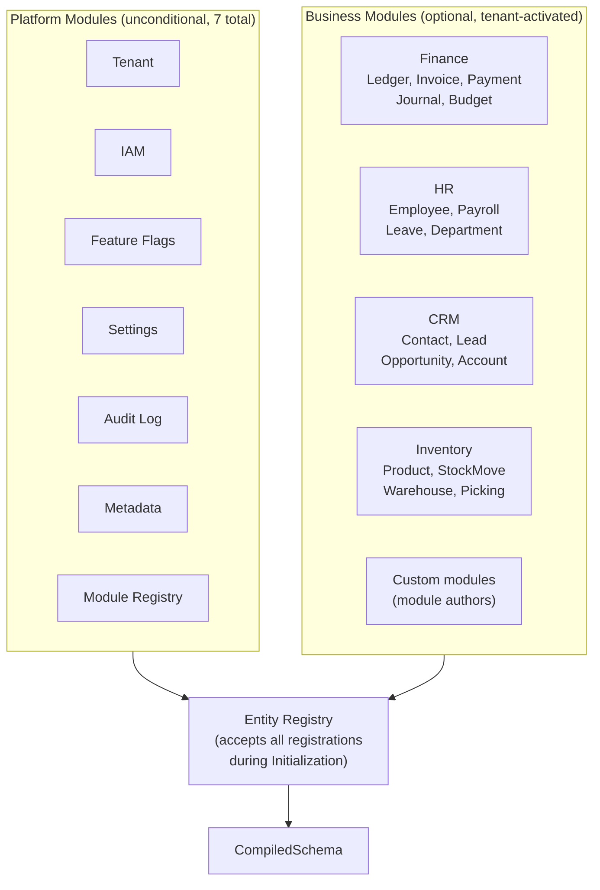
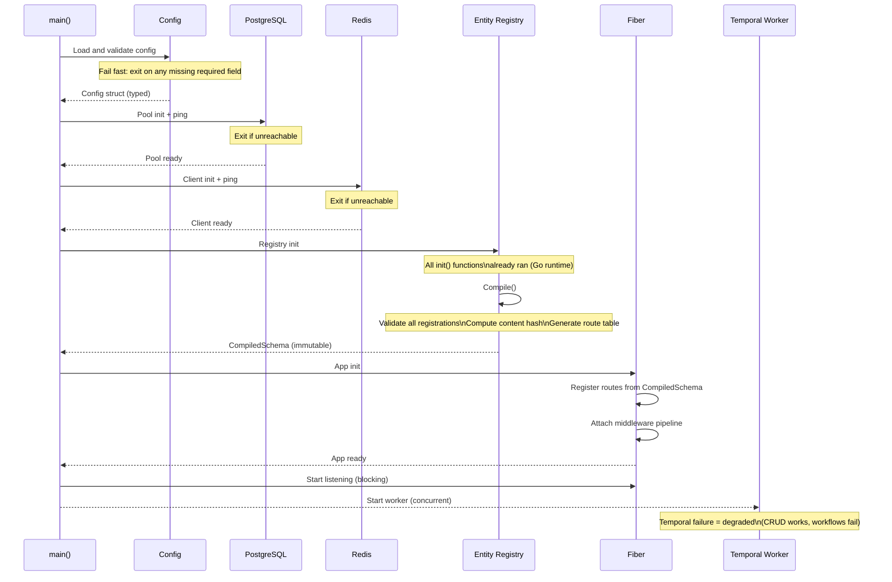
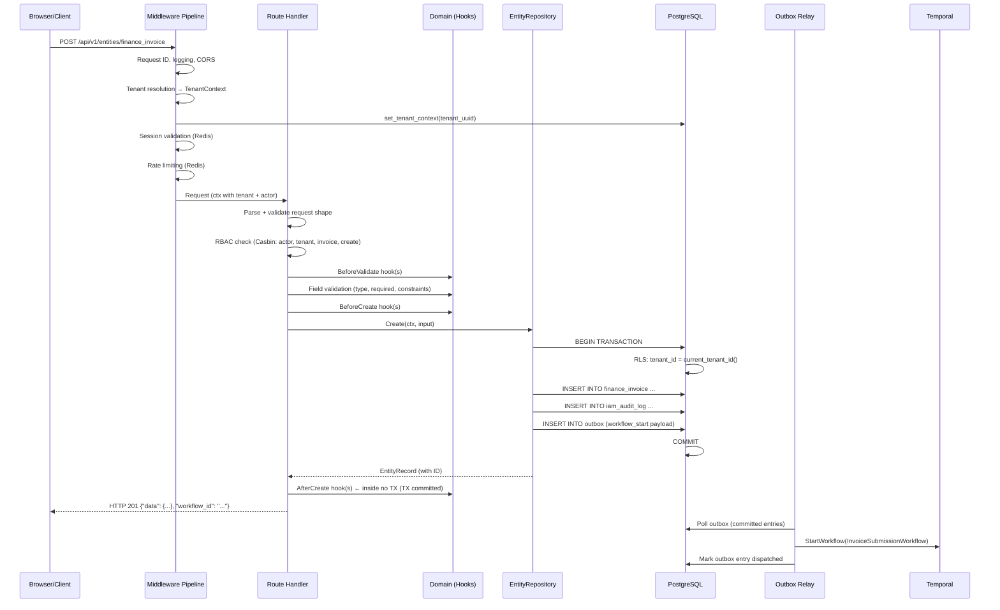
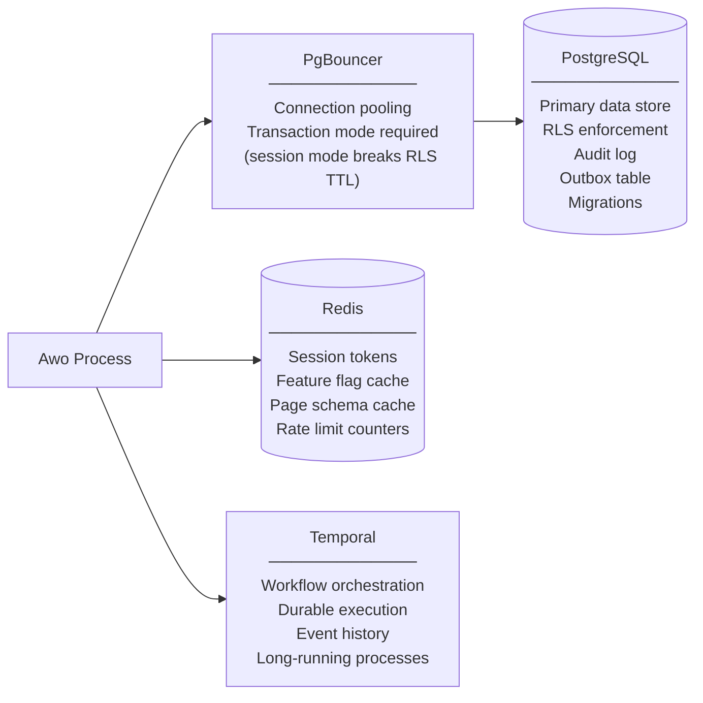

# Architecture Overview

**INTRO-003 | Status: Accepted | Stability: Stable**

This document provides a structural view of the Awo Framework at the ten-thousand-foot level. It describes how the major subsystems relate, how data flows through the system, and why the structure is what it is. It does not specify behavior — that is the responsibility of the normative documents in `02-architecture/` through `15-security/`.

Read this document after [Philosophy](philosophy.md) and [Design Goals](design-goals.md). It assumes familiarity with the five axioms and the explicit goals.

---

## Table of Contents

1. [The Central Primitive: EntityDefinition](#1-the-central-primitive-entitydefinition)
2. [Five-Layer Architecture](#2-five-layer-architecture)
3. [The Compilation Pipeline](#3-the-compilation-pipeline)
4. [Structural Multi-Tenancy](#4-structural-multi-tenancy)
5. [The Module System](#5-the-module-system)
6. [Startup Sequence](#6-startup-sequence)
7. [Request Lifecycle](#7-request-lifecycle)
8. [Infrastructure Dependencies](#8-infrastructure-dependencies)
9. [What Is Not In The Framework](#9-what-is-not-in-the-framework)

---

## 1. The Central Primitive: EntityDefinition

Every significant structure in Awo traces back to one declaration: the [EntityDefinition](../GLOSSARY.md#entitydefinition).

An EntityDefinition is a Go struct that declares everything about an entity: its name, its fields, its edges to other entities, its lifecycle hooks, its permission policies, its SDUI page builders, and its workflow triggers. It is not a configuration file. It is the input to a compilation step that produces the entity's behavior across five subsystems simultaneously.



> **Figure 1.** A single `EntityDefinition` declaration drives five subsystems simultaneously. The declaration is processed once, at compilation. The outputs — routes, page schemas, policies, workflow bindings — are all derived from the same source.

The significance of this design cannot be overstated. In a conventional framework, these five subsystems are configured or programmed independently. A developer writes a route handler, separately configures permissions, separately builds a UI, separately registers a webhook. Inconsistency across these independent configurations accumulates silently: the permission check misses an action, the UI form allows a field the permission denies, the webhook fires for events the UI does not expose.

In Awo, the configuration exists once. The five outputs are derived automatically. Inconsistency is structurally prevented because there is only one source.

---

## 2. Five-Layer Architecture

Awo's runtime is structured in five layers with a strict top-down dependency rule: no layer may import from a layer above it.



> **Figure 2.** Five-layer architecture. Arrows indicate permitted dependency direction. The Domain Layer has no external dependencies — it imports only from the framework's definition packages and Go standard library.

### Layer Responsibilities

**UI Layer** — The amis renderer running in the browser. Consumes [Page Schema](../GLOSSARY.md#page-schema) JSON documents served by the API layer. Has no knowledge of entity implementation details; it only knows the schema. No custom JavaScript is required for standard ERP views.

**API Layer** — Fiber v2 HTTP server. Handles request parsing, the [Middleware Pipeline](../GLOSSARY.md#middleware-pipeline), authentication, tenant resolution, rate limiting, and response serialization. Route handlers are thin — they validate input shape, delegate to the Domain layer, and serialize the result. Handlers longer than ~50 lines are a code smell.

**Domain Layer** — The stateless core. Contains [EntityDefinition](../GLOSSARY.md#entitydefinition) declarations, [HookRegistration](../GLOSSARY.md#hookregistration) implementations, [Policy Functions](../GLOSSARY.md#policy-function-policyfunc), and validators. Has no imports from the API or Workflow layers. Can be tested without any running infrastructure.

**Workflow Layer** — Temporal workflow functions and [Activity](../GLOSSARY.md#activity-temporal) implementations. Handles long-running, durable, asynchronous processes: multi-step approval chains, email dispatch, external API calls, saga compensations. Activities are independently retried and independently testable.

**Store Layer** — The only layer that communicates with external infrastructure (PostgreSQL, Redis). Translates [Filter DSL](../GLOSSARY.md#filter-dsl) expressions into SQL, manages connection pooling via PgBouncer, and implements the [EntityRepository](../GLOSSARY.md#entityrepository) interface backed by `pgx`.

### The Import Rule

This rule is absolute: no layer may import from a layer above it. Violation of this rule creates circular dependencies and, more importantly, couples subsystems that must remain independent for testing, reasoning, and future decomposition.

In practice:
- Domain layer code that needs to trigger a workflow does so by returning a result that the API layer passes to the Workflow layer. Domain code does not import Temporal.
- Store layer code that encounters an error does not format an HTTP response. It returns a typed error that the API layer maps to HTTP status codes.

---

## 3. The Compilation Pipeline

The framework distinguishes between two operational phases that never overlap: Initialization and Runtime.



> **Figure 3.** The three phases of Awo startup. The Registry accepts registrations only during Initialization. Compilation is a one-time transformation that produces the immutable CompiledSchema. The Runtime phase never modifies the schema.

### Why Three Phases Matter

**Registry.Compile() is a barrier.** After it is called, no `definition.Register()` call succeeds. This prevents race conditions in route registration and ensures that the compiled route table is complete before the HTTP server starts accepting connections.

**Compilation validates the entire schema.** An entity that references an edge target that was not registered fails at compilation — before the process accepts any traffic. An entity that uses a `FieldType` that has no registered handler fails at compilation. A permission that references a role that does not exist fails at compilation. The process exits with a clear error message. No invalid schema ever reaches the runtime.

**The CompiledSchema carries a content hash.** The content hash is the SHA-256 of the canonical serialization of the full schema. Two instances of the same binary, started with the same configuration, must produce identical content hashes. If they do not, [schema divergence](../GLOSSARY.md#schema-divergence) has occurred and the deployment is in a defect state.

---

## 4. Structural Multi-Tenancy

Multi-tenancy in Awo is enforced at three levels simultaneously. The levels are independent — no single level's failure causes tenant data to leak.



> **Figure 4.** Three-level tenant isolation: middleware (resolves and injects context), application (EntityRepository enforces context on every query), database (RLS excludes rows from other tenants at the database engine level). All three levels operate independently.

### Level 1: Middleware — Tenant Resolution

Every inbound request passes through the Middleware Pipeline in fixed order. Tenant resolution (step 5) determines the current [TenantContext](../GLOSSARY.md#tenantcontext) from the request. If tenant resolution fails, the request is rejected with HTTP 400 before any application logic executes.

### Level 2: Application — set_tenant_context()

After tenant resolution, `set_tenant_context($tenant_uuid)` is called. This stored procedure:
1. Validates the tenant exists in the `tenants` global table
2. Validates the tenant's status is `ACTIVE` (returns 402 for SUSPENDED, 410 for ARCHIVED, 503 for PENDING)
3. Calls `SET LOCAL "app.current_tenant_id" = $1` — a transaction-local PostgreSQL variable

The `LOCAL` keyword makes the setting transaction-local. It resets automatically on COMMIT or ROLLBACK. **This requires PgBouncer in transaction mode** — session mode would cause the setting to persist across connections in a way that is not reset between requests.

### Level 3: Database — Row-Level Security

Every tenant-scoped table has:

```sql
ALTER TABLE finance_invoice ENABLE ROW LEVEL SECURITY;
ALTER TABLE finance_invoice FORCE ROW LEVEL SECURITY;
CREATE POLICY tenant_isolation ON finance_invoice
    USING (tenant_id = current_tenant_id());
```

`current_tenant_id()` is a PostgreSQL function that reads `app.current_tenant_id`. If that variable is not set — because `set_tenant_context()` was not called — `current_tenant_id()` returns NULL and the USING clause excludes all rows.

`FORCE ROW LEVEL SECURITY` means the policy applies even to the table owner. Application code running as the owner role cannot bypass the policy.

---

## 5. The Module System

Awo's functionality is organized into [modules](../GLOSSARY.md#module). A module is a cohesive unit that owns a set of entities, their migrations, hooks, services, handlers, and workflows.



> **Figure 5.** Module types. Platform modules are unconditional — present in every deployment. Business modules are optional and controlled per tenant by the Module Registry.

### Platform Modules

Seven platform modules live in `internal/platform/` and are unconditional. They are not optional, cannot be disabled, and use the same patterns as business modules (EntityDefinition, Register(), PolicyFunc, HookDef, migrations). There is no special framework path for platform modules.

| Module | Responsibility |
|---|---|
| Tenant | Tenant lifecycle, provisioning, status machine |
| IAM | Users, roles, permissions, sessions, authentication |
| Feature Flags | Per-tenant boolean switches, Redis-cached |
| Settings | Hierarchical configuration: system → tenant → branch |
| Audit Log | Tamper-evident mutation records, legal compliance |
| Metadata | Runtime custom field definitions |
| Module Registry | Tracks installed/activated business modules per tenant |

### Business Modules

Business modules (Finance, HR, CRM, Inventory, and custom modules built by module authors) are registered at startup but may be activated or deactivated per tenant through the Module Registry. Activation state controls feature availability — it does not control code loading (all modules are compiled into the binary).

### Module Directory Layout

All modules — platform and business — use the same directory structure:

```
internal/{platform|core}/<module>/
    <module>.go       ← init() calls definition.Register()
    definition.go     ← EntityDefinition variable declarations
    policy.go         ← PolicyFunc implementations
    hooks.go          ← HookDef implementations
    service.go        ← Thin service layer on EntityRepository
    handler.go        ← Custom HTTP handlers (beyond standard CRUD)
    migrations/
        YYYYMMDDHHMMSS_create_<table>.up.sql
        YYYYMMDDHHMMSS_create_<table>.down.sql
```

---

## 6. Startup Sequence

The startup sequence is a hard dependency chain. Each step must succeed before the next begins. Failures at any step produce a process exit with a descriptive error.



> **Figure 6.** Startup sequence. PostgreSQL, Redis, and Entity Registry compilation are hard dependencies — process exits on failure. Temporal worker startup is concurrent and its failure produces degraded operation rather than process exit.

### Failure Modes

| Component | Failure during startup | Failure during operation |
|---|---|---|
| Config validation | Process exits with error | N/A (config is immutable after load) |
| PostgreSQL | Process exits | HTTP 503 on affected requests |
| Redis | Process exits | HTTP 503 on all auth (session validation requires Redis) |
| Entity Registry | Process exits | N/A (registry is sealed after compilation) |
| Temporal worker | Degraded (CRUD works) | Workflow starts fail; entity records saved; retry queue active |

---

## 7. Request Lifecycle

Once the process is serving requests, a typical create-entity request follows this path:



> **Figure 7.** Request lifecycle for a create operation. The [Outbox Pattern](../GLOSSARY.md#outbox-pattern-transactional-outbox) ensures the workflow starts even if the process crashes between the database commit and the Temporal API call.

### Key Points About the Lifecycle

**Hooks execute in declared order.** `BeforeValidate` hooks run first, then field validation, then `BeforeCreate` hooks, then the database operation. `AfterCreate` hooks run after the transaction commits. The execution order is deterministic and declared in the [HookRegistration](../GLOSSARY.md#hookregistration).

**RBAC is checked before any domain logic.** An actor without permission for `create` on `finance_invoice` is rejected at the RBAC check, before any hooks execute.

**Privacy policies inject WHERE predicates automatically.** If the entity's [Policy Function](../GLOSSARY.md#policy-function-policyfunc) restricts reads to records owned by the current actor, that predicate is injected automatically into every query by the EntityRepository. No hook or handler needs to apply it manually.

**The Outbox is written in the same transaction.** If the entity insert succeeds but the process crashes before the outbox relay runs, the outbox entry survives the crash. The relay will dispatch the workflow start on the next process start. The entity record is never committed without a corresponding outbox entry.

---

## 8. Infrastructure Dependencies



> **Figure 8.** Infrastructure dependencies. PgBouncer sits between Awo and PostgreSQL. Transaction mode is required — session mode prevents proper RLS TTL reset. All three dependencies are hard requirements for full operation.

### PostgreSQL

The only entity persistence store. Awo uses PostgreSQL-specific features that have no equivalents in other databases: `FORCE ROW LEVEL SECURITY`, transaction-local `set_config()`, `CREATE INDEX CONCURRENTLY`, `numeric(20,4)`, GIN indexes, `tsvector`. PostgreSQL is not interchangeable.

Version requirement: PostgreSQL 14+ (for improved RLS performance) with the `pg_trgm` extension for trigram indexes.

### PgBouncer

Connection pooler running in **transaction mode**. Each transaction gets a connection from the pool; the connection returns to the pool on COMMIT or ROLLBACK. Session mode is prohibited: it would cause the transaction-local `app.current_tenant_id` variable set by `set_tenant_context()` to persist incorrectly across requests sharing a connection.

### Redis

Used for four purposes with distinct key patterns:

| Purpose | Key Pattern | TTL |
|---|---|---|
| Session tokens | `session:{token}` | Session expiry |
| Feature flag cache | `eval:{SHA256(flag+tenant+user)}` | 5 minutes |
| Page schema cache | `page:{entity}:{version}:{tenant}` | 5 minutes |
| Rate limit counters | `rl:{tenant}:{user}:{window}` | Window duration |

Redis is not the source of truth for any persistent data. PostgreSQL is. Redis failure degrades gracefully for feature flags and page schema cache. Redis failure causes hard failure for session validation — correct security behavior, because the session store is the authentication state.

### Temporal

Durable workflow execution platform. Temporal handles: workflow persistence across crashes, automatic replay from checkpoints, event history (months retention), and signal-based gates for long-running approval chains. Temporal failure produces degraded operation (CRUD routes work; workflow starts fail gracefully and are recorded for retry).

---

## 9. What Is Not In The Framework

Understanding what Awo does not provide is as important as understanding what it does.

**Authentication mechanisms** — Awo validates sessions (Redis lookup, expiry check) but does not implement authentication protocols (OAuth2, SAML, LDAP, OTP). The IAM module provides password-based authentication for the reference implementation. Enterprise SSO is provided by integrating an identity provider with the session creation endpoint.

**Business logic** — The framework provides the scaffolding (hooks, services, actions) but not the domain logic. An entity with a hook that calls `TODO: implement` is structurally complete but behaviorally incomplete. Module authors provide the domain logic.

**Data visualization** — amis provides tables and basic charts. Complex analytical dashboards, custom visualizations, and real-time data views are not provided. They require custom SDUI renderer implementations or external BI tooling.

**Email and notification delivery** — The framework provides the Activity pattern for notification delivery. The actual email client, SMS gateway, or push notification service is an infrastructure dependency provided by the deployment, not by the framework.

**Multi-language (i18n)** — amis has internationalization support. The framework does not provide translation infrastructure, translation file management, or locale-specific formatting beyond the EAT timezone serialization for Kenyan tenants.

**Background job scheduling** — Long-running scheduled processes use Temporal's schedule functionality. The framework does not provide a cron-like scheduler.

---

## Related Documents

- [Philosophy](philosophy.md) — the five axioms behind this architecture
- [Design Goals](design-goals.md) — the formal goals this architecture satisfies
- [Architecture Laws](../02-architecture/laws.md) — normative rules derived from this structure
- [Architecture Invariants](../02-architecture/invariants.md) — runtime properties this structure guarantees
- [EntityDefinition](../03-kernel/entity-definition.md) — the central primitive described in §1
- [Compilation Pipeline](../03-kernel/compilation-pipeline.md) — detailed specification of §3
- [Tenancy Model](../06-tenancy/tenant-model.md) — detailed specification of §4
- [Module System](../10-modules/module-system.md) — detailed specification of §5
- [Glossary](../GLOSSARY.md) — canonical definitions for all terms used here
