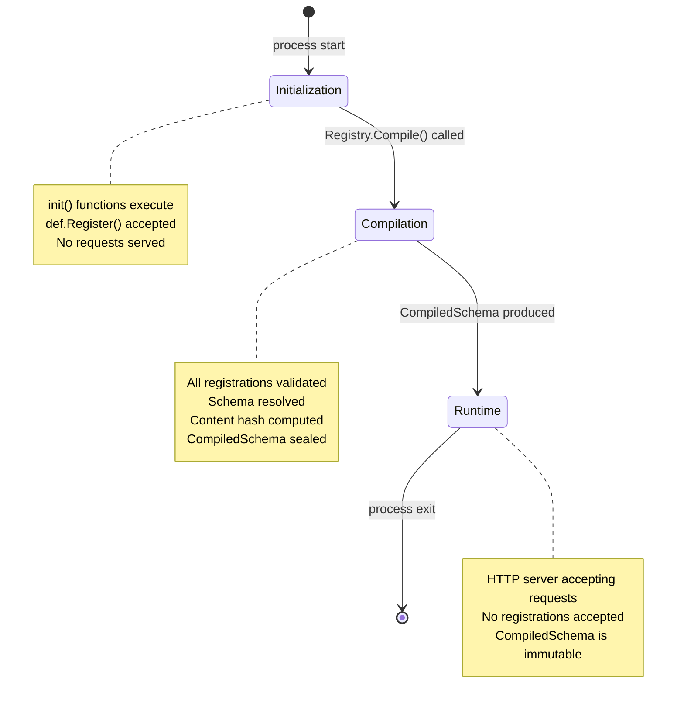

# Compilation Pipeline

**KERN-002 | Status: Accepted | Stability: Frozen**

This document specifies the compilation pipeline: the three-phase process that transforms [EntityDefinition](../GLOSSARY.md#entitydefinition) declarations into the immutable [CompiledSchema](../GLOSSARY.md#compiledschema) consumed by all runtime subsystems.

The key words MUST, MUST NOT, REQUIRED, SHALL, SHALL NOT, SHOULD, SHOULD NOT, RECOMMENDED, MAY, and OPTIONAL in this document are to be interpreted as described in [RFC 2119](https://www.rfc-editor.org/rfc/rfc2119).

---

## Table of Contents

1. [Phase Model](#1-phase-model)
2. [Initialization Phase](#2-initialization-phase)
3. [Compilation Phase](#3-compilation-phase)
4. [Runtime Phase](#4-runtime-phase)
5. [CompiledSchema Structure](#5-compiledschema-structure)
6. [Content Hash Computation](#6-content-hash-computation)
7. [Compilation Error Handling](#7-compilation-error-handling)
8. [Schema Divergence Detection](#8-schema-divergence-detection)

---

## 1. Phase Model

The framework's lifecycle is divided into three mutually exclusive phases:



> **Figure 1.** Three-phase lifecycle. Phases are sequential and non-overlapping. The transition from Initialization to Compilation is the point of no return: no registration is accepted after this boundary.

The phases are enforced by a state flag in the [Entity Registry](../GLOSSARY.md#entity-registry). The flag transitions from `Initializing` → `Compiling` → `Running` and is checked atomically on every registration attempt.

---

## 2. Initialization Phase

### Entry Point

The Initialization Phase begins when the Go runtime executes `init()` functions. It ends when `Registry.Compile()` is called by `main()`.

### What Happens

All module `init()` functions execute during this phase. Each `init()` calls `def.Register()` for each `EntityDefinition` the module owns. The registry accumulates registrations without validation beyond immediate format checks.

```go
// internal/core/finance/finance.go
func init() {
    def.Register(&InvoiceDefinition)
    def.Register(&InvoiceLineDefinition)
    def.Register(&PaymentDefinition)
}
```

### Ordering

Go guarantees that `init()` functions within a package execute after all imported packages' `init()` functions have completed. The registration order of modules is therefore determined by the import graph of `cmd/server/main.go`.

The compiler MUST NOT depend on registration order for correctness. A registration dependency (entity A's edge references entity B) is resolved during Compilation Phase cross-reference resolution, not at registration time.

### Permitted Operations

- `def.Register(&entityDef)` — add an entity to the registry
- Driver handler registration — register custom FieldType handlers
- Event name registration — register custom trigger event names
- Custom lifecycle stage registration

### Prohibited Operations

- Database queries
- Redis operations
- HTTP requests
- Goroutine spawning with side effects
- Reading runtime configuration

---

## 3. Compilation Phase

### Entry Point

`Registry.Compile()` is called once, by `main()`, after all `init()` functions have executed. This call transitions the registry from `Initializing` to `Compiling`, then to `Running`.

### Compilation Steps

The compiler executes the following steps in order. A failure at any step causes process exit with a descriptive error.

```mermaid
flowchart TD
    S1["Step 1: Seal registry\nSet state = Compiling\nNo further Register() accepted"]
    S2["Step 2: Name uniqueness validation\nDetect duplicate entity names\nVerify {module}_{noun} format"]
    S3["Step 3: Field type validation\nVerify every FieldType has registered handler\nVerify type-specific constraints (Series format, etc.)"]
    S4["Step 4: Cross-reference resolution\nResolve Edge.Target → EntityDefinition\nResolve FieldDef.LinkTarget → EntityDefinition\nDetect dangling references"]
    S5["Step 5: Hook policy validation\nVerify cross-module HookRegistrations\ntarget Open entities (LAW-017)"]
    S6["Step 6: Permission compilation\nTranslate PermissionSet → Casbin policy tuples\nValidate role name format"]
    S7["Step 7: Route table generation\nBuild route entries for all CRUD endpoints\nBuild route entries for all Actions"]
    S8["Step 8: SDUI schema index\nBuild page schema index (list, create, edit, detail)\nInvoke PageBuilderFunc for non-nil builders (pre-warm)"]
    S9["Step 9: Workflow trigger compilation\nValidate trigger event names\nValidate WorkflowFn names are registered\nBuild outbox routing table"]
    S10["Step 10: Content hash computation\nCanonical serialization of compiled artifacts\nSHA-256 hash"]
    S11["Step 11: Schema sealing\nCompiledSchema struct populated\nAll internal references frozen\nState = Running"]

    S1-->S2-->S3-->S4-->S5-->S6-->S7-->S8-->S9-->S10-->S11
```



> **Figure 2.** Compilation steps in order. A failure at any step terminates the process. No partial CompiledSchema is returned.

### Step Details

**Step 1: Seal registry** — The registry state transitions to `Compiling`. Any `def.Register()` call after this point returns an error immediately. The seal is atomic to prevent race conditions during concurrent `init()` execution in test scenarios.

**Step 2: Name uniqueness** — All registered entity names are collected into a set. Duplicates cause a compilation error listing all entities with the duplicate name. Names are validated against the `{module}_{noun}` regex.

**Step 3: Field type validation** — For each `FieldDef.Type` value across all registered entities, the compiler looks up the registered handler. Unknown types fail compilation. Type-specific constraints are also validated: `NamingSeries` format strings are parsed, `Select` options lists are checked for non-empty.

**Step 4: Cross-reference resolution** — `Edge.Target` and `FieldDef.LinkTarget` strings are resolved to actual `EntityDefinition` references. A reference to an entity name that is not in the registry is a dangling reference and fails compilation. Circular edges (A → B → A) are permitted for data modeling purposes but MUST be explicitly declared to prevent infinite recursion during schema generation.

**Step 5: Hook policy validation** — All `HookRegistration` values that target an entity other than the registering module's own entities are validated against the target entity's `HookPolicy`. A cross-module registration targeting a `Closed` entity fails compilation with a message identifying both the registering module and the target entity.

**Step 6: Permission compilation** — `PermissionSet` values are translated into Casbin `(subject, domain, object, action)` policy tuples. The `domain` wildcard `*` is used for tenant-scoped policies (Casbin evaluates with the actual tenant UUID at request time). The resulting policy set is loaded into the Casbin enforcer.

**Step 7: Route table generation** — A route table entry is generated for each standard CRUD operation on each entity, plus one entry per `ActionDef`. Route table entries carry: HTTP method, path template, entity name, handler reference, and required permission. The route table is immutable after this step.

**Step 8: SDUI schema index** — For each entity, the compiler registers schema index entries for list, create, edit, and detail views. If a `PageBuilderFunc` is declared, it is invoked immediately to pre-warm the Redis cache. This step may fail if a PageBuilderFunc returns an error.

**Step 9: Workflow trigger compilation** — `WorkflowTrigger.On` values are validated against the set of registered event names. `WorkflowFn` strings are validated against the set of registered Temporal workflow function names. An outbox routing table is built: for each `(entity_name, event)` pair, the routing table maps to the `WorkflowTrigger` configuration.

**Step 10: Content hash computation** — See [§6](#6-content-hash-computation).

**Step 11: Schema sealing** — The `CompiledSchema` struct is populated from all compiled artifacts. All internal references are frozen. The registry state transitions to `Running`.

---

## 4. Runtime Phase

### Entry Point

The Runtime Phase begins when `Registry.Compile()` returns successfully. The `CompiledSchema` is now available.

### What Happens

`main()` uses the `CompiledSchema` to:
1. Register Fiber routes from the compiled route table
2. Load the compiled Casbin policy set into the enforcer
3. Start the Fiber HTTP server
4. Start the Temporal worker with compiled trigger registrations
5. Start the outbox relay goroutine

No further schema mutations occur. The `CompiledSchema` is shared across all goroutines without synchronization (read-only, no locks needed).

### Registration Rejection

Any `def.Register()` call during the Runtime Phase MUST return an error immediately. The error MUST clearly state that the registry is sealed and no further registrations are accepted.

---

## 5. CompiledSchema Structure

The `CompiledSchema` type is produced by `Registry.Compile()` and is immutable for the process lifetime.

```go
// CompiledSchema is the immutable, process-lifetime snapshot of all registered entities.
// Stability: FROZEN
type CompiledSchema struct {
    // All registered entity definitions, keyed by entity name.
    Entities map[string]*CompiledEntity

    // Route table: all HTTP route entries derived from entities and actions.
    Routes []RouteEntry

    // Casbin policy set compiled from all PermissionSets.
    PolicySet CasbinPolicySet

    // Workflow trigger routing: (entity_name, event) → WorkflowTrigger config.
    WorkflowTriggers map[TriggerKey]WorkflowTriggerConfig

    // SDUI schema index: (entity_name, view_type) → PageBuilderFunc or cached schema.
    SDUIIndex map[SDUIKey]PageSchemaEntry

    // Content hash: SHA-256 of canonical serialization.
    ContentHash [32]byte

    // Version information.
    CompilationTimestamp time.Time
    FrameworkVersion     string
}
```

`CompiledSchema` exposes no mutating methods. All fields are populated once during compilation and are read-only thereafter.

---

## 6. Content Hash Computation

The content hash is the SHA-256 digest of the canonical serialization of the compiled schema. It is the sole authoritative identifier for a specific schema version. See [LAW-010](../02-architecture/laws.md#law-010-content-hash-is-the-schema-identity).

### Canonical Serialization

The canonical serialization MUST be deterministic: the same schema inputs MUST always produce the same byte sequence, regardless of registration order, map iteration order, or other sources of non-determinism in Go.

Requirements for canonical serialization:
1. Entities are serialized in lexicographic order by entity name
2. Fields are serialized in declaration order (not sorted)
3. Edges are serialized in declaration order
4. Permission role lists are sorted lexicographically
5. All strings are UTF-8 encoded
6. All maps are serialized with keys in sorted order
7. Boolean values are serialized as 0 or 1 (not true/false strings)

The canonical serialization format is an internal implementation detail and may change between major versions. Only the resulting hash is considered stable.

### What Is Included

The content hash covers:
- All entity names, field names, field types, field constraints
- All edge definitions
- All permission role assignments
- All workflow trigger event bindings (event names, workflow function names, task queues)
- All action names and permission assignments
- The framework version string

### What Is Excluded

The content hash explicitly excludes:
- PageBuilderFunc implementations (function pointers are not serializable)
- Timestamp of compilation
- SDUI schema content (content may differ per tenant based on feature flags)
- Hook implementations (function pointers)

### Usage

The content hash is exposed via:

```go
schema.ContentHash  // [32]byte — the raw hash
hex.EncodeToString(schema.ContentHash[:])  // string representation for logs
```

The `/health/ready` endpoint MUST include the hex-encoded content hash in its JSON response.

---

## 7. Compilation Error Handling

Compilation errors MUST:
1. Identify the specific entity, field, or declaration that caused the error
2. State the constraint that was violated
3. Suggest the correction if determinable
4. Cause process exit with a non-zero exit code

### Error Format

```
compilation error: entity "finance_invoice", field "total_amount":
  FieldType "MONEY" is not registered. Did you mean "Currency"?
  Register a FieldType handler or use a canonical type.
```

```
compilation error: entity "finance_payment", edge "invoice":
  Target entity "finance_invoices" is not registered.
  Did you mean "finance_invoice"?
  Registered entities: [finance_invoice, finance_invoice_line, ...]
```

Multiple compilation errors MUST be collected and reported together. The compiler MUST NOT stop at the first error — it must continue validation and report all errors simultaneously. This prevents the "fix one error, discover another" loop.

### Process Exit

On compilation failure, `Registry.Compile()` MUST call `log.Fatal()` (or equivalent) after writing all error messages to stderr. The process MUST exit with exit code 1. The process MUST NOT continue to the Runtime Phase.

---

## 8. Schema Divergence Detection

All instances of the same binary, started with the same configuration, MUST produce identical content hashes. This is [Architecture Invariant INV-009](../02-architecture/invariants.md#inv-009-the-content-hash-is-identical-across-all-running-instances).

### Detection Mechanism

Each instance exposes its content hash at `/health/ready`:

```json
{
  "status": "ready",
  "schema_hash": "a3f9e2c1...",
  "framework_version": "1.0.0",
  "entity_count": 47
}
```

An external health aggregator polls all instances, collects their `schema_hash` values, and alerts if any hash differs from the others.

### Sources of Divergence

Schema divergence can occur when:

1. **Map iteration order dependency** — `init()` registration depends on map iteration order (non-deterministic in Go). Fix: sort entities or use ordered registration.
2. **Environment-dependent registration** — An `init()` function reads `os.Getenv()` to decide whether to register an entity. Fix: always register; use feature flags to control activation at runtime.
3. **Partial rollout** — Different instances are running different binary versions. Fix: coordinate deployments to ensure all instances update atomically.
4. **Non-deterministic canonical serialization** — The content hash computation depends on map iteration order. Fix: enforce sorted key iteration in the serialization step.

### Response to Divergence

Instances with a divergent content hash MUST be removed from the load balancer rotation. They MUST log the divergence with the conflicting hashes. The deployment MUST be investigated before the diverged instances are restored to rotation.

---

## Related Documents

- [Entity Registry](registry.md) — the registry that accepts inputs to this pipeline
- [EntityDefinition](entity-def.md) — the inputs to this pipeline
- [Startup Sequence](startup-sequence.md) — where Compile() fits in the startup order
- [Architecture Laws](../02-architecture/laws.md) — LAW-002, LAW-003, LAW-004, LAW-010, LAW-019
- [Architecture Invariants](../02-architecture/invariants.md) — INV-002, INV-009
- [Glossary](../GLOSSARY.md) — CompiledSchema, Content Hash, Schema Divergence, Initialization Phase, Compilation Phase, Runtime Phase
