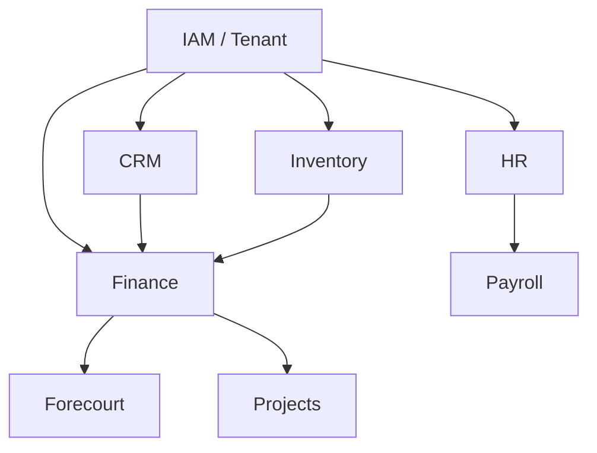

# Business Module Catalog

**MOD-003 | Status: Accepted | Stability: Stable**

This document catalogs the standard business modules shipped with Awo. Each section describes the module's purpose, core entities, and key integration points.

---

## Module Dependency Graph



All modules depend on IAM and Tenancy (implicit — not shown).

---

## 1. CRM Module (`internal/core/crm`)

**Purpose**: Manage customer relationships, leads, and sales pipeline.

**Core entities**:

| Entity | Type | Description |
|---|---|---|
| `crm_contact` | System | People and organizations — leads, customers, partners |
| `crm_interaction` | Custom | Calls, emails, meetings logged against a contact |
| `crm_opportunity` | System | Sales deals in the pipeline |
| `crm_activity` | Custom | Tasks and follow-ups assigned to sales reps |

**Key integrations**:
- Finance: `crm_contact` is the `customer` link target for `finance_invoice`
- HR: `assigned_to` on opportunities links to `hr_employee`

**Module manifest**:
```go
Provides: []string{"crm.contact", "crm.opportunity"},
Requires: []string{"iam.user", "iam.role"},
```

---

## 2. Finance Module (`internal/core/finance`)

**Purpose**: Accounts receivable, accounts payable, general ledger, payments.

**Core entities**:

| Entity | Type | Description |
|---|---|---|
| `finance_invoice` | System | Customer invoices (AR) |
| `finance_purchase_order` | System | Supplier purchase orders (AP) |
| `finance_payment` | System | Payment records — links invoice to payment method |
| `finance_ledger_entry` | System | Double-entry ledger rows (never written directly by modules) |
| `finance_journal` | System | Groups ledger entries into a balanced journal |
| `finance_tax_entry` | System | KRA eTIMS records for VAT compliance |
| `finance_account` | System | Chart of accounts |
| `finance_cost_center` | Custom | Department/project cost allocation |

**Critical constraints** (enforced by DB):
- `finance_ledger_entry`: `debit_amount + credit_amount = 0` CHECK constraint
- `finance_payment`: immutable after creation (no UPDATE allowed via app role)
- `finance_tax_entry`: immutable — KRA regulatory requirement

**Key integrations**:
- Inventory: `inventory_stock_move` triggers journal entries via workflow
- HR/Payroll: payroll runs produce journal entries
- Forecourt: daily fuel sales reconciliation produces invoices

---

## 3. Inventory Module (`internal/core/inventory`)

**Purpose**: Stock management, warehouse operations, goods movement.

**Core entities**:

| Entity | Type | Description |
|---|---|---|
| `inventory_product` | System | Products with UOM, category, pricing |
| `inventory_stock_move` | System | Every physical movement of goods |
| `inventory_location` | System | Warehouses, zones, shelves |
| `inventory_lot` | Custom | Batch/lot tracking for expiry and traceability |
| `inventory_valuation` | System | Stock value at cost (FIFO/WAC) |

**Key constraints**:
- `inventory_stock_move`: quantity must be positive; source and destination location must be in same tenant
- Stock on hand is computed from `inventory_stock_move` sum — never stored as a mutable field

**Key integrations**:
- Finance: every stock move with a cost produces a `finance_ledger_entry` via workflow
- Forecourt: fuel tank levels are modeled as inventory locations

---

## 4. HR Module (`internal/core/hr`)

**Purpose**: Employee records, leave management, attendance.

**Core entities**:

| Entity | Type | Description |
|---|---|---|
| `hr_employee` | System | Employee records — linked to `iam_user` |
| `hr_department` | System | Organizational units |
| `hr_position` | Custom | Job titles and grade bands |
| `hr_leave_type` | Custom | Annual, sick, maternity, etc. |
| `hr_leave_request` | System | Leave applications with approval workflow |
| `hr_attendance` | System | Clock-in/clock-out records |
| `hr_contract` | System | Employment contracts with start/end dates |

**Key integrations**:
- IAM: `hr_employee.user_id` → `iam_user.id` (one-to-one)
- Payroll: `hr_contract` defines payroll basis; `hr_attendance` feeds hours calculation
- Workflow: `hr_leave_request` triggers multi-step approval via Temporal signals

---

## 5. Payroll Module (`internal/core/payroll`)

**Purpose**: Payroll runs, statutory deductions, payslip generation.

**Core entities**:

| Entity | Type | Description |
|---|---|---|
| `payroll_run` | System | Monthly payroll batch |
| `payroll_entry` | System | Per-employee payroll computation for a run |
| `payroll_deduction` | Custom | Ad-hoc deductions applied to an entry |
| `payroll_statutory` | System | PAYE, NHIF, NSSF, Housing Levy deductions |

**Key constraints**:
- `payroll_entry`: immutable after `payroll_run.status = 'Posted'`
- PAYE computed from `paye_bands` global table (KRA tax bands)
- All payroll amounts MUST use `Currency` field type — never `Float`

**Key integrations**:
- HR: consumes `hr_contract`, `hr_attendance`, `hr_leave_request`
- Finance: posting a payroll run creates `finance_journal` entries for salary expense and liability accounts

---

## 6. Forecourt Module (`internal/core/forecourt`)

**Purpose**: Fuel station operations: pump management, shift reconciliation, dipping.

**Core entities**:

| Entity | Type | Description |
|---|---|---|
| `forecourt_pump` | System | Fuel dispensers with nozzle configuration |
| `forecourt_shift` | System | Operator shifts with opening/closing readings |
| `forecourt_dip` | System | Tank dip readings for stock reconciliation |
| `forecourt_price` | System | Fuel price changes with effective date |

**Key integrations**:
- Inventory: tank stock managed as `inventory_location`
- Finance: shift close triggers invoice creation and ledger entry

---

## 7. Projects Module (`internal/core/projects`)

**Purpose**: Project tracking, task management, time logging, billing.

**Core entities**:

| Entity | Type | Description |
|---|---|---|
| `project` | Custom | Project header with budget and status |
| `project_task` | Custom | Work items within a project |
| `project_timesheet` | System | Time entries — feeds project billing |
| `project_expense` | System | Project-related expenses |
| `project_milestone` | Custom | Schedule milestones with due dates |

**Key integrations**:
- CRM: projects linked to `crm_opportunity`
- Finance: `project_timesheet` and `project_expense` generate invoices via workflow
- HR: `assigned_to` links to `hr_employee`

---

## Module Registration Order

Modules MUST be blank-imported in dependency order. Platform modules load first (automatic — they are wired in `bootstrap.go`):

```go
// cmd/server/main.go
import (
    // Platform (order managed by bootstrap)
    _ "awo.so/internal/platform/bootstrap"

    // Business modules — dependency order
    _ "awo.so/internal/core/crm"
    _ "awo.so/internal/core/inventory"
    _ "awo.so/internal/core/finance"       // depends on crm, inventory
    _ "awo.so/internal/core/hr"
    _ "awo.so/internal/core/payroll"       // depends on hr, finance
    _ "awo.so/internal/core/forecourt"     // depends on inventory, finance
    _ "awo.so/internal/core/projects"      // depends on crm, finance, hr
)
```

If a module is imported before its dependencies, the EntityRegistry validator rejects the registration with a descriptive error at startup.

---

## Related Documents

- [Module System](module-system.md) — ModuleManifest, dependency resolution
- [Platform Modules](platform-modules.md) — 7 built-in platform modules
- [Module Dev Guide](../16-module-dev-guide/README.md) — how to build a new module
