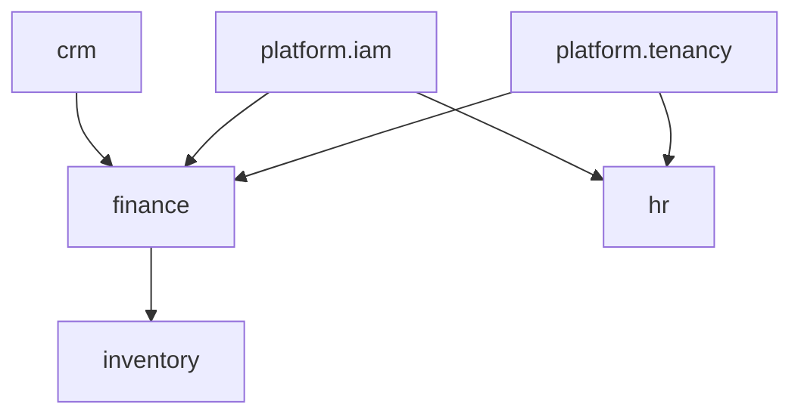

# Module System

**MOD-001 | Status: Accepted | Stability: Stable**

This document specifies the module structure, ModuleManifest, registration via `init()`, dependency resolution, and the directory layout convention for both platform and business modules.

The key words MUST, MUST NOT, REQUIRED, SHALL, SHALL NOT, SHOULD, RECOMMENDED, MAY, and OPTIONAL are interpreted per RFC 2119.

---

## 1. What a Module Is

A module is a Go package (or package group) that:
- Declares one or more `EntityDefinition`s
- Registers them via `definition.Register()` in `init()`
- Declares a `ModuleManifest` with capability tokens and dependencies
- Provides migrations in a `migrations/` subdirectory
- Optionally provides custom HTTP handlers, Temporal activities, and Temporal workflows

Modules are the unit of capability activation: a tenant may have some business modules active and others inactive. The Module Registry tracks which modules are installed and active per tenant.

---

## 2. Module Types

### Platform Modules

Located in `internal/platform/`. Loaded unconditionally on every deployment. Cannot be deactivated per-tenant.

| Module | Package |
|---|---|
| Tenant | `internal/platform/tenant` |
| IAM | `internal/platform/iam` |
| Feature Flags | `internal/platform/flags` |
| Settings | `internal/platform/settings` |
| Audit Log | `internal/platform/audit` |
| Metadata | `internal/platform/metadata` |
| Module Registry | `internal/platform/registry` |

### Business Modules

Located in `internal/core/`. Activated per-tenant via the Module Registry. Examples: `finance`, `hr`, `inventory`, `crm`, `forecourt`.

---

## 3. Directory Layout

All modules (platform and business) use the same directory layout:

```
internal/{platform|core}/{module}/
    {module}.go           ← init() — calls definition.Register() for all entities
    manifest.go           ← ModuleManifest declaration
    definition.go         ← EntityDefinition variable declarations
    policy.go             ← PolicyFunc implementations
    hooks.go              ← Hook implementations
    service.go            ← Thin service layer on EntityRepository
    handler.go            ← Custom HTTP handlers (if needed beyond CRUD)
    workflows/
        workflows.go      ← Workflow function declarations
        activities.go     ← Activities struct + methods
        register.go       ← RegisterActivities(w worker.Worker)
    migrations/
        YYYYMMDDHHMMSS_create_{table}.up.sql
        YYYYMMDDHHMMSS_create_{table}.down.sql
    {module}_test.go      ← Unit tests for hooks, policies, service logic
```

Files are only created when needed. A module with no custom handlers has no `handler.go`. A module with no workflows has no `workflows/` directory.

---

## 4. ModuleManifest

Every module MUST declare a `ModuleManifest`:

```go
// manifest.go
var Manifest = definition.ModuleManifest{
    // Unique module identifier — matches the module's entity name prefix
    Name: "finance",

    // Human-readable label
    Label: "Finance",

    // Semantic version of this module
    Version: "1.3.0",

    // Capability tokens this module provides — other modules may declare
    // dependencies on these tokens
    Provides: []string{
        "finance.invoicing",
        "finance.payments",
        "finance.ledger",
    },

    // Capability tokens this module requires — resolved before this module
    // is initialized. Registry.Compile() fails if any required token is absent.
    Requires: []string{
        "platform.tenancy",   // always provided by the Tenant platform module
        "platform.iam",       // always provided by the IAM platform module
    },

    // Optional: modules whose entities may be referenced in Link fields
    // Dependency modules are initialized before this module during compilation
    DependsOn: []string{
        "crm",    // finance invoices link to crm_customer
    },

    // Contact for this module (for documentation and incident routing)
    Owner: "finance-team",
}
```

---

## 5. Registration via init()

Entity definitions MUST be registered in an `init()` function so they are available before `Registry.Compile()` is called:

```go
// finance.go
package finance

import "awo.so/framework/definition"

func init() {
    definition.Register(&InvoiceDefinition)
    definition.Register(&InvoiceLineDefinition)
    definition.Register(&PaymentDefinition)
    definition.RegisterManifest(&Manifest)
}
```

The `init()` function runs when the package is first imported. The server's `main.go` blank-imports all modules to trigger their `init()` functions:

```go
// cmd/server/main.go
import (
    _ "awo.so/internal/platform/tenant"
    _ "awo.so/internal/platform/iam"
    _ "awo.so/internal/platform/flags"
    _ "awo.so/internal/platform/settings"
    _ "awo.so/internal/platform/audit"
    _ "awo.so/internal/platform/metadata"
    _ "awo.so/internal/core/finance"
    _ "awo.so/internal/core/hr"
    _ "awo.so/internal/core/inventory"
    // ...
)
```

All `init()` functions execute before `main()` begins — before `Registry.Compile()` is called in the startup sequence.

---

## 6. Dependency Resolution

`Registry.Compile()` resolves module dependencies in topological order:



Resolution algorithm:
1. Collect all registered manifests
2. Build dependency graph from `Requires` and `DependsOn` tokens
3. Topological sort — detect cycles (cycles → compilation error)
4. Verify all required tokens are provided by at least one manifest
5. Compile entity definitions in dependency order

Compilation fails if any required token is absent. This is intentional: a module that depends on `finance.invoicing` cannot operate correctly if the finance module is absent.

---

## 7. Tenant-Level Module Activation

At the platform level, `Registry.Compile()` compiles all registered modules. Tenant-level activation is a separate concept: the Module Registry entity tracks which modules a tenant has activated.

```
All compiled modules (process-wide)
    └── Tenant A: [finance, hr, inventory] — active
    └── Tenant B: [crm, hr] — active
    └── Tenant C: [finance, crm] — active
```

Module activation controls:
- Which SDUI navigation items appear for the tenant
- Which entities are accessible to the tenant via API
- Which workflows can be triggered for the tenant

Entity-level access control remains with RBAC (Casbin). Module activation is a coarser-grained gate applied before RBAC.

---

## 8. Adding a New Business Module

Step-by-step:
1. Create directory: `internal/core/{module}/`
2. Write `manifest.go` with `ModuleManifest`
3. Write `definition.go` with `EntityDefinition` variables
4. Write `{module}.go` with `init()` calling `definition.Register` for each entity
5. Write `policy.go` and `hooks.go`
6. Write `migrations/` SQL files for all system entities
7. Add a blank import to `cmd/server/main.go`
8. Add activity registration call to worker setup in `cmd/server/main.go`

The module is then available to be activated per-tenant via the admin UI's Module Registry section.

---

## Related Documents

- [Platform Modules](platform-modules.md) — built-in unconditional modules
- [Registry](../03-kernel/registry.md) — compilation and registration API
- [EntityDefinition](../03-kernel/entity-definition.md) — module's central primitive
- [Startup Sequence](../03-kernel/startup-sequence.md) — when init() and Compile() run
- [Architecture Laws](../02-architecture/laws.md) — LAW-011 (entity names unique)
- [Glossary](../GLOSSARY.md) — Module, ModuleManifest, Platform Module, Business Module
