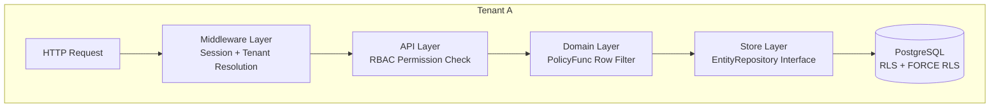

# Security Model

**SEC-001 | Status: Accepted | Stability: Stable**

This document specifies the defense-in-depth security architecture, trust boundaries, threat model, and compliance considerations for Awo deployments.

The key words MUST, MUST NOT, REQUIRED, SHALL, SHALL NOT, SHOULD, RECOMMENDED, MAY, and OPTIONAL are interpreted per RFC 2119.

---

## 1. Defense-in-Depth Layers

Awo implements security at five independent layers. Bypassing any single layer does not compromise tenant isolation.

| Layer | Mechanism | What It Enforces |
|---|---|---|
| Network | TLS termination, firewall rules | Encryption in transit; internal service isolation |
| Session | Redis server-side session validation | Authentication; identity resolution |
| RBAC | Casbin `(subject, domain, object, action)` | Operation-level access control |
| PolicyFunc | Row-level WHERE injection | Data-level access control (which records) |
| PostgreSQL RLS | `FORCE ROW LEVEL SECURITY` | Database-level tenant isolation (defense of last resort) |

No layer trusts the layer above it. PostgreSQL RLS fires even if application code bypasses RBAC. RBAC checks even if the session is valid. Each layer is independently auditable.

---

## 2. Trust Boundaries

### External (Untrusted)

- HTTP clients (browsers, mobile apps, API clients, webhooks)
- All input from external sources is treated as untrusted until validated

### Internal (Trusted after verification)

- Session middleware establishes trusted actor identity after Redis validation
- `TenantContext` is trusted after `set_tenant_context()` succeeds
- Temporal activities receive trusted input (the workflow caller's tenant context is embedded in input struct)

### Platform Admin (Elevated Trust)

- `role:platform-admin` bypasses Casbin
- Platform admin sessions MUST be protected with additional controls (MFA, short TTL, IP allowlist)
- Platform admin operations are fully audited (Audit Log module, separate audit trail)

### Database Role

The application PostgreSQL role MUST NOT be a superuser. It MUST NOT have `BYPASSRLS`. It has `SELECT`, `INSERT`, `UPDATE`, `DELETE` on tenant-scoped tables — filtered by RLS.

---

## 3. Threat Model

### T1: Tenant Data Leakage (Cross-Tenant Access)

**Attack**: Tenant A's session used to access Tenant B's data by manipulating `X-Tenant-ID` header.

**Mitigations**:
- Middleware validates session token and extracts the actor's authorized tenant scope
- `set_tenant_context()` validates the tenant exists and is ACTIVE before setting the session variable
- PostgreSQL RLS enforces `tenant_id = current_tenant_id()` at the database level — even if application code passes the wrong tenant, the database rejects it
- Audit log records tenant_id on every mutation — cross-tenant access would be detectable

**Residual risk**: None under correct deployment (PgBouncer in transaction mode, FORCE RLS applied).

### T2: Privilege Escalation (Role Elevation)

**Attack**: Standard user accesses admin functionality by crafting API requests.

**Mitigations**:
- RBAC (Casbin) checks the actor's role set against each operation's required permission
- Role assignments stored in PostgreSQL, not in session token — a compromised session cannot elevate privileges without modifying the database
- PolicyFunc further restricts which records are visible based on role
- Sensitive fields absent from responses unless the actor has explicit sensitive-read permission

### T3: Session Hijacking

**Attack**: Attacker steals a valid session token.

**Mitigations**:
- Session tokens: 256-bit cryptographically random, URL-safe base64 — brute force infeasible
- HttpOnly, Secure, SameSite=Strict cookies prevent JavaScript access and CSRF
- Server-side sessions in Redis — revocation is immediate (DEL the key)
- Short TTL (8 hours default) with sliding expiry — abandoned sessions expire automatically
- Redis unavailability causes all auth to fail (INV-007) — better than accepting stale sessions

### T4: Injection Attacks (SQL, Command)

**Attack**: Malicious input reaches database or OS commands.

**Mitigations**:
- `EntityRepository` interface — no raw SQL in business logic; all queries parameterized
- Filter DSL validates field names against the CompiledSchema — unknown fields rejected
- No shell command execution in request path

### T5: Sensitive Data Exposure

**Attack**: Sensitive fields (passwords, PII, financial details) exposed in logs or error responses.

**Mitigations**:
- Fields declared `Sensitive: true` excluded from logs, error responses, and standard API responses (INV-006, LAW-013)
- Stack traces never sent to clients (INV-010)
- Config logging excludes secret fields (database URL, JWT secret)

### T6: Workflow Tampering

**Attack**: Attacker triggers unauthorized workflow execution by forging outbox entries or Temporal signals.

**Mitigations**:
- Outbox table is framework-private (LAW-018) — application role cannot write to it directly
- Temporal signals require knowledge of the workflow ID (tenant-namespaced) and a valid session
- Signal handlers in workflows validate actor permissions before processing

---

## 4. Authentication Security

Password security:
- bcrypt cost ≥ 12 (configurable; 12 is the minimum)
- Constant-time comparison prevents timing attacks on login
- Dummy bcrypt comparison when user not found (prevents user enumeration via timing)
- Rate limiting: 10 attempts/15min by IP, 5 failed attempts by email → temporary lockout

Password reset:
- Time-limited single-use tokens (HMAC-signed, 1-hour expiry)
- Tokens stored in Redis with TTL — cannot be reused after expiry
- Old password invalidated after reset

First login:
- Forced password change on first login (provisioning sets a temporary password)
- Temporary password flag stored in session — not cleared until password changed

See [Authentication](../07-iam/authentication.md) for full implementation specification.

---

## 5. Input Validation

All external input MUST be validated before processing:

- HTTP request bodies validated against the entity's `FieldDef` declarations
- `Required` fields checked before reaching hooks
- `MaxLen`, `Min`, `Max` constraints enforced at the framework level
- Custom `FieldValidator` implementations for business-specific rules
- Filter DSL field names validated against CompiledSchema — cannot reference non-existent or unauthorized fields

Validation failures return HTTP 422 with field-level messages — never HTTP 500 (which would suggest unhandled input).

---

## 6. Cryptography Standards

| Purpose | Algorithm | Key Size | Notes |
|---|---|---|---|
| Session tokens | CSPRNG | 256 bits | URL-safe base64 encoding |
| Password hashing | bcrypt | cost ≥ 12 | Adaptive; increase cost as hardware improves |
| Field encryption | AES-256-GCM | 256 bits | For `Sensitive` fields requiring encryption at rest |
| Password reset tokens | HMAC-SHA-256 | 256-bit key | 1-hour expiry |
| Content hash | SHA-256 | 256-bit output | CompiledSchema identity (LAW-010) |

**Prohibited:**
- MD5 or SHA-1 for any security purpose
- ECB mode for any symmetric encryption
- Hardcoded keys or IVs

---

## 7. Transport Security

- All external traffic over TLS 1.2+ (TLS 1.3 preferred)
- TLS terminated at load balancer or ingress controller
- Internal service communication (to PostgreSQL, Redis, Temporal): TLS required in production
- `ALLOWED_ORIGINS` configured to restrict CORS to known domains
- `Strict-Transport-Security` header set on all responses in production

---

## 8. Audit Trail

The Audit Log module records every mutation with:
- Tenant ID, actor (user ID + role set), operation type
- Record before and after state (JSONB diff)
- Request ID for correlation with access logs
- Timestamp (UTC, nanosecond precision)

Audit log entries are immutable (INSERT only; no UPDATE or DELETE policy on the table). This makes the audit trail tamper-evident within the database.

For regulatory-grade tamper evidence, consider shipping audit logs to an external append-only store (e.g., Amazon S3 with object lock, WORM storage).

---

## 9. Compliance Notes

### Kenya Data Protection Act (DPA) 2019

- Personal data fields should be declared `Sensitive: true` — excluded from logs, responses require explicit permission
- Data subject access requests: the Filter DSL and Audit Log provide the foundation for data subject queries
- Data retention: configurable via `audit.retention_days` setting; enforced by scheduled workflow

### Financial Regulatory (Central Bank of Kenya)

- Double-entry ledger (LedgerEntry system entity) maintains immutable financial records
- All financial mutations audited with actor identity and timestamp
- Currency stored as `numeric(20,4)` — no floating-point imprecision in regulatory records

---

## Related Documents

- [RBAC](../07-iam/rbac.md) — Casbin policy model and role hierarchy
- [Sessions](../07-iam/sessions.md) — server-side session implementation
- [Authentication](../07-iam/authentication.md) — login, password hashing, rate limiting
- [RLS](../06-tenancy/rls.md) — PostgreSQL row-level security setup
- [Architecture Laws](../02-architecture/laws.md) — LAW-005, LAW-013, LAW-015, LAW-018
- [Invariants](../02-architecture/invariants.md) — INV-001, INV-006, INV-007, INV-010
- [Glossary](../GLOSSARY.md) — Defense in Depth, Session Token, Sensitive Field, RBAC
