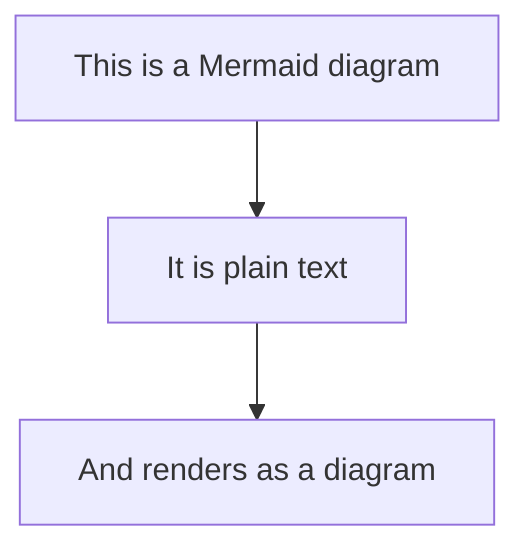
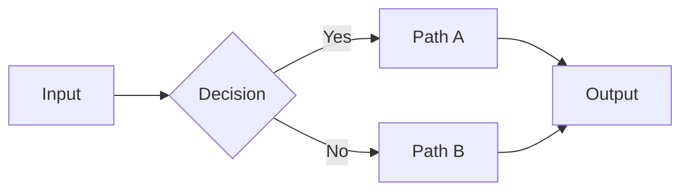
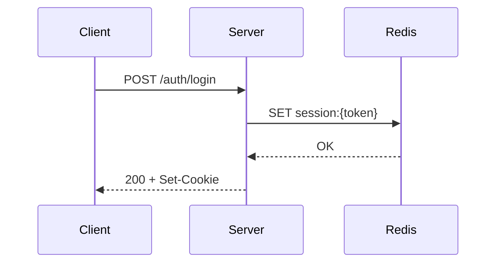
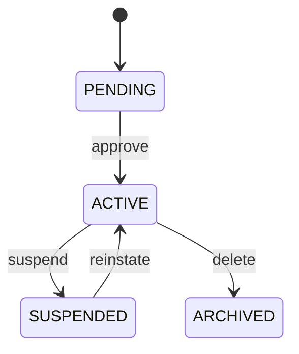
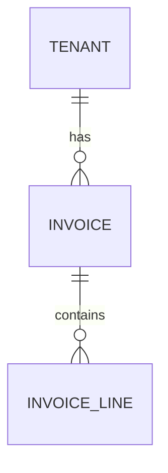
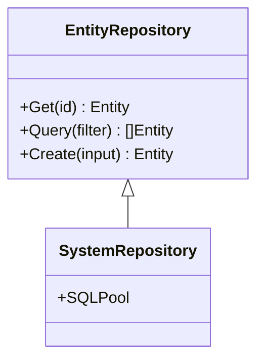
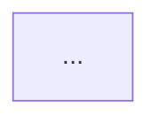

> ⚠️ **LEGACY DOCUMENTATION**
>
> This document describes the deprecated Framework A architecture and is retained for historical reference only.
>
> It MUST NOT be used when implementing or extending the Awo Framework (Framework B).
>
> Refer to [`awo/docs/`](../awo/docs/README.md) for the current canonical documentation.

---

---
title: "Diagram Standards"
id: gov-diagrams
status: accepted
category: SPEC
stability: STABLE
audience: [module-authors, framework-authors]
since: "1.0"
normative-level: normative
related:
  - "[Documentation Standards](documentation-standards.md)"
  - "[Awo Glossary](../GLOSSARY.md)"
---

# Diagram Standards

**Status: Accepted | Stability: Stable**

This document specifies the diagram format, when diagrams are required, and quality standards for all diagrams in the Awo documentation set.

The key words MUST, MUST NOT, REQUIRED, SHALL, SHALL NOT, SHOULD, RECOMMENDED, MAY, and OPTIONAL are interpreted per RFC 2119.

---

## 1. Diagram Format

All diagrams MUST be written in **Mermaid** — the only accepted diagram format. No PNG, SVG, or Excalidraw images in documentation.

Rationale:
- Mermaid is version-controlled as text — diffs are readable
- Renders in GitHub, most markdown previewers, and documentation portals
- Diagrams stay in sync with documentation (no separate image files to maintain)



---

## 2. When Diagrams Are Required

Diagrams MUST be included when:
- Describing a multi-step sequence (startup sequence, request lifecycle, compilation pipeline)
- Showing relationships between three or more components
- Illustrating a state machine with more than two states

Diagrams SHOULD be included when:
- A concept involves directionality (layer dependencies, data flow)
- Visual comparison helps (before/after, correct/incorrect)

Diagrams MUST NOT be included when:
- The diagram duplicates information clearly expressed in prose
- A table communicates the same information more precisely
- The diagram is decorative (adds visual interest but no informational value)

---

## 3. Diagram Types and Usage

### Flowchart (`graph` or `flowchart`)

Use for: processes, decision trees, compilation steps, request flow.



### Sequence Diagram (`sequenceDiagram`)

Use for: request/response flows, multi-participant interactions (startup sequence, outbox relay).



### State Diagram (`stateDiagram-v2`)

Use for: lifecycle state machines (tenant status, entity status).



### Entity Relationship (`erDiagram`)

Use for: database schema relationships (sparingly — prefer prose tables for field-level detail).



### Class Diagram (`classDiagram`)

Use for: Go struct relationships, interface implementations.



---

## 4. Diagram Quality Standards

Every diagram MUST:
- Have a meaningful title or caption (the section heading serves as title)
- Use consistent node labels (same capitalization throughout)
- Render without errors in standard Mermaid v10+
- Be legible at standard markdown rendering width (~700px)

Diagrams MUST NOT:
- Exceed 20 nodes (split into multiple diagrams if needed)
- Use colors that don't render in high-contrast/dark mode (Mermaid defaults are safe)
- Include detail that belongs in prose (diagrams show structure; prose explains meaning)

---

## 5. Placement Rules

Diagrams MUST be placed:
- Immediately after the prose they illustrate (not before)
- In the section where the concept is introduced (not a separate "diagrams" section)
- After a transitional sentence: "The following diagram shows..."

---

## 6. Alt Text (Accessibility)

When the documentation portal supports it, include alt text for all diagrams:

```markdown
<!-- Alt: Flowchart showing the compilation pipeline five steps -->

```

Alt text is RECOMMENDED for all diagrams in public-facing documentation.

---

## Related Documents

- [Documentation Standards](documentation-standards.md) — overall writing rules
- [Documentation Architecture](documentation-architecture.md) — documentation structure
