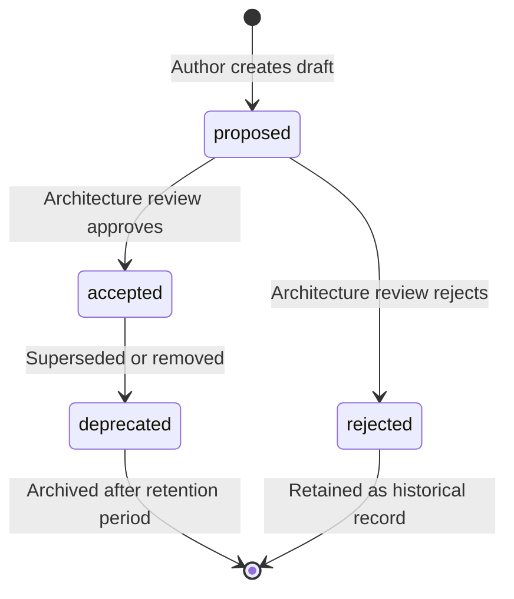

> ⚠️ **LEGACY DOCUMENTATION**
>
> This document describes the deprecated Framework A architecture and is retained for historical reference only.
>
> It MUST NOT be used when implementing or extending the Awo Framework (Framework B).
>
> Refer to [`awo/docs/`](../awo/docs/README.md) for the current canonical documentation.

---

---
title: "Document Lifecycle"
id: gov-lifecycle
status: accepted
category: SPEC
stability: STABLE
audience: [module-authors, framework-authors]
since: "1.0"
normative-level: normative
related:
  - "[Review Process](review-process.md)"
  - "[Stability Model](stability-model.md)"
  - "[Metadata Standard](metadata-standard.md)"
  - "[Awo Glossary](../GLOSSARY.md)"
---

# Document Lifecycle

**Status: Accepted | Stability: Stable**

This document specifies how documents move through their lifecycle stages, from creation to deprecation, and the rules governing each transition.

The key words MUST, MUST NOT, REQUIRED, SHALL, SHALL NOT, SHOULD, RECOMMENDED, MAY, and OPTIONAL are interpreted per RFC 2119.

---

## 1. Lifecycle Stages



---

## 2. Stage Definitions

### proposed

Document is under review. Not yet authoritative.

- `status: proposed`
- MAY be referenced by other proposed documents
- MUST NOT be referenced normatively by accepted documents
- Content may change during review

### accepted

Document is the current approved version. Authoritative.

- `status: accepted`
- All normative content takes effect immediately on acceptance
- Changes subject to the [Review Process](review-process.md) rules for the document's stability level

### rejected

Document was proposed but the architecture team decided not to accept it. Retained as historical record.

- `status: rejected`
- MUST NOT be referenced normatively
- MUST NOT be deleted — retained for historical record
- No further changes permitted

### deprecated

Document is no longer current. It has been superseded by a newer document or the feature it describes has been removed.

- `status: deprecated`
- MUST include a notice: `> **Deprecated:** Replaced by [New Document](link.md).`
- Retained for at least one major version after deprecation
- After retention period: moved to an archive directory (not deleted)

---

## 3. Lifecycle Transitions

### proposed → accepted

Requirements:
- Review checklist complete (see [Review Process](review-process.md))
- Minimum required approvals obtained (by stability level)
- `status: proposed` changed to `status: accepted` in frontmatter

### accepted → deprecated

Requirements:
- Replacement document accepted first
- Deprecation notice added to the document
- `status: deprecated` set in frontmatter
- All documents that linked to the deprecated document updated to link to the replacement
- Architecture team notified

### accepted → rejected (rare)

When an accepted document is found to contain fundamentally incorrect guidance:
- A corrective document is written and accepted first
- The incorrect document marked rejected and corrective document marked accepted
- Changelog entry explaining the correction

This is rare — documents should be corrected via amendment rather than rejection. Rejection is for cases where the entire document's premise was wrong.

---

## 4. Retention Rules

| Status | Retention |
|---|---|
| accepted | Indefinite |
| proposed (rejected) | Indefinite (historical record) |
| deprecated | Minimum 1 major version after deprecation |

Retained deprecated documents are moved to `00-documentation/archive/` after the retention period. They are not deleted from the repository (version control preserves them).

---

## 5. ADR Lifecycle

ADRs follow a simplified lifecycle:

```
proposed → accepted (frozen immediately)
proposed → rejected (retained as history)
```

ADRs are never deprecated — they record a decision. If the decision is reversed, a new ADR is written with `supersedes: "ADR-NNN"`. The original ADR gains `superseded-by: "ADR-MMM"` but is not changed otherwise.

---

## Related Documents

- [Review Process](review-process.md) — how acceptance is granted
- [Stability Model](stability-model.md) — how stability relates to lifecycle
- [Metadata Standard](metadata-standard.md) — frontmatter fields for each lifecycle stage
