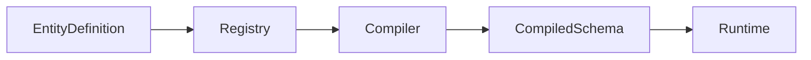
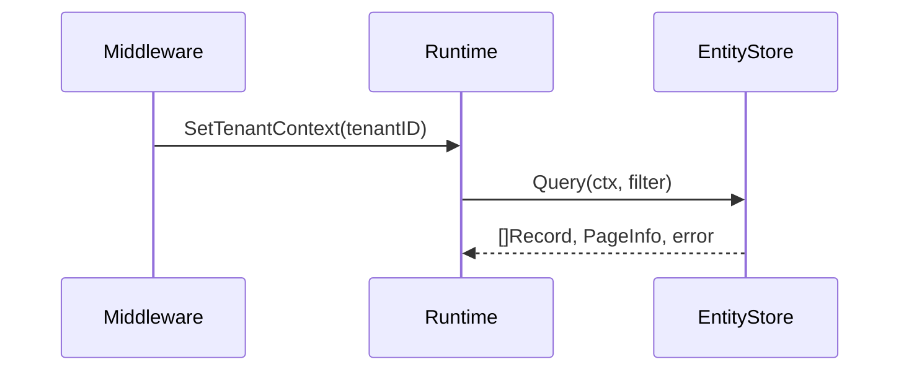
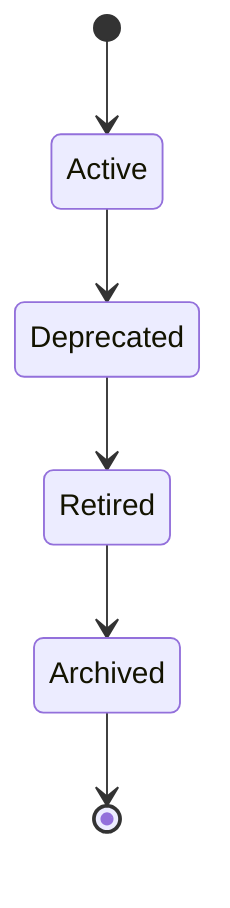

> ⚠️ **LEGACY DOCUMENTATION**
>
> This document describes the deprecated Framework A architecture and is retained for historical reference only.
>
> It MUST NOT be used when implementing or extending the Awo Framework (Framework B).
>
> Refer to [`awo/docs/`](../awo/docs/README.md) for the current canonical documentation.

---

---
title: "Awo Framework Documentation Standards"
id: doc-standards-001
status: accepted
category: spec
stability: frozen
normative-level: normative
audience: [all]
since: "1.0"
depends-on:
  - "00-documentation/documentation-architecture.md"
related:
  - "00-documentation/writing-standards.md"
  - "00-documentation/terminology-governance.md"
  - "00-documentation/diagram-standards.md"
  - "GLOSSARY.md"
---

# Awo Framework Documentation Standards

**Classification:** Normative Specification
**Stability:** Frozen
**Effective:** v1.0
**Supersedes:** None
**Superseded by:** Nothing — this document is a permanent commitment.

---

The key words MUST, MUST NOT, REQUIRED, SHALL, SHALL NOT, SHOULD, SHOULD NOT, RECOMMENDED, MAY, and OPTIONAL in this document are to be interpreted as described in [RFC 2119](https://www.rfc-editor.org/rfc/rfc2119) and [RFC 8174](https://www.rfc-editor.org/rfc/rfc8174).

This document applies to every file committed under `awo/docs/`. No exceptions. A pull request that violates this document MUST be rejected regardless of the quality of the change it proposes.

---

## Table of Contents

1. [Purpose](#1-purpose)
2. [Documentation Principles](#2-documentation-principles)
3. [Documentation Taxonomy](#3-documentation-taxonomy)
4. [RFC 2119 Language](#4-rfc-2119-language)
5. [Standard Document Template](#5-standard-document-template)
6. [Naming Rules](#6-naming-rules)
7. [Cross-Reference Rules](#7-cross-reference-rules)
8. [Diagram Standards](#8-diagram-standards)
9. [Code Example Standards](#9-code-example-standards)
10. [Example Policy](#10-example-policy)
11. [Consistency Rules](#11-consistency-rules)
12. [Stability Classes](#12-stability-classes)
13. [Versioning Policy](#13-versioning-policy)
14. [Documentation Review Checklist](#14-documentation-review-checklist)
15. [AI Authoring Rules](#15-ai-authoring-rules)
16. [Long-Term Maintenance](#16-long-term-maintenance)
17. [Documentation Quality Metrics](#17-documentation-quality-metrics)
18. [Appendix — Writing Style Reference](#18-appendix--writing-style-reference)

---

## 1. Purpose

### 1.1 Documentation as Architecture

Documentation is not a description of the framework written after the fact. It is part of the framework.

This distinction has a precise technical meaning: the documentation defines the contract. The source code is one implementation of that contract. When documentation and source code disagree, the documentation is authoritative and the source code contains a defect. The implementation must be corrected.

This model is followed by every major long-lived technical system. PostgreSQL's documentation defines what PostgreSQL does. When a PostgreSQL release behaves differently from what the documentation says, that is a bug — not a documentation inaccuracy. The Go language specification defines Go. When the compiler deviates from the specification, the compiler is wrong. The same principle applies to Awo.

The practical consequence: no feature exists until it is documented. A behavior present in the source code but absent from the documentation is an undocumented implementation detail. It carries no compatibility guarantee, may be removed in any version, and MUST NOT be relied upon by application developers or module authors.

### 1.2 Documentation as Engineering Artifact

Documentation is version-controlled alongside the source code. Documentation changes are reviewed with the same rigor as source code changes. Documentation has defined stability levels, deprecation processes, and compatibility guarantees. Documentation defects are tracked as bugs. Documentation coverage is measured as a quality metric.

A documentation pull request that introduces ambiguity, contradiction, or an undefined concept is as defective as a source code pull request that introduces a data race or an unchecked error.

### 1.3 Permanence Requirement

The Awo Framework documentation is intended to remain consistent and useful for the lifetime of the framework — target: 20 years from initial publication. Decisions documented in this standards document, and in the documents that conform to it, must be made with that horizon in mind.

Documentation that will be wrong in five years because it references implementation details is not acceptable. Documentation that explains architectural principles will remain correct as long as those principles hold.

### 1.4 Scope

This document governs every file under `awo/docs/`. It does not govern inline Go documentation (`godoc`), code comments, issue trackers, or external communications. Those are separate concerns. The boundary is the `awo/docs/` directory.

---

## 2. Documentation Principles

These principles are immutable. They MUST NOT be violated in any document under `awo/docs/`. Where a principle conflicts with convenience, the principle takes precedence.

### P1 — Documentation Is Source-Controlled

Every documentation file MUST be committed to version control alongside the source code. No documentation exists outside the repository. Documentation hosted on external platforms (wikis, Google Docs, Notion) is not official documentation. Official documentation is exclusively what lives in `awo/docs/`.

**Why:** Documentation outside version control diverges from the code it describes. It cannot be reviewed with the same rigor as code changes. It cannot be rolled back. It cannot be compared across versions. Keeping documentation in the repository makes it subject to the same engineering discipline as code.

### P2 — Documentation Is Reviewed Like Code

Every change to documentation MUST go through a pull request. Pull requests MUST require at least one reviewer approval before merging. The reviewer MUST check technical accuracy, consistency, terminology, and compliance with this standard. Documentation cannot be committed directly to the main branch.

**Why:** Unreviewed documentation accumulates errors silently. A reviewer who reads documentation for the first time as a reviewer will notice ambiguities and inaccuracies that the author cannot see. The review process is not a bureaucratic step — it is a quality gate that documentation cannot skip.

### P3 — Documentation Never Contradicts the Specification

When documentation and the implemented specification conflict, the documentation is authoritative. A document that accurately describes what the implementation does, but inaccurately describes what the framework guarantees, is wrong even if it matches the code. The framework guarantees are defined in the documentation. The code implements those guarantees.

**Why:** If documentation describes what the code does, documentation becomes a changelog: accurate today, wrong tomorrow. If documentation describes what the framework guarantees, it describes something that must remain true regardless of implementation changes.

A corollary: before merging a source code change that breaks a documented guarantee, the guarantee must be updated through the appropriate deprecation and versioning process — not silently violated.

### P4 — Normative Statements Are Explicit

A normative requirement — something that implementations MUST do — is always expressed using RFC 2119 keywords in uppercase. A description of what the current implementation does is never normative by implication. A reader MUST always be able to determine whether a statement is a binding requirement or a description, without ambiguity.

**Why:** Implicit normative requirements are the most common source of specification ambiguity. When a specification says "the compiler processes entities in registration order" without indicating whether this is a requirement or an observation, implementors must guess. Half will implement it as a guarantee; half will not. The resulting implementations are incompatible.

### P5 — Examples Never Redefine Architecture

An example illustrates an already-defined concept. An example does not introduce a concept. An example does not define a term. An example does not make normative claims. If an example appears to require a new concept or definition to be understood, that concept belongs in the specification — not in the example.

**Why:** Examples are the most widely read part of any documentation. Developers copy examples before reading specifications. If examples encode architectural decisions not present in the specification, those decisions become de-facto standards that the specification does not acknowledge — and that cannot be changed without breaking the examples.

### P6 — One Source of Truth

Every concept, definition, guarantee, and architectural decision has exactly one canonical location in the documentation. Other documents reference that location. They do not restate its content. Restatement produces drift: over time, the two statements will disagree, and there will be no way to determine which is authoritative.

**Why:** In a corpus of 200 documents developed over 20 years, any concept explained in two places will eventually be explained differently. The divergence is usually subtle — a word changed for clarity that inadvertently changes the meaning. The result is a documentation corpus that contradicts itself and cannot be trusted.

### P7 — Every Concept Has Exactly One Canonical Definition

This is a specific application of P6 to terminology. Every term used in the documentation is defined in `GLOSSARY.md` and nowhere else. A reader who encounters an unfamiliar term in any document must be able to find a complete definition by looking in exactly one place.

**Why:** Distributed definitions are the primary mechanism of terminology drift. If "Entity" is defined in the introduction, the kernel specification, and the application developer guide, those three definitions will diverge. Eventually "Entity" means different things in different parts of the documentation.

### P8 — Every Document Has a Clearly Defined Responsibility

Every document exists to serve one specific purpose. That purpose is stated in the document's frontmatter and in its opening section. A document that serves two purposes should be two documents. A document that serves no distinct purpose should not exist.

**Why:** Documents without clear responsibilities accumulate everything that does not fit elsewhere. They become junk drawers. Readers cannot predict what they will find, cannot determine when they are done reading, and cannot maintain them without reading the entire document to understand what belongs there.

### P9 — Documentation Debt Is Technical Debt

Incomplete, inaccurate, or inconsistent documentation is not a separate concern from technical debt — it is technical debt. Documentation debt compounds the same way code debt does: it becomes harder to correct as more documentation builds on the incorrect foundation.

**Why:** This principle exists to prevent the rationalization "we'll fix the docs later." Later rarely comes. The fix becomes harder as more documents reference the incorrect content. Documentation must be correct when merged, not eventually.

---

## 3. Documentation Taxonomy

Every document MUST belong to exactly one category. The category determines the document's authority, writing style, change policy, and what content is permitted within it.

### 3.1 SPEC — Normative Specification

**Definition:** A document that defines what the framework guarantees. Every statement in a SPEC that uses RFC 2119 keywords is a binding commitment on all implementations.

**Authority:** The highest authority in the documentation system. SPECs define the framework. Implementations that deviate from SPECs are incorrect.

**When used:** To specify the behavior of a kernel type, a driver interface, an invariant, an architecture law, or any other construct that carries a compatibility guarantee.

**Required elements:** Purpose, scope, normative specification using RFC 2119 language, invariants, error conditions, compatibility guarantees.

**MUST NOT contain:**
- Tutorial content (step-by-step instructions)
- Narrative descriptions of how to do something
- Motivational or persuasive writing
- Speculative content about future capabilities
- Implementation-specific detail that is not part of the contract

**Examples:**
- `03-kernel/types/filter.md` — Filter DSL specification
- `03-kernel/invariants.md` — Architecture law specifications
- `06-drivers/conformance/entity-store.md` — EntityStore conformance

---

### 3.2 THEORY — Theoretical Foundation

**Definition:** A document that explains the reasoning behind a design decision. Theory documents answer "why?" SPEC documents answer "what?"

**Authority:** High. Theory documents justify SPECs. They do not override SPECs. If a theory document's reasoning would justify a different specification than the one that exists, the specification was made for reasons beyond what the theory document captures — and the theory document should be updated to reflect those reasons.

**When used:** To explain the conceptual model, design trade-offs, and architectural philosophy behind a system or decision. Read before the SPEC of the same topic.

**Required elements:** Problem statement, design constraints, the concept, why this approach, trade-offs considered, implications.

**MUST NOT contain:**
- Application-level examples (specific entity names, specific ERP concepts)
- Tutorial content
- RFC 2119 normative language
- Implementation details that are not part of the theoretical model

**Examples:**
- `02-theory/compilation-theory.md` — Why metadata is compiled
- `02-theory/consistency-model.md` — Consistency trade-offs
- `02-theory/tenancy-model.md` — Why tenancy is structural

---

### 3.3 REF — Reference

**Definition:** A document optimized for lookup. Complete, authoritative information about a specific API, configuration, error, or concept. Not read linearly — consulted.

**Authority:** High for the subject it covers. REF documents describe the current stable state of a public interface.

**When used:** For complete API documentation, configuration references, error catalogs, field type references. Anywhere a developer needs to look up a specific thing quickly.

**Required elements:** Every item in the reference domain covered, with consistent structure for each entry.

**MUST NOT contain:**
- Narrative explanations of why things work as they do (link to THEORY)
- Step-by-step instructions (link to TUTORIAL)
- Motivational content

---

### 3.4 GUIDE — Conceptual Guide

**Definition:** A document that builds a conceptual model for the reader. Guides explain how a system works, how its parts relate, and how to think about it correctly. Read linearly.

**Authority:** Informative. No normative claims.

**When used:** To help a developer understand a concept or system at a level deeper than a tutorial but less rigorous than a specification. Guides bridge theory and practice.

**Required elements:** Concept overview, how it fits into the framework, common patterns, common mistakes.

**MUST NOT contain:**
- RFC 2119 normative language
- Complete API specifications (link to SPEC)
- Step-by-step task instructions (link to TUTORIAL)

---

### 3.5 TUTORIAL — Task-Oriented Tutorial

**Definition:** A document that teaches a specific task by guiding the reader through it step by step. Every step produces a testable result.

**Authority:** Informative. No normative claims.

**When used:** To teach a new developer to accomplish one specific goal with the framework. The tutorial is complete when the goal is achieved.

**Required elements:** Clear statement of what will be built, prerequisites, numbered steps each producing a testable result, final state of all files created, what to do when things go wrong.

**MUST NOT contain:**
- RFC 2119 normative language
- Architectural definitions
- Complete API specifications
- Content that requires understanding concepts not covered by prerequisites

---

### 3.6 ADR — Architecture Decision Record

**Definition:** An immutable record of a significant architectural decision: what was decided, why, what alternatives were considered, and what the long-term implications are.

**Authority:** Historical. ADRs record decisions. The decisions themselves are enforced by SPEC documents.

**When used:** For every significant decision about framework architecture, design, or direction. Also for rejected designs (prefixed REJ-).

**Required elements (mandatory, must follow the ADR template):** Status, context, decision, rationale, alternatives considered, implications, consequences.

**MUST NOT contain:**
- Tutorial content
- API specifications
- Content that changes (ADRs are immutable after acceptance)

---

### 3.7 RFC — Request for Comments

**Definition:** A formal proposal for a change to the framework, documentation, or governance. The mechanism for proposing breaking changes or modifications to frozen documents.

**Authority:** Provisional. An RFC becomes authoritative only after acceptance and incorporation into SPEC documents.

**When used:** For changes to frozen documents, new major APIs, breaking changes to stable APIs, changes to documentation governance.

**Required elements (mandatory, must follow the RFC template):** Problem statement, proposed solution, alternatives, migration strategy, compatibility implications, open questions.

**MUST NOT contain:**
- Content presented as already decided (proposals are not decisions)

---

### 3.8 LAW — Architecture Law

**Definition:** The formal statement of a framework invariant that MUST never be violated. The highest normative authority.

**Authority:** Supreme. No other document may override an Architecture Law. Changing a Law requires unanimous core team agreement and a major version bump.

**When used:** For invariants that constrain the framework itself — not user code, but the framework's own behavior.

**Required elements:** Law identifier, formal statement using RFC 2119 language, motivation, enforcement mechanism, consequences of violation.

**MUST NOT contain:**
- Guidance or recommendations (Laws are absolute)
- Speculative content

---

### 3.9 GLOSSARY — Term Definitions

**Definition:** The single canonical source of all term definitions. Every term used in the documentation system is defined here and only here.

**Authority:** Definitional. The Glossary determines the meaning of every term used throughout the documentation.

**When used:** The Glossary is a single document, `GLOSSARY.md`. New terms are added to it. Existing terms are never redefined.

**Required elements per entry:** Term, precise definition, disambiguation (what it is not), related terms.

**MUST NOT contain:**
- Normative requirements (definitions, not prescriptions)
- Tutorial content
- Implementation-specific detail that may change

---

### 3.10 ANTI — Anti-Pattern

**Definition:** A document that identifies a common incorrect usage pattern, explains why it is incorrect, and provides the correct alternative.

**Authority:** Informative. Warns against incorrect usage.

**When used:** For recurring mistakes observed in practice. Not for hypothetical mistakes.

**Required elements:** The incorrect pattern (with code), why it is incorrect, the correct alternative (with code), link to the authoritative document.

**MUST NOT contain:**
- RFC 2119 normative language
- Architectural definitions

---

### 3.11 APPENDIX — Supplementary Material

**Definition:** Supporting material that does not fit the primary taxonomy. Formal grammars, state machine diagrams, worked examples, benchmarks, migration guides.

**Authority:** Varies. Formally marked SPEC appendices (e.g., the Filter grammar) carry SPEC authority. Informative appendices carry no normative authority.

**When used:** For material that complements existing documents without belonging to any single document.

---

### 3.12 Category Prohibitions Summary

| Category | No RFC 2119 | No tutorials | No arch definitions | No API specs | Immutable after acceptance |
|---|---|---|---|---|---|
| SPEC | — | MUST NOT | — | — | No |
| THEORY | MUST NOT | MUST NOT | — | MUST NOT | No |
| REF | — | MUST NOT | — | — | No |
| GUIDE | MUST NOT | MUST NOT | — | MUST NOT | No |
| TUTORIAL | MUST NOT | — | MUST NOT | MUST NOT | No |
| ADR | MUST NOT | MUST NOT | — | MUST NOT | Yes |
| RFC | — | — | — | — | Yes (post-decision) |
| LAW | — | MUST NOT | — | — | Effectively yes |
| GLOSSARY | MUST NOT | MUST NOT | — | MUST NOT | Entries frozen once accepted |
| ANTI | MUST NOT | — | MUST NOT | MUST NOT | No |
| APPENDIX | Varies | — | — | — | Varies |

---

## 4. RFC 2119 Language

### 4.1 Definitions

The following definitions are binding on all normative documents in `awo/docs/`.

**MUST / SHALL / REQUIRED**

The item is an absolute requirement. No compliant implementation or document may deviate. When an implementation deviates from a MUST, the deviation is a defect, not a feature. When a document deviates from a MUST stated in this document, the deviation is a documentation defect.

Use MUST when deviation produces a broken invariant, a security vulnerability, or an incorrect result. MUST is the strongest possible requirement.

**MUST NOT / SHALL NOT**

The item is an absolute prohibition. No compliant implementation or document may do this thing. Use MUST NOT for behaviors that, if present, constitute a defect regardless of intent.

**SHOULD / RECOMMENDED**

The item is strongly recommended. There may be valid reasons to deviate, but those reasons MUST be understood, evaluated, and documented. Unexplained deviation from a SHOULD is presumed to be an error.

Use SHOULD when deviation is possible under known special circumstances that the framework cannot enumerate, but where deviation is wrong in all typical cases.

**SHOULD NOT**

The item is strongly discouraged. A compliant implementation may do the thing, but SHOULD document why and SHOULD consider alternatives.

**MAY / OPTIONAL**

The item is genuinely optional. Implementations and documents that omit it are fully compliant. Use MAY only when the choice is architecturally neutral — when there is no preferred option.

### 4.2 Where RFC 2119 Keywords Are Permitted

RFC 2119 keywords in uppercase (MUST, SHOULD, MAY, etc.) MUST only appear in documents with `normative-level: normative` in their frontmatter, or in sections explicitly marked as normative within documents with `normative-level: mixed`.

RFC 2119 keywords in uppercase MUST NOT appear in:
- TUTORIAL documents
- GUIDE documents
- ANTI documents
- THEORY documents
- ADR documents
- Informative sections of MIXED documents

Lowercase "must," "should," and "may" MAY appear in any document as ordinary English words. The distinction between the uppercase normative form and the lowercase descriptive form MUST be maintained rigorously.

**Correct usage in normative document:**
> The EntityStore driver MUST return `ErrMissingTenantContext` if a query is attempted without tenant context.

**Correct usage in informative document (lowercase):**
> When writing a hook, you must handle the case where the record has no custom fields by checking whether the field exists before reading it.

**Incorrect usage in informative document:**
> When writing a hook, you MUST handle the case...

### 4.3 Normative Sections in Mixed Documents

A document with `normative-level: mixed` MUST clearly delimit its normative sections:

```markdown
> **Normative:** The following section contains binding requirements. Statements
> using MUST, SHOULD, and MAY are to be interpreted per RFC 2119.

[normative content]

> **End of normative section.**
```

This delimiter MUST appear at the start and end of every normative section in a mixed document.

### 4.4 Avoiding Ambiguity

RFC 2119 keywords MUST be used precisely. Common errors:

- Do not use MUST when SHOULD is appropriate. MUST means no valid reason to deviate exists.
- Do not use SHOULD when MAY is appropriate. SHOULD means deviation requires justification.
- Do not use MAY when SHOULD is appropriate. MAY means the choice is architecturally neutral.

When uncertain whether to use MUST or SHOULD, ask: "Is there any legitimate scenario where a correct implementation would not do this?" If yes, use SHOULD. If no, use MUST.

---

## 5. Standard Document Template

### 5.1 Frontmatter

Every document MUST begin with a YAML frontmatter block:

```yaml
---
title: "Human-readable title matching the H1 heading"
id: "unique-document-identifier"
status: "draft | review | accepted | stable | deprecated | archived"
category: "spec | theory | ref | guide | tutorial | adr | rfc | law | glossary | anti | appendix"
stability: "frozen | stable | evolving | experimental | draft"
normative-level: "normative | informative | mixed"
audience: ["application-developers", "driver-authors", "framework-contributors",
           "operators", "security-auditors", "core-team", "module-authors",
           "api-clients", "all"]
since: "1.0"
depends-on:
  - "path/to/prerequisite.md"
related:
  - "path/to/related.md"
---
```

All fields shown as required MUST be present and non-empty before a document may be merged to main.

### 5.2 Standard Sections

The following sections are defined. Each document category has different requirements for which sections are mandatory.

---

**Purpose**

One to three paragraphs. Answers: what does this document cover, what problem does it solve, who needs to read it. Does not summarize the content — states the reason the document exists.

Mandatory in: SPEC, THEORY, GUIDE, TUTORIAL, LAW
Optional in: REF, ADR, APPENDIX

---

**Audience**

States explicitly who should read this document and what prior knowledge is assumed. This section enables readers to determine whether they are in the right document.

Format:
```markdown
## Audience

This document is intended for **driver authors** implementing the `EntityStore`
interface. Readers SHOULD be familiar with:

- The [EntityRepository interface](../../03-kernel/types/entity-repository.md)
- The [consistency model](../../02-theory/consistency-model.md)
- PostgreSQL transaction semantics
```

Mandatory in: SPEC, TUTORIAL, GUIDE
Optional in: All others

---

**Scope**

Explicitly states what this document covers and what it does not cover. The scope statement prevents documents from expanding beyond their defined responsibility.

Format:
```markdown
## Scope

This document specifies the conformance requirements for `EntityStore` driver
implementations.

**In scope:**
- Correctness requirements for all EntityStore methods
- Tenant isolation guarantees
- Error semantics
- Transaction boundary requirements

**Out of scope:**
- How to implement EntityStore against a specific database (see `06-drivers/developing/entity-store.md`)
- Performance characteristics (these are not part of the interface contract)
- Connection pool management (implementation detail)
```

Mandatory in: SPEC
Recommended in: THEORY, REF
Optional in: All others

---

**Prerequisites**

Documents the reader must have read before this document will be fully understood. Prerequisites are not suggestions — if a reader does not understand the prerequisites, this document will be ambiguous or confusing.

Mandatory in: SPEC, THEORY, TUTORIAL
Optional in: All others

---

**Definitions**

Terms used in this document that are defined in the Glossary. Does not redefine terms — provides a local table linking to definitions for the reader's convenience.

```markdown
## Definitions

The following terms are used in this document. Each is defined in the
[Glossary](../../GLOSSARY.md).

| Term | Meaning in this context |
|------|------------------------|
| [Entity](../../GLOSSARY.md#entity) | A managed data concept described by an EntityDefinition |
| [Tenant context](../../GLOSSARY.md#tenant-context) | The PostgreSQL transaction-local tenant identifier |
```

Mandatory in: SPEC
Optional in: All others

---

**Concepts**

Explanatory overview of the concepts covered before the specification or instructions begin. For SPEC documents, this section is informative — it provides context but makes no normative claims. For THEORY documents, this section IS the primary content.

Optional in: All categories. Strongly recommended in SPEC documents that cover complex systems.

---

**Specification** (SPEC only)

The normative content. Every statement uses RFC 2119 language. Every claim is binding. This section MUST be clearly delimited from conceptual and informative sections.

Mandatory in: SPEC
MUST NOT appear in: TUTORIAL, GUIDE, ANTI, THEORY, GLOSSARY

---

**Invariants** (SPEC only)

A list of conditions that MUST always hold. Invariants are tested by the conformance suite. Invariants are expressed as formal statements:

```markdown
## Invariants

**INV-ES-001:** A query executing under tenant T MUST NOT return records belonging
to any tenant other than T, regardless of filter parameters.

**INV-ES-002:** `EntityStore.Create()` MUST be atomic. Either the record is created
and a valid UUID is returned, or the operation fails and no record is created.
No partial state is observable.
```

Mandatory in: SPEC
MUST NOT appear in: Informative documents

---

**Error Conditions** (SPEC only)

Documents every error that the specified interface may return, under what conditions, and what the caller may infer from receiving that error.

Mandatory in: SPEC for interface specifications
Optional in: All others

---

**Examples**

Concrete examples illustrating concepts from the document. Examples in normative documents are informative — they illustrate, not prescribe. Examples in tutorial documents are prescriptive — they are the instructions.

Mandatory in: TUTORIAL
Recommended in: GUIDE, ANTI
Optional in: SPEC (where they clarify ambiguity)
MUST NOT appear as primary content in: THEORY

---

**Diagrams**

Visual representations of the concepts in this document. See Section 8 for diagram standards.

Optional in: All categories. SHOULD be included in SPEC and THEORY documents covering non-trivial relationships or sequences.

---

**References**

External resources referenced in this document. Format:

```markdown
## References

- [RFC 2119] S. Bradner, "Key words for use in RFCs to Indicate Requirement Levels,"
  March 1997. https://www.rfc-editor.org/rfc/rfc2119
- [CloudEvents v1.0] CNCF CloudEvents Specification, v1.0.2.
  https://github.com/cloudevents/spec/blob/v1.0.2/cloudevents/spec.md
```

MUST appear in: Any document that references external specifications
Optional in: All others

---

**Related Documents**

Internal documents that cover related topics. Different from `depends-on` (which lists prerequisites) — these are documents the reader may find useful after reading this one.

Optional in: All categories
RECOMMENDED in: SPEC and THEORY

---

**Compatibility**

For SPEC documents: what can change in minor versions without breaking this specification, what requires a major version change, and what is permanently frozen.

Mandatory in: SPEC documents covering public APIs
Optional in: All others

---

**Version History**

A log of significant changes to the document itself. Not a changelog of the feature — that belongs in `CHANGELOG.md`.

```markdown
## Version History

| Version | Change |
|---------|--------|
| 1.0 | Initial specification |
| 1.1 | Added `IfVersion` option to `Update()` for optimistic locking |
```

Mandatory in: SPEC (as content evolves)
Optional in: All others
MUST NOT appear in: ADR (ADRs are immutable — changes are new ADRs)

---

### 5.3 Section Omission Rules

Sections marked "Optional" MAY be omitted if their content would be empty or redundant. The omission MUST be deliberate — not accidental. When a mandatory section is omitted from a document that should contain it, the document is defective.

A section MUST NOT be retained if it has no content. An empty "Examples" section is worse than no Examples section — it suggests the author intended to add examples and forgot.

---

## 6. Naming Rules

### 6.1 Directory Names

Directories at the top level of `awo/docs/` MUST use a two-digit numeric prefix followed by a lowercase, hyphen-separated name:

```
00-documentation/
01-introduction/
02-theory/
03-kernel/
04-compiler/
```

Subdirectories MUST use lowercase, hyphen-separated names without numeric prefixes:

```
03-kernel/types/
06-drivers/conformance/
06-drivers/developing/
```

Numeric prefixes communicate reading order at the top level. Subdirectories do not need ordering because they are navigated through their parent's README.

### 6.2 File Names

Documentation files MUST use lowercase, hyphen-separated names with `.md` extension:

```
entity-def.md       ✓
filter-dsl.md              ✓
hook-registration.md       ✓
EntityDefinition.md        ✗  (uppercase forbidden)
filter_dsl.md              ✗  (underscores forbidden)
hooks.md                   ✗  (too vague)
```

File names MUST be descriptive. A file named `overview.md` in isolation is not descriptive. A file named `compilation-overview.md` in `04-compiler/` is descriptive.

ADR files MUST follow the pattern: `ADR-NNN-kebab-case-title.md` where NNN is zero-padded to three digits:

```
ADR-001-metadata-first-architecture.md
ADR-015-system-viewer-semantics.md
```

Rejected designs use the REJ prefix: `REJ-001-go-plugin-package.md`

RFC files MUST follow: `RFC-NNN-kebab-case-title.md`

### 6.3 Heading Names

H1 headings MUST match the `title` frontmatter field exactly.

H2 headings MUST be descriptive noun phrases or gerund phrases. Single words are acceptable only for major section types (e.g., "Specification," "Examples," "Invariants"). Generic headings such as "Overview," "Background," "Introduction," "Details" MUST NOT be used for H3 and below. They are acceptable as the first H2 in a document where they serve as a section marker.

Headings MUST NOT use emphasis (bold, italic) or inline code. Heading text is plain.

```markdown
## Compilation Phase 3 — Semantic Analysis    ✓
## **Semantic Analysis**                       ✗ (bold forbidden)
## The `semanticAnalysis` Phase               ✗ (inline code forbidden)
```

### 6.4 Anchor Names

Anchors are auto-generated from headings by Markdown processors. When manually linking to a section, derive the anchor by: lowercasing the heading, replacing spaces with hyphens, removing all punctuation except hyphens.

```markdown
## Compilation Phase 3 — Semantic Analysis
# anchor: #compilation-phase-3--semantic-analysis
```

Do not create manual anchors (`<a id="...">`) except when the section heading is ambiguous or when the anchor must be stable across heading renames.

When an anchor must be stable across renames, use an explicit anchor tag:

```markdown
<a id="entity-store-invariants"></a>
## EntityStore Behavioral Invariants
```

### 6.5 Diagram Names

Diagrams embedded in documents as Mermaid code blocks do not have file names.

Standalone diagram files stored in `17-appendices/diagrams/` MUST follow:

```
{section-number}-{subject}-{diagram-type}.md
```

Examples:
```
04-compiler-compilation-flow-flowchart.md
05-runtime-request-lifecycle-sequence.md
03-kernel-package-dependencies-graph.md
```

### 6.6 Table Names

Tables MUST have a caption. Captions are placed immediately above the table:

```markdown
*Table 1: Compilation phases, their inputs, and their outputs.*

| Phase | Input | Output |
|-------|-------|--------|
```

### 6.7 Image Names

Images (raster or SVG) stored in `17-appendices/diagrams/` MUST use the same naming convention as diagram files with the appropriate extension (`.svg`, `.png`).

Raster images (`.png`, `.jpg`) MUST NOT be used for technical diagrams. Raster images are permitted only for screenshots in tutorials.

### 6.8 Glossary Reference Names

When constructing anchor links to Glossary entries, the anchor is the term in lowercase with spaces replaced by hyphens:

```markdown
[EntityDefinition](../../GLOSSARY.md#entitydefinition)
[hook chain](../../GLOSSARY.md#hook-chain)
[compiled schema](../../GLOSSARY.md#compiled-schema)
```

---

## 7. Cross-Reference Rules

### 7.1 The Canonical Reference Principle

Every concept has one canonical home. When a document needs to discuss a concept whose canonical home is elsewhere, it references that home. It does not restate the concept's content. This applies even when a partial restatement would make the current document more readable in isolation.

The cost of reduced readability in isolation is paid once by the reader who must follow a link. The cost of restated content is paid continuously by every contributor who must keep two copies consistent.

### 7.2 Link Format

All cross-references MUST use relative Markdown links. The path is relative to the current file's location:

```markdown
<!-- From: 04-compiler/phases/03-semantic-analysis.md -->
<!-- Referencing: 03-kernel/types/field-def.md -->

See the [FieldDef specification](../../03-kernel/types/field-def.md) for
the complete list of constraints.

<!-- Referencing a specific section -->
See [Compilation Phase 2](02-name-resolution.md#name-resolution-algorithm) for
how unresolved references are handled.
```

Absolute paths MUST NOT be used. Absolute paths break when the repository is moved or when the documentation is published to a different root.

External URLs MAY be used for references to external specifications. External URLs MUST include the full resource name as link text:

```markdown
<!-- Correct: full resource name -->
[RFC 2119: Key words for use in RFCs](https://www.rfc-editor.org/rfc/rfc2119)

<!-- Incorrect: bare URL -->
[https://www.rfc-editor.org/rfc/rfc2119]

<!-- Incorrect: vague link text -->
[see here](https://www.rfc-editor.org/rfc/rfc2119)
```

### 7.3 First-Use Rule

When a defined term is used for the first time in a document, it MUST be linked to its Glossary entry. Subsequent uses in the same document do not require links.

```markdown
Every [EntityDefinition](../../GLOSSARY.md#entitydefinition) drives five
subsystems simultaneously. An EntityDefinition specifies fields, edges,
policies, hooks, and workflow triggers.
```

The first-use rule applies per document, not per section. If "EntityDefinition" was linked in Section 2, it need not be linked again in Section 7 of the same document.

Exception: REF documents that consist primarily of lists of terms MAY link terms throughout rather than only on first use, if doing so aids navigation.

### 7.4 Circular Reference Prohibition

A circular reference exists when document A depends on document B and document B depends on document A. Circular references MUST NOT exist in the dependency graph.

A reference is a dependency when a reader must understand the referenced document to understand the referencing document. A reference to a related document for further reading is not a dependency.

When a circular dependency appears, it indicates that a shared concept belongs in a third document at a lower dependency level.

### 7.5 Backward References Only in Dependency Direction

Document A MUST NOT make normative references to document B if B is at a higher dependency level than A (as defined in the dependency hierarchy in `documentation-architecture.md`). A kernel specification MUST NOT make normative references to an application developer guide. A theory document MUST NOT make normative references to an operations guide.

Informative "see also" references may point in any direction. Only normative "you MUST understand this to understand me" references must follow the dependency hierarchy.

### 7.6 ADR References

When a design decision is documented in an ADR, documents that implement that decision SHOULD reference the ADR:

```markdown
The hook registration model uses an open string type for `LifecycleStage`
rather than a fixed struct. See [ADR-011](../../13-adrs/ADR-011-hook-registration-model.md)
for the rationale.
```

ADR references are informative. They explain historical reasoning. They do not affect the normative content of the referencing document.

---

## 8. Diagram Standards

### 8.1 Purpose of Diagrams

Diagrams MUST serve a specific communicative purpose. A diagram that makes a complex relationship visually immediate is valuable. A diagram that merely illustrates prose that is already clear is not valuable and SHOULD be omitted.

Every diagram MUST be referenced in the surrounding text. A diagram that appears without a textual introduction is not accessible and MUST be removed or introduced.

### 8.2 Standard Format: Mermaid

Mermaid is the standard diagram format. Mermaid diagrams are embedded in Markdown, version-controlled alongside the documentation, and rendered by all documentation platforms supported by Awo.

Mermaid MUST be used in preference to raster images for all technical diagrams. When a diagram cannot be expressed in Mermaid, SVG is the permitted alternative.

### 8.3 Permitted Mermaid Diagram Types

**`flowchart LR` or `flowchart TD`** — For process flows, decision trees, data flow. Use `LR` (left-right) for pipelines and sequences. Use `TD` (top-down) for hierarchies and trees.



**`sequenceDiagram`** — For temporal sequences: request/response flows, lifecycle sequences, protocol interactions between components.



**`stateDiagram-v2`** — For lifecycle state machines. Use for tenant lifecycle, entity lifecycle, field lifecycle, document lifecycle.



**`erDiagram`** — For entity-relationship models. Use for data models, not type hierarchies.

**`classDiagram`** — For interface hierarchies, type relationships, driver interface trees. Use for type-level relationships, not data relationships.

**`graph`** — For dependency graphs (package dependencies, module dependency resolution). When the direction is not fixed, prefer `graph` over `flowchart`.

### 8.4 Diagram Captions

Every diagram MUST have a caption immediately following it:

```markdown
*Figure N: [Subject of the diagram]. [What the reader should understand from it.]*
```

Figure numbers restart at 1 per document. Captions MUST describe what the diagram shows, not what the reader should do with it.

```markdown
*Figure 1: Compilation pipeline from EntityDefinition to CompiledSchema.
The Registry is write-only before compilation and read-only after.*

*Figure 2: Tenant lifecycle state machine. The ARCHIVED state is terminal —
no transition out of ARCHIVED is possible.*
```

### 8.5 Diagram Synchronization

When a specification changes, all diagrams that illustrate that specification MUST be updated in the same pull request. A diagram that contradicts the specification it illustrates is a documentation defect.

CI MUST check that modified SPEC files are accompanied by updates to any diagrams embedded in those files, where those diagrams depict the changed specification.

### 8.6 Diagram Prohibition

Diagrams MUST NOT be used:
- As decoration (diagrams that add no information beyond the adjacent prose)
- To replace specification (a diagram is never authoritative; the prose SPEC is authoritative)
- In documents where they cannot be maintained (if a diagram depicts an API that changes frequently, and the diagram will not be maintained, the diagram SHOULD be omitted)

### 8.7 Mermaid Styling

Mermaid diagrams MUST use clean, minimal styling. Do not use custom colors or themes unless the color carries semantic meaning (e.g., red for error states). If color is used semantically, the caption MUST explain the color convention.

Do not use complex layouts. A diagram that requires the reader to study it for more than 30 seconds has failed its purpose.

---

## 9. Code Example Standards

### 9.1 Language Identification

Every code block MUST have a language identifier:

````markdown
```go
type EntityDefinition struct { ... }
```

```sql
CREATE INDEX CONCURRENTLY idx_invoice_tenant
ON finance_invoice (tenant_id, status);
```

```yaml
title: "Example document"
status: draft
```

```shell
awo migrate up --target 20250601000000
```
````

Code blocks without language identifiers MUST be treated as a documentation defect.

### 9.2 Accuracy Requirement

All code in documentation MUST be accurate at the time of publication. Code that demonstrates an API MUST reflect the actual API signature. Code that demonstrates behavior MUST behave as described.

When an API changes, all code examples using that API MUST be updated in the same pull request. Stale code examples are defects.

Code in SPEC documents MAY show interface signatures without full implementation bodies:

```go
type EntityStore interface {
    Get(ctx context.Context, id uuid.UUID) (Record, error)
    // ... additional methods
}
```

Code in TUTORIAL documents MUST be complete and runnable.

### 9.3 Import Statements

Code examples in SPEC and THEORY documents MUST NOT include import statements unless the import itself is the subject being demonstrated. Import statements add noise and become stale when package paths change.

Code examples in TUTORIAL documents MUST include all imports required to compile the example. The tutorial must be runnable by copying the code.

### 9.4 Error Handling

Code examples MUST demonstrate correct error handling. Ignoring errors in examples teaches incorrect usage.

```go
// Correct: errors are handled
record, err := repo.Create(ctx, input)
if err != nil {
    return fmt.Errorf("creating invoice: %w", err)
}

// Incorrect: error ignored
record, _ := repo.Create(ctx, input)
```

Exception: In examples where error handling would obscure the point being demonstrated, errors MAY be acknowledged with a comment:

```go
// Error handling omitted for clarity — see error catalog for error types.
record, err := repo.Create(ctx, input)
```

This exception MUST be used sparingly. If error handling must be omitted for clarity, the example may be too complex.

### 9.5 Comment Density

Comments in code examples MUST explain what is not obvious from the code. They MUST NOT narrate what the code clearly does.

```go
// Correct: explains non-obvious behavior
// IfVersion enforces optimistic locking — returns ErrConflict if
// the record was modified since the caller read it.
_, err := repo.Update(ctx, id, input, query.IfVersion(record.Version))

// Incorrect: narrates obvious code
// Create an invoice
invoice, err := repo.Create(ctx, input)
```

Comments that explain why take priority over comments that explain what.

Maximum comment density: one substantive comment per five lines of code in most examples. SPEC examples tend toward lower density. TUTORIAL examples toward higher density.

### 9.6 Version Compatibility

Code examples MUST specify the minimum framework version they are compatible with if they use APIs introduced after v1.0:

```go
// Requires: awo >= 1.2
record, err := repo.QueryStream(ctx, filter)
```

---

## 10. Example Policy

### 10.1 Categories of Examples

**Illustrative Example**

An illustrative example demonstrates one concept in isolation. It is intentionally simplified. It prioritizes clarity over completeness. It MUST NOT be presented as production-ready code.

Illustrative examples MUST be clearly labeled:

```markdown
*The following example illustrates the concept. It is not complete
production code — error handling and configuration are omitted.*
```

**Production Example**

A production example demonstrates how a feature should be used in a real deployment. It includes error handling, configuration, edge cases, and realistic values. It MUST compile and SHOULD be tested in CI.

Production examples live in `17-appendices/examples/`. They are complete modules with all files, migrations, tests, and configuration.

**Pseudocode**

Pseudocode uses code-like syntax to describe an algorithm or behavior without binding to a specific API. It MUST be clearly labeled as pseudocode and MUST be in a language-neutral code block:

```
// pseudocode
for each entity in registry:
    validate fields
    resolve edges
    compile hook chain
```

**Reference Implementation**

A reference implementation is a complete, tested implementation of a driver interface or module. It is authoritative — it demonstrates the intended usage of every interface method. Reference implementations live in `contrib/` or `examples/`.

**Counterexample**

A counterexample shows incorrect usage, paired with the correct usage. Used in SPEC documents to clarify what a requirement prohibits.

```markdown
**Non-compliant (violates INV-001):**
```go
// WRONG: Compiling after registration is closed
registry.Compile()
registry.Register(&LateEntity)  // panics — registry is frozen
```

**Compliant:**
```go
registry.Register(&InvoiceEntity)
registry.Register(&ContactEntity)
schema := registry.Compile()
```

**Anti-Pattern**

An anti-pattern is a recurring incorrect usage. Anti-patterns belong in ANTI documents with a full explanation of why the pattern is incorrect and what the correct alternative is.

### 10.2 Example Domain

Code examples MUST use realistic ERP domain concepts. Toy examples ("foo," "bar," "MyEntity") MUST NOT appear in documentation.

Preferred domains for examples:

| Domain | Example entities |
|---|---|
| Finance | invoice, payment, journal_entry, ledger_account |
| Inventory | stock_move, product, warehouse_location |
| CRM | contact, lead, opportunity, activity |
| Procurement | purchase_order, vendor, receipt |
| Manufacturing | production_order, work_center, bom_line |
| HR | employee, leave_request, payroll_entry |
| Fuel Retail | fuel_shift, nozzle_reading, price_change |

---

## 11. Consistency Rules

### 11.1 Concept Ownership

Every concept has one owner document. The owner document defines the concept completely. Other documents reference the owner document instead of restating the concept.

Concept ownership is declared in the owner document's frontmatter (implicitly, by the document's scope and purpose). When two documents claim to cover the same concept, one MUST be designated the owner and the other MUST reference the owner.

### 11.2 Avoidance of Duplication

When a writer is tempted to restate a concept from another document for the reader's convenience, the writer SHOULD instead:

1. Add a clear reference to the owning document
2. Quote a single sentence from the owning document if necessary for context, with attribution

Restating is only acceptable when the concept must be presented in a significantly different way for a different audience, AND doing so will not create a maintenance burden. This is rare. When in doubt, reference rather than restate.

### 11.3 Cross-Document Consistency Audit

Every release cycle MUST include a cross-document consistency audit verifying that:

- All uses of defined terms are consistent with their Glossary definitions
- All normative claims in GUIDE documents are consistent with the SPEC they describe
- All code examples in all documents compile against the released version
- No two documents define the same concept in conflicting terms

---

## 12. Stability Classes

### 12.1 Definitions

**FROZEN**

A frozen document will not change after reaching `accepted` status, except to correct typographical errors that do not affect meaning. Even typographical corrections require a pull request. Content changes require an RFC.

Frozen stability communicates a permanent commitment: the content of this document is a binding commitment for the lifetime of this major version.

*Documents in this class:* All kernel type specifications, all architecture laws, all ADRs, the Filter DSL formal grammar, all Architecture Laws.

**STABLE**

A stable document changes only when the underlying concept or specification it describes changes. Changes require two reviewer approvals. Normative claims in stable documents MUST NOT change meaning — only clarifications and additions are permitted in minor versions.

*Documents in this class:* Theory documents, driver conformance specifications, partition behavior table.

**EVOLVING**

An evolving document is updated regularly with the framework. Content is accurate for the current version and is expected to be updated with each minor version. One reviewer approval required for changes.

*Documents in this class:* Tutorials, guides, operations documentation, contributing guides, examples.

**EXPERIMENTAL**

An experimental document describes a feature or concept that has not yet stabilized. Content may change at any time. Experimental documents MUST display a prominent notice.

```markdown
> **Experimental:** This document describes a feature with stability:experimental.
> Content may change between minor versions without notice. Do not build production
> systems on the features described here without consulting the release notes.
```

*Documents in this class:* IR specification (until v1.2), compiler plugin pass specification (until v1.2).

**DRAFT**

A document in active development. Not merged to main. MUST NOT be referenced by accepted documents.

**DEPRECATED**

A deprecated document describes something that is no longer the recommended approach. The document remains accessible for historical reference but displays a prominent deprecation notice at the top.

```markdown
> **Deprecated since v1.3:** This document describes the v1.x hook registration
> model, which was superseded in v1.3. See
> [ADR-011](../../13-adrs/ADR-011-hook-registration-model.md) for the rationale.
> Current documentation: [Hook Registration](../../03-kernel/types/hook-registration.md).
```

**HISTORICAL**

A historical document describes something that no longer exists in the framework. Moved to an archive directory. Not visible in default navigation. Accessible by explicit path or version-specific documentation site.

### 12.2 Promotion Rules

| Transition | Requirement |
|---|---|
| DRAFT → EXPERIMENTAL | Author submits PR; one reviewer approval |
| DRAFT → EVOLVING | Author submits PR; one reviewer approval; all quality gates pass |
| DRAFT → STABLE | Author submits PR; two reviewer approvals; all quality gates pass |
| EXPERIMENTAL → EVOLVING | Technical correctness verified; prominent experimental notice removed |
| EVOLVING → STABLE | No significant changes in one release cycle; two reviewer approvals |
| STABLE → FROZEN | Core team decision; RFC if content is modified during transition |
| Any → DEPRECATED | Core team decision documenting what supersedes it |
| DEPRECATED → HISTORICAL | Major version boundary; core team decision |

A document MUST NOT skip stability levels on promotion. A DRAFT document MUST become EXPERIMENTAL or EVOLVING before STABLE. A STABLE document MUST become DEPRECATED before HISTORICAL.

---

## 13. Versioning Policy

### 13.1 Documentation and Framework Versions

Documentation is part of the framework. It is versioned with the framework. The version of the documentation is the version of the framework.

`awo/docs/` on the main branch always reflects the unreleased upcoming version. Published documentation for released versions is served from versioned snapshots.

### 13.2 What Changes at Each Release Type

**Patch release (v1.0.N → v1.0.N+1)**

- MUST NOT introduce new normative claims
- MUST NOT deprecate any public API or documented behavior
- MAY correct typographical errors in any document
- MAY correct factual errors in non-frozen documents
- MAY clarify ambiguous prose without changing meaning
- MUST NOT change code examples (except to fix errors matching the patch fix)

**Minor release (v1.N.0 → v1.N+1.0)**

- MAY add new normative claims (additive only; no existing claim is modified)
- MAY add new SPEC documents for new features
- MAY deprecate APIs (MUST accompany with a deprecation notice and timeline)
- MAY upgrade documents from EXPERIMENTAL to EVOLVING or STABLE
- MUST update all code examples that use changed APIs
- MAY add new entries to the Glossary
- MUST NOT change the meaning of existing Glossary entries
- MUST NOT modify frozen documents (requires RFC and would necessitate a major version for breaking changes)

**Major release (vN.0.0 → vN+1.0.0)**

- MAY make breaking changes to SPEC documents (each breaking change MUST have an approved RFC)
- MAY remove deprecated APIs (each removal MUST be documented in the ADR that authorized the deprecation)
- MAY redefine Glossary terms (each redefinition MUST have an approved RFC)
- MUST archive documentation for the previous major version
- MUST provide a migration guide for every breaking change
- MUST update all affected documents
- The previous major version's `docs/` becomes a versioned archive

### 13.3 Version Markers in Documents

When content is added in a version after the document's `since` version, mark it:

```markdown
> **Added in v1.2:** The `stabilizes-in` frontmatter field is optional and
> indicates when an experimental document is expected to reach stable status.
```

When content is deprecated:

```markdown
> **Deprecated in v1.3, removed in v2.0:** The `DynamicLink` field type
> is deprecated. Use typed edges instead. See
> [ADR-004](../../13-adrs/rejected/REJ-004-dynamic-link-field.md).
```

### 13.4 Semantic Versioning for Documentation Contracts

Normative claims carry an implicit compatibility promise:

- A MUST claim introduced in v1.0 MUST remain a MUST for all v1.x versions
- A SHOULD claim MAY be upgraded to MUST in a minor version (this is not a breaking change)
- A MUST claim MUST NOT be downgraded to SHOULD in a minor version (this is a breaking change)
- A MAY claim MAY be upgraded to SHOULD or MUST in a minor version
- Any normative claim MUST NOT be removed in a minor version

---

## 14. Documentation Review Checklist

Every documentation pull request MUST be evaluated against this checklist. Reviewers MUST NOT approve a PR that fails a MUST item. Reviewers SHOULD document failed SHOULD items as review comments.

### Category I — Frontmatter and Metadata

- [ ] Frontmatter block is present and syntactically valid YAML
- [ ] `title` field is present and matches the document's H1 heading
- [ ] `id` field is present and unique across all documents in `awo/docs/`
- [ ] `status` is a valid lifecycle state for this PR (draft → review for new documents)
- [ ] `category` is a valid document category
- [ ] `stability` is a valid stability level appropriate for this document's content
- [ ] `normative-level` is accurate (normative content uses RFC 2119 keywords; informative content does not)
- [ ] `audience` lists all applicable reader roles
- [ ] `since` is specified
- [ ] `depends-on` lists all genuine prerequisites

### Category II — Content Compliance with Category

- [ ] The document's content matches its declared category
- [ ] SPEC documents use RFC 2119 language for all normative claims
- [ ] TUTORIAL documents do not contain normative claims (RFC 2119 uppercase)
- [ ] GUIDE documents do not contain API specifications or normative claims
- [ ] THEORY documents do not reference application-level examples
- [ ] ADR documents are not being modified after acceptance

### Category III — Terminology

- [ ] All defined terms are used consistently with their Glossary definitions
- [ ] No new term is introduced without a corresponding Glossary PR
- [ ] Terms are not defined within this document (definitions belong in GLOSSARY.md)
- [ ] Technical terms are capitalized correctly
- [ ] Abbreviations are expanded on first use

### Category IV — Cross-References

- [ ] All relative links resolve to existing files
- [ ] All anchor links resolve to existing headings
- [ ] Defined terms are linked to the Glossary on first use
- [ ] External URLs include the full resource name as link text
- [ ] No absolute documentation paths (all links are relative)
- [ ] References to ADRs are present where design decisions are implemented
- [ ] The document is reachable from `docs/README.md` via navigation

### Category V — Diagrams

- [ ] Every diagram is referenced in the surrounding prose
- [ ] Every diagram has a caption with figure number
- [ ] Diagrams accurately reflect the specification they illustrate
- [ ] If a specification changed, affected diagrams are updated in this PR
- [ ] Mermaid syntax is valid
- [ ] No raster images are used for technical diagrams

### Category VI — Code Examples

- [ ] All code blocks have a language identifier
- [ ] All code examples are accurate for the current API
- [ ] Error handling is demonstrated (or explicitly acknowledged as omitted)
- [ ] Import statements are present in TUTORIAL examples
- [ ] Import statements are absent in SPEC examples (unless imports are the subject)
- [ ] Examples use realistic ERP domain terms (no "foo," "bar," "MyEntity")
- [ ] Counterexamples are clearly labeled as non-compliant

### Category VII — Architectural Consistency

- [ ] The document does not contradict any Architecture Law (LAW-001 through LAW-020)
- [ ] The document does not contradict any SPEC document it references
- [ ] Normative claims are consistent with existing SPEC documents
- [ ] No concept is fully defined that has a canonical home elsewhere
- [ ] No frozen document is modified without an RFC linked in the PR description

### Category VIII — Stability and Version Compliance

- [ ] Stability class matches the content (frozen content in frozen documents)
- [ ] Version markers are present for content added after the document's `since` version
- [ ] Patch PRs contain no new normative claims
- [ ] Minor version PRs contain only additive normative changes
- [ ] Deprecated content has a deprecation notice with version and replacement

### Category IX — Writing Quality

- [ ] Active voice is used throughout
- [ ] RFC 2119 keywords appear only in normative content
- [ ] No marketing language, speculation, or advocacy
- [ ] Section ordering follows the standard for the document category
- [ ] No H5+ headings
- [ ] Headings do not use emphasis or inline code
- [ ] Callout boxes are used correctly (Note / Important / Warning)

### Category X — Technical Accuracy (Domain Reviewer)

- [ ] All technical claims are correct
- [ ] The specification is complete — no significant edge cases are unaddressed
- [ ] The specification is consistent with the source code (or the source code divergence is a noted defect)
- [ ] The specification is consistent with all referenced documents
- [ ] No claim contradicts an Architecture Law

---

## 15. AI Authoring Rules

Documentation for the Awo Framework may be authored collaboratively with AI language models. When AI is used in documentation authoring, the following rules apply without exception.

### 15.1 Rationale

AI language models produce fluent, well-structured prose efficiently. They also produce plausible-sounding but incorrect technical claims with the same fluency. In documentation, incorrect technical claims are indistinguishable from correct ones without expert review. These rules exist to prevent AI-generated inaccuracies from reaching the documentation corpus.

### 15.2 Absolute Prohibitions

**AILAW-001:** AI MUST NOT invent API signatures, types, method names, or package names that are not present in the framework specification. AI-generated API descriptions that do not match the actual `def/`, `driver/`, `filter/`, or `registry/` packages are factual errors.

**AILAW-002:** AI MUST NOT contradict any Architecture Law. If AI-generated content conflicts with a LAW, the content MUST be rejected. The law is authoritative; the AI output is wrong.

**AILAW-003:** AI MUST NOT redefine Glossary terms. If AI-generated content uses a defined term with a meaning different from the Glossary definition, the content MUST be corrected before acceptance.

**AILAW-004:** AI MUST NOT make normative claims (MUST, SHOULD, MAY) about framework behavior that have not been established in the existing specification. AI can describe existing guarantees accurately, but cannot create new guarantees.

**AILAW-005:** AI MUST NOT speculate about how a feature might be implemented when the implementation is not yet determined. Speculative implementation detail in documentation creates false expectations.

**AILAW-006:** AI MUST NOT produce content for FROZEN documents. Frozen documents require RFC authorization for any change. AI-generated modifications to frozen documents MUST be rejected regardless of their apparent accuracy.

### 15.3 Required Practices for AI-Assisted Documentation

**AILAW-007:** Every AI-generated documentation section MUST be reviewed by a human with domain expertise before the PR is submitted for formal review. The domain expert verifies technical accuracy, not just prose quality.

**AILAW-008:** When AI makes an architectural assumption to fill a gap in the specification, the assumption MUST be explicitly noted:

```markdown
> **Assumption:** The following description assumes that the Registry uses
> topological sort to determine compilation order. This assumption is based on
> [ADR-011](../../13-adrs/ADR-011-hook-registration-model.md) but has not been
> formally specified. If incorrect, this section requires revision.
```

Assumptions MUST be resolved before the document reaches `accepted` status. An accepted document MUST NOT contain unresolved assumptions.

**AILAW-009:** AI-generated content MUST preserve terminology exactly. If the Glossary defines "EntityDefinition" (one word, capitalized), AI-generated content MUST NOT use "entity definition" (two words, lowercase) as if they are equivalent. Terminology precision is not stylistic — it is semantic.

**AILAW-010:** AI MUST clearly distinguish between informative and normative content. A human reviewer MUST verify that no informative description has been phrased in a way that creates an implicit normative expectation.

**AILAW-011:** AI-generated code examples MUST be verified against the actual Go source before the PR is submitted. AI-generated Go code that does not compile against the actual framework is a documentation defect.

### 15.4 AI Content Identification

Pull requests that include significant AI-generated content SHOULD note this in the PR description. This is not a quality judgment — it is a process signal that specific review attention is required on technical accuracy.

---

## 16. Long-Term Maintenance

### 16.1 The Twenty-Year Problem

A documentation corpus grows over time. Features are added. APIs evolve. Decisions are revisited. Over twenty years, a documentation corpus without a maintenance discipline becomes inconsistent, contradictory, and unusable.

This section defines the processes that prevent that outcome.

### 16.2 Deprecation Process

Deprecation is the formal announcement that a documented feature, API, or behavior will be removed or replaced.

**Step 1 — Deprecation Notice**

When a feature is deprecated, a deprecation notice is added to the top of every document that primarily covers that feature:

```markdown
> **Deprecated since v1.3:** This document describes `DynamicLink` field type,
> which is deprecated and will be removed in v2.0. New code MUST NOT use
> `DynamicLink`. Existing uses SHOULD migrate to typed edges before v2.0.
> See [Migration Guide: DynamicLink to Typed Edges](../../09-operations/migrations/dynamic-link-migration.md).
```

The deprecation notice MUST specify: the version in which deprecation was announced, the version in which removal is planned, what replaces the deprecated feature, and a link to the migration guide.

**Step 2 — Migration Guide**

Every deprecation MUST be accompanied by a migration guide. The migration guide is a TUTORIAL document that walks developers through migrating from the deprecated pattern to the replacement. Migration guides live in `09-operations/migrations/`.

**Step 3 — ADR**

Every significant deprecation MUST have an associated ADR documenting the decision, the rationale, the timeline, and the migration strategy.

**Step 4 — Removal**

At the major version boundary where removal occurs, deprecated documents transition to HISTORICAL status. They are moved to the archive. The migration guide remains in the current documentation for at least one major version after removal.

### 16.3 Superseded Documents

When a document is superseded by a newer, better document, the superseded document is not immediately archived. Instead:

1. The superseded document displays a notice at the top referencing the superseding document
2. The `superseded-by` frontmatter field is set
3. The document transitions to DEPRECATED status
4. At the next major version boundary, it transitions to HISTORICAL

### 16.4 Errata

An erratum is a correction to a factual error in an accepted document. Errata are handled differently based on document stability:

**Errata in EVOLVING documents:** Corrected directly in a PR with one reviewer. The correction is noted in the document's version history.

**Errata in STABLE documents:** Corrected via PR with two reviewers. The correction MUST NOT change normative meaning — only correct factual errors. If correcting the error changes normative meaning, an RFC is required.

**Errata in FROZEN documents:** Require an RFC. The RFC proposes the correction and explains why it does not constitute a change in meaning. Core team approves. If the correction changes normative meaning, it requires a major version bump.

**Errata MUST NOT be made silently.** Every erratum MUST be noted in the document's version history and in the release changelog.

### 16.5 Obsolete Sections

A section within a document becomes obsolete when it describes something that no longer exists. Obsolete sections MUST NOT be silently removed. Instead:

1. The section is marked with an obsolete notice
2. An issue is filed to address the obsolete content
3. At the next appropriate release, the section is removed in a PR that references the issue

### 16.6 Annual Documentation Audit

Every year, the documentation maintainer conducts an audit:

1. **Link check:** All relative links verified against current file structure
2. **Example check:** All code examples compiled against the current release
3. **Terminology audit:** Random sample of 20 documents checked for terminology consistency with GLOSSARY
4. **Stale content review:** Documents not modified in 12 months reviewed for accuracy
5. **Coverage gap analysis:** Framework features introduced in the past year checked for documentation coverage

Audit results are published as a report in `00-documentation/audits/YYYY-audit.md`. Issues found are filed and prioritized.

---

## 17. Documentation Quality Metrics

### 17.1 Coverage

**Definition:** The percentage of public framework API surface that has corresponding documentation in `awo/docs/`.

**Target:** 100% coverage for all SPEC-class items at v1.0.

**Measurement:** The documentation build system generates a coverage report by comparing the list of public types and interfaces in `def/`, `driver/`, and `filter/` against the list of SPEC documents in `awo/docs/`.

**Threshold:** A release MUST NOT ship with coverage below 100% for kernel types. Coverage below 95% for driver interfaces is a release blocker.

### 17.2 Broken Links

**Definition:** The count of relative links in `awo/docs/` that do not resolve to an existing file or anchor.

**Target:** Zero.

**Measurement:** CI runs `awo-doccheck links` on every PR. External links are checked weekly.

**Threshold:** Any broken internal link is a PR blocker. More than 5 broken external links triggers a maintenance issue.

### 17.3 Terminology Consistency

**Definition:** The percentage of defined-term uses that match the Glossary definition exactly (correct capitalization, correct form).

**Target:** > 98%.

**Measurement:** `awo-doccheck terms` scans all documents for uses of defined terms and flags deviations.

**Threshold:** Below 95% triggers a terminology audit of all documents in the same release cycle.

### 17.4 Diagram Coverage

**Definition:** The percentage of SPEC documents that contain at least one diagram illustrating their subject.

**Target:** > 80%.

**Measurement:** Automated check counting SPEC documents with and without embedded Mermaid diagrams.

**Threshold:** Below 70% is a quality concern logged in the annual audit.

### 17.5 Reference Density

**Definition:** The average number of cross-references per SPEC document.

**Target:** > 3 references per SPEC document (linking to Glossary, to theory, to related specs).

**Measurement:** Count `[...](...md)` links per document.

**Threshold:** SPEC documents with fewer than 2 cross-references are candidates for review.

### 17.6 Example Validation

**Definition:** The percentage of code examples in TUTORIAL documents that compile and run correctly against the latest release.

**Target:** 100%.

**Measurement:** The `awo-doccheck examples` tool extracts code blocks from TUTORIAL documents and attempts to compile them.

**Threshold:** Any failing example is a defect. Tutorial examples that do not compile MUST be fixed before release.

### 17.7 Review Completeness

**Definition:** The percentage of merged documentation PRs that received the required number of reviewer approvals and completed the full review checklist.

**Target:** 100%.

**Measurement:** Audit of PR merge records.

**Threshold:** Any PR merged without required approvals is a process violation requiring a post-mortem.

---

## 18. Appendix — Writing Style Reference

### 18.1 Voice

Use active voice. The subject of a sentence does the thing.

```
Active:   The compiler validates entity names during Phase 2.
Passive:  Entity names are validated during Phase 2.

Active:   The EntityStore MUST return ErrMissingTenantContext when called
          without tenant context.
Passive:  ErrMissingTenantContext is returned when tenant context is absent.
```

Active voice is clearer, shorter, and identifies who is responsible for an action. Passive voice obscures responsibility — "is validated" does not tell the reader who validates it.

### 18.2 Tone

Neutral and technical. No enthusiasm, no advocacy, no marketing language.

```
Correct:   The compiler produces an immutable CompiledSchema.
Incorrect: The compiler produces a powerful, flexible, immutable CompiledSchema!

Correct:   This approach was chosen because it provides deterministic compilation order.
Incorrect: This elegant approach brilliantly solves the ordering problem.
```

### 18.3 Person

| Category | Person | Example |
|---|---|---|
| SPEC | Third person or imperative | "The driver MUST..." / "Implementations SHALL..." |
| THEORY | Third or first plural for decisions | "This approach..." / "We chose..." |
| GUIDE | Second or third person | "When you define..." / "A developer who..." |
| TUTORIAL | Second person imperative | "Create a file..." / "Run the migration..." |
| ADR | First plural | "The team decided..." / "We considered..." |

### 18.4 Tense

Present tense for descriptions of how the framework works:
```
The compiler validates all entity names during Phase 2.
```

Past tense for historical decisions in ADRs:
```
The team chose PostgreSQL RLS over application-layer filtering.
```

Future tense SHOULD be avoided in SPEC documents. If something will happen in a future version, mark it explicitly as planned:
```
> **Planned (v2.0):** WASM-based hook isolation will be implemented in v2.0.
```

### 18.5 Grammar Rules

**Contractions:** MUST NOT appear in normative documents. MAY appear in TUTORIAL and GUIDE documents.

**Semicolons:** Use semicolons to join two closely related independent clauses. Do not use them in lists — use bullet points instead.

**Em dashes:** Use em dashes (—) for parenthetical statements. Do not use double hyphens (--).

**Ellipsis:** Use `...` only in code examples (for omitted code). Do not use ellipsis in prose.

**Oxford comma:** REQUIRED in lists of three or more items:
```
Correct:   fields, edges, and policies
Incorrect: fields, edges and policies
```

### 18.6 Capitalization

**Framework concepts:** Capitalize Awo Framework concepts when used as proper nouns referring to specific framework constructs. Use lowercase when used as generic descriptions.

```
Correct:   An EntityDefinition drives five subsystems.
Correct:   Entity definitions are registered during initialization.
Incorrect: An entity definition drives five subsystems.  (when referring to the type)
```

**Section titles:** Title case for H1 and H2 headings. Sentence case for H3 and below.

```
H1: # Awo Framework Documentation Standards
H2: ## Documentation Taxonomy
H3: ### Standard document template
```

### 18.7 Markdown Conventions

**Bold:** Use for terms on first introduction in a document, for UI element names, for key points in IMPORTANT callouts. Do not use for emphasis in running prose.

**Italic:** Use for titles of external works, for introducing a foreign or technical term, for light emphasis. Do not use for strong emphasis.

**Inline code:** Use for all code, including type names, function names, file names, package names, and command-line arguments. Use for all technical strings that must be exact.

```markdown
The `EntityStore` interface defines `Get()`, `Query()`, and `Create()`.
Set `stability: frozen` in the frontmatter.
Run `awo migrate up` before starting the server.
```

**Tables:** Use for structured comparative data. Tables MUST have a header row and a caption. Tables MUST NOT be used for non-comparative information that would read more naturally as a list.

### 18.8 Callout Conventions

Three callout types are defined. Do not invent additional types.

```markdown
> **Note:** Additional context that helps understanding but is not critical to the
> main content. Used for clarifications, interesting background, and cross-references
> to related content.

> **Important:** Information the reader MUST NOT overlook to use the feature correctly.
> Not for normative requirements — those go in the spec prose.

> **Warning:** Information about consequences that may be irreversible, cause data loss,
> or create a security issue. Use sparingly — overuse dilutes the signal.
```

Callouts MUST NOT contain normative RFC 2119 language. Normative requirements belong in specification prose, not in callout boxes.

### 18.9 Line Length

Prose lines SHOULD be wrapped at 100 characters. This is a recommendation, not a requirement. Code blocks are never wrapped.

Markdown tables are not wrapped — they may exceed 100 characters.

### 18.10 List Conventions

Use bullet lists for unordered items. Use numbered lists for sequential steps. Use definition lists (term: definition) when presenting a set of terms with explanations.

Do not use lists for fewer than three items when prose reads naturally:
```
Correct prose:  The driver must handle both `Get` and `Query` operations.
Incorrect list: The driver must handle:
                - Get
                - Query
```

List items are either all complete sentences (ending in periods) or all fragments (no periods). Do not mix.

### 18.11 Pre-Submission Author Checklist

Every documentation author MUST complete this checklist before opening a pull request.

**Structure**
- [ ] Frontmatter is complete with all required fields
- [ ] Title in frontmatter matches the H1 heading
- [ ] Document ID is unique (checked by searching `awo/docs/` for the ID)
- [ ] Document is linked from the relevant section README
- [ ] Document is reachable from `docs/README.md`

**Content**
- [ ] All terms used are defined in GLOSSARY.md (or a Glossary PR accompanies this one)
- [ ] No term is defined within this document
- [ ] No concept is fully explained that has a canonical home elsewhere
- [ ] Examples use realistic ERP domain terms
- [ ] All code blocks have language identifiers
- [ ] All code examples are accurate for the current API
- [ ] Error handling is shown in code examples (or explicitly omitted)

**Normative Compliance**
- [ ] RFC 2119 keywords (uppercase) appear only if this document is normative
- [ ] All normative claims are consistent with existing SPEC documents
- [ ] No Architecture Law is violated
- [ ] If modifying a frozen document: RFC is linked in PR description

**Cross-References**
- [ ] All relative links resolve
- [ ] All anchor links resolve
- [ ] Terms are linked to GLOSSARY on first use
- [ ] ADRs are referenced where design decisions are implemented

**Diagrams**
- [ ] Every diagram is referenced in surrounding prose
- [ ] Every diagram has a caption with figure number
- [ ] Mermaid diagrams render without error
- [ ] If a SPEC changed: affected diagrams updated

**AI Content (if applicable)**
- [ ] All AI-generated content reviewed by a domain expert
- [ ] All AI-generated code examples compiled against actual framework
- [ ] All architectural assumptions explicitly noted
- [ ] No AI-invented API signatures present

---

*This document defines the rules by which all future Awo Framework documentation is written, reviewed, and maintained. It is subject to its own rules. It is `stability: frozen`. Changes to this document require an RFC. It is expected to remain authoritative for the lifetime of the framework.*

*doc-standards-001 | Accepted | 2025-07-06*
