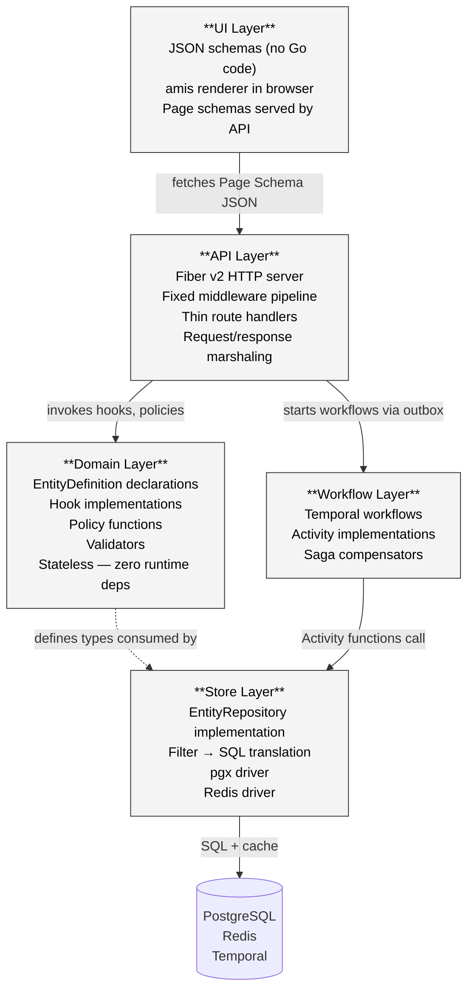

> ⚠️ **LEGACY DOCUMENTATION**
>
> This document describes the deprecated Framework A architecture and is retained for historical reference only.
>
> It MUST NOT be used when implementing or extending the Awo Framework (Framework B).
>
> Refer to [`awo/docs/`](../awo/docs/README.md) for the current canonical documentation.

---

---
title: "Five-Layer Architecture"
id: arch-003
status: accepted
category: SPEC
stability: FROZEN
audience: [framework-authors, module-authors, contributors]
since: "1.0"
normative-level: normative
related:
  - "[Architecture Laws](laws.md)"
  - "[Architecture Invariants](invariants.md)"
  - "[Architecture Overview](../01-introduction/architecture-overview.md)"
  - "[EntityDefinition](../03-kernel/entity-def.md)"
  - "[EntityRepository](../05-persistence/entity-repository.md)"
  - "[Awo Glossary](../GLOSSARY.md)"
---

# Five-Layer Architecture

**ARCH-003 | Status: Accepted | Stability: Frozen**

This document is the normative specification of Awo's five-layer dependency model. It defines each layer's responsibilities, its permitted imports, what code belongs in it, anti-patterns that violate it, and how each layer is tested.

The five-layer model is the structural enforcement of [Architecture Law LAW-008](laws.md#law-008-layer-imports-are-strictly-downward). Violation of the model is a defect, regardless of whether it produces observable misbehavior today.

The key words MUST, MUST NOT, REQUIRED, SHALL, SHALL NOT, SHOULD, SHOULD NOT, RECOMMENDED, MAY, and OPTIONAL in this document are to be interpreted as described in [RFC 2119](https://www.rfc-editor.org/rfc/rfc2119).

---

## Table of Contents

1. [Layer Overview](#1-layer-overview)
2. [UI Layer](#2-ui-layer)
3. [API Layer](#3-api-layer)
4. [Domain Layer](#4-domain-layer)
5. [Workflow Layer](#5-workflow-layer)
6. [Store Layer](#6-store-layer)
7. [Cross-Layer Communication Patterns](#7-cross-layer-communication-patterns)
8. [Import Rules by Layer](#8-import-rules-by-layer)
9. [Testing Strategy by Layer](#9-testing-strategy-by-layer)
10. [Anti-Patterns](#10-anti-patterns)

---

## 1. Layer Overview



> **Figure 1.** Five-layer dependency diagram. Solid arrows indicate permitted call directions. The dashed arrow from Domain to Store represents the interface dependency (Domain defines the `EntityRepository` interface; Store implements it) — not an import.

---

## 2. UI Layer

### Responsibility

The UI Layer is the browser-side rendering of [Page Schemas](../GLOSSARY.md#page-schema). It consists of the [amis](../GLOSSARY.md#amis) JavaScript renderer and the JSON schemas served by the API layer.

The UI layer has no Go code. It is not compiled into the server binary. It is served as static assets (`web/sdk/`, `web/pages/`, `web/schemas/pages/`) and executes entirely in the browser.

### What Belongs Here

- `web/pages/index.html` — the shell page that loads the amis SDK and bootstraps the sidebar
- `web/sdk/` — the pinned amis SDK files (sdk.js, sdk.css, charts)
- `web/schemas/pages/` — static amis JSON schema files (generated or hand-authored)
- CSS custom property overrides for theming

### What Does Not Belong Here

- Custom JavaScript beyond the amis bootstrap
- Application logic
- API calls that bypass the standard API layer
- Direct database queries

### Key Constraint

The amis SDK MUST NOT be updated without a complete compatibility audit of all [Page Builder](../GLOSSARY.md#page-builder) output. The SDK is pinned in `web/sdk/` for this reason.

---

## 3. API Layer

### Responsibility

The API Layer handles the HTTP protocol: receiving requests, executing the middleware pipeline, dispatching to route handlers, and serializing responses. It is the boundary between the external world and the framework's internal structure.

The API layer is implemented with Fiber v2. It is the only layer that may import Fiber.

### What Belongs Here

**Middleware** — The eight-stage [Middleware Pipeline](../GLOSSARY.md#middleware-pipeline) in fixed order. Middleware is framework code; module authors do not write middleware.

**Route handlers** — Auto-generated CRUD handlers (framework code) and custom action handlers (module author code). Custom handlers MUST be kept thin:
- Parse and validate the request shape (input structure, required fields present)
- Invoke RBAC check
- Call the appropriate Domain layer function or EntityRepository method
- Serialize the result into the [Response Envelope](../GLOSSARY.md#response-envelope)
- Return

A handler longer than approximately 50 lines is a sign that business logic has leaked into the API layer.

**Error mapping** — Translation of domain and store errors into HTTP status codes and response envelope format. Uses `errors.As` for error chain unwrapping; never a type switch.

**Request/response types** — Input parsing structs, output serialization structs. These MUST NOT be the same types as domain structs. The API layer serialization boundary is the point where field selection, sensitive field exclusion, and format normalization (currency, datetime) occur.

### What Does Not Belong Here

- Business logic (validation beyond input shape, business rules, workflows)
- Direct database access
- Session management beyond reading the session from context
- Tenant resolution beyond reading the tenant from context (resolution is middleware)
- Any import from the Temporal SDK

### Handler Size Rule

Route handlers MUST NOT exceed approximately 50 lines. If a handler cannot be expressed in 50 lines, the business logic it contains belongs in the Domain layer (as a hook or service function) or the Workflow layer (as a workflow).

### File Layout

```
internal/{platform|core}/<module>/
    handler.go     ← custom action handlers only; CRUD is auto-generated
```

---

## 4. Domain Layer

### Responsibility

The Domain Layer contains the stateless core of each module: [EntityDefinition](../GLOSSARY.md#entitydefinition) declarations, [HookRegistration](../GLOSSARY.md#hookregistration) implementations, [Policy Functions](../GLOSSARY.md#policy-function-policyfunc), and validators.

The Domain Layer has no external dependencies. It imports only `awo/def/`, `awo/filter/`, and the Go standard library. This property is the foundation of the framework's testability guarantee: domain logic can be tested without starting any infrastructure.

### What Belongs Here

**EntityDefinition declarations** — The `def.go` file in each module declares all EntityDefinitions and calls `def.Register()` in `init()`.

**Hook implementations** — Structs implementing the hook interfaces (`BeforeCreateHook`, `AfterCreateHook`, etc.). Hooks receive an `EntityRecord` and may mutate it (before-hooks) or perform side effects using the `EntityRepository` passed in the hook context. Hooks MUST NOT perform I/O outside of `EntityRepository` calls — external API calls, email sends, and file operations belong in Workflow Layer activities.

**Policy functions** — `PolicyFunc` implementations that inject row-level filter predicates based on the current `Actor`. Policy functions are pure: same actor → same predicate. They MUST NOT query the database.

**Validators** — Field-level validators implementing `FieldValidator`. Validators are pure functions: same input → same validation result. They MUST NOT query the database except through the `EntityRepository` passed in the validator context.

**Service layer** — Thin orchestration functions that coordinate multiple repository calls within a single operation. Services are domain code — they use the `EntityRepository` interface, not direct database access. Services MUST be stateless.

### What Does Not Belong Here

- HTTP imports (Fiber, net/http)
- Database driver imports (pgx, go-redis)
- Temporal SDK imports
- Global mutable state
- Goroutine spawning (goroutines belong in Workflow activities)
- Direct Redis access

### The Zero-Import Property

The Domain Layer's zero-external-import property is not a style rule. It is a structural guarantee. When Domain Layer code is tested:

```go
// Domain layer test — no running infrastructure required
func TestInvoiceValidator_MissingCustomer(t *testing.T) {
    repo := &mockEntityRepository{}  // implements EntityRepository[Invoice]
    validator := &InvoiceValidator{repo: repo}

    err := validator.BeforeCreate(context.Background(), missingCustomerRecord())

    var ve *ValidationError
    if !errors.As(err, &ve) {
        t.Fatal("expected ValidationError")
    }
    if _, ok := ve.Fields["customer"]; !ok {
        t.Error("expected field error on 'customer'")
    }
}
```

No database. No Redis. No HTTP server. Compile, run, done.

### File Layout

```
internal/{platform|core}/<module>/
    <module>.go      ← init() calls def.Register()
    def.go    ← EntityDefinition variable declarations
    policy.go        ← PolicyFunc implementations
    hooks.go         ← HookDef implementations
    service.go       ← Thin service functions
```

---

## 5. Workflow Layer

### Responsibility

The Workflow Layer handles all asynchronous, durable, long-running processes. It is implemented using Temporal and consists of workflow functions and [Activity](../GLOSSARY.md#activity-temporal) implementations.

### What Belongs Here

**Workflow functions** — Orchestration logic that coordinates activities. Workflow functions MUST be deterministic. They MUST NOT perform I/O directly — all I/O goes in activities. They MUST use `workflow.Now()`, `workflow.Sleep()`, `workflow.SideEffect`, and `workflow.Go` instead of their non-workflow equivalents.

**Activity implementations** — The actual I/O: database reads and writes (via `EntityRepository`), email sends, external HTTP calls, file operations. Activities are the only Workflow Layer code that imports Store Layer code.

**Saga compensators** — Compensation functions registered per activity. If the saga fails at step N, compensation runs from step N-1 to step 1 in reverse. The framework provides `SagaCompensator` to manage the compensation chain.

**Activities struct** — Activities are implemented as methods on a struct that receives dependencies (EmailClient, EntityRepository) via constructor injection. This pattern enables testing activities with mock dependencies.

### What Does Not Belong Here

- HTTP request handling
- Direct synchronous user-facing responses
- Temporal `StartWorkflow` calls from within a `WithTx` block (see [LAW-006](laws.md#law-006-outbox-entry-and-entity-record-commit-atomically))
- `time.Now()`, `time.Sleep()`, `rand`, standard goroutines (in workflow functions)

### Workflow Determinism

Workflow functions replay from event history on recovery. Replay must produce identical decisions given identical history. Non-deterministic workflow code causes replay divergence — a condition Temporal detects and reports as a `NonDeterministicError`.

Non-determinism sources that MUST be avoided in workflow functions:

| Prohibited | Replacement |
|---|---|
| `time.Now()` | `workflow.Now(ctx)` |
| `time.Sleep()` | `workflow.Sleep(ctx, d)` |
| `rand.Int()` | `workflow.SideEffect(ctx, func() any { return rand.Int() })` |
| HTTP call | Activity function |
| DB query | Activity function |
| `go func()` | `workflow.Go(ctx, func(ctx workflow.Context) {...})` |

### File Layout

```
internal/{platform|core}/<module>/
    workflows/
        <workflow_name>_workflow.go   ← workflow function
        <workflow_name>_activities.go ← activities struct + methods
        <workflow_name>_saga.go       ← saga compensators (if applicable)
```

---

## 6. Store Layer

### Responsibility

The Store Layer implements the infrastructure interfaces declared in `awo/driver/`. It is the only layer that communicates directly with PostgreSQL, Redis, and Temporal.

### What Belongs Here

**EntityRepository implementation** — The `pgx`-backed implementation of `EntityRepository[T]`. Translates [Filter DSL](../GLOSSARY.md#filter-dsl) expressions into parameterized SQL, manages RLS context (calls `set_tenant_context()` before every query), and maps database errors to domain errors.

**Filter → SQL compiler** — Translates Filter DSL predicate trees into SQL WHERE clauses and bind parameters. Handles operator precedence, NULL semantics, and JSONB path expressions for custom fields.

**Session store implementation** — Redis-backed implementation of `driver.SessionStore`. Reads session tokens, validates expiry, extracts `Actor` from session data.

**Cache implementations** — Redis-backed implementations for page schema cache, feature flag cache, and rate limit counters.

**Migration runner** — The `cmd/migrate/` command uses golang-migrate to apply migration files. Migration runner code is separate from the server binary — it runs as a distinct process in CI before the server starts.

### What Does Not Belong Here

- Business logic
- HTTP protocol handling
- Temporal workflow or activity code
- Domain-level error types (the store layer maps DB errors to domain error types, but does not define them)

### Error Mapping

The store layer MUST translate database-specific errors (pgx error codes) into domain error types before returning them. Domain error types are defined in `awo/def/` or `internal/shared/errors/`. The store layer MUST NOT expose pgx or database-specific error types to callers.

```go
func parseDBError(err error, op string) error {
    var pgErr *pgconn.PgError
    if errors.As(err, &pgErr) {
        switch pgErr.Code {
        case "23505": // unique_violation
            return &BusinessError{Code: "duplicate", Message: "Record already exists", Status: 409}
        case "23514": // check_violation
            return &BusinessError{Code: "constraint", Message: pgErr.Message, Status: 400}
        case "23503": // foreign_key_violation
            return &BusinessError{Code: "reference", Message: "Referenced record does not exist", Status: 400}
        }
    }
    return fmt.Errorf("%s: %w", op, err)
}
```

### File Layout

```
internal/store/
    entity_store.go       ← EntityRepository implementation
    filter_compiler.go    ← Filter DSL → SQL
    session_store.go      ← Redis session store
    schema_cache.go       ← Redis page schema cache
    flag_cache.go         ← Redis feature flag cache
    rate_limiter.go       ← Redis rate limit counters
    db_errors.go          ← pgx → domain error mapping
```

---

## 7. Cross-Layer Communication Patterns

### API → Domain

The API layer invokes Domain layer hook functions and service functions directly. These are synchronous Go function calls. No message queue, no channel, no goroutine crossing.

```go
// In handler.go (API layer)
result, err := invoiceService.Submit(ctx, recordID, actor)
```

### API → Store (via EntityRepository)

The API layer reads data directly from the EntityRepository for simple queries that do not require domain logic. For mutations, the API layer calls the EntityRepository inside the lifecycle sequence (hooks interleaved).

### Domain → Store (interface dependency)

The Domain layer defines the `EntityRepository` interface in `awo/def/`. The Store layer implements it. Domain code receives an `EntityRepository` via constructor or hook context injection — it never imports the store package.

This is a classic dependency inversion: the high-level module (Domain) defines the interface; the low-level module (Store) implements it.

### API → Workflow (via outbox)

The API layer does not call Temporal directly. After a mutation commits (including the outbox entry), the outbox relay — running as a background goroutine in the same process — polls for undelivered outbox entries and calls `temporal.StartWorkflow()` for each.

This decoupling means the API layer has no Temporal SDK import. Temporal failures do not fail the HTTP response.

### Workflow → Store (in Activity functions)

Activity functions receive an `EntityRepository` via dependency injection on the `Activities` struct. Activities use the repository to read and write data. They do not use raw SQL.

---

## 8. Import Rules by Layer

| Layer | May import | Must not import |
|---|---|---|
| UI | N/A (JSON, JS) | N/A |
| API | `awo/def/`, `awo/filter/`, `internal/store/`, fiber, slog | Temporal SDK |
| Domain | `awo/def/`, `awo/filter/`, Go stdlib | Fiber, pgx, redis, Temporal SDK |
| Workflow | `awo/def/`, `awo/filter/`, `internal/store/`, Temporal SDK | Fiber, net/http |
| Store | `awo/def/`, `awo/filter/`, `awo/driver/`, pgx, go-redis | Fiber, Temporal SDK, Domain layer |

---

## 9. Testing Strategy by Layer

| Layer | Test approach | Infrastructure required |
|---|---|---|
| UI | amis schema validation (JSON Schema), visual regression | None (JSON validation) |
| API | Handler tests with `fiber.Test()`, mock EntityRepository | None (test transport) |
| Domain | Unit tests with mock EntityRepository | None |
| Workflow | `testsuite.WorkflowTestSuite` (Temporal test suite), mock activities | None (Temporal test suite) |
| Store | Integration tests against real PostgreSQL and Redis | PostgreSQL, Redis (Docker) |

The layered architecture ensures that the three highest-value layers (API, Domain, Workflow) require no running infrastructure for testing. Only the Store layer requires integration test infrastructure, and Store layer testing is limited to: SQL correctness, Filter → SQL translation, error mapping, and RLS enforcement.

---

## 10. Anti-Patterns

The following patterns are violations of the five-layer model. Each is prohibited.

### AP-01: Business Logic in Handlers

```go
// PROHIBITED: business logic in API layer handler
func CreateInvoiceHandler(c *fiber.Ctx) error {
    // ...
    if invoice.Total.LessThan(decimal.Zero) {
        return c.Status(422).JSON(...)  // ← validation belongs in Domain hook
    }
    if customer.CreditLimit.LessThan(invoice.Total) {
        return c.Status(400).JSON(...)  // ← business rule belongs in Domain hook
    }
    // ...
}
```

**Correct:** Move validation to a `BeforeCreateHook`. Move business rules to a `BeforeCreateHook`. The handler calls `repo.Create(ctx, input)` and handles the returned error.

### AP-02: Direct Database Access in Handlers

```go
// PROHIBITED: direct database access in API layer
func GetInvoiceHandler(c *fiber.Ctx) error {
    row := db.QueryRow("SELECT * FROM finance_invoice WHERE id = $1", id)
    // ...
}
```

**Correct:** Use `EntityRepository.Get(ctx, id)`.

### AP-03: Domain Layer Importing Infrastructure

```go
// PROHIBITED: Domain layer importing pgx
import "github.com/jackc/pgx/v5"

func (h *InvoiceValidator) BeforeCreate(ctx context.Context, rec *entity.EntityRecord) error {
    conn, _ := pgx.Connect(ctx, os.Getenv("DATABASE_URL"))  // ← cannot test without DB
    // ...
}
```

**Correct:** The validator receives an `EntityRepository` via hook context. It calls `repo.Exists(ctx, filter)` — no direct database access.

### AP-04: Temporal Call Inside Transaction

```go
// PROHIBITED: StartWorkflow inside WithTx
repo.WithTx(ctx, func(ctx context.Context, txRepo EntityRepository) error {
    _, err := txRepo.Create(ctx, input)
    if err != nil { return err }
    _, err = temporalClient.StartWorkflow(ctx, options, "InvoiceWorkflow", input)
    return err  // ← if this fails, transaction rolls back but entity record is lost
})
```

**Correct:** Write to the outbox inside the transaction. Let the outbox relay dispatch the workflow start after commit.

### AP-05: Lazy Edge Loading

```go
// PROHIBITED: loading edges per-record (N+1)
invoices, _, _ := repo.Query(ctx, filter)
for _, inv := range invoices {
    lines, _ := repo.Query(ctx, filter.Eq("invoice_id", inv.ID))  // N queries
}
```

**Correct:** Use a `QueryOption` that loads the `lines` edge in a single additional query (or JOIN), not one query per invoice.

### AP-06: Workflow I/O Outside Activities

```go
// PROHIBITED: I/O in workflow function
func InvoiceSubmissionWorkflow(ctx workflow.Context, input Input) error {
    // ...
    resp, err := http.Post("https://api.kra.go.ke/etims/submit", ...)  // ← not deterministic
    // ...
}
```

**Correct:** Extract the HTTP call into an Activity function. Call the activity from the workflow function using `workflow.ExecuteActivity(ctx, activities.SubmitToKRAActivity, input)`.

---

## Related Documents

- [Architecture Laws](laws.md) — LAW-008 is the normative basis for this document
- [Architecture Invariants](invariants.md) — INV-003, INV-006, INV-010 are maintained by this model
- [Architecture Overview](../01-introduction/architecture-overview.md) — informal introduction to this model
- [EntityDefinition](../03-kernel/entity-def.md) — the Domain layer's central type
- [EntityRepository](../05-persistence/entity-repository.md) — the interface between Domain and Store
- [Hook System](../04-domain/hooks.md) — the Domain layer extension mechanism
- [Temporal Integration](../09-workflow/temporal-integration.md) — Workflow layer specification
- [Outbox Pattern](../09-workflow/outbox-pattern.md) — the API→Workflow communication mechanism
- [Glossary](../GLOSSARY.md) — canonical definitions for all terms
