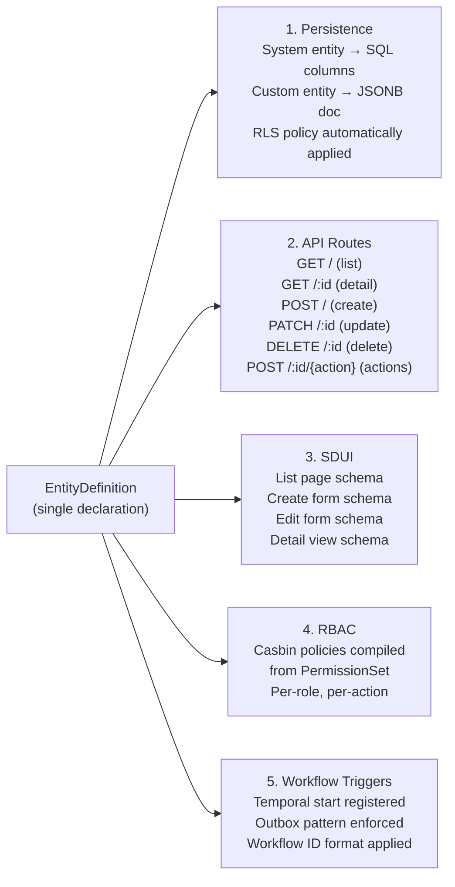

> ⚠️ **LEGACY DOCUMENTATION**
>
> This document describes the deprecated Framework A architecture and is retained for historical reference only.
>
> It MUST NOT be used when implementing or extending the Awo Framework (Framework B).
>
> Refer to [`awo/docs/`](../awo/docs/README.md) for the current canonical documentation.

---

---
title: "EntityDefinition"
id: kern-001
status: accepted
category: SPEC
stability: FROZEN
audience: [framework-authors, module-authors, contributors]
since: "1.0"
normative-level: normative
related:
  - "[Compilation Pipeline](compilation-pipeline.md)"
  - "[Entity Registry](registry.md)"
  - "[Fields](../04-domain/fields.md)"
  - "[Edges](../04-domain/edges.md)"
  - "[Hooks](../04-domain/hooks.md)"
  - "[Policy Functions](../04-domain/policies.md)"
  - "[Actions](../04-domain/actions.md)"
  - "[EntityRepository](../05-persistence/entity-repository.md)"
  - "[Architecture Laws](../02-architecture/laws.md)"
  - "[Awo Glossary](../GLOSSARY.md)"
---

# EntityDefinition

**KERN-001 | Status: Accepted | Stability: Frozen**

The [EntityDefinition](../GLOSSARY.md#entitydefinition) is the central primitive of the Awo Framework. Every significant runtime behavior in Awo — HTTP routes, database schema, SDUI page schemas, Casbin permission policies, Temporal workflow triggers — is derived from EntityDefinition declarations.

This document is the normative specification of the EntityDefinition type, its fields, its constraints, and its relationship to the five subsystems it drives. Module authors declaring entities and framework authors modifying the EntityDefinition type must conform to this specification.

The key words MUST, MUST NOT, REQUIRED, SHALL, SHALL NOT, SHOULD, SHOULD NOT, RECOMMENDED, MAY, and OPTIONAL in this document are to be interpreted as described in [RFC 2119](https://www.rfc-editor.org/rfc/rfc2119).

---

## Table of Contents

1. [Overview](#1-overview)
2. [EntityDefinition Struct](#2-entitydefinition-struct)
3. [Identity Fields](#3-identity-fields)
4. [Fields](#4-fields)
5. [Edges](#5-edges)
6. [Hooks](#6-hooks)
7. [Permissions](#7-permissions)
8. [Workflow Triggers](#8-workflow-triggers)
9. [Actions](#9-actions)
10. [Page Builders](#10-page-builders)
11. [Policy Function](#11-policy-function)
12. [Hook Policy](#12-hook-policy)
13. [Entity Storage Model](#13-entity-storage-model)
14. [Registration](#14-registration)
15. [Naming Rules](#15-naming-rules)
16. [Complete Example](#16-complete-example)
17. [Constraints and Validation](#17-constraints-and-validation)

---

## 1. Overview

A single `EntityDefinition` declaration drives five subsystems simultaneously:



> **Figure 1.** One declaration, five derived artifacts. All five are produced at compilation time, not at request time.

The subsystem derivations are:

| Subsystem | What is derived | When |
|---|---|---|
| Persistence | Storage strategy, table name, column types, index strategy | Compilation → migration generation |
| API | Route table entries for all CRUD endpoints and declared actions | Compilation → Fiber route registration |
| SDUI | Page schema index entries (list, create, edit, detail) | Compilation → Redis cache population |
| RBAC | Casbin policy tuples for all declared permission roles and actions | Compilation → Casbin model load |
| Workflows | Temporal trigger registration, outbox schema | Compilation → worker registration |

---

## 2. EntityDefinition Struct

All EntityDefinitions in Awo are declared as values of type `def.EntityDefinition`. The package path is `awo.so/awo/def`. Module authors use the alias `entity` in most module code.

```go
// Full struct — all fields
type EntityDefinition struct {
    // Identity (required)
    Name        string  // stable, globally unique, {module}_{noun} format
    Module      string  // owning module name
    Label       string  // human-readable singular label
    LabelPlural string  // human-readable plural label

    // Storage
    StorageModel StorageModel  // SystemEntity or CustomEntity (default: CustomEntity)

    // Schema
    Fields  []FieldDef
    Edges   []EdgeDef

    // Lifecycle
    Hooks HookPolicy  // Open or Closed (default: Closed)

    // Domain
    Permissions      PermissionSet
    PolicyFn         PolicyFunc          // row-level filter injection
    Actions          []ActionDef
    WorkflowTriggers []WorkflowTrigger

    // SDUI
    PageBuilders PageBuilderSet  // optional overrides; nil = framework defaults
}
```

The struct fields are described individually in the sections below.

---

## 3. Identity Fields

### Module

```go
Module string  // required
```

The name of the module that owns this entity. Lowercase, underscores only. Unique globally within a deployment. Examples: `finance`, `inventory`, `iam`, `hr`, `crm`, `platform`.

The `Module` field is used to:
- Derive the qualified name together with `Name`
- Construct module-scoped API routes (`/api/v1/{module}/{plural}`)
- Group entities in the SDUI sidebar navigation
- Scope Casbin roles (`role:{module}.{role_name}`)
- Group migrations in the file system

### Name

```go
Name string  // required — module-local identifier
```

The module-local entity identifier. Unique within the owning module. Does **not** include the module prefix.

**Format:** `{noun}` or `{noun}_{qualifier}`, lowercase snake_case. No module prefix, no hyphens, no uppercase, no spaces.

**Examples:** `invoice`, `stock_move`, `user`, `employee`, `shift`, `org_assignment`

**Qualified name** (compiler-derived): The globally unique identifier is `Module + "_" + Name`, computed by the compiler. Entity authors MUST NOT construct this manually.

| Module | Name | QualifiedName (compiler-derived) |
|--------|------|----------------------------------|
| `finance` | `invoice` | `finance_invoice` |
| `inventory` | `stock_move` | `inventory_stock_move` |
| `iam` | `user` | `iam_user` |
| `platform` | `organization` | `platform_organization` |

**Immutability:** Entity names MUST NOT be changed after the entity has been registered in any non-development deployment. The qualified name is embedded in migration filenames, Temporal workflow IDs, Redis cache keys, Casbin policy tuples, and audit log records.

**Uniqueness:** Within a module, `Name` must be unique. Across modules, `QualifiedName` must be unique (enforced by registry).

### PluralName

```go
PluralName string  // optional — explicit plural override
```

An explicit plural override for the module-local name used in API resource paths. Leave empty unless automatic pluralization produces the wrong result.

**Example (override needed):** entity `"sheep"` → default `"sheeps"` (wrong) → set `PluralName: "sheep"`.

**Example (override not needed):** entity `"category"` → compiler derives `"categories"` correctly.

### Label and LabelPlural

```go
Label       string  // optional — human-readable singular: "Invoice", "Stock Move"
LabelPlural string  // optional — human-readable plural: "Invoices", "Stock Moves"
```

Used in SDUI page titles, list headings, breadcrumbs, and error messages. Derived automatically from `Name` if not set: `"org_assignment"` → `"Org Assignment"` / `"Org Assignments"`.

---

## 4. Fields

```go
Fields []FieldDef  // required — at least one field; system columns added automatically
```

Each `FieldDef` declares one data attribute on the entity. The framework automatically adds system columns (`id`, `tenant_id`, `created_at`, `updated_at`, `created_by`, `custom_fields`) and does not require them to be declared in `Fields`.

### FieldDef Struct

```go
type FieldDef struct {
    Name        string    // required; stable; snake_case
    Type        FieldType // required; open string type
    Label       string    // optional; defaults to Title(Name)
    Required    bool
    Unique      bool
    Immutable   bool      // set-once; rejected on update
    Sensitive   bool      // excluded from logs and standard responses
    Searchable  bool      // GIN trigram index generated
    MaxLen      int       // for Data/SmallText fields
    Min         float64   // for Int/Float fields
    Max         float64   // for Int/Float fields

    // Type-specific
    Options         []string  // for Select, MultiSelect
    Default         any       // literal default value
    LinkTarget      string    // entity name; for Link, LinkList
    Series          string    // format string; for NamingSeries
    TenantOverridable bool    // for NamingSeries prefix override

    // Validation
    Validators []FieldValidator
}
```

### Field Types

Field types are open strings (not a closed enum). The canonical types registered by the framework are:

**Scalar types:**

| FieldType | PostgreSQL type | Go type | Notes |
|---|---|---|---|
| `Data` | `varchar(n)` | `string` | `Searchable()` adds GIN trgm index |
| `SmallText` | `varchar(1024)` | `string` | No B-tree index |
| `LongText` | `text` | `string` | No index; use tsvector for FTS |
| `Int` | `bigint` | `int64` | Counts, quantities; never money |
| `Float` | `double precision` | `float64` | Scientific/percentages only; **never money** |
| `Currency` | `numeric(20,4)` | `decimal.Decimal` | **Only correct type for money** |
| `Bool` | `boolean` | `bool` | — |
| `Date` | `date` | `time.Time` | Date portion only |
| `DateTime` | `timestamptz` | `time.Time` | Stored UTC; serialized as EAT ISO 8601 |
| `Time` | `time` | `time.Time` | Time portion only |

**Structured types:**

| FieldType | Notes |
|---|---|
| `Select` | SQL `CHECK (col IN (...))`. Options in `FieldDef.Options` |
| `MultiSelect` | Array column; `text[]` in PostgreSQL |
| `NamingSeries` | Format: `INV-{YYYY}-{SEQ:5}`. Atomic per-tenant counter |
| `JSON` | Freeform JSONB; GIN indexed |

**Relational types:**

| FieldType | Notes |
|---|---|
| `Link` | FK to single entity type; `FieldDef.LinkTarget` required |
| `LinkList` | Array of FKs; `FieldDef.LinkTarget` required |
| `DynamicLink` | Polymorphic: stores `link_type` + `link_name` pair |

External [Drivers](../GLOSSARY.md#driver) may register additional field types. The compiler verifies that every `FieldType` value used in any registered `EntityDefinition` has a registered handler before accepting the registration.

### Field Name Rules

Field names MUST be:
- Lowercase
- Underscore-separated (`snake_case`)
- Stable after first deployment
- Unique within the entity

Field names MUST NOT:
- Use reserved system column names: `id`, `tenant_id`, `created_at`, `updated_at`, `created_by`, `custom_fields`
- Contain spaces, hyphens, or uppercase letters

### Currency Field Constraint

Any field that represents a monetary value MUST use `FieldType: Currency`. The use of `Float`, `Data`, `SmallText`, or any other type to store monetary values is a violation of [Architecture Invariant INV-008](../02-architecture/invariants.md#inv-008-all-monetary-arithmetic-uses-exact-decimal-representation).

---

## 5. Edges

```go
Edges []EdgeDef  // optional
```

Each `EdgeDef` declares a relationship from this entity to another entity. Edges are loaded explicitly via [QueryOption](../GLOSSARY.md#queryoption) — never lazily.

### EdgeDef Struct

```go
type EdgeDef struct {
    Name          string    // stable; snake_case; e.g. "lines", "customer"
    Target        string    // entity name of the related entity
    Type          EdgeType  // OneToOne, OneToMany, ManyToMany
    CascadeDelete bool      // delete related records when this record is deleted
    Label         string    // optional; for SDUI display
}
```

### Edge Types

| EdgeType | Cardinality | Example |
|---|---|---|
| `OneToOne` | This entity has exactly one related record | `invoice` → `invoice_pdf` |
| `OneToMany` | This entity has zero or more related records | `invoice` → `invoice_line` |
| `ManyToMany` | This entity shares related records with others | `product` → `product_tag` |

### Edge Loading

Edges are never lazily loaded. To load an edge, pass a `QueryOption` to the `EntityRepository.Query()` or `EntityRepository.Get()` call:

```go
invoice, err := invoiceRepo.Get(ctx, id, entity.WithEdge("lines"), entity.WithEdge("customer"))
```

Not declaring an edge load option means the edge field is nil in the returned `EntityRecord`. Accessing a nil edge field is a programming error, not a framework behavior.

---

## 6. Hooks

```go
Hooks HookPolicy  // Open or Closed; governs cross-module hook registration
```

The `Hooks` field on `EntityDefinition` governs whether other modules may register hooks on this entity's lifecycle stages. See [§12 Hook Policy](#12-hook-policy) for the `Open`/`Closed` specification.

Hook implementations are registered separately as [HookRegistration](../GLOSSARY.md#hookregistration) values, not directly on the EntityDefinition. See [Hooks](../04-domain/hooks.md) for the full hook system specification.

### Lifecycle Stages

The framework defines these canonical lifecycle stages:

| Stage | Timing | Inside TX? | Abort via |
|---|---|---|---|
| `before_validate` | Before field validation | No | `ValidationError` |
| `before_create` | Before first persist | No | `BusinessError` |
| `after_create` | After first persist | Yes | error → rollback |
| `before_update` | Before update persist | No | `BusinessError` |
| `after_update` | After update persist | Yes | error → rollback |
| `before_delete` | Before delete | No | `BusinessError` |
| `after_delete` | After delete | Yes | error → rollback |
| `before_save` | Before any write (create or update) | No | `BusinessError` |
| `after_save` | After any write (create or update) | Yes | error → rollback |

---

## 7. Permissions

```go
Permissions PermissionSet  // required for entities with non-public data
```

The `PermissionSet` declares which roles are granted each standard CRUD permission and each custom action permission.

### PermissionSet Struct

```go
type PermissionSet struct {
    Create []string  // roles granted "create" action
    Read   []string  // roles granted "read" action
    Write  []string  // roles granted "write" (update) action
    Delete []string  // roles granted "delete" action
}
```

Each string in the permission lists is a Casbin subject: `role:{role-name}` for role-based grants, or `user:{uuid}` for direct user grants (rare; prefer roles).

### Built-in Roles

| Role | Scope | Notes |
|---|---|---|
| `role:platform-admin` | All tenants | Bypasses Casbin; not in PermissionSet |
| `role:tenant.admin` | One tenant | Full access; typically in all permission lists |
| `role:tenant.user` | One tenant | Standard user; customize per module |
| `role:api-client` | One tenant | Machine-to-machine; limited scopes |

Module-specific roles follow the format `role:{module}.{role_name}`:

```go
Permissions: entity.PermissionSet{
    Create: []string{"role:finance.accounts_payable", "role:tenant.admin"},
    Read:   []string{"role:finance.viewer", "role:finance.accounts_payable", "role:tenant.admin"},
    Write:  []string{"role:finance.accounts_payable", "role:tenant.admin"},
    Delete: []string{"role:tenant.admin"},
},
```

### Permission Evaluation Semantics

Permission evaluation uses OR semantics: an actor is granted an action if they hold any one of the roles listed for that action.

Permission evaluation is an operation-level gate. It answers: "may this actor perform this action on this entity type?" Row-level access control (which records the actor may see) is handled by [Policy Functions](../04-domain/policies.md).

Both checks are required. RBAC gates the operation; Policy Functions gate the rows.

---

## 8. Workflow Triggers

```go
WorkflowTriggers []WorkflowTrigger  // optional
```

Each `WorkflowTrigger` binds a [Lifecycle Stage](../GLOSSARY.md#lifecycle-stage) event to the start of a Temporal workflow.

### WorkflowTrigger Struct

```go
type WorkflowTrigger struct {
    On           string       // lifecycle stage name or custom event name
    WorkflowFn   string       // registered Temporal workflow function name
    TaskQueue    string       // Temporal task queue: "{module}.{entity}.{event}"
    InputBuilder func(rec *EntityRecord, ctx TriggerContext) (any, error)
}
```

### Canonical Trigger Events

| Event | Fires on |
|---|---|
| `on_create` | After successful Create commit |
| `on_update` | After successful Update commit |
| `on_delete` | After successful Delete commit |
| `on_submit` | After a `submit` action commits |
| `on_cancel` | After a `cancel` action commits |

Custom events may be declared by module authors for module-specific lifecycle transitions.

### Workflow ID Format

The workflow ID for every started workflow is:

```
{tenant-uuid}.{entity-name}.{record-id}.{event}.{WorkflowFn}
```

This format is mandated by [LAW-016](../02-architecture/laws.md#law-016-workflow-id-format-is-canonical) and must not deviate.

### Outbox Guarantee

Workflow starts are guaranteed by the [Outbox Pattern](../09-workflow/outbox-pattern.md). The outbox entry is written in the same transaction as the entity record (see [LAW-006](../02-architecture/laws.md#law-006-outbox-entry-and-entity-record-commit-atomically)). The Temporal `StartWorkflow` call occurs after the transaction commits, performed by the outbox relay.

---

## 9. Actions

```go
Actions []ActionDef  // optional
```

Each `ActionDef` declares a custom operation beyond standard CRUD.

### ActionDef Struct

```go
type ActionDef struct {
    Name        string       // stable; snake_case; used in URL: POST /:id/{Name}
    Method      ActionMethod // Post (default), Get
    Label       string       // human-readable; shown in SDUI action button
    Permission  string       // single role string: "role:finance.accounts_payable"
    HandlerFunc ActionHandlerFunc
}

type ActionHandlerFunc func(ctx context.Context, action ActionContext) (*ActionResult, error)
```

### ActionContext

The `ActionContext` received by every action handler contains:

```go
type ActionContext struct {
    Repo     EntityRepository  // scoped; tenant + permissions applied
    RecordID uuid.UUID         // target record
    Actor    Actor             // authenticated user from session
    Input    map[string]any    // parsed request body (if any)
}
```

The handler receives a pre-resolved, permission-checked context. It must not perform its own tenant wiring or authentication.

### Generated Route

`ActionDef.Name = "submit"` generates: `POST /api/v1/entities/finance_invoice/{id}/submit`

---

## 10. Page Builders

```go
PageBuilders PageBuilderSet  // optional; nil = framework defaults for all views
```

The `PageBuilderSet` declares optional overrides for the four auto-generated SDUI views.

```go
type PageBuilderSet struct {
    List   PageBuilderFunc  // override list page schema
    Create PageBuilderFunc  // override create form schema
    Edit   PageBuilderFunc  // override edit form schema
    Detail PageBuilderFunc  // override detail view schema
}

type PageBuilderFunc func(ctx context.Context, schema PageSchemaContext) (PageSchema, error)
```

Nil entries use the framework-generated default. Only override views where the generated output is genuinely insufficient.

Page schemas are cached in Redis at `page:{entity}:{version}:{tenant}` with a 5-minute TTL. The cache is invalidated on permission changes and feature flag changes. Page builder functions are invoked at schema-serve time, not at request time.

---

## 11. Policy Function

```go
PolicyFn PolicyFunc  // optional; nil = no row-level filtering beyond RLS
```

A `PolicyFunc` is a function that receives the current `Actor` from context and returns a [Filter](../GLOSSARY.md#filter) predicate to be automatically injected into all queries for this entity.

```go
type PolicyFunc func(ctx context.Context) Filter
```

### Example: Owner-Only Policy

```go
PolicyFn: entity.PolicyFunc(func(ctx context.Context) entity.Filter {
    actor := session.ActorFromContext(ctx)
    return filter.Eq("assigned_to", actor.UserID)
}),
```

This predicate is injected into every `Query`, `Get`, `Exists`, `Count`, and `Aggregate` call on this entity. The actor sees only records where `assigned_to` equals their user ID.

### Policy Composition

Multiple policies may be composed. The framework applies AND semantics: all injected predicates must be satisfied. [RLS](../GLOSSARY.md#rls-row-level-security) provides the tenant isolation predicate; `PolicyFn` provides additional row-level filtering.

Policy functions MUST be pure: same actor → same predicate. They MUST NOT query the database.

---

## 12. Hook Policy

```go
Hooks HookPolicy  // Open or Closed (default: Closed)
```

The `HookPolicy` field controls whether modules other than the owning module may register hooks on this entity's lifecycle stages.

| HookPolicy | Meaning |
|---|---|
| `Closed` (default) | Only the owning module may register hooks |
| `Open` | Any module may register hooks via `HookRegistration` |

See [LAW-017](../02-architecture/laws.md#law-017-cross-module-hook-registration-requires-open-policy).

---

## 13. Entity Storage Model

```go
StorageModel StorageModel  // SystemEntity or CustomEntity (default: CustomEntity)
```

| StorageModel | Storage | Use when |
|---|---|---|
| `SystemEntity` | Typed SQL columns | Financial integrity, inventory accuracy, IAM data, high write frequency |
| `CustomEntity` | JSONB document | Tenant-specific data, evolving schema, no financial participation |

### Mandatorily System Entities

The following entities MUST be declared as `SystemEntity`:

| Entity | Reason |
|---|---|
| `LedgerEntry` | Double-entry accounting; SQL numeric constraints required |
| `StockMove` | Inventory accounting; SQL quantity constraints required |
| `Payment` | Financial transaction; SQL constraints + audit triggers |
| `User` | IAM data; JSONB corruption risk unacceptable |
| `Tenant` | Platform identity; accessible before per-tenant schemas load |
| `JournalEntry` | Double-entry; debit/credit balance enforced at DB level |
| `TaxEntry` | KRA eTIMS record; regulatory compliance |

### Custom Fields on System Entities

Every `SystemEntity` automatically receives a `custom_fields jsonb` column. Tenant-defined [Custom Fields](../GLOSSARY.md#custom-field) are stored in this column. The framework's Filter DSL and SDUI treat custom fields identically to declared fields.

### Escalation Criteria

Escalate from `CustomEntity` to `SystemEntity` when:
- Record volume exceeds 10 million rows
- Fields are used in financial calculations requiring precision
- FK constraints to system entity PKs are required

---

## 14. Registration

EntityDefinitions MUST be registered using `def.Register()` from an `init()` function. This ensures registration occurs during the [Initialization Phase](../GLOSSARY.md#initialization-phase), before `Registry.Compile()` is called.

```go
// internal/core/finance/def.go

var InvoiceDefinition = entity.EntityDefinition{
    Name:   "invoice",   // module-local; compiler derives "finance_invoice"
    Module: "finance",
    // ...
}

// internal/core/finance/finance.go

func init() {
    def.Register(&InvoiceDefinition)
}
```

`def.Register()` MUST NOT be called from:
- Request handlers
- Service functions
- Any function that executes after process startup

Calling `def.Register()` after `Registry.Compile()` returns an error (see [LAW-003](../02-architecture/laws.md#law-003-registry-is-closed-after-compilation)).

---

## 15. Naming Rules

| Field | Format | Example |
|---|---|---|
| `Module` | snake_case, unique globally | `finance` |
| `Name` | snake_case, module-local noun (no module prefix) | `invoice` |
| `PluralName` | snake_case, plural (only when auto-plural is wrong) | `sheep` |
| `Label` | Title case (auto-derived from Name if omitted) | `Invoice` |
| `LabelPlural` | Title case (auto-derived from Label if omitted) | `Invoices` |
| `Fields[*].Name` | snake_case | `total_kes` |
| `Edges[*].Name` | snake_case | `invoice_lines` |
| `Actions[*].Name` | snake_case | `submit_for_approval` |
| `WorkflowTriggers[*].TaskQueue` | `{module}.{noun}.{event}` | `finance.invoice.submit` |
| `WorkflowTriggers[*].WorkflowFn` | `{Entity}{Event}Workflow` | `InvoiceSubmitWorkflow` |

### Compiler-Derived Identity

The compiler derives all globally-unique identifiers from `Module` + `Name`. Entity authors MUST NOT construct these manually.

| Derived Field | Formula | Example |
|---|---|---|
| `QualifiedName` | `module + "_" + name` | `finance_invoice` |
| `TableName` | `QualifiedName` (system); `custom_entity_records` (custom) | `finance_invoice` |
| `RoutePrefix` | `/api/v1/{module}/{plural(name)}` | `/api/v1/finance/invoices` |
| `APIResource` | `plural(name)` or `PluralName` | `invoices` |
| `APISingular` | `name` | `invoice` |
| `OpenAPITag` | `Title(module)` | `Finance` |
| `EventNamespace` | `module + "." + name` | `finance.invoice` |
| `WorkflowNamespace` | `module + "." + name` | `finance.invoice` |
| `PermissionNamespace` | `QualifiedName` | `finance_invoice` |
| `MetricNamespace` | `QualifiedName` | `finance_invoice` |
| `CacheNamespace` | `module + ":" + name` | `finance:invoice` |

---

## 16. Complete Example

```go
// internal/core/finance/def.go

var InvoiceDefinition = entity.EntityDefinition{
    Name:         "invoice",   // module-local; compiler derives "finance_invoice"
    Module:       "finance",
    Label:        "Invoice",
    LabelPlural:  "Invoices",
    StorageModel: entity.SystemEntity,

    Fields: []entity.FieldDef{
        {
            Name:   "number",
            Type:   entity.NamingSeries,
            Series: "INV-{YYYY}-{SEQ:5}",
            Label:  "Invoice Number",
        },
        {
            Name:       "customer",
            Type:       entity.Link,
            LinkTarget: "crm_customer",
            Required:   true,
            Label:      "Customer",
        },
        {
            Name: "status",
            Type: entity.Select,
            Options: []string{
                "Draft", "Submitted", "Approved", "Paid", "Cancelled",
            },
            Default:   "Draft",
            Immutable: false,
        },
        {
            Name:     "total_kes",
            Type:     entity.Currency,
            Required: true,
            Label:    "Total (KES)",
        },
        {
            Name:  "due_date",
            Type:  entity.Date,
            Label: "Due Date",
        },
        {
            Name:  "notes",
            Type:  entity.LongText,
            Label: "Notes",
        },
    },

    Edges: []entity.EdgeDef{
        {
            Name:          "lines",
            Target:        "finance_invoice_line",
            Type:          entity.OneToMany,
            CascadeDelete: true,
        },
    },

    Permissions: entity.PermissionSet{
        Create: []string{"role:finance.accounts_payable", "role:tenant.admin"},
        Read:   []string{"role:finance.viewer", "role:finance.accounts_payable", "role:tenant.admin"},
        Write:  []string{"role:finance.accounts_payable", "role:tenant.admin"},
        Delete: []string{"role:tenant.admin"},
    },

    PolicyFn: entity.PolicyFunc(func(ctx context.Context) entity.Filter {
        // Finance viewers can only see invoices in their assigned cost center
        actor := session.ActorFromContext(ctx)
        if actor.HasRole("role:finance.viewer") && !actor.HasRole("role:tenant.admin") {
            return filter.Eq("cost_center", actor.CostCenter)
        }
        return filter.None() // no additional restriction
    }),

    Hooks: entity.Open, // Finance module allows other modules to attach hooks

    Actions: []entity.ActionDef{
        {
            Name:        "submit",
            Label:       "Submit for Approval",
            Permission:  "role:finance.accounts_payable",
            HandlerFunc: SubmitInvoiceAction,
        },
        {
            Name:        "cancel",
            Label:       "Cancel Invoice",
            Permission:  "role:finance.accounts_payable",
            HandlerFunc: CancelInvoiceAction,
        },
    },

    WorkflowTriggers: []entity.WorkflowTrigger{
        {
            On:         "on_submit",
            WorkflowFn: "InvoiceApprovalWorkflow",
            TaskQueue:  "finance.invoice.submit",
            InputBuilder: func(rec *entity.EntityRecord, tc entity.TriggerContext) (any, error) {
                return finance.InvoiceApprovalInput{
                    TenantID:  rec.TenantID,
                    InvoiceID: rec.ID,
                    Total:     rec.Fields["total_kes"].(decimal.Decimal),
                }, nil
            },
        },
    },

    PageBuilders: entity.PageBuilderSet{
        Detail: BuildInvoiceDetailPage, // only override detail view
        // List, Create, Edit use framework defaults
    },
}

func init() {
    def.Register(&InvoiceDefinition)
}
```

---

## 17. Constraints and Validation

The compiler validates every registered `EntityDefinition` before producing the `CompiledSchema`. Compilation fails if any constraint is violated.

| Constraint | Compile-time check |
|---|---|
| `Name` follows `{module}_{noun}` format | Regex check |
| `Name` is globally unique | Duplicate detection across all registrations |
| Every `FieldType` has a registered handler | Handler registry lookup |
| Every `Edges[*].Target` is a registered entity name | Registry lookup |
| Every `Fields[*].LinkTarget` is a registered entity name | Registry lookup |
| `Currency` type not used with `Searchable: true` | Type compatibility check |
| `NamingSeries` type has a valid `Series` format string | Format string parser |
| `Select` type has at least one option | Options length check |
| Cross-module `HookRegistration` targets an `Open` entity | HookPolicy check |
| `WorkflowTriggers[*].On` is a known event name or registered custom event | Event registry check |
| No reserved field names (`id`, `tenant_id`, etc.) used | Reserved name check |

Compiler error messages MUST include: the entity name, the specific field or declaration that failed, and the constraint that was violated.

---

## Related Documents

- [Fields](../04-domain/fields.md) — complete FieldDef and FieldType specification
- [Edges](../04-domain/edges.md) — complete EdgeDef and edge loading specification
- [Hooks](../04-domain/hooks.md) — HookRegistration, lifecycle stages, execution order
- [Policy Functions](../04-domain/policies.md) — PolicyFunc composition and semantics
- [Actions](../04-domain/actions.md) — ActionDef, ActionContext, ActionResult
- [Entity Registry](registry.md) — registration, validation, and compilation
- [Compilation Pipeline](compilation-pipeline.md) — how the EntityDefinition becomes runtime behavior
- [EntityRepository](../05-persistence/entity-repository.md) — the persistence interface driven by this declaration
- [Architecture Laws](../02-architecture/laws.md) — LAW-011 (naming), LAW-007 (hook order), LAW-017 (hook policy)
- [Glossary](../GLOSSARY.md) — canonical definitions
