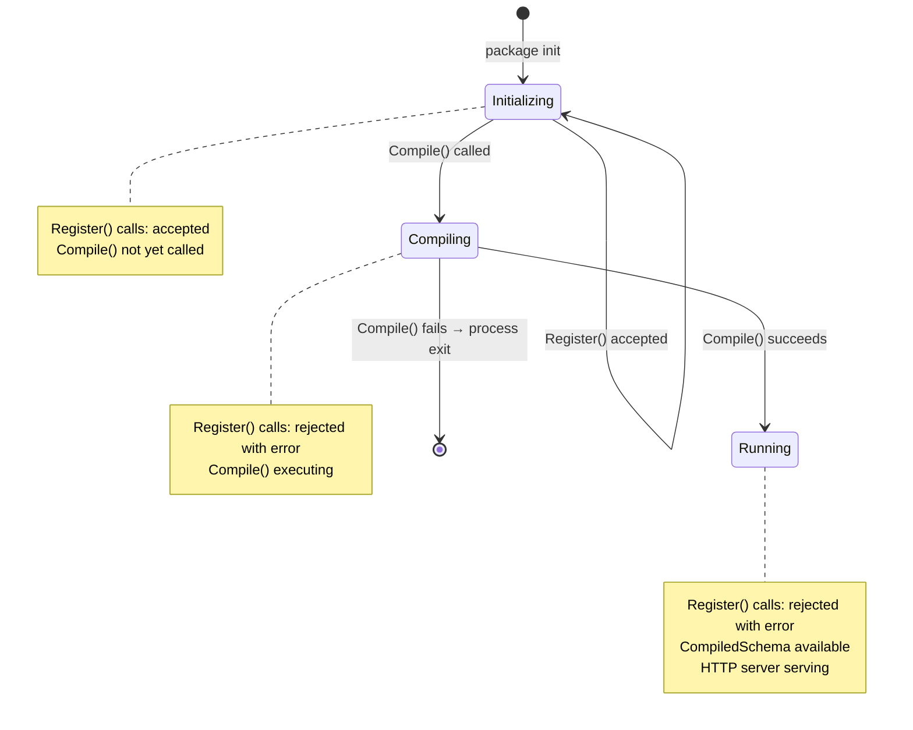

> ⚠️ **LEGACY DOCUMENTATION**
>
> This document describes the deprecated Framework A architecture and is retained for historical reference only.
>
> It MUST NOT be used when implementing or extending the Awo Framework (Framework B).
>
> Refer to [`awo/docs/`](../awo/docs/README.md) for the current canonical documentation.

---

---
title: "Entity Registry"
id: kern-003
status: accepted
category: SPEC
stability: FROZEN
audience: [framework-authors, contributors]
since: "1.0"
normative-level: normative
related:
  - "[EntityDefinition](entity-def.md)"
  - "[Compilation Pipeline](compilation-pipeline.md)"
  - "[Architecture Laws](../02-architecture/laws.md)"
  - "[Awo Glossary](../GLOSSARY.md)"
---

# Entity Registry

**KERN-003 | Status: Accepted | Stability: Frozen**

The [Entity Registry](../GLOSSARY.md#entity-registry) is the framework subsystem that accumulates [EntityDefinition](../GLOSSARY.md#entitydefinition) registrations during the [Initialization Phase](../GLOSSARY.md#initialization-phase) and produces the [CompiledSchema](../GLOSSARY.md#compiledschema) during the [Compilation Phase](../GLOSSARY.md#compilation-phase).

The key words MUST, MUST NOT, REQUIRED, SHALL, SHALL NOT, SHOULD, SHOULD NOT, RECOMMENDED, MAY, and OPTIONAL in this document are to be interpreted as described in [RFC 2119](https://www.rfc-editor.org/rfc/rfc2119).

---

## Table of Contents

1. [Registry Contract](#1-registry-contract)
2. [Registration API](#2-registration-api)
3. [State Machine](#3-state-machine)
4. [Validation on Registration](#4-validation-on-registration)
5. [Module Manifests](#5-module-manifests)
6. [Hook Registration](#6-hook-registration)
7. [Driver Handler Registration](#7-driver-handler-registration)
8. [Query API](#8-query-api)

---

## 1. Registry Contract

The Entity Registry has two responsibilities and one invariant:

**Responsibility 1:** Accept `EntityDefinition` registrations during the Initialization Phase and accumulate them without performing full cross-reference validation (cross-references are resolved at Compilation Phase, not at registration time, because forward references are permitted).

**Responsibility 2:** On `Compile()`, validate all accumulated registrations, resolve all cross-references, and produce an immutable `CompiledSchema`.

**Invariant:** After `Compile()` is called, no new registration is accepted. The registry is sealed. This invariant is enforced by an atomic state flag. See [LAW-003](../02-architecture/laws.md#law-003-registry-is-closed-after-compilation).

---

## 2. Registration API

The public API for entity registration is package-level functions in `awo.so/awo/def`. Module authors use these functions; they do not interact with the registry type directly.

```go
package definition

// Register adds an EntityDefinition to the global registry.
// Must be called from an init() function.
// Returns an error if called after Registry.Compile().
// Panics if def is nil.
// Stability: FROZEN
func Register(def *EntityDefinition) error

// RegisterHook adds a HookRegistration to the global registry.
// Must be called from an init() function.
// The target entity need not be registered at the time of this call
// (forward references are permitted; resolved at Compile()).
// Stability: FROZEN
func RegisterHook(h HookRegistration) error

// RegisterFieldTypeHandler registers a handler for a custom FieldType.
// Must be called before any EntityDefinition using this FieldType is registered.
// Stability: STABLE
func RegisterFieldTypeHandler(typeName FieldType, handler FieldTypeHandler) error

// RegisterTriggerEvent registers a custom trigger event name.
// Must be called before any EntityDefinition using this event name is registered.
// Stability: STABLE
func RegisterTriggerEvent(eventName string) error
```

### Usage Pattern

```go
// internal/core/finance/finance.go

import "awo.so/awo/def"

func init() {
    // Register entities — order within init() does not matter
    if err := def.Register(&InvoiceDefinition); err != nil {
        panic(fmt.Sprintf("finance: failed to register invoice: %v", err))
    }
    if err := def.Register(&InvoiceLineDefinition); err != nil {
        panic(fmt.Sprintf("finance: failed to register invoice_line: %v", err))
    }

    // Register hooks on own entities
    def.RegisterHook(def.HookRegistration{
        EntityName:  "finance_invoice",
        Stage:       "before_create",
        Priority:    100,
        HandlerFunc: InvoiceValidator{}.BeforeCreate,
        Module:      "finance",
    })
}
```

---

## 3. State Machine



> **Figure 1.** Registry state machine. The `Compiling` state is transient (entered and exited within the `Compile()` call). The `Running` state is terminal within the process lifetime.

The state flag is a `sync/atomic` integer value:
- `0`: Initializing
- `1`: Compiling
- `2`: Running

`Register()` checks: if state ≥ 1, return `ErrRegistrySealed`.

The transition from 0→1 is performed with `atomic.CompareAndSwap(0, 1)` to prevent concurrent `Compile()` calls.

---

## 4. Validation on Registration

The registry performs immediate (Initialization Phase) validation of format-only constraints:

| Constraint | Validated at |
|---|---|
| `def` is not nil | Registration |
| `Name` is non-empty | Registration |
| `Name` matches `^[a-z][a-z0-9]*(_[a-z][a-z0-9]*)+$` | Registration |
| `Module` is non-empty | Registration |
| `Label` is non-empty | Registration |
| `LabelPlural` is non-empty | Registration |

Cross-reference constraints (edge target exists, LinkTarget exists) are validated at Compilation Phase, not at registration time. This allows forward references:

```go
// A.go — registered first
var ADefinition = EntityDefinition{
    Name: "module_a",
    Edges: []EdgeDef{{Name: "b", Target: "module_b"}},  // forward reference to B
}

// B.go — registered second
var BDefinition = EntityDefinition{
    Name: "module_b",
}
```

`module_a`'s edge to `module_b` is a forward reference at registration time but resolves correctly during compilation (after both A and B are registered).

---

## 5. Module Manifests

Module manifests provide additional metadata about a module to the registry. A manifest is optional but recommended for modules that declare dependencies on other modules.

```go
type ModuleManifest struct {
    // Reverse-DNS name: "so.awo.finance"
    Name string

    // Semantic version: "1.2.0"
    Version string

    // Capability tokens this module provides.
    // Format: "{reverse-DNS}/{capability-name}"
    Provides []string

    // Capability tokens this module requires.
    // Compile() fails if a required capability is not provided by any registered module.
    Requires []string
}

// RegisterModule adds a module manifest to the registry.
// Stability: STABLE
func RegisterModule(m ModuleManifest) error
```

### Capability Token Example

```go
func init() {
    def.RegisterModule(def.ModuleManifest{
        Name:     "so.awo.finance",
        Version:  "1.0.0",
        Provides: []string{"so.awo/capability/finance.ledger"},
        Requires: []string{"so.awo/capability/iam.users"},
    })
}
```

If `finance` requires `so.awo/capability/iam.users` and the IAM module is not registered, compilation fails with a clear error identifying the missing capability.

---

## 6. Hook Registration

[HookRegistration](../GLOSSARY.md#hookregistration) values are accumulated separately from `EntityDefinition` registrations. They are validated during the Compilation Phase.

```go
type HookRegistration struct {
    // Target entity name. May be a forward reference.
    EntityName string

    // Lifecycle stage name. Must be canonical or registered custom stage.
    Stage string

    // Execution priority within the stage for this module.
    // Lower numbers execute first. Default: 100.
    Priority int

    // The hook handler function.
    HandlerFunc HookHandlerFunc

    // The registering module's name.
    Module string
}
```

### Execution Order

The framework sorts hooks within a stage using a two-key sort:
1. Primary key: topological sort order of module dependencies (a module that depends on another executes its hooks after)
2. Secondary key: `Priority` field (lower = earlier)
3. Tertiary key: registration order within the same module and priority

This three-level sort ensures deterministic execution order. See [LAW-007](../02-architecture/laws.md#law-007-hook-execution-order-is-deterministic).

---

## 7. Driver Handler Registration

Custom [FieldType](../GLOSSARY.md#fieldtype) handlers and custom trigger event names are registered with the registry before any EntityDefinition that uses them.

```go
type FieldTypeHandler interface {
    // PostgreSQL column type for this FieldType (e.g. "varchar(255)", "jsonb")
    ColumnType() string

    // Go type for reading from database rows
    GoType() reflect.Type

    // Serialize value to JSON for API responses
    Serialize(v any) (json.RawMessage, error)

    // Deserialize JSON from API request into Go value
    Deserialize(raw json.RawMessage) (any, error)

    // Generate SDUI field schema for create/edit forms
    SDUIFieldSchema(def FieldDef) (json.RawMessage, error)

    // Generate Filter DSL predicates for this type
    FilterPredicates() []string
}
```

Drivers that implement custom field types MUST register their handlers before any module `init()` function that uses those types executes. This requires the driver initialization to happen before module initialization, which is achieved by importing the driver package before the module packages in `cmd/server/main.go`.

---

## 8. Query API

The registry provides a read-only query API for looking up compiled schema data during the Runtime Phase.

```go
// Global accessor — available after Compile()
func Schema() *CompiledSchema

// Convenience lookups on CompiledSchema
func (s *CompiledSchema) Entity(name string) (*CompiledEntity, bool)
func (s *CompiledSchema) Route(method, path string) (*RouteEntry, bool)
func (s *CompiledSchema) WorkflowTrigger(entityName, event string) (*WorkflowTriggerConfig, bool)
```

These methods are safe for concurrent use. No locking is required — the CompiledSchema is immutable.

---

## Related Documents

- [EntityDefinition](entity-def.md) — the registration input
- [Compilation Pipeline](compilation-pipeline.md) — what the registry produces on Compile()
- [Startup Sequence](startup-sequence.md) — when Compile() is called
- [Architecture Laws](../02-architecture/laws.md) — LAW-003 (registry sealing), LAW-007 (hook order), LAW-017 (cross-module hooks)
- [Glossary](../GLOSSARY.md) — Entity Registry, Initialization Phase, Compilation Phase, CompiledSchema
