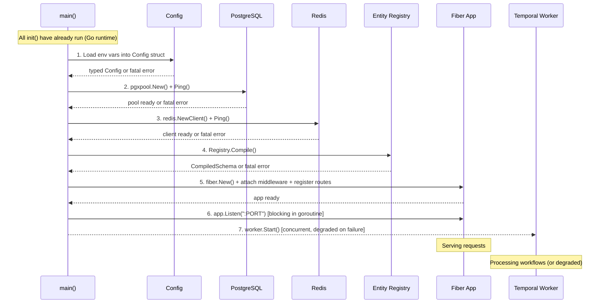
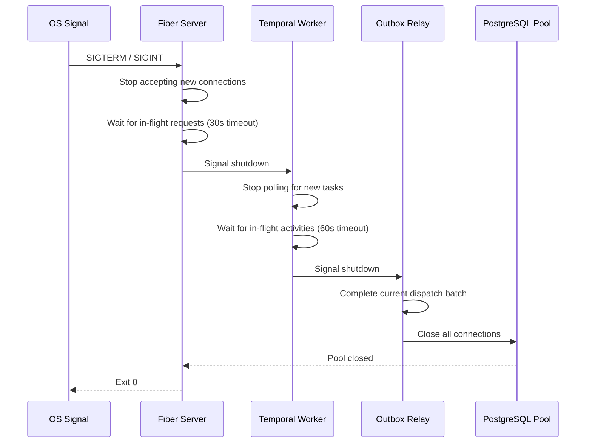

> ⚠️ **LEGACY DOCUMENTATION**
>
> This document describes the deprecated Framework A architecture and is retained for historical reference only.
>
> It MUST NOT be used when implementing or extending the Awo Framework (Framework B).
>
> Refer to [`awo/docs/`](../awo/docs/README.md) for the current canonical documentation.

---

---
title: "Startup Sequence"
id: kern-004
status: accepted
category: SPEC
stability: STABLE
audience: [framework-authors, operators, contributors]
since: "1.0"
normative-level: normative
related:
  - "[Entity Registry](registry.md)"
  - "[Compilation Pipeline](compilation-pipeline.md)"
  - "[Architecture Invariants](../02-architecture/invariants.md)"
  - "[Configuration](../12-configuration/configuration.md)"
  - "[Observability](../13-observability/observability.md)"
  - "[Awo Glossary](../GLOSSARY.md)"
---

# Startup Sequence

**KERN-004 | Status: Accepted | Stability: Stable**

This document specifies the Awo process startup sequence: the ordered set of initialization steps that must complete before the process serves its first HTTP request or executes its first Temporal activity.

The startup sequence is a hard dependency chain. Each step must succeed before the next begins. Failure at any step results in process exit with a descriptive error message and a non-zero exit code. See [Constraint C-5](../01-introduction/design-goals.md#c-5-the-process-must-fail-fast-rather-than-start-in-a-degraded-state).

The key words MUST, MUST NOT, REQUIRED, SHALL, SHALL NOT, SHOULD, SHOULD NOT, RECOMMENDED, MAY, and OPTIONAL in this document are to be interpreted as described in [RFC 2119](https://www.rfc-editor.org/rfc/rfc2119).

---

## Table of Contents

1. [Sequence Overview](#1-sequence-overview)
2. [Step 1: Configuration Load and Validation](#2-step-1-configuration-load-and-validation)
3. [Step 2: PostgreSQL Pool Initialization](#3-step-2-postgresql-pool-initialization)
4. [Step 3: Redis Client Initialization](#4-step-3-redis-client-initialization)
5. [Step 4: Entity Registry Compilation](#5-step-4-entity-registry-compilation)
6. [Step 5: Fiber Application Initialization](#6-step-5-fiber-application-initialization)
7. [Step 6: Fiber Server Start](#7-step-6-fiber-server-start)
8. [Step 7: Temporal Worker Start (Concurrent)](#8-step-7-temporal-worker-start-concurrent)
9. [Failure Modes](#9-failure-modes)
10. [Health Check Integration](#10-health-check-integration)
11. [Graceful Shutdown](#11-graceful-shutdown)

---

## 1. Sequence Overview



> **Figure 1.** Startup sequence. Steps 1–6 are sequential and fatal on failure. Step 7 is concurrent with step 6 and produces degraded operation on failure.

---

## 2. Step 1: Configuration Load and Validation

**Fatal on failure: YES**

Configuration is loaded from environment variables into a typed `Config` struct. Every required field MUST be present and valid before proceeding.

```go
type Config struct {
    Port         int           `env:"PORT,required"`
    DatabaseURL  string        `env:"DATABASE_URL,required"`
    RedisURL     string        `env:"REDIS_URL,required"`
    TemporalHost string        `env:"TEMPORAL_HOST,required"`
    LogLevel     slog.Level    `env:"LOG_LEVEL" envDefault:"info"`

    // Sensitive — never log these fields
    JWTSecret    string        `env:"JWT_SECRET,required"`
}
```

### Validation Rules

- All fields marked `required` MUST be non-empty. A missing required field causes immediate process exit.
- Sensitive fields (`JWTSecret`, database passwords embedded in `DATABASE_URL`) MUST NOT be logged. The configuration loader MUST redact sensitive fields from any log output.
- `PORT` MUST be a valid port number (1024–65535 for non-root processes).
- `DATABASE_URL` MUST be a valid PostgreSQL connection string or DSN.
- `REDIS_URL` MUST be a valid Redis connection URL.

### Failure Behavior

```
FATAL: configuration error: JWT_SECRET is required but not set
FATAL: configuration error: PORT "abc" is not a valid port number
```

Process exits with code 1 immediately. No other initialization occurs.

---

## 3. Step 2: PostgreSQL Pool Initialization

**Fatal on failure: YES**

```go
pool, err := pgxpool.New(ctx, config.DatabaseURL)
if err != nil {
    log.Fatalf("postgres: failed to create pool: %v", err)
}
if err := pool.Ping(ctx); err != nil {
    log.Fatalf("postgres: failed to ping: %v", err)
}
```

### Requirements

- Pool MUST be created with connection limits appropriate for the deployment (max connections, min idle).
- A ping MUST succeed before proceeding. A ping failure indicates PostgreSQL is unreachable.
- PgBouncer MUST be running in transaction mode. The startup sequence does not validate PgBouncer mode directly, but session-mode PgBouncer produces incorrect RLS behavior at request time.

### Failure Behavior

```
FATAL: postgres: failed to ping: dial tcp 127.0.0.1:5432: connect: connection refused
```

Process exits with code 1. Config is valid; only PostgreSQL connectivity failed.

---

## 4. Step 3: Redis Client Initialization

**Fatal on failure: YES**

```go
rdb := redis.NewClient(&redis.Options{Addr: config.RedisURL})
if err := rdb.Ping(ctx).Err(); err != nil {
    log.Fatalf("redis: failed to ping: %v", err)
}
```

### Requirements

- A ping MUST succeed before proceeding.
- The Redis client MUST be configured with retry logic appropriate for transient failures during startup (e.g., Redis restarting).
- Connection pool size MUST be configured to match expected concurrent session validation load.

### Failure Behavior

```
FATAL: redis: failed to ping: dial tcp 127.0.0.1:6379: connect: connection refused
```

Process exits with code 1.

---

## 5. Step 4: Entity Registry Compilation

**Fatal on failure: YES**

```go
schema, err := def.Registry().Compile()
if err != nil {
    // Compile() calls log.Fatal internally after collecting all errors
    // This line is not reached on error
}
// schema is the immutable CompiledSchema
```

### What Happens

All `init()` functions have already executed (Go runtime executed them before `main()` was called). The registry has accumulated all `EntityDefinition` registrations from all imported modules. `Compile()` runs the full compilation pipeline (see [Compilation Pipeline](compilation-pipeline.md) §3).

### Multiple Error Reporting

`Compile()` MUST collect all compilation errors before exiting. It MUST NOT stop at the first error. The process exits after all errors are reported:

```
FATAL: compilation failed with 3 error(s):

  1. entity "finance_invoice", field "customer":
     LinkTarget "crm_customers" is not registered. Did you mean "crm_customer"?

  2. entity "hr_employee", edge "department":
     Target entity "hr_departments" is not registered. Did you mean "hr_department"?

  3. entity "inventory_product", field "price":
     FieldType "Money" is not registered. Use "Currency" instead.
```

### Timing

`Compile()` is the only step in the startup sequence that is CPU-bound (not I/O-bound). For a schema with 100 entities and 1000 fields, compilation typically completes in under 100ms.

---

## 6. Step 5: Fiber Application Initialization

**Fatal on failure: YES (panic)**

```go
app := fiber.New(fiber.Config{
    ErrorHandler: mapEntityError,
})

// Attach fixed middleware pipeline in order
app.Use(middleware.RequestID())
app.Use(middleware.Logger(slog.Default()))
app.Use(middleware.PanicRecovery())
app.Use(middleware.CORS(config.AllowedOrigins))
app.Use(middleware.TenantResolver(pool))
app.Use(middleware.SessionValidator(rdb))
app.Use(middleware.RateLimiter(rdb, config.RateLimits))

// Register routes from CompiledSchema
for _, route := range schema.Routes {
    app.Add(route.Method, route.Path, route.Handler)
}
```

### Requirements

- The middleware pipeline MUST be attached in the exact order specified. The order is immutable. See [Architecture Invariant INV-011](../02-architecture/invariants.md#inv-011-the-middleware-pipeline-executes-in-full-for-every-request).
- Routes MUST be registered from the `CompiledSchema.Routes` slice only. No route may be registered manually that duplicates auto-generated CRUD routes.
- The Casbin enforcer MUST be loaded with `schema.PolicySet` before any route handler that checks permissions is registered.

---

## 7. Step 6: Fiber Server Start

**Fatal on failure: YES**

```go
go func() {
    if err := app.Listen(fmt.Sprintf(":%d", config.Port)); err != nil {
        log.Fatalf("fiber: server failed: %v", err)
    }
}()
```

The Fiber server start is launched in a goroutine so that Step 7 (Temporal worker start) can proceed concurrently. However, the `/health/ready` endpoint MUST NOT return 200 until both the Fiber server is listening and the Temporal worker has started (or Temporal is confirmed unavailable and the degraded state is acknowledged).

---

## 8. Step 7: Temporal Worker Start (Concurrent)

**Fatal on failure: NO — produces degraded operation**

```go
c, err := client.NewLazyClient(client.Options{
    HostPort:  config.TemporalHost,
    Namespace: config.TemporalNamespace,
})
if err != nil {
    slog.Error("temporal: failed to create client — workflow starts will fail",
        "err", err)
    // Continue; CRUD operations work without Temporal
} else {
    w := worker.New(c, "awo-main", worker.Options{})
    // Register all workflows and activities from compiled schema
    registerWorkflows(w, schema)
    if err := w.Start(); err != nil {
        slog.Error("temporal: worker failed to start — workflow starts will fail",
            "err", err)
    }
}
```

### Degraded Operation

Temporal failure at startup produces **degraded operation**, not process exit:
- All standard CRUD operations continue to function
- Workflow trigger dispatch fails gracefully: the outbox entry is written (committed with the entity record) but the relay cannot dispatch to Temporal
- The outbox relay retries dispatch with exponential backoff
- When Temporal connectivity is restored, pending outbox entries are dispatched automatically

Degraded operation MUST be surfaced in:
- The `/health/ready` response (include `"temporal_connected": false`)
- Structured logs at `ERROR` level
- Prometheus metric: `temporal_worker_connected{status="false"}`

---

## 9. Failure Modes

| Step | Component | On Failure | Recovery |
|---|---|---|---|
| 1 | Config | Process exits | Fix environment variables; restart |
| 2 | PostgreSQL | Process exits | Fix PostgreSQL; restart |
| 3 | Redis | Process exits | Fix Redis; restart |
| 4 | Entity Registry | Process exits | Fix EntityDefinition errors; rebuild; restart |
| 5 | Fiber init | Process exits (panic) | Fix middleware or route configuration; rebuild; restart |
| 6 | Fiber listen | Process exits | Fix port conflict or bind error; restart |
| 7 | Temporal worker | Degraded operation | Temporal restores; outbox relay dispatches pending entries |

**During operation (after startup):**

| Component | Failure | HTTP Response |
|---|---|---|
| PostgreSQL connection lost | Store layer error | 503 Service Unavailable |
| Redis connection lost | Session validation fails | 503 on all authenticated requests |
| Temporal unreachable | Outbox relay pauses | Entity mutations succeed; workflow starts queued |

---

## 10. Health Check Integration

Two health endpoints MUST be served:

### GET /health/live

Returns 200 if the process is running. No dependency checks. This endpoint is used by liveness probes — if it fails, the process is dead and should be restarted.

```json
{"status": "alive"}
```

### GET /health/ready

Returns 200 only if PostgreSQL and Redis are reachable and the `CompiledSchema` is populated. Used by readiness probes — if it fails, the load balancer removes the instance from rotation.

```json
{
  "status": "ready",
  "schema_hash": "a3f9e2c1b8d7...",
  "entity_count": 47,
  "temporal_connected": true,
  "framework_version": "1.0.0",
  "checks": {
    "postgres": "ok",
    "redis": "ok",
    "schema": "compiled"
  }
}
```

The `schema_hash` field enables external schema divergence detection across cluster instances. See [Compilation Pipeline §8](compilation-pipeline.md#8-schema-divergence-detection).

---

## 11. Graceful Shutdown

The process MUST handle `SIGTERM` and `SIGINT` with a graceful shutdown sequence:



### Shutdown Timeouts

| Component | Graceful shutdown timeout |
|---|---|
| Fiber in-flight requests | 30 seconds |
| Temporal in-flight activities | 60 seconds |
| Outbox relay current batch | 10 seconds |
| PostgreSQL pool drain | 5 seconds |

After the timeout, the component is force-closed and the process exits with code 0 (clean shutdown) or 1 (forced closure required).

**The shutdown sequence MUST NOT interrupt in-flight database transactions.** In-flight requests that cannot complete within the Fiber timeout are rejected with HTTP 503 and their transactions are rolled back by PostgreSQL.

---

## Related Documents

- [Compilation Pipeline](compilation-pipeline.md) — detail on Step 4
- [Entity Registry](registry.md) — the registry that Step 4 calls Compile() on
- [Configuration](../12-configuration/configuration.md) — full Config struct specification
- [Observability](../13-observability/observability.md) — health check format, metrics
- [Architecture Invariants](../02-architecture/invariants.md) — INV-002 (schema fixed before first request), INV-011 (middleware pipeline)
- [Tenancy Model](../06-tenancy/tenant-model.md) — set_tenant_context() called in Step 5 middleware
- [Glossary](../GLOSSARY.md) — Initialization Phase, Compilation Phase, Runtime Phase, CompiledSchema
