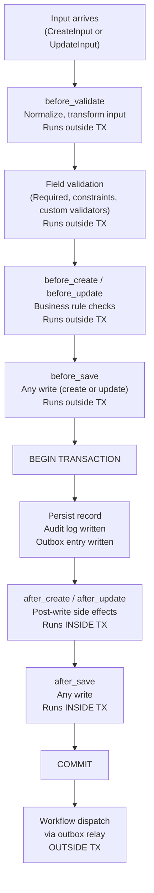

> ⚠️ **LEGACY DOCUMENTATION**
>
> This document describes the deprecated Framework A architecture and is retained for historical reference only.
>
> It MUST NOT be used when implementing or extending the Awo Framework (Framework B).
>
> Refer to [`awo/docs/`](../awo/docs/README.md) for the current canonical documentation.

---

---
title: "Hooks"
id: dom-003
status: accepted
category: SPEC
stability: FROZEN
audience: [module-authors, framework-authors]
since: "1.0"
normative-level: normative
related:
  - "[EntityDefinition](../03-kernel/entity-def.md)"
  - "[Entity Registry](../03-kernel/registry.md)"
  - "[Policy Functions](policies.md)"
  - "[Architecture Laws](../02-architecture/laws.md)"
  - "[Awo Glossary](../GLOSSARY.md)"
---

# Hooks

**DOM-003 | Status: Accepted | Stability: Frozen**

This document specifies the hook system: `HookRegistration`, all lifecycle stages, execution order, hook context, error handling, and cross-module hook registration.

The key words MUST, MUST NOT, REQUIRED, SHALL, SHALL NOT, SHOULD, SHOULD NOT, RECOMMENDED, MAY, and OPTIONAL are interpreted per RFC 2119.

---

## Table of Contents

1. [Overview](#1-overview)
2. [Lifecycle Stages](#2-lifecycle-stages)
3. [HookRegistration](#3-hookregistration)
4. [Hook Handler Interface](#4-hook-handler-interface)
5. [Hook Context](#5-hook-context)
6. [Execution Order](#6-execution-order)
7. [Error Handling in Hooks](#7-error-handling-in-hooks)
8. [Cross-Module Hooks](#8-cross-module-hooks)
9. [Testing Hooks](#9-testing-hooks)
10. [Anti-Patterns](#10-anti-patterns)

---

## 1. Overview

Hooks are named extension points in the [EntityRecord lifecycle](../GLOSSARY.md#entityrecord). They allow module authors to inject business logic, validation, and side effects at specific points in the lifecycle without modifying the framework or the entity's core declaration.

The hook system has three design properties:

1. **Deterministic order** — for a given entity and stage, the execution sequence is identical across all invocations. See [LAW-007](../02-architecture/laws.md#law-007-hook-execution-order-is-deterministic).
2. **Explicit registration** — hooks are registered via `def.RegisterHook()`, not by implementing a magic interface. Registration is visible and auditable.
3. **Cross-module sovereignty** — a module may only attach hooks to entities it owns or to entities that declare `HookPolicy: Open`. See [LAW-017](../02-architecture/laws.md#law-017-cross-module-hook-registration-requires-open-policy).

---

## 2. Lifecycle Stages



> **Figure 1.** Hook execution sequence for a create or update operation. Hooks before the transaction boundary run outside the transaction and may abort without rollback. Hooks after persistence run inside the transaction; an error causes rollback.

### Stage Reference

| Stage | Fires on | Inside TX | Abort via | Can mutate record? |
|---|---|---|---|---|
| `before_validate` | Create, Update | No | `ValidationError` | Yes (normalizing input) |
| `before_create` | Create only | No | `BusinessError` | Yes |
| `before_update` | Update only | No | `BusinessError` | Yes |
| `before_save` | Create and Update | No | `BusinessError` | Yes |
| `after_create` | Create only | Yes | error → rollback | Limited (see §4) |
| `after_update` | Update only | Yes | error → rollback | Limited |
| `after_save` | Create and Update | Yes | error → rollback | Limited |
| `before_delete` | Delete only | No | `BusinessError` | No |
| `after_delete` | Delete only | Yes | error → rollback | No |

---

## 3. HookRegistration

```go
type HookRegistration struct {
    // Name of the entity this hook targets. May be a forward reference.
    EntityName string

    // Lifecycle stage name. Must be a canonical stage or a registered custom stage.
    Stage string

    // Execution priority within the stage for this module.
    // Lower numbers execute first. Default: 100.
    // Use negative numbers for hooks that must run before all others.
    Priority int

    // The hook implementation.
    Handler HookHandler

    // The module that owns this registration.
    Module string
}
```

Registration in `init()`:

```go
func init() {
    def.RegisterHook(def.HookRegistration{
        EntityName: "finance_invoice",
        Stage:      "before_create",
        Priority:   100,
        Handler:    &InvoiceValidator{},
        Module:     "finance",
    })

    def.RegisterHook(def.HookRegistration{
        EntityName: "finance_invoice",
        Stage:      "after_create",
        Priority:   200,
        Handler:    &InvoiceNumberAssigner{},
        Module:     "finance",
    })
}
```

---

## 4. Hook Handler Interface

All hooks implement a single interface variant appropriate to their stage:

```go
// HookHandler is the base interface. All stage-specific interfaces embed it.
type HookHandler interface {
    // Stage returns the stage this handler is for (used for validation).
    Stage() string
}

// BeforeHook can abort the operation and mutate the record.
type BeforeHook interface {
    HookHandler
    Execute(ctx context.Context, hc HookContext) error
}

// AfterHook receives the persisted record; return error causes rollback.
type AfterHook interface {
    HookHandler
    Execute(ctx context.Context, hc HookContext) error
}
```

### HookContext

```go
type HookContext struct {
    // The entity record. Before-hooks may mutate field values.
    // After-hooks receive the persisted record; mutations are not persisted.
    Record *EntityRecord

    // EntityRepository scoped to this tenant and actor.
    // May be used to load related records or check business rules.
    Repo EntityRepository

    // The actor performing the operation.
    Actor Actor

    // Operation type: "create", "update", "delete"
    Operation string

    // For update operations: the previous state of the record.
    // Nil for create and delete operations.
    Previous *EntityRecord
}
```

### Before-Hook Record Mutation

Before-hooks may mutate `hc.Record.Fields` to normalize input before persistence. This is the correct location for:
- Converting units (e.g., converting grams to kilograms before storage)
- Normalizing case (e.g., uppercasing a company_size field)
- Setting computed fields (e.g., computing `total` from `unit_price` × `quantity`)
- Stripping whitespace from string fields

After-hooks MUST NOT attempt to mutate the record with the expectation that the mutation will be persisted. The record passed to after-hooks is the just-persisted record; any mutations are discarded. To persist post-create modifications, use `hc.Repo.Update()` within the after-hook (inside the still-open transaction).

---

## 5. Execution Order

Hook execution order is fully deterministic. The framework sorts hooks for a given `(entity, stage)` pair using a three-key sort at compilation time:

**Key 1: Module topological order** — If module B declares a dependency on module A in its module manifest, B's hooks execute after A's hooks for the same stage. This ensures that modules that depend on each other respect that dependency in hook execution.

**Key 2: Priority** — Lower `Priority` values execute first (default 100). To execute before all other module hooks, use a negative priority (e.g., -100). To execute after, use a high value (e.g., 1000).

**Key 3: Registration order** — Within the same module and priority, hooks execute in the order they were passed to `RegisterHook()`.

The compiled hook sequence is immutable after `Registry.Compile()`. The sequence is identical across all process restarts and all cluster instances of the same binary.

---

## 6. Error Handling in Hooks

### Aborting in Before-Hooks (Outside TX)

Before-hooks abort the operation by returning an error. The error type determines the HTTP response:

```go
// ValidationError — HTTP 422 with field-level messages
func (h *InvoiceValidator) Execute(ctx context.Context, hc HookContext) error {
    if hc.Record.Fields["total_kes"] == nil {
        return &entity.ValidationError{
            Fields: map[string]string{
                "total_kes": "Invoice total is required",
            },
        }
    }
    return nil
}

// BusinessError — HTTP 400/409/etc.
func (h *InvoiceStatusGuard) Execute(ctx context.Context, hc HookContext) error {
    if hc.Previous != nil && hc.Previous.Fields["status"] == "Paid" {
        return &entity.BusinessError{
            Code:    "invoice.already_paid",
            Message: "Paid invoices cannot be modified",
            Status:  409,
        }
    }
    return nil
}
```

The framework stops hook execution at the first error returned by any hook in the chain for a given stage. Subsequent hooks in the same stage do not execute.

### Aborting in After-Hooks (Inside TX)

Errors returned by after-hooks cause the database transaction to roll back. The entity record, audit log entry, and outbox entry are all rolled back atomically.

After-hook errors MUST be used only for genuine failure conditions (external service call failed, data consistency check failed). Using after-hook errors for business rule validation is incorrect — that validation belongs in a before-hook.

### Error Wrapping

Hooks MUST wrap errors with context:

```go
return fmt.Errorf("InvoiceValidator.Execute: validate customer credit: %w", err)
```

This ensures the error chain is traceable in logs without exposing internal details in API responses.

---

## 7. Cross-Module Hooks

A module may register a hook on an entity it does not own if and only if the target entity declares `Hooks: entity.Open`.

```go
// In the Finance module's EntityDefinition:
var InvoiceDefinition = entity.EntityDefinition{
    Name:  "finance_invoice",
    Hooks: entity.Open,  // ← permits cross-module hook registration
    // ...
}

// In the Audit module's init():
def.RegisterHook(def.HookRegistration{
    EntityName: "finance_invoice",
    Stage:      "after_save",
    Priority:   1000,  // run last
    Handler:    &AuditTrailHook{},
    Module:     "platform_audit",
})
```

The compiler validates this registration: if `finance_invoice` declares `Hooks: entity.Closed` (or omits the field, since Closed is the default), the compiler fails with:

```
compilation error: module "platform_audit" attempted to register hook on
entity "finance_invoice" (stage "after_save") but the entity's HookPolicy
is Closed. The owning module "finance" must declare Hooks: entity.Open.
```

See [LAW-017](../02-architecture/laws.md#law-017-cross-module-hook-registration-requires-open-policy).

---

## 8. Testing Hooks

Hooks are domain layer code with no external dependencies. They are tested with mock `EntityRepository` implementations:

```go
func TestInvoiceValidator_MissingTotal(t *testing.T) {
    repo := &mockEntityRepository{}
    hook := &InvoiceValidator{repo: repo}

    hc := entity.HookContext{
        Record:    &entity.EntityRecord{Fields: map[string]any{"customer": someUUID}},
        Repo:      repo,
        Actor:     testActor(),
        Operation: "create",
    }

    err := hook.Execute(context.Background(), hc)

    var ve *entity.ValidationError
    if !errors.As(err, &ve) {
        t.Fatalf("expected ValidationError, got %T: %v", err, err)
    }
    if _, ok := ve.Fields["total_kes"]; !ok {
        t.Error("expected field error on 'total_kes'")
    }
}
```

Table-driven tests are preferred for validators that check multiple field conditions:

```go
func TestInvoiceValidator_FieldValidation(t *testing.T) {
    tests := []struct {
        name     string
        fields   map[string]any
        wantErr  bool
        wantField string
    }{
        {"valid", validFields(), false, ""},
        {"missing total", missingTotal(), true, "total_kes"},
        {"negative total", negativeTotal(), true, "total_kes"},
        {"missing customer", missingCustomer(), true, "customer"},
    }
    for _, tt := range tests {
        t.Run(tt.name, func(t *testing.T) {
            // ...
        })
    }
}
```

---

## 9. Anti-Patterns

### AP-01: I/O in Before-Hooks

```go
// PROHIBITED: external HTTP call in before_create hook
func (h *KRAValidator) Execute(ctx context.Context, hc HookContext) error {
    resp, err := http.Post("https://api.kra.go.ke/validate", ...)  // blocks request
    // ...
}
```

External HTTP calls, email sends, and file operations MUST be in Workflow Layer activities. Before-hooks may query the database only through `hc.Repo`.

### AP-02: Business Validation in After-Hooks

```go
// PROHIBITED: business rule check in after_create (inside TX)
func (h *CreditChecker) Execute(ctx context.Context, hc HookContext) error {
    // This rolls back the TX if it fails — correct behavior but wrong location
    if hc.Record.Fields["total"].(decimal.Decimal).GreaterThan(creditLimit) {
        return fmt.Errorf("credit limit exceeded")
    }
    return nil
}
```

Business rule validation belongs in `before_create` or `before_save`. After-hooks are for side effects (sending notifications, updating derived data) that must occur inside the transaction.

### AP-03: Spawning Goroutines in Hooks

Hooks execute synchronously in the request path. Goroutines spawned in hooks are detached from the request context and from the database transaction. Use Workflow Layer activities for async operations.

---

## Related Documents

- [EntityDefinition](../03-kernel/entity-def.md) — Hooks field and HookPolicy
- [Entity Registry](../03-kernel/registry.md) — RegisterHook() API and execution order compilation
- [Policy Functions](policies.md) — row-level filtering (separate from hooks)
- [Architecture Laws](../02-architecture/laws.md) — LAW-007 (order), LAW-017 (cross-module)
- [Glossary](../GLOSSARY.md) — Hook, HookRegistration, HookPolicy, Lifecycle Stage
