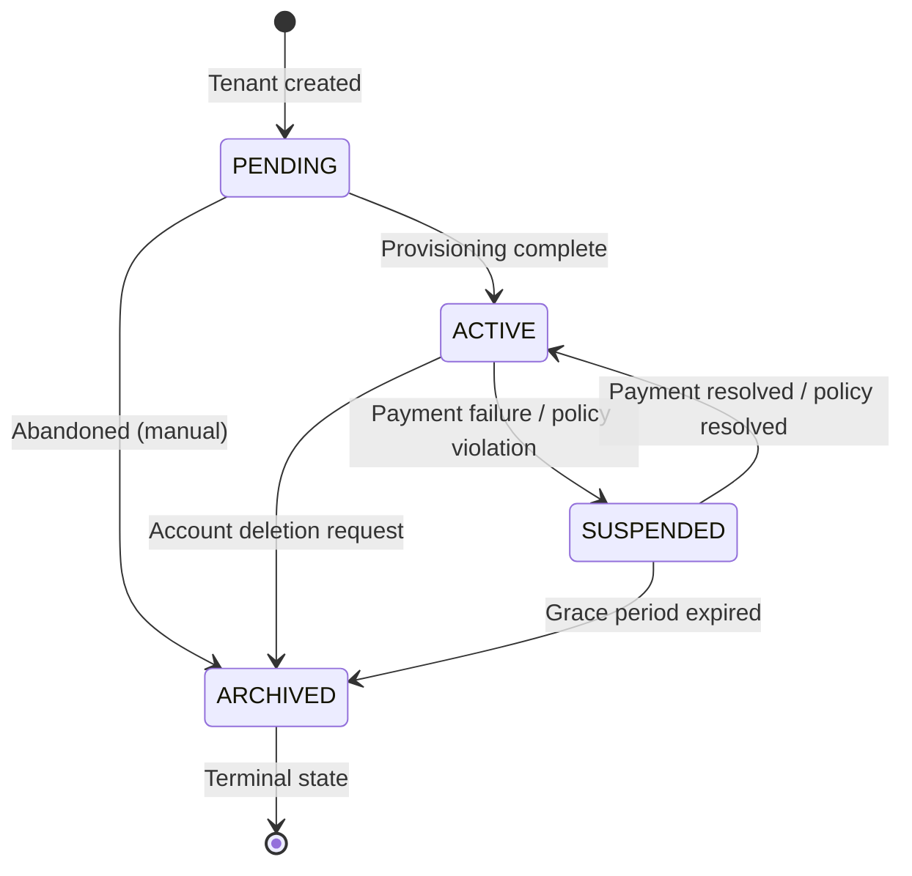

> ⚠️ **LEGACY DOCUMENTATION**
>
> This document describes the deprecated Framework A architecture and is retained for historical reference only.
>
> It MUST NOT be used when implementing or extending the Awo Framework (Framework B).
>
> Refer to [`awo/docs/`](../awo/docs/README.md) for the current canonical documentation.

---

---
title: "Tenant Lifecycle"
id: ten-003
status: accepted
category: SPEC
stability: STABLE
audience: [framework-authors, operators]
since: "1.0"
normative-level: normative
related:
  - "[Tenant Model](tenant-model.md)"
  - "[Row-Level Security](rls.md)"
  - "[Awo Glossary](../GLOSSARY.md)"
---

# Tenant Lifecycle

**TEN-003 | Status: Accepted | Stability: Stable**

This document specifies the tenant status state machine, HTTP response codes for each status, the provisioning process, and the archival/deletion policy.

The key words MUST, MUST NOT, REQUIRED, SHALL, SHALL NOT, SHOULD, RECOMMENDED, MAY, and OPTIONAL are interpreted per RFC 2119.

---

## 1. Status State Machine



> **Figure 1.** Tenant status transitions. ARCHIVED is terminal — no transitions out of ARCHIVED.

### Status Definitions

| Status | Meaning | HTTP Response |
|---|---|---|
| `PENDING` | Tenant created; provisioning not yet complete | 503 + `Retry-After: 60` |
| `ACTIVE` | Tenant operational; all operations permitted | 200 (normal) |
| `SUSPENDED` | Operations suspended; data preserved | 402 Payment Required |
| `ARCHIVED` | Terminal; data preserved per retention policy | 410 Gone |

### Transition Rules

| From | To | Permitted by | Trigger |
|---|---|---|---|
| `PENDING` | `ACTIVE` | Platform admin / Provisioning workflow | Provisioning complete |
| `PENDING` | `ARCHIVED` | Platform admin | Abandoned registration |
| `ACTIVE` | `SUSPENDED` | Platform admin | Payment failure, policy violation |
| `ACTIVE` | `ARCHIVED` | Platform admin | Account deletion |
| `SUSPENDED` | `ACTIVE` | Platform admin | Payment resolved |
| `SUSPENDED` | `ARCHIVED` | Platform admin / Automated | Grace period expired |

Direct `PENDING → SUSPENDED` is not permitted (a tenant that hasn't been activated cannot be suspended).
Direct `ARCHIVED → *` is not permitted (ARCHIVED is terminal).

---

## 2. HTTP Response Behavior by Status

The `set_tenant_context()` stored procedure validates tenant status on every request. The middleware translates the stored procedure's error into the correct HTTP response:

### PENDING → HTTP 503

```json
HTTP/1.1 503 Service Unavailable
Retry-After: 60

{
  "error": {
    "code": "tenant.provisioning",
    "message": "This account is being set up. Please try again in a moment."
  }
}
```

The `Retry-After: 60` header instructs clients and load balancers to retry after 60 seconds. Provisioning typically completes in under a minute.

### SUSPENDED → HTTP 402

```json
HTTP/1.1 402 Payment Required

{
  "error": {
    "code": "tenant.suspended",
    "message": "This account has been suspended. Please contact support."
  }
}
```

### ARCHIVED → HTTP 410

```json
HTTP/1.1 410 Gone

{
  "error": {
    "code": "tenant.archived",
    "message": "This account no longer exists."
  }
}
```

410 Gone is used (not 404 Not Found) to distinguish a permanently deleted resource from a temporarily absent one. Clients MUST NOT retry 410 responses.

---

## 3. Tenant Provisioning

Provisioning is a multi-step workflow that transforms a `PENDING` tenant into an `ACTIVE` tenant. It is implemented as a Temporal workflow (`TenantProvisioningWorkflow`) triggered when a new tenant record is created.

Provisioning steps:
1. Create IAM bootstrap user (tenant admin) with temporary credentials
2. Seed system roles (`role:tenant.admin`, `role:tenant.user`, `role:api-client`)
3. Seed default settings (locale, currency, timezone, fiscal year)
4. Run module activation for the tenant's subscribed modules
5. Send welcome email to the bootstrap user
6. Set tenant status to `ACTIVE`

If any step fails, the saga compensator:
- Marks the tenant as `ARCHIVED` (preventing partial state from being used)
- Logs the failure to the platform audit log
- Notifies platform operations

---

## 4. Tenant Suspension

Suspension is triggered by:
- Payment failure (automated, triggered by billing integration)
- Policy violation (manual, triggered by platform admin)

During suspension:
- All data is preserved
- All API requests return HTTP 402
- Background workflows for the tenant are paused (Temporal worker skips suspended tenant IDs)
- Sessions remain in Redis but validation fails before session check (status is checked first)

---

## 5. Tenant Archival

Archival is the terminal state. It is triggered by:
- Explicit account deletion request from tenant admin (via platform API)
- Grace period expiry after suspension (automated, configurable per deployment)
- Provisioning failure (abandoned PENDING tenants)

After archival:
- API requests return HTTP 410
- Data is preserved for the configured retention period (default: 90 days)
- After retention period, data is eligible for deletion via the data retention job
- The tenant record in `tenants` is retained permanently (for audit trail); only tenant-scoped data is deleted

---

## 6. Tenant Record Schema

```sql
CREATE TABLE tenants (
    id              uuid        PRIMARY KEY DEFAULT gen_random_uuid(),
    slug            varchar(64) NOT NULL UNIQUE,
    name            varchar(256) NOT NULL,
    status          varchar(16) NOT NULL DEFAULT 'PENDING'
                    CHECK (status IN ('PENDING','ACTIVE','SUSPENDED','ARCHIVED')),
    locale          varchar(16) NOT NULL DEFAULT 'en-KE',
    timezone        varchar(64) NOT NULL DEFAULT 'Africa/Nairobi',
    currency        varchar(8)  NOT NULL DEFAULT 'KES',
    company_size    varchar(16) CHECK (company_size IN ('MICRO','SMALL','MEDIUM','LARGE','ENTERPRISE')),
    created_at      timestamptz NOT NULL DEFAULT now(),
    updated_at      timestamptz NOT NULL DEFAULT now(),
    suspended_at    timestamptz,
    archived_at     timestamptz,
    suspension_reason text
);
-- No RLS — tenants is a global table
```

`company_size` values are stored uppercase (normalized at the repository layer on Create and Update).

---

## Related Documents

- [Tenant Model](tenant-model.md) — how tenant status is checked on every request
- [Row-Level Security](rls.md) — how ACTIVE status enables RLS
- [Glossary](../GLOSSARY.md) — Tenant, Tenant Status Machine
