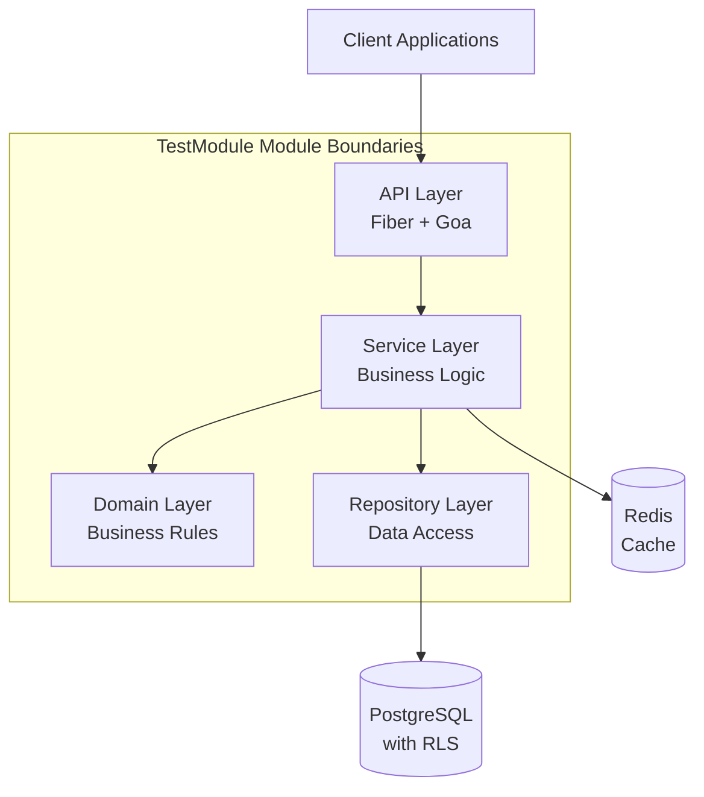
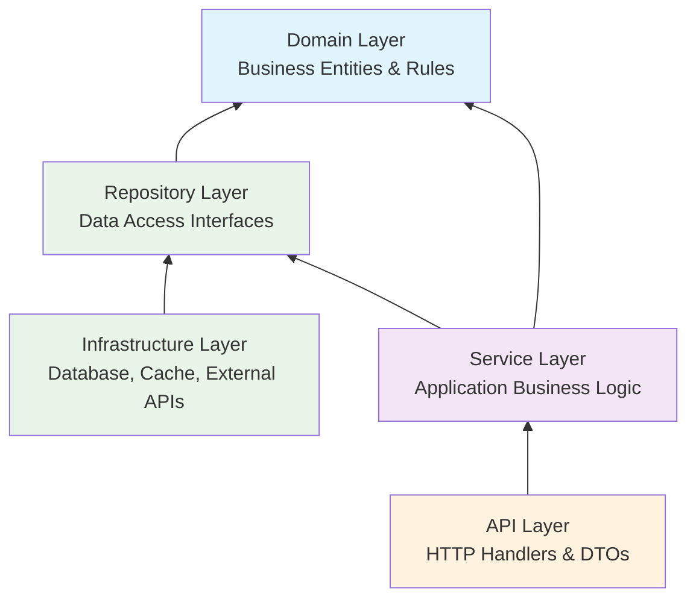
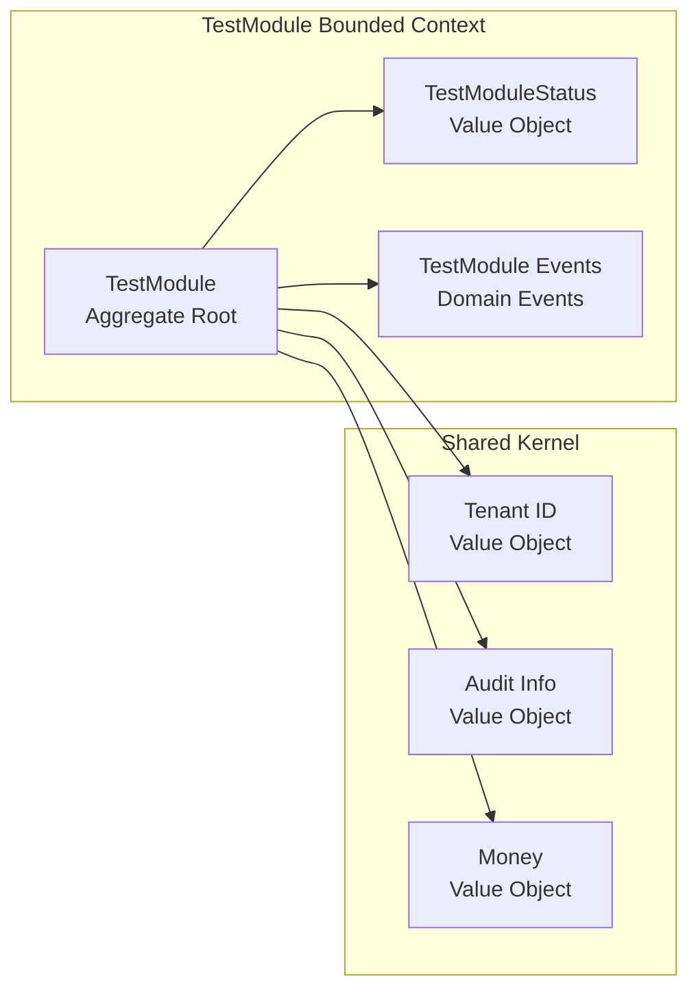

# TestModule Module - Architecture Guide

**Version**: 1.0  
**Date**: October 12, 2025  
**Status**: Implementation In Progress

---

## Table of Contents

- [Architecture Overview](#architecture-overview)
- [Clean Architecture Implementation](#clean-architecture-implementation)
- [Domain-Driven Design Patterns](#domain-driven-design-patterns)
- [TestModule Domain Model](#test_module-domain-model)
- [Service Layer Architecture](#service-layer-architecture)
- [Repository & Data Access](#repository--data-access)
- [API Layer Design](#api-layer-design)
- [Multi-Tenancy Architecture](#multi-tenancy-architecture)
- [Security & Authorization](#security--authorization)
- [Performance & Scalability](#performance--scalability)
- [Integration Patterns](#integration-patterns)

---

## Architecture Overview

### System Context

The TestModule Module operates within the AWO ERP ecosystem, implementing clean architecture principles with domain-driven design patterns to ensure maintainability, testability, and business alignment.



### Design Principles

1. **Clean Architecture**: Dependency inversion with business logic at the center
2. **Domain-Driven Design**: Rich domain model with ubiquitous language
3. **SOLID Principles**: Single responsibility, open/closed, interface segregation
4. **Multi-Tenancy**: Row-level security with tenant isolation
5. **Security-First**: ABAC authorization integrated throughout
6. **Performance**: Optimized for high-throughput financial operations

---

## Clean Architecture Implementation

### Layer Dependencies



### Dependency Injection

```go
// Dependency injection container structure
type TestModuleContainer struct {
    // Infrastructure
    db     *database.DB
    cache  cache.Cache
    logger *slog.Logger
    tracer trace.Tracer
    
    // Repositories
    testModuleRepo repository.TestModuleRepository
    
    // Services
    testModuleService service.TestModuleService
    
    // ABAC & Validation
    abacEngine abac.Engine
    validator  validation.Validator
}

func NewTestModuleContainer(deps Dependencies) *TestModuleContainer {
    container := &TestModuleContainer{
        db:     deps.DB,
        cache:  deps.Cache,
        logger: deps.Logger,
        tracer: deps.Tracer,
    }
    
    // Repository layer
    container.testModuleRepo = repository.NewTestModuleRepository(
        container.db, container.logger, container.tracer)
    
    // Service layer
    container.testModuleService = service.NewTestModuleService(
        container.testModuleRepo, deps.ABACEngine, container.logger, container.tracer)
    
    return container
}
```

---

## Domain-Driven Design Patterns

### Ubiquitous Language

**Core Domain Terms:**
- **TestModule**: Primary aggregate root representing test_module business concept
- **TestModuleID**: Strong-typed identifier using UUID v4
- **TestModuleStatus**: State enumeration with business meaning
- **Tenant Context**: Multi-tenant boundary enforcement
- **Domain Events**: Business event notifications for workflow integration

### Bounded Context



### Aggregate Design

```go
// TestModule aggregate root
type TestModule struct {
    // Identity
    id       TestModuleID
    tenantID tenant.ID
    
    // Core attributes
    name        string
    description *string
    status      TestModuleStatus
    
    // Business rules
    validator *TestModuleValidator
    
    // Event sourcing
    events []DomainEvent
    
    // Audit trail
    audit AuditInfo
}

// Business methods with domain logic
func (testModule *TestModule) Activate(ctx context.Context, reason string) error {
    if err := testModule.validator.ValidateActivation(testModule); err != nil {
        return fmt.Errorf("cannot activate test_module: %w", err)
    }
    
    if testModule.status == TestModuleStatusActive {
        return business.ErrAlreadyActive
    }
    
    testModule.status = TestModuleStatusActive
    testModule.audit.UpdatedAt = time.Now()
    
    // Emit domain event
    testModule.AddEvent(TestModuleActivatedEvent{
        TestModuleID: testModule.id,
        TenantID: testModule.tenantID,
        Reason:   reason,
        Timestamp: time.Now(),
    })
    
    return nil
}
```

---

## TestModule Domain Model

### Core Entities

#### TestModule Entity

```go
type TestModule struct {
    // Strong-typed identifiers
    ID       TestModuleID `json:"id"`
    TenantID tenant.ID         `json:"tenant_id"`
    
    // Business attributes
    Name        string                  `json:"name"`
    Description *string                 `json:"description,omitempty"`
    Status      TestModuleStatus        `json:"status"`
    
    // Hierarchical structure (if applicable)
    ParentID *TestModuleID           `json:"parent_id,omitempty"`
    Level    int                       `json:"level"`
    Path     string                    `json:"path"`
    
    
    // Financial attributes
    Balance      decimal.Decimal       `json:"balance"`
    Currency     Currency              `json:"currency"`
    LastValued   *time.Time           `json:"last_valued,omitempty"`
    
    
    // Metadata
    Tags         map[string]string     `json:"tags,omitempty"`
    CustomFields map[string]interface{} `json:"custom_fields,omitempty"`
    
    // Audit information
    CreatedAt time.Time `json:"created_at"`
    UpdatedAt time.Time `json:"updated_at"`
    CreatedBy UserID    `json:"created_by"`
    UpdatedBy UserID    `json:"updated_by"`
    Version   int64     `json:"version"`
}
```

#### Value Objects

```go
// TestModuleID - Strong-typed identifier
type TestModuleID string

func NewTestModuleID() TestModuleID {
    return TestModuleID(uuid.New().String())
}

func (id TestModuleID) String() string {
    return string(id)
}

func (id TestModuleID) Validate() error {
    if id == "" {
        return ErrInvalidTestModuleID
    }
    _, err := uuid.Parse(string(id))
    return err
}

// TestModuleStatus - State enumeration
type TestModuleStatus string

const (
    TestModuleStatusPending   TestModuleStatus = "pending"
    TestModuleStatusActive    TestModuleStatus = "active"
    TestModuleStatusInactive  TestModuleStatus = "inactive"
    TestModuleStatusArchived  TestModuleStatus = "archived"
)

func (s TestModuleStatus) IsValid() bool {
    switch s {
    case TestModuleStatusPending, TestModuleStatusActive, 
         TestModuleStatusInactive, TestModuleStatusArchived:
        return true
    default:
        return false
    }
}

func (s TestModuleStatus) CanTransitionTo(target TestModuleStatus) bool {
    transitions := map[TestModuleStatus][]TestModuleStatus{
        TestModuleStatusPending:  { TestModuleStatusActive, TestModuleStatusArchived},
        TestModuleStatusActive:   { TestModuleStatusInactive, TestModuleStatusArchived},
        TestModuleStatusInactive: { TestModuleStatusActive, TestModuleStatusArchived},
        TestModuleStatusArchived: {}, // Terminal state
    }
    
    allowed := transitions[s]
    for _, allowedStatus := range allowed {
        if allowedStatus == target {
            return true
        }
    }
    return false
}
```

### Business Rules & Validation

```go
type TestModuleValidator struct {
    repo   TestModuleRepository
    abac   abac.Engine
    logger *slog.Logger
}

func (v *TestModuleValidator) ValidateCreate(ctx context.Context, cmd CreateTestModuleCommand) error {
    var errs []error
    
    // Basic validation
    if cmd.Name == "" {
        errs = append(errs, ErrInvalidName)
    }
    
    if len(cmd.Name) > 255 {
        errs = append(errs, ErrNameTooLong)
    }
    
    // Business rule validation
    if err := v.validateNameUniqueness(ctx, cmd.TenantID, cmd.Name); err != nil {
        errs = append(errs, err)
    }
    
    
    // Financial validation
    if cmd.Currency == "" {
        errs = append(errs, ErrCurrencyRequired)
    }
    
    
    // Authorization check
    if err := v.abac.Authorize(ctx, abac.Request{
        Subject:  authz.SubjectFromContext(ctx),
        Action:   "test_module.test_module.create",
        Resource: abac.Resource{Type: "test_module", Attributes: cmd.ToAttributes()},
    }); err != nil {
        errs = append(errs, err)
    }
    
    if len(errs) > 0 {
        return validation.CombineErrors(errs...)
    }
    
    return nil
}

func (v *TestModuleValidator) validateNameUniqueness(ctx context.Context, tenantID tenant.ID, name string) error {
    exists, err := v.repo.ExistsByName(ctx, tenantID, name)
    if err != nil {
        return fmt.Errorf("failed to check name uniqueness: %w", err)
    }
    
    if exists {
        return ErrNameAlreadyExists
    }
    
    return nil
}
```

---

## Service Layer Architecture

### Service Interface Design

```go
type TestModuleService interface {
    // Core CRUD operations
    CreateTestModule(ctx context.Context, cmd CreateTestModuleCommand) (*TestModule, error)
    GetTestModuleByID(ctx context.Context, tenantID tenant.ID, id TestModuleID) (*TestModule, error)
    UpdateTestModule(ctx context.Context, id TestModuleID, cmd UpdateTestModuleCommand) (*TestModule, error)
    DeleteTestModule(ctx context.Context, tenantID tenant.ID, id TestModuleID) error
    
    // Business operations
    ListTestModule(ctx context.Context, tenantID tenant.ID, filter TestModuleFilter) (*TestModuleList, error)
    SearchTestModule(ctx context.Context, tenantID tenant.ID, query string, options SearchOptions) (*TestModuleList, error)
    
    // State management
    ActivateTestModule(ctx context.Context, tenantID tenant.ID, id TestModuleID, reason string) error
    DeactivateTestModule(ctx context.Context, tenantID tenant.ID, id TestModuleID, reason string) error
    
    
    // Financial operations
    CalculateTestModuleBalance(ctx context.Context, tenantID tenant.ID, id TestModuleID, asOf time.Time) (decimal.Decimal, error)
    UpdateTestModuleValuation(ctx context.Context, tenantID tenant.ID, id TestModuleID, amount decimal.Decimal) error
    
}
```

### Command Pattern Implementation

```go
// Commands encapsulate user intent and validation rules
type CreateTestModuleCommand struct {
    TenantID    tenant.ID            `json:"tenant_id" validate:"required"`
    Name        string               `json:"name" validate:"required,min=1,max=255"`
    Description *string              `json:"description,omitempty" validate:"omitempty,max=1000"`
    ParentID    *TestModuleID        `json:"parent_id,omitempty"`
    
    
    Currency    Currency             `json:"currency" validate:"required"`
    InitialBalance decimal.Decimal   `json:"initial_balance,omitempty"`
    
    
    Tags        map[string]string    `json:"tags,omitempty"`
    CustomFields map[string]interface{} `json:"custom_fields,omitempty"`
}

func (cmd CreateTestModuleCommand) ToAttributes() map[string]interface{} {
    return map[string]interface{}{
        "tenant_id":   cmd.TenantID,
        "name":        cmd.Name,
        "has_parent":  cmd.ParentID != nil,
        
        "currency":    cmd.Currency,
        
    }
}

type UpdateTestModuleCommand struct {
    Name        *string              `json:"name,omitempty" validate:"omitempty,min=1,max=255"`
    Description *string              `json:"description,omitempty" validate:"omitempty,max=1000"`
    Tags        map[string]string    `json:"tags,omitempty"`
    CustomFields map[string]interface{} `json:"custom_fields,omitempty"`
    Version     int64                `json:"version" validate:"required"`
}
```

### Service Implementation

```go
type testModuleService struct {
    repo      TestModuleRepository
    abac      abac.Engine
    validator *TestModuleValidator
    logger    *slog.Logger
    tracer    trace.Tracer
    cache     cache.Cache
}

func (s *testModuleService) CreateTestModule(ctx context.Context, cmd CreateTestModuleCommand) (*TestModule, error) {
    ctx, span := s.tracer.Start(ctx, "testModule_service.create")
    defer span.End()
    
    // Validation
    if err := s.validator.ValidateCreate(ctx, cmd); err != nil {
        span.RecordError(err)
        return nil, fmt.Errorf("validation failed: %w", err)
    }
    
    // Create domain entity
    testModule := &TestModule{
        ID:          NewTestModuleID(),
        TenantID:    cmd.TenantID,
        Name:        cmd.Name,
        Description: cmd.Description,
        Status:      TestModuleStatusPending,
        ParentID:    cmd.ParentID,
        Tags:        cmd.Tags,
        CustomFields: cmd.CustomFields,
        CreatedAt:   time.Now(),
        UpdatedAt:   time.Now(),
        Version:     1,
    }
    
    
    testModule.Currency = cmd.Currency
    testModule.Balance = cmd.InitialBalance
    
    
    // Hierarchy validation and path calculation
    if cmd.ParentID != nil {
        parent, err := s.repo.GetByID(ctx, cmd.TenantID, *cmd.ParentID)
        if err != nil {
            return nil, fmt.Errorf("failed to validate parent: %w", err)
        }
        testModule.Level = parent.Level + 1
        testModule.Path = fmt.Sprintf("%s/%s", parent.Path, testModule.ID)
    } else {
        testModule.Level = 0
        testModule.Path = string(testModule.ID)
    }
    
    // Persist to repository
    createdTestModule, err := s.repo.Create(ctx, testModule)
    if err != nil {
        span.RecordError(err)
        return nil, fmt.Errorf("failed to create test_module: %w", err)
    }
    
    // Clear relevant caches
    s.clearCacheForTenant(ctx, cmd.TenantID)
    
    // Emit domain event
    s.emitEvent(ctx, TestModuleCreatedEvent{
        TestModuleID: createdTestModule.ID,
        TenantID: createdTestModule.TenantID,
        Name:     createdTestModule.Name,
        Timestamp: time.Now(),
    })
    
    s.logger.InfoContext(ctx, "test_module created",
        "test_module_id", createdTestModule.ID,
        "tenant_id", createdTestModule.TenantID,
        "name", createdTestModule.Name)
    
    return createdTestModule, nil
}
```

---

## Repository & Data Access

### Repository Interface

```go
type TestModuleRepository interface {
    // Basic CRUD
    Create(ctx context.Context, testModule *TestModule) (*TestModule, error)
    GetByID(ctx context.Context, tenantID tenant.ID, id TestModuleID) (*TestModule, error)
    Update(ctx context.Context, testModule *TestModule) (*TestModule, error)
    Delete(ctx context.Context, tenantID tenant.ID, id TestModuleID) error
    
    // Queries
    List(ctx context.Context, tenantID tenant.ID, filter TestModuleFilter) ([]*TestModule, error)
    ExistsByName(ctx context.Context, tenantID tenant.ID, name string) (bool, error)
    GetByPath(ctx context.Context, tenantID tenant.ID, path string) (*TestModule, error)
    
    // Hierarchical operations
    GetChildren(ctx context.Context, tenantID tenant.ID, parentID TestModuleID) ([]*TestModule, error)
    GetAncestors(ctx context.Context, tenantID tenant.ID, id TestModuleID) ([]*TestModule, error)
    
    
    // Financial queries
    GetBalance(ctx context.Context, tenantID tenant.ID, id TestModuleID, asOf time.Time) (decimal.Decimal, error)
    UpdateBalance(ctx context.Context, tenantID tenant.ID, id TestModuleID, amount decimal.Decimal) error
    
}
```

### SQLC Integration

```sql
-- name: CreateTestModule :one
INSERT INTO test_module_test_module (
    id, tenant_id, name, description, status, parent_id, level, path,
    
    balance, currency,
    
    tags, custom_fields, created_at, updated_at, created_by, updated_by, version
) VALUES (
    $1, $2, $3, $4, $5, $6, $7, $8,
    
    $9, $10,
    
    $11, $12, $13, $14, $15, $16, $17
) RETURNING *;

-- name: GetTestModuleByID :one
SELECT * FROM test_module_test_module
WHERE id = $1 AND tenant_id = $2 AND deleted_at IS NULL;

-- name: ListTestModule :many
SELECT * FROM test_module_test_module
WHERE tenant_id = $1 
  AND deleted_at IS NULL
  AND ($2::text IS NULL OR status = $2)
  AND ($3::text IS NULL OR name ILIKE '%' || $3 || '%')
ORDER BY name ASC
LIMIT $4 OFFSET $5;

-- name: UpdateTestModule :one
UPDATE test_module_test_module
SET 
    name = COALESCE($3, name),
    description = COALESCE($4, description),
    tags = COALESCE($5, tags),
    custom_fields = COALESCE($6, custom_fields),
    updated_at = $7,
    updated_by = $8,
    version = version + 1
WHERE id = $1 AND tenant_id = $2 AND version = $9 AND deleted_at IS NULL
RETURNING *;
```

### Repository Implementation with Multi-Tenancy

```go
type testModuleRepository struct {
    db     *database.DB
    logger *slog.Logger
    tracer trace.Tracer
}

func (r *testModuleRepository) Create(ctx context.Context, testModule *TestModule) (*TestModule, error) {
    ctx, span := r.tracer.Start(ctx, "testModule_repository.create")
    defer span.End()
    
    // Set tenant context for RLS
    if err := r.db.SetTenantContext(ctx, testModule.TenantID); err != nil {
        return nil, fmt.Errorf("failed to set tenant context: %w", err)
    }
    
    // Execute SQLC query
    created, err := r.db.Queries.CreateTestModule(ctx, CreateTestModuleParams{
        ID:          testModule.ID,
        TenantID:    testModule.TenantID,
        Name:        testModule.Name,
        Description: testModule.Description,
        Status:      testModule.Status,
        ParentID:    testModule.ParentID,
        Level:       int32(testModule.Level),
        Path:        testModule.Path,
        
        Balance:     testModule.Balance,
        Currency:    testModule.Currency,
        
        Tags:         testModule.Tags,
        CustomFields: testModule.CustomFields,
        CreatedAt:    testModule.CreatedAt,
        UpdatedAt:    testModule.UpdatedAt,
        CreatedBy:    testModule.CreatedBy,
        UpdatedBy:    testModule.UpdatedBy,
        Version:      testModule.Version,
    })
    
    if err != nil {
        span.RecordError(err)
        return nil, r.handleDBError(err)
    }
    
    return r.mapToEntity(created), nil
}

func (r *testModuleRepository) handleDBError(err error) error {
    var pgErr *pgconn.PgError
    if errors.As(err, &pgErr) {
        switch pgErr.Code {
        case "23505": // unique_violation
            if strings.Contains(pgErr.ConstraintName, "name") {
                return ErrNameAlreadyExists
            }
            return ErrDuplicateTestModule
        case "23503": // foreign_key_violation
            return ErrInvalidReference
        }
    }
    return fmt.Errorf("database error: %w", err)
}
```

---

## API Layer Design

### HTTP Handler Structure

```go
type TestModuleHandler struct {
    service service.TestModuleService
    logger  *slog.Logger
    tracer  trace.Tracer
}

func (h *TestModuleHandler) CreateTestModule(c *fiber.Ctx) error {
    ctx, span := h.tracer.Start(c.Context(), "testModule_handler.create")
    defer span.End()
    
    // Parse request
    var req gen.CreateTestModuleRequest
    if err := c.BodyParser(&req); err != nil {
        return h.handleValidationError(c, err)
    }
    
    // Extract tenant from context
    tenantID := tenant.FromContext(ctx)
    if tenantID == "" {
        return h.handleError(c, ErrMissingTenant, fiber.StatusBadRequest)
    }
    
    // Convert to command
    cmd := CreateTestModuleCommand{
        TenantID:    tenantID,
        Name:        req.Name,
        Description: req.Description,
        ParentID:    (*TestModuleID)(req.ParentID),
        
        Currency:    Currency(req.Currency),
        InitialBalance: decimal.NewFromFloat(req.InitialBalance),
        
        Tags:         req.Tags,
        CustomFields: req.CustomFields,
    }
    
    // Execute business logic
    testModule, err := h.service.CreateTestModule(ctx, cmd)
    if err != nil {
        return h.handleServiceError(c, err)
    }
    
    // Return response
    return h.handleResponse(c, h.mapToResponse(testModule), fiber.StatusCreated)
}
```

### Error Handling

```go
func (h *TestModuleHandler) handleServiceError(c *fiber.Ctx, err error) error {
    switch {
    case errors.Is(err, ErrNameAlreadyExists):
        return h.handleError(c, err, fiber.StatusConflict)
    case errors.Is(err, ErrInvalidParent):
        return h.handleError(c, err, fiber.StatusBadRequest)
    case errors.Is(err, abac.ErrForbidden):
        return h.handleError(c, err, fiber.StatusForbidden)
    case errors.Is(err, ErrNotFound):
        return h.handleError(c, err, fiber.StatusNotFound)
    default:
        h.logger.ErrorContext(c.Context(), "internal service error",
            "error", err,
            "path", c.Path(),
            "method", c.Method())
        return h.handleError(c, ErrInternalError, fiber.StatusInternalServerError)
    }
}

func (h *TestModuleHandler) handleError(c *fiber.Ctx, err error, status int) error {
    return c.Status(status).JSON(gen.ErrorResponse{
        Error: gen.Error{
            Code:          getErrorCode(err),
            Message:       err.Error(),
            CorrelationID: correlation.FromContext(c.Context()),
        },
    })
}
```

---

## Multi-Tenancy Architecture

### Row-Level Security Implementation

```sql
-- Enable RLS on the test_module table
ALTER TABLE test_module_test_module ENABLE ROW LEVEL SECURITY;

-- Create policy for tenant isolation
CREATE POLICY test_module_tenant_isolation ON test_module_test_module
    USING (tenant_id = current_setting('app.current_tenant_id')::uuid);

-- Grant permissions
GRANT SELECT, INSERT, UPDATE, DELETE ON test_module_test_module TO app_user;
```

### Tenant Context Management

```go
type TenantContextMiddleware struct {
    extractor TenantExtractor
}

func (m *TenantContextMiddleware) Handler(c *fiber.Ctx) error {
    tenantID, err := m.extractor.ExtractTenant(c)
    if err != nil {
        return fiber.NewError(fiber.StatusBadRequest, "invalid tenant context")
    }
    
    // Set in context for service layer
    ctx := tenant.WithContext(c.Context(), tenantID)
    c.SetUserContext(ctx)
    
    return c.Next()
}

func (db *DB) SetTenantContext(ctx context.Context, tenantID tenant.ID) error {
    _, err := db.ExecContext(ctx, "SELECT set_config('app.current_tenant_id', $1, true)", tenantID)
    return err
}
```

---

## Security & Authorization

### ABAC Integration

```go
// ABAC policies for TestModule operations
type TestModuleABACPolicies struct {
    engine abac.Engine
}

func (p *TestModuleABACPolicies) RegisterPolicies() error {
    policies := []abac.Policy{
        {
            ID:          "test_module.test_module.create",
            Description: "Allow test_module creation based on role and tenant",
            Rule: abac.Rule{
                Subject: abac.SubjectRules{
                    "role": abac.OneOf("admin", "manager", "accountant"),
                },
                Resource: abac.ResourceRules{
                    "type": abac.Equals("test_module"),
                },
                Context: abac.ContextRules{
                    "tenant_id": abac.Equals("$subject.tenant_id"),
                },
            },
        },
        {
            ID:          "test_module.test_module.update",
            Description: "Allow test_module updates with ownership or manager role",
            Rule: abac.Rule{
                Subject: abac.SubjectRules{
                    "role": abac.OneOf("admin", "manager"),
                },
                Resource: abac.ResourceRules{
                    "type":      abac.Equals("test_module"),
                    "tenant_id": abac.Equals("$subject.tenant_id"),
                },
                Context: abac.ContextRules{
                    "operation": abac.Equals("update"),
                },
            },
        },
    }
    
    for _, policy := range policies {
        if err := p.engine.RegisterPolicy(policy); err != nil {
            return fmt.Errorf("failed to register policy %s: %w", policy.ID, err)
        }
    }
    
    return nil
}
```

---

## Performance & Scalability

### Database Optimization

```sql
-- Indexes for test_module table
CREATE INDEX CONCURRENTLY idx_test_module_tenant_id ON test_module_test_module (tenant_id);
CREATE INDEX CONCURRENTLY idx_test_module_name_tenant ON test_module_test_module (tenant_id, name);
CREATE INDEX CONCURRENTLY idx_test_module_status_tenant ON test_module_test_module (tenant_id, status);
CREATE INDEX CONCURRENTLY idx_test_module_path ON test_module_test_module USING GIN (string_to_array(path, '/'));
CREATE INDEX CONCURRENTLY idx_test_module_parent_id ON test_module_test_module (parent_id) WHERE parent_id IS NOT NULL;


-- Financial indexes
CREATE INDEX CONCURRENTLY idx_test_module_balance ON test_module_test_module (tenant_id, balance) WHERE balance != 0;
CREATE INDEX CONCURRENTLY idx_test_module_currency ON test_module_test_module (tenant_id, currency);

```

### Caching Strategy

```go
type TestModuleCache struct {
    cache cache.Cache
    ttl   time.Duration
}

func (c *TestModuleCache) GetTestModule(ctx context.Context, tenantID tenant.ID, id TestModuleID) (*TestModule, error) {
    key := fmt.Sprintf("test_module:%s:%s", tenantID, id)
    
    var testModule TestModule
    if err := c.cache.Get(ctx, key, &testModule); err != nil {
        if errors.Is(err, cache.ErrNotFound) {
            return nil, nil
        }
        return nil, err
    }
    
    return &testModule, nil
}

func (c *TestModuleCache) SetTestModule(ctx context.Context, testModule *TestModule) error {
    key := fmt.Sprintf("test_module:%s:%s", testModule.TenantID, testModule.ID)
    return c.cache.Set(ctx, key, testModule, c.ttl)
}
```

---

## Integration Patterns

### Event-Driven Architecture

```go
// Domain events for integration
type TestModuleCreatedEvent struct {
    TestModuleID TestModuleID `json:"test_module_id"`
    TenantID tenant.ID     `json:"tenant_id"`
    Name     string        `json:"name"`
    Timestamp time.Time    `json:"timestamp"`
}

func (e TestModuleCreatedEvent) EventType() string {
    return "test_module.test_module.created"
}

// Event handler for workflow integration
type TestModuleWorkflowHandler struct {
    workflow workflow.Client
    logger   *slog.Logger
}

func (h *TestModuleWorkflowHandler) HandleTestModuleCreated(ctx context.Context, event TestModuleCreatedEvent) error {
    // Start approval workflow if needed
    workflowOptions := workflow.StartWorkflowOptions{
        ID:        fmt.Sprintf("test_module-approval-%s", event.TestModuleID),
        TaskQueue: "test_module-approval",
    }
    
    _, err := h.workflow.ExecuteWorkflow(ctx, workflowOptions, "TestModuleApprovalWorkflow", event)
    if err != nil {
        return fmt.Errorf("failed to start approval workflow: %w", err)
    }
    
    return nil
}
```

### External API Integration

```go
// External service integration patterns
type ExternalTestModuleSync struct {
    client   external.TestModuleClient
    repo     TestModuleRepository
    logger   *slog.Logger
}

func (s *ExternalTestModuleSync) SyncTestModule(ctx context.Context, tenantID tenant.ID, externalID string) error {
    // Fetch from external system
    externalTestModule, err := s.client.GetTestModule(ctx, externalID)
    if err != nil {
        return fmt.Errorf("failed to fetch external test_module: %w", err)
    }
    
    // Map to internal model
    internalTestModule := s.mapFromExternal(externalTestModule, tenantID)
    
    // Upsert to repository
    _, err = s.repo.Upsert(ctx, internalTestModule)
    if err != nil {
        return fmt.Errorf("failed to sync test_module: %w", err)
    }
    
    return nil
}
```

---

**Architecture Version**: 1.0.0  
**Generated**: 2025-10-12 22:32:13  
**Generator**: awoctl 0.1.0  
**Architecture Patterns**: Clean Architecture + DDD + Multi-Tenancy + ABAC