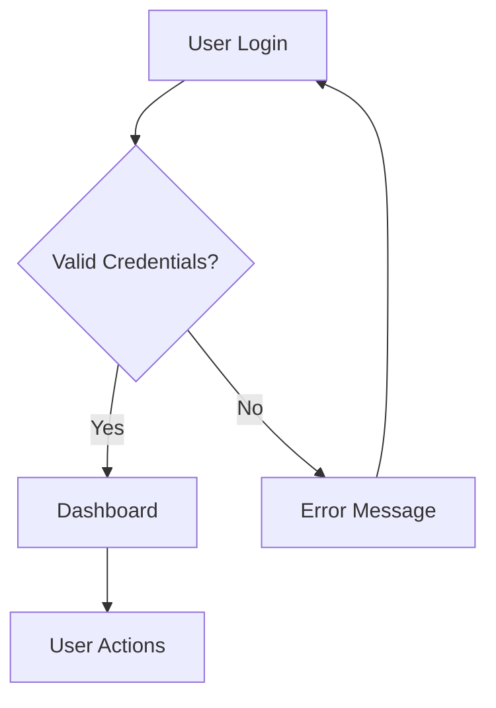
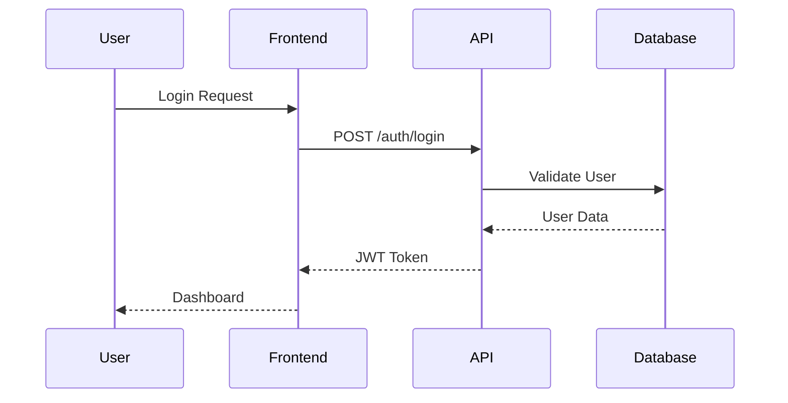

# Mermaid.js Test Page

This page tests the Mermaid.js integration.

## Simple Flowchart Test

```mermaid
graph TD
    A[User Login] --> B{Valid Credentials?}
    B -->|Yes| C[Dashboard]
    B -->|No| D[Error Message]
    D --> A
    C --> E[User Actions]
```

## API Flow Test

```mermaid
sequenceDiagram
    participant User
    participant Frontend
    participant API
    participant Database
    
    User->>Frontend: Login Request
    Frontend->>API: POST /auth/login
    API->>Database: Validate User
    Database-->>API: User Data
    API-->>Frontend: JWT Token
    Frontend-->>User: Dashboard
```

If these diagrams render correctly, Mermaid.js is working!