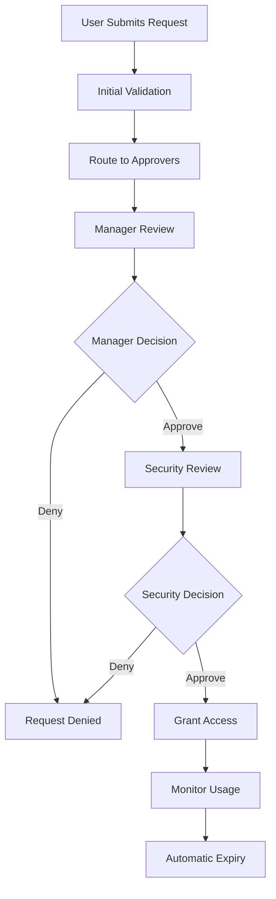

# Access Request Workflow Guide

## Overview
Complete guide to implementing and managing access request workflows in the AWO ERP system.

## Workflow Architecture



## Request Types

### 1. Entity Access Requests
Requests for access to specific business entities (departments, projects, etc.)

**Approval Flow**: Manager → Security Team → Auto-Grant
**Default Duration**: 90 days
**Auto-Extensions**: Allowed with justification

### 2. Role Assignment Requests  
Requests for elevated roles or permissions

**Approval Flow**: Manager → Admin → Security Audit
**Default Duration**: 30 days
**Auto-Extensions**: Manual review required

### 3. Emergency Access Requests
Time-sensitive requests for critical system access

**Approval Flow**: On-call Manager → Immediate Grant → Post-approval Audit
**Default Duration**: 4 hours
**Auto-Extensions**: Not allowed

## Approval Matrix

| Resource Type | Access Level | Approvers Required | Review Time |
|---------------|-------------|-------------------|-------------|
| Entity (read) | Read | 1 (Manager) | 4 hours |
| Entity (write) | Write | 2 (Manager + Admin) | 24 hours |
| Role (standard) | Standard | 2 (Manager + Security) | 48 hours |
| Role (admin) | Admin | 3 (Manager + Admin + CISO) | 72 hours |
| System (emergency) | Emergency | 1 (On-call) + Post-audit | 30 minutes |

## Implementation Steps

### 1. Configure Approval Rules
```yaml
# access-request-config.yaml
approval_rules:
  entity_access:
    read:
      approvers: ["manager"]
      sla_hours: 4
      auto_grant_conditions:
        - same_department: true
        - risk_level: "low"
    
    write:
      approvers: ["manager", "admin"]
      sla_hours: 24
      conditions:
        - background_check_required: true
        - training_completed: ["security_101"]
```

### 2. Set Up Notification Channels
- **Email notifications** for approvers
- **Slack/Teams integration** for urgent requests
- **SMS alerts** for emergency access requests
- **Dashboard notifications** in the admin portal

### 3. Define Auto-Approval Conditions
```json
{
  "auto_approval_rules": [
    {
      "condition": "same_department AND access_level = 'read'",
      "action": "auto_approve",
      "notification": "post_approval"
    },
    {
      "condition": "emergency_request AND on_call_approval",
      "action": "auto_approve",
      "audit": "immediate"
    }
  ]
}
```

## Monitoring & Analytics

### Key Metrics
- **Average Approval Time**: Target < 24 hours
- **Request Volume**: Trend analysis by department
- **Denial Rate**: Track reasons and patterns
- **Emergency Requests**: Frequency and justifications
- **Access Utilization**: Monitor granted access usage

### Compliance Reporting
- **Monthly Access Report**: All granted permissions
- **Quarterly Risk Assessment**: High-privilege access review
- **Annual Audit Trail**: Complete request history
- **Violation Alerts**: Unauthorized access attempts

## Best Practices

### For Requesters
1. **Provide clear justification** with business context
2. **Request minimum necessary access** (principle of least privilege)
3. **Specify accurate duration** to avoid unnecessary extensions
4. **Plan ahead** for non-emergency requests

### For Approvers
1. **Review request context** and business justification
2. **Verify identity** of the requester
3. **Apply conditions** when appropriate (time/IP restrictions)
4. **Document approval reasons** for audit purposes

### For Administrators
1. **Regular review** of approval workflows
2. **Monitor approval patterns** for policy improvements
3. **Automate routine approvals** to reduce overhead
4. **Maintain audit logs** for compliance requirements

## Troubleshooting

### Common Issues

#### Delayed Approvals
- **Cause**: Approver notifications not reaching recipients
- **Solution**: Verify email settings and backup notification channels

#### Auto-Approval Failures
- **Cause**: Misconfigured approval rules or missing conditions
- **Solution**: Review rule logic and test with sample requests

#### Access Not Granted After Approval
- **Cause**: Downstream provisioning system integration issues
- **Solution**: Check API connectivity and permission mapping

### Emergency Procedures

#### Bypass Approval Process
```bash
# Emergency access grant (requires admin privileges)
curl -X POST "$API_BASE_URL/access-requests/emergency-grant" \
  -H "Authorization: Bearer $ADMIN_TOKEN" \
  -d '{
    "user_id": "emergency-user-uuid",
    "resource_id": "critical-system-uuid", 
    "duration_hours": 4,
    "justification": "Production system outage",
    "incident_id": "INC-2025-001"
  }'
```

#### Audit Emergency Actions
All emergency grants must be audited within 24 hours with proper documentation and approval retroactively obtained.

## Integration Points

### Identity Management Systems
- **Active Directory**: Group membership management
- **LDAP**: User attribute synchronization  
- **SAML/OIDC**: Federated identity integration

### Ticketing Systems
- **Jira/ServiceNow**: Link requests to change tickets
- **PagerDuty**: Emergency access escalation
- **Slack/Teams**: Real-time collaboration on approvals

### Monitoring Tools
- **Splunk/ELK**: Audit log aggregation
- **DataDog/Grafana**: Metrics and alerting
- **Security Tools**: SIEM integration for threat detection