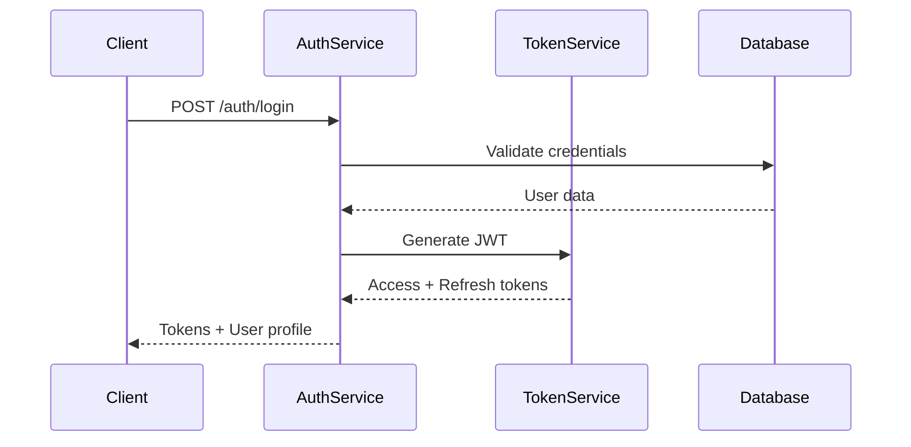

# Authentication Workflow

## Overview
Complete authentication workflow documentation for the AWO ERP system, including login flows, token management, and session handling.

## Authentication Flow



## Supported Authentication Methods

### 1. Username/Password Authentication
Standard credential-based login for internal users.

### 2. Multi-Factor Authentication (MFA)
Additional security layer using TOTP or SMS verification.

### 3. Single Sign-On (SSO)
Integration with external identity providers:
- SAML 2.0
- OAuth 2.0/OpenID Connect
- LDAP/Active Directory

## Token Management

### JWT Structure
```json
{
  "header": {
    "alg": "RS256",
    "typ": "JWT"
  },
  "payload": {
    "sub": "user-uuid",
    "tenant": "tenant-uuid", 
    "roles": ["admin", "finance"],
    "permissions": ["read:entities", "write:transactions"],
    "exp": 1640995200,
    "iat": 1640991600
  }
}
```

### Token Lifecycle
- **Access Token**: 15 minutes expiry
- **Refresh Token**: 7 days expiry (rolling refresh)
- **Session Token**: 24 hours (for web sessions)

## Security Features

### Multi-Tenant Isolation
Each JWT token includes tenant context to ensure complete data isolation.

### Permission-Based Access Control
Tokens include fine-grained permissions for resource-level access control.

### Audit Trail
All authentication events are logged for security monitoring and compliance.

## Implementation Examples

### Login Request
```bash
curl -X POST "$API_BASE_URL/auth/login" \
  -H "Content-Type: application/json" \
  -d '{
    "username": "admin@company.com",
    "password": "secure-password",
    "tenant_id": "tenant-uuid",
    "mfa_code": "123456"
  }'
```

### Token Refresh
```bash
curl -X POST "$API_BASE_URL/auth/refresh" \
  -H "Content-Type: application/json" \
  -d '{"refresh_token": "your-refresh-token"}'
```

### Logout
```bash
curl -X POST "$API_BASE_URL/auth/logout" \
  -H "Authorization: Bearer your-access-token"
```

## Error Handling

### Common Error Codes
- `AUTH_INVALID_CREDENTIALS`: Username or password incorrect
- `AUTH_ACCOUNT_LOCKED`: Account temporarily locked due to failed attempts
- `AUTH_MFA_REQUIRED`: Multi-factor authentication required
- `AUTH_TOKEN_EXPIRED`: Access token has expired
- `AUTH_INSUFFICIENT_PERMISSIONS`: Token lacks required permissions

### Rate Limiting
- **Login attempts**: 5 attempts per 15 minutes per IP
- **Token refresh**: 10 requests per minute per user
- **Password reset**: 3 attempts per hour per email

## Best Practices

### For Developers
1. Always validate tokens on protected endpoints
2. Implement proper token storage (secure HTTP-only cookies)
3. Handle token refresh automatically
4. Log authentication events for audit purposes

### For Security
1. Rotate signing keys regularly
2. Monitor for unusual authentication patterns
3. Implement IP whitelisting for admin accounts
4. Use HTTPS for all authentication endpoints