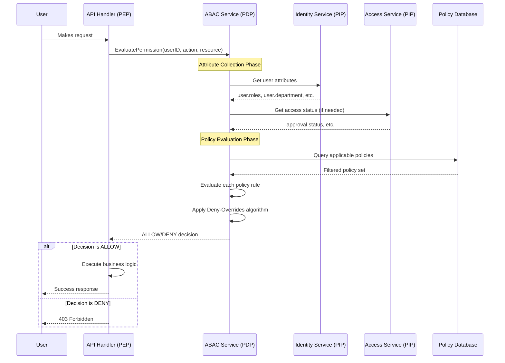
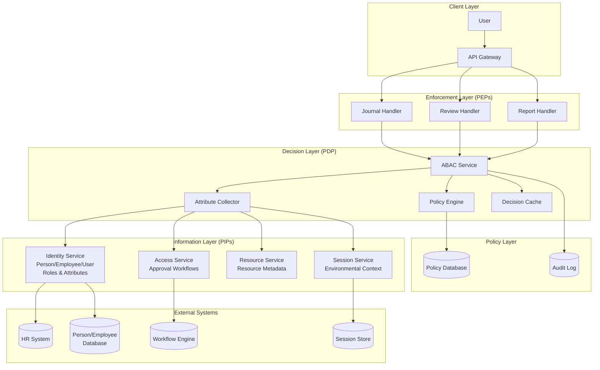

# Awo ERP ABAC Engine

## 1. Overview & Core Philosophy

The Awo ERP authorization model is built on a sophisticated, ABAC-centric design. Unlike traditional Role-Based Access Control (RBAC) where permissions are statically tied to roles, our ABAC engine makes dynamic, real-time decisions based on a rich set of attributes describing the user, the resource they are trying to access, and the environment of the request.

**The Core Philosophy:** Centralize the complex decision-making logic within the ABAC service, and decentralize the enforcement of those decisions to the API handlers. This makes the system incredibly flexible, allowing for complex security rules to be added or changed as simple data in the database, without requiring code changes.

### Identity Foundation: The Person-Employee-User Model

Before any authorization can occur, the system must establish identity through a three-tier hierarchy:

- **`Person`**: The root record for any individual, storing generic information like name and contact details. A Person can be a customer, vendor contact, or employee.
- **`Employee`**: Extends a Person with employment-specific data such as employee number, manager, and department. Links directly to a Person record.
- **`User`**: The system account that grants access, containing login credentials (username, password_hash), account status, and security settings. Must be linked to a Person and, if applicable, an Employee.

This structure allows the system to manage information about individuals even without system access (e.g., customer contacts) while cleanly separating personal data from employment data and system credentials.

## 2. Definitions: The Cast of Characters

To understand the flow, you must first know the players. We'll use the analogy of a security guard at a high-security event.

| Term | Definition | Analogy |
| :--- | :--- | :--- |
| **Attribute** | A single piece of information about anything in the system. Examples: `user.role = "Accountant"`, `resource.value = 5000`, `environment.time = "14:30"`. | The details on an ID card (age, clearance level), the event ticket (section, seat), and the current situation (time of day, security alert level). |
| **Policy** | A single rule that results in an `ALLOW` or `DENY` decision. It's composed of a `target` (when the rule applies) and a `rule` (the specific conditions). | A single line in the guard's rulebook, e.g., "Rule 5a: Only allow staff with 'Catering' on their ID into the kitchen." |
| **Policy Information Point (PIP)** | Any service that provides attributes to the engine. In our system, the `identity.Service` and `access.Service` are primary PIPs. | The systems the guard can query for more info. He can check the HR database for an employee's department (`identity.Service`) or the ticketing system for an approval status (`access.Service`). |
| **Policy Decision Point (PDP)** | The central brain that gathers attributes, evaluates policies, and makes the final decision. This is our `abac.Service`. | The security guard himself. He gathers all the information (from the ID, ticket, and his other systems) and uses his rulebook to make a final "Go" or "No-Go" decision. |
| **Policy Enforcement Point (PEP)** | The component that intercepts a user's action, asks the PDP for a decision, and then enforces that decision. This is our API handlers. | The gate or door where the guard stands. It's the point where access is physically blocked or granted based on the guard's decision. |
| **Combining Algorithm** | The master rule used when multiple policies apply and have conflicting outcomes (e.g., one says `ALLOW`, another says `DENY`). Our system uses **Deny-Overrides**. | The guard's most important rule: "If any single rule in the book says 'DENY', the final answer is always 'DENY', no matter what other rules say." |

## 3. User Lifecycle & Identity Management

Understanding how users are created, authenticated, and managed is crucial for understanding how the ABAC engine obtains its user attributes.

### User Onboarding (Creation Flow)

Creating a new internal user who is an employee follows these steps, orchestrated by the `identity.Service`:

1. **Create Person**: An administrator creates a Person record using `identity.Service.CreatePerson`. This establishes the individual's core identity in the system.

2. **Create Employee**: An Employee record is created via `identity.Service.CreateEmployee`, linked to the Person and containing all employment-related details.

3. **Register User**: The system access account is created using `identity.Service.RegisterNewUser`. This step:
   - Creates the User record in the database
   - Links the User to the corresponding Person and Employee records
   - Securely hashes and stores the user's password
   - Sets the initial `account_status` to `ACTIVE`

4. **Assign Roles (Optional)**: If needed, `identity.Service.AssignUserRole` links the new User to predefined roles. These roles become critical attributes for the ABAC engine.

### Authentication and Session Management

The daily interaction flow that feeds attributes to the ABAC engine:

1. **Authentication**: User logs in with credentials. The `identity.Service.Authenticate` method verifies the password against the stored `password_hash`.

2. **Session Creation**: Upon successful login, a new record is created in the `user_sessions` table, generating a session token. This session includes contextual data like IP address and device info, which become environmental attributes for ABAC policies.

3. **Attribute-Rich Context**: Each session maintains rich contextual information that the ABAC engine can leverage:
   - `environment.ip_address`
   - `environment.device_type`
   - `environment.login_time`
   - `environment.session_duration`

### User Offboarding (Deactivation Flow)

When an employee leaves, the offboarding process ensures secure access revocation:

1. **Trigger**: Initiated by events like `employment_terminated`

2. **Immediate Access Revocation**:
   - User's `account_status` changed to `LOCKED` or `INACTIVE` via `identity.Service`
   - All active sessions in `user_sessions` table terminated
   - ABAC cache invalidated for the user

3. **Data and Asset Transfer**: Workflows handle transfer of digital assets to managers

4. **Data Archiving**: Records are "soft-deleted" by setting `deleted_at` timestamp, preserving audit trails while preventing access

## 4. The Evaluation Lifecycle: A Step-by-Step Breakdown

Here is the precise, end-to-end process that occurs every time a permission check is needed, integrated with the identity management system.



### Detailed Steps:

1. **Request & Interception (PEP):** A user action triggers an API handler (the PEP). The handler's first job is to stop and ask for permission before proceeding. It packages up the initial, known details of the request and calls the `abac.Service.EvaluatePermission` function.

2. **Attribute Collection (PDP & PIPs):** The `abac.Service` (the PDP) receives the request and begins gathering attributes using its `Attribute Collector`:
   - **User Attributes**: Calls `identity.Service.GetUserByID` and `identity.Service.GetUserRoles` to get  user information including:
     - `user.roles` (from user-role assignments)
     - `user.department` (from the linked Employee record)
     - `user.security_level` 
     - `user.account_status`
     - `user.manager_id` (from Employee hierarchy)
   - **Session Attributes**: Retrieves environmental context from the current session:
     - `environment.ip_address`
     - `environment.device_type` 
     - `environment.login_time`
     - `environment.time_of_day`
   - **Resource Attributes**: Inspects the target resource for attributes like:
     - `resource.type`
     - `resource.sensitivity_level`
     - `resource.department_id`
     - `resource.owner_id`
   - **Access Service Attributes**: If needed, calls `access.Service` for approval workflow status

3. **Policy Filtering (PDP):** With collected attributes, the PDP queries the `policies` table using the `target` field to filter down to relevant policies for this specific context.

4. **Rule Evaluation (PDP):** For each applicable policy, the PDP evaluates the `rule` field against the collected attributes. Each policy evaluation results in: `ALLOW`, `DENY`, or `Not Applicable`.

5. **Decision Aggregation (PDP):** The PDP applies the **Deny-Overrides** combining algorithm:
   - If any policy returned `DENY`, the final decision is **`DENY`**
   - If there are no `DENY`s and at least one `ALLOW`, the final decision is **`ALLOW`**
   - If no policies applied, the decision defaults to **`DENY`**

6. **Enforcement (PEP):** The final decision is returned to the API handler, which either proceeds with business logic (`ALLOW`) or returns a `403 Forbidden` error (`DENY`).

## 5. User Stories, Policies, and Code Examples

This is how the theory translates into solving real business problems.

### User Story 1: Role-Based Access with Context

> **As a** Finance Manager,
> **I want** accountants on my team to be able to create journal entries,
> **so that** they can perform their daily duties, **but only** during standard business hours for security reasons.

#### The Policy

An administrator would create this policy record in the `policies` table using the Policy Management API:

```json
{
    "name": "Allow Accountant Journal Creation During Business Hours",
    "effect": "ALLOW",
    "priority": 100,
    "target": {
        "user.roles": ["Accountant"],
        "resource.type": "journal_entry",
        "action": "create"
    },
    "rule": {
        "and": [
            { "environment.time_of_day": { "between": ["09:00", "17:00"] } },
            { "environment.on_corporate_network": true }
        ]
    }
}
```

#### The Code (The PEP)

```go
// From: internal/api/handlers/journal_entry_handler.go

func (h *JournalEntryHandler) CreateJournalEntry(w http.ResponseWriter, r *http.Request) {
    // ... decode request, get user ID ...

    // The handler doesn't know about roles or business hours. It just asks.
    decision, err := h.abacService.EvaluatePermission(r.Context(), &abac.PermissionEvaluationRequest{
        UserID:       userID,
        ResourceType: "journal_entry",
        Action:       "create",
        // The context can be empty if the ABAC service can gather everything it needs.
        // Or we can pass specific data about the object being created.
        Context:      map[string]interface{}{},
    })

    if err != nil || decision.Decision != types.PolicyDecisionAllow {
        // Log the denial for audit purposes
        h.logger.Warn("Access denied", 
            "user_id", userID, 
            "action", "create", 
            "resource", "journal_entry",
            "reason", decision.Reason)
        
        http.Error(w, "Forbidden", http.StatusForbidden)
        return
    }

    // ... proceed to create the journal entry ...
}
```

### User Story 2: Data-Dependent Authorization

> **As a** Department Manager,
> **I want** to view the performance reviews of employees in my own department,
> **so that** I can manage my team, **but I should not** be able to see reviews for employees in other departments.

#### The Policy

This policy demonstrates comparing attributes between the user and the resource.

```json
{
    "name": "Allow Manager to View Own Department Reviews",
    "effect": "ALLOW",
    "priority": 100,
    "target": {
        "user.roles": ["Manager"],
        "resource.type": "performance_review",
        "action": "read"
    },
    "rule": {
        "equals": {
            "user.department_id": "resource.department_id"
        }
    }
}
```

#### The Code (The PEP)

```go
// From: internal/api/handlers/performance_review_handler.go

func (h *PerformanceReviewHandler) GetPerformanceReview(w http.ResponseWriter, r *http.Request) {
    userID := auth.GetUserIDFromContext(r.Context())
    reviewID := mux.Vars(r)["id"]

    // First, get the resource so we can pass its attributes to the ABAC engine
    review, err := h.reviewService.GetReviewMetadata(reviewID) // This just gets non-sensitive metadata
    if err != nil {
        http.NotFound(w, r)
        return
    }

    decision, err := h.abacService.EvaluatePermission(r.Context(), &abac.PermissionEvaluationRequest{
        UserID:       userID,
        ResourceType: "performance_review",
        Action:       "read",
        Context: map[string]interface{}{
            // Pass the resource's attributes into the context for evaluation
            "resource.department_id": review.DepartmentID,
            "resource.owner_id": review.EmployeeID,
        },
    })

    if err != nil || decision.Decision != types.PolicyDecisionAllow {
        h.logger.Info("Performance review access denied",
            "user_id", userID,
            "review_id", reviewID,
            "user_dept", decision.UserAttributes["user.department_id"],
            "resource_dept", review.DepartmentID)
        
        http.Error(w, "Forbidden", http.StatusForbidden)
        return
    }

    // ... now fetch the full, sensitive review data and return it ...
}
```

### User Story 3: Conditional Access with Approval Workflows

> **As a** Senior Executive,
> **I want** to access highly sensitive financial reports,
> **so that** I can make strategic decisions, **but only** after my access request has been approved by the Board.

#### The Policy

```json
{
    "name": "Senior Executive Sensitive Reports with Approval",
    "effect": "ALLOW",
    "priority": 200,
    "target": {
        "user.roles": ["Senior_Executive"],
        "resource.type": "financial_report",
        "resource.sensitivity_level": "highly_sensitive",
        "action": "read"
    },
    "rule": {
        "and": [
            { "approval.status": "approved" },
            { "approval.approver_role": "Board_Member" },
            { "approval.expiry_date": { "after": "environment.current_time" } }
        ]
    }
}
```

## 6. Architecture Diagram



## 7. Key Functions and Their Roles

- `abac.Service.EvaluatePermission(ctx, req)`: **The Main Entry Point.** This is the single function that handlers should call to get an authorization decision. It orchestrates the entire lifecycle.

- `abac.AttributeCollector.CollectAttributes(ctx, req)`: **The Data Gatherer.** This internal function is called by `EvaluatePermission` to fetch all the necessary attributes from the various PIPs.

- `identity.Service.GetUserByID(ctx, id)`, `identity.Service.GetUserRoles(ctx, id)`, & `identity.Service.GetEmployeeByUserID(ctx, id)`: **The Primary PIPs.** These functions provide the authoritative source of user, employment, and role information. The Employee data provides department and managerial hierarchy attributes crucial for many policies.

- `policies.Repository.FindApplicable(ctx, attributes)`: **The Filter.** This database function takes the collected attributes and efficiently finds all policies in the database whose `target` clause matches the current context.

## 8. Performance Considerations & Optimizations

### Caching Strategy

The system implements a multi-layered caching approach:

```go
// Example cache key structure
type CacheKey struct {
    UserID       string
    ResourceType string
    Action       string
    ContextHash  string // Hash of all relevant context attributes
}
```

### Cache Invalidation Events

```go
// Event-driven cache invalidation
type InvalidationEvent struct {
    Type     string // "user.roles.changed", "employee.department.changed", "user.deactivated", "policy.updated", etc.
    UserID   string // Optional, for user-specific invalidation
    PolicyID string // Optional, for policy-specific invalidation
}

// Critical events that require immediate cache invalidation:
// - User role assignments/removals
// - Employee department changes
// - User account status changes (ACTIVE -> LOCKED)
// - Employee termination/soft-deletion
// - Manager hierarchy changes
```

### Performance Metrics to Monitor

- **Attribute Collection Time:** How long PIPs take to respond
- **Policy Evaluation Time:** Time spent evaluating rules
- **Cache Hit Rate:** Percentage of requests served from cache
- **Decision Latency:** End-to-end time for authorization decisions

## 9. Gotchas & Advanced Considerations

This system is powerful, but it comes with complexities you must manage.

### Performance is Paramount
The permission check happens on almost every API call. A slow check means a slow app.

- **Gotcha:** The `Attribute Collector` can become a bottleneck if it needs to make multiple slow database calls or external API calls to PIPs.
- **Solution:** Your system rightly includes a caching layer (`policy_evaluations` table). Caching the *final decision* for a specific user/resource/action/context combination is critical. The `context_hash` field is key here.

### Cache Invalidation is Hard
The biggest challenge with caching is knowing when to invalidate the cache, especially with the multi-layered identity model.

- **Gotcha:** A user's role is changed, but the ABAC decision cache still holds the old decision. Even worse, an employee's department is changed (affecting `user.department` attribute), but only role-based cache invalidation is implemented.
- **Solution:** Implement  event-driven invalidation covering all identity layers:
  - `user.roles.changed` → Invalidate all decisions for that user
  - `employee.department.changed` → Invalidate decisions using department-based policies  
  - `employee.manager.changed` → Invalidate decisions using managerial hierarchy
  - `user.account.deactivated` → Immediately invalidate and prevent new cache entries
  - `person.deleted` → Full cleanup of all related cached decisions

### Debugging Policies is Complex
When a user is denied access, it can be difficult to know *why*.

- **Gotcha:** A user is denied access, and you have 20 potentially applicable policies. Which one caused the `DENY`? Was it a missing attribute?
- **Solution:** Your `audit_log` table is the answer. When `EvaluatePermission` runs, it should log not just the final decision, but also which policies were evaluated and what their individual outcomes were. This creates an invaluable audit trail for debugging.

### Attribute Reliability (The PIP Problem)
The ABAC engine's decisions are only as good as the attributes it receives.

- **Gotcha:** The HR system (a PIP) is down, and the `Attribute Collector` cannot fetch the user's `security_level`. What should it do?
- **Solution:** Fail securely. If a critical attribute required by a policy cannot be fetched, the evaluation of that policy should result in a `DENY`. Never default to `ALLOW` on missing information.

### Policy Explosion
As your system grows, you might end up with hundreds of policies.

- **Gotcha:** Policy management becomes unwieldy, and conflicting policies create unexpected behaviors.
- **Solution:** Implement policy validation, versioning, and testing. Create policy templates for common patterns.

## 10. Security Best Practices

### Principle of Least Privilege
- Start with deny-all and explicitly grant permissions
- Regularly audit and remove unused policies
- Implement time-bounded permissions where appropriate

### Defense in Depth
- ABAC is one layer; implement additional security controls
- Use encryption for sensitive attribute data
- Implement rate limiting for policy evaluation endpoints

### Monitoring and Alerting
- Alert on policy evaluation failures
- Monitor for unusual access patterns
- Track policy modification activities

## 11. Troubleshooting Guide

### Common Issues and Solutions

| Problem | Symptoms | Solution |
|---------|----------|----------|
| Slow authorization | High response times | Check PIP performance, optimize caching |
| Unexpected denials | Users can't access expected resources | Check audit logs, verify attribute collection |
| Cache inconsistency | Permissions persist after role changes | Verify event-driven cache invalidation |
| Policy conflicts | Inconsistent access decisions | Review policy priorities and combining algorithm |

### Debug Commands

```bash
# Check policy evaluation for specific user/resource
curl -X POST /internal/abac/debug \
  -d '{"user_id": "123", "resource_type": "journal_entry", "action": "create"}'

# View recent audit logs
curl /internal/abac/audit?user_id=123&limit=10

# Simulate policy changes
curl -X POST /internal/abac/simulate \
  -d '{"policy_changes": [...], "test_cases": [...]}'
```

## 12. My Recommendations for Success

### Treat Policies as Code
Store your policy JSON files in version control. Have a CI/CD pipeline that validates and deploys policy changes to the database. This gives you history, peer review, and automated testing for your security rules.

### Build a Policy Library
Don't write every policy from scratch. Identify common patterns (like the user stories above) and create templates. An administrator should be able to create a new policy by filling in a few values, not by writing complex JSON by hand.

### Embrace "Deny by Default"
Your system is designed this way, but it's a mindset the whole team needs to adopt. Access is forbidden unless a policy explicitly grants it. This is the most secure posture.

### Invest in Auditing and Simulation Tools
The `audit_log` is your most powerful tool for understanding the "why" behind a decision. A UI that allows administrators to query this log and simulate policy evaluations ("What would happen if Bob from Finance tried to access this HR report?") will make the system manageable and transparent.

### Create Policy Testing Framework
Implement automated testing for your policies:

```go
// Example policy test
func TestManagerCanViewOwnDepartmentReviews(t *testing.T) {
    testCases := []struct{
        userDept     string
        resourceDept string
        expected     PolicyDecision
    }{
        {"Engineering", "Engineering", ALLOW},
        {"Engineering", "Finance", DENY},
        {"HR", "HR", ALLOW},
    }
    
    for _, tc := range testCases {
        decision := evaluatePolicy(managerReviewPolicy, tc.userDept, tc.resourceDept)
        assert.Equal(t, tc.expected, decision)
    }
}
```

### Monitor Policy Health
Track key metrics:
- Policy evaluation frequency (identify unused policies)
- Attribute retrieval success rates (identify unreliable PIPs)
- Cache effectiveness (optimize for better performance)
- Security incidents related to authorization failures

## 13. Future Enhancements

### Dynamic Policy Learning
Consider implementing machine learning to suggest policy optimizations based on usage patterns and access requests.

### Policy Simulation UI
Build a web interface where administrators can test "what-if" scenarios before deploying policy changes.

### Distributed Decision Points
For high-scale deployments, consider distributing the PDP across multiple services with eventual consistency models.

### Integration with External Identity Providers
Extend PIP capabilities to pull attributes from external systems like Active Directory, LDAP, or cloud identity providers.
