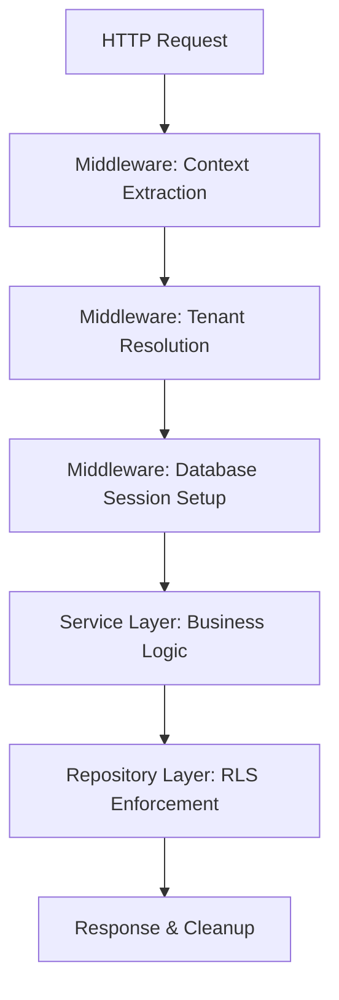

# Awo ERP Architecture

This document is the authoritative source of truth for the Awo ERP system's architecture. It outlines the project structure, data flow patterns, and core architectural principles that guide development.

## 1. Core Principles (Clean Architecture)

The application follows a strict Clean Architecture pattern, emphasizing separation of concerns and a one-way dependency flow. This ensures the core business logic is independent of infrastructure details like databases, frameworks, and APIs.

- **Multi-Tenant First:** All features must be designed for multi-tenancy. Every database query and API endpoint must be scoped to the current tenant context.
- **Dependency Inversion:** The core business logic (`internal/core`) defines interfaces (ports) for its dependencies, such as repositories. Concrete implementations (`internal/repository`) of these interfaces are provided by outer layers.
- **API-Driven:** All functionality is exposed via APIs defined using the Goa DSL.

### Data Flow

The data flow is strictly unidirectional:

`Client → Handler → Service → Repository → Database`

1.  **Handler (`/internal/api/handlers`)**: Receives HTTP requests, validates payloads, and calls the appropriate `Service`. Contains no business logic.
2.  **Service (`/internal/core/*`)**: Contains the core business logic, validation, and rules. Orchestrates data access by calling `Repository` interfaces.
3.  **Repository (`/internal/repository`)**: Implements the data persistence interfaces defined by the `Service` layer. It abstracts the database, converting between domain models and database models and interacting with the `sqlc`-generated `Store`.
4.  **Store (`/db/sqlc`)**: The `sqlc`-generated Data Access Layer (DAL). This code is auto-generated from SQL queries and should not be edited manually.

## 2. Project Structure

The project is organized to reflect the Clean Architecture principles.

```sh
erp/
├── cmd/                    # Application entry points (server, workers)
├── config/                 # System configuration files
├── db/                     # Database migrations, queries, and generated code
│   ├── migration/
│   ├── queries/
│   └── sqlc/               # sqlc-generated DAL (DO NOT EDIT)
├── docs/                   # Project documentation
│   └── architecture/
│       ├── adr/            # Architecture Decision Records
│       └── README.md       # This file
├── internal/               # Private application code
│   ├── api/                # API definitions and handlers
│   │   ├── design/         # Goa DSL for API design
│   │   └── handlers/       # HTTP handlers
│   ├── core/               # Core business logic and domain models (Services)
│   ├── platform/           # Infrastructure implementations (DB connections, cache)
│   ├── repository/         # Repository implementations for data access
│   └── shared/             # Common utilities (logging, errors, etc.)
├── pkg/                    # Public, reusable packages (if any)
└── web/                    # Frontend assets
```

## 3. Core Concept: Tenant Context Lifecycle

A critical aspect of our multi-tenant architecture is the management of the tenant context throughout the request lifecycle. This ensures complete data isolation and security.

*Implementation relies on PostgreSQL's session variables (`app.current_tenant_id`) to automatically enforce Row Level Security (RLS) policies at the database level.*

### Lifecycle Phases



### Phase 1: Context Extraction (Middleware)

The Goa middleware intercepts every incoming request to identify the tenant.

- **Priority Order:**
    1.  `X-Tenant-ID` HTTP Header (UUID)
    2.  JWT Token Claim
    3.  Subdomain (`subdomain.example.com`)

### Phase 2: Tenant Resolution (Middleware)

Once an identifier is extracted, the middleware resolves it to a valid tenant record.

1.  **Cache Check:** The system first checks a cache (e.g., Redis) for the tenant's data to improve performance.
2.  **Database Lookup:** On a cache miss, it queries the database using the `sqlc`-generated `GetTenantByID` function.
3.  **Status Validation:** The tenant's status is checked to ensure it is `active`. Suspended or terminated tenants are rejected.

### Phase 3: Database Session Setup (Middleware)

This is the most critical step for ensuring data isolation.

1.  **Set Session Variable:** The middleware calls the `tenant.Service` to set the tenant context for the current database connection.
2.  **`set_config()`:** The repository layer executes `SELECT set_config('app.current_tenant_id', '...', false)`. The `false` argument makes the setting session-local, persisting across transactions within the same connection.
3.  **RLS Activation:** Once `app.current_tenant_id` is set, all RLS policies that rely on this variable are automatically activated by PostgreSQL for the duration of the request.

### Phase 4 & 5: Service & Repository (Request Processing)

- **Service Layer:** Services can now call repository methods without needing to pass the `tenant_id` manually for every query. They can retrieve the current tenant's information from the context if needed for business logic.
- **Repository Layer:** The repository executes `sqlc`-generated queries (e.g., `GetUserByID`). The underlying RLS policy in PostgreSQL automatically adds the equivalent of `WHERE tenant_id = current_tenant_id()` to the query, ensuring only data for the correct tenant is accessed.

### Phase 6: Cleanup

A `defer` block in the middleware ensures that the database session is cleaned up after the request is complete.

- **`RESET app.current_tenant_id`**: This command is executed to clear the session variable, ensuring the connection is clean before being returned to the connection pool.

### Tenant-Aware Transactions

The system uses a `store.WithTenant(...)` method to handle transactions. This method begins a transaction, sets the tenant context *within that transaction*, executes the business logic, and then commits or rolls back. This ensures that even complex, multi-statement operations are fully isolated.

### Cross-Tenant Operations (Admin)

Administrative functions that require access to multiple tenants are handled by switching the database connection's role to a special `admin_role`. This role has a permissive RLS policy (`USING (true)`) that bypasses the tenant isolation check, allowing for system-wide operations. This approach is safer than disabling RLS entirely.
