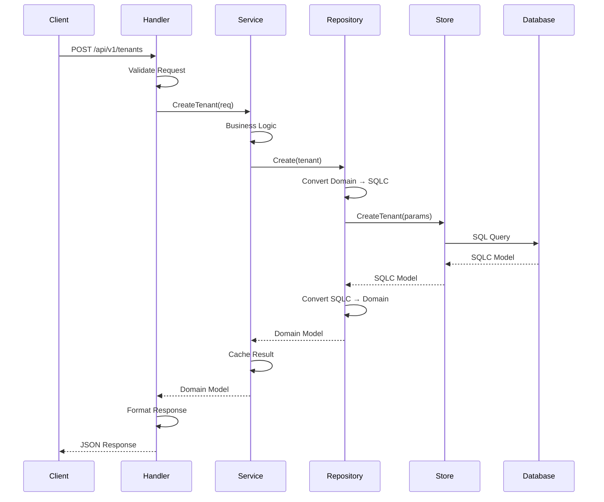
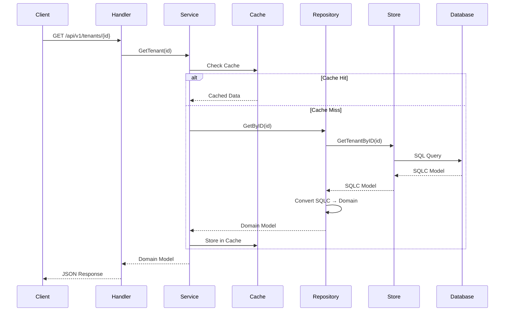
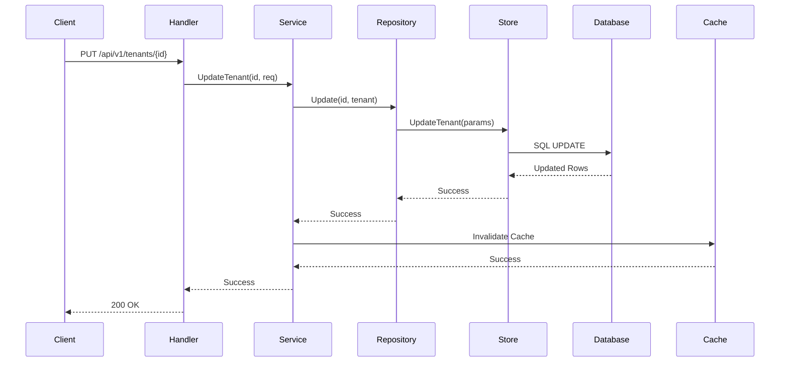
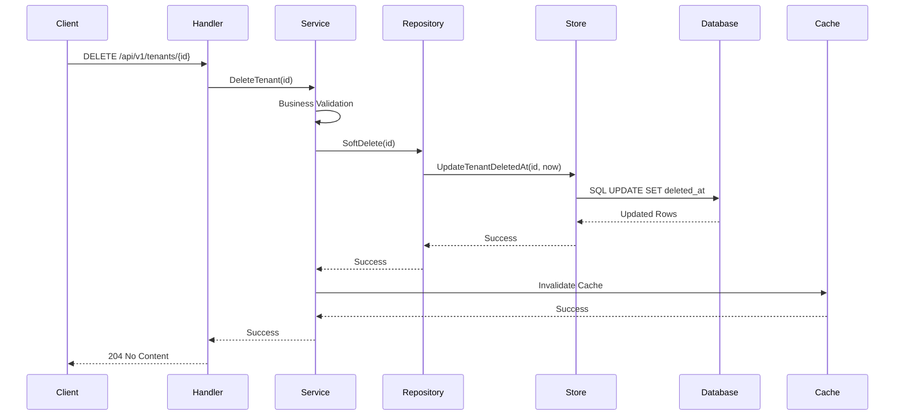
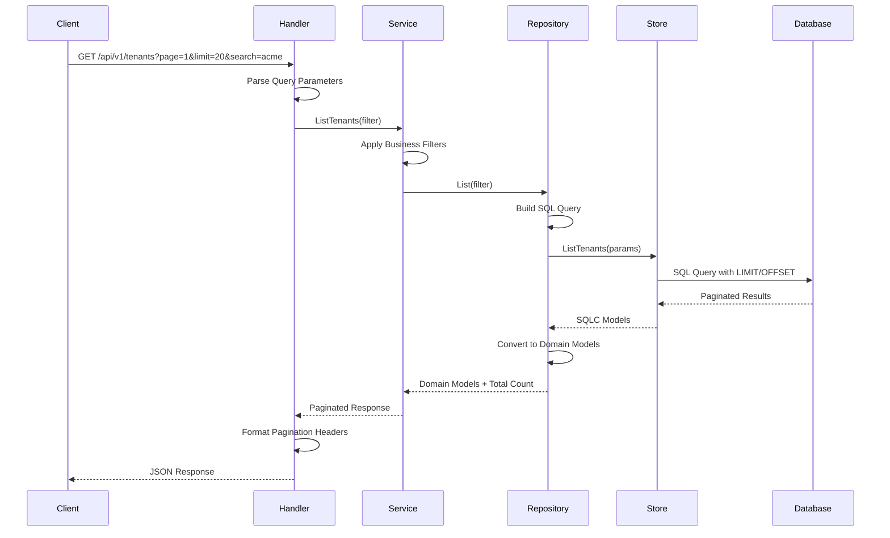
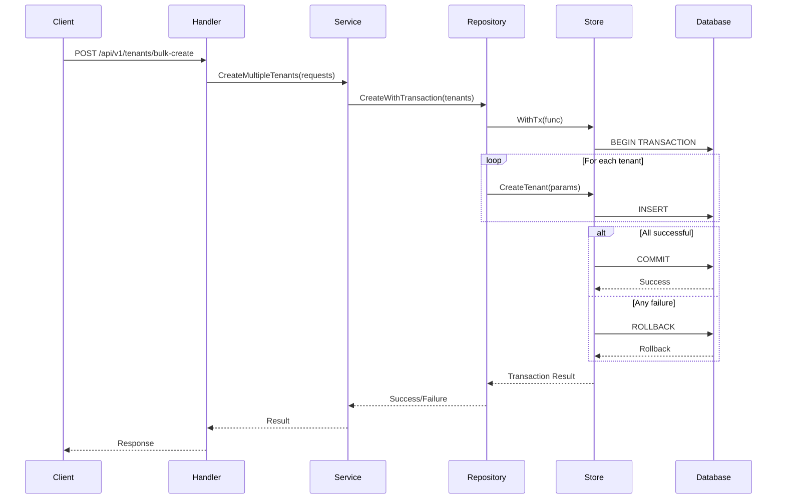
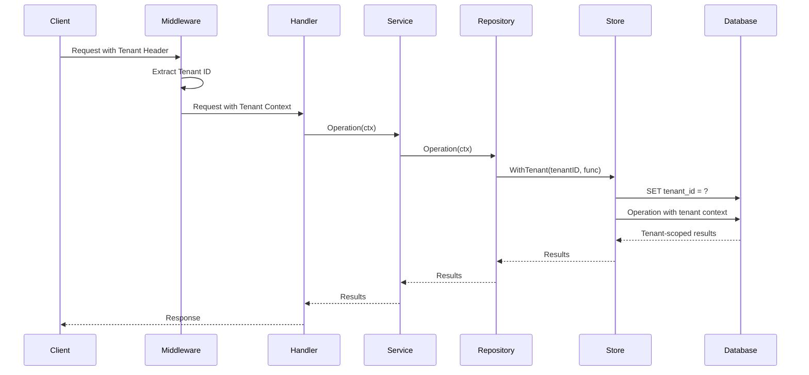

# Data Flow Patterns

This guide explains how data flows through our Clean Architecture layers, with detailed sequence diagrams and interaction patterns.

## 🔄 Core Flow Patterns

### Overview
All requests follow a consistent pattern through our layers:
```
Client → Handler → Service → Repository → Database
       ← Handler ← Service ← Repository ← Database
```

## 📝 Create Operation Flow

### Sequence Diagram


### Step-by-Step Breakdown

#### 1. **Client Request** → **Handler**
```http
POST /api/v1/tenants
Content-Type: application/json

{
  "name": "Acme Corp",
  "slug": "acme-corp",
  "email": "admin@acme.com",
  "subdomain": "acme"
}
```

#### 2. **Handler Processing**
```go
func (h *TenantHandler) CreateTenant(c *gin.Context) {
    // Parse and validate JSON request
    var req CreateTenantRequest
    if err := c.ShouldBindJSON(&req); err != nil {
        c.JSON(400, gin.H{"error": "Invalid request format"})
        return
    }
    
    // Call service layer
    tenant, err := h.service.CreateTenant(c.Request.Context(), req)
    if err != nil {
        // Handle different error types
        handleError(c, err)
        return
    }
    
    // Format successful response
    c.JSON(201, tenant)
}
```

#### 3. **Service Processing**
```go
func (s *service) CreateTenant(ctx context.Context, req CreateTenantRequest) (*Tenant, error) {
    // Business validation
    if req.Subdomain != nil {
        exists, err := s.repo.Exists(ctx, *req.Subdomain)
        if err != nil {
            return nil, fmt.Errorf("validation failed: %w", err)
        }
        if exists {
            return nil, ErrSubdomainAlreadyExists
        }
    }
    
    // Create domain entity with business rules
    tenant := &Tenant{
        ID:           uuid.New(),
        Name:         req.Name,
        Slug:         req.Slug,
        Email:        req.Email,
        Subdomain:    req.Subdomain,
        Status:       StatusActive,  // Business rule
        Timezone:     "UTC",         // Default value
        CurrencyCode: "USD",         // Default value
        CreatedAt:    time.Now(),
    }
    
    // Persist via repository
    if err := s.repo.Create(ctx, tenant); err != nil {
        return nil, fmt.Errorf("failed to create tenant: %w", err)
    }
    
    // Cache the result
    if tenant.Subdomain != nil {
        cacheKey := fmt.Sprintf("tenant:subdomain:%s", *tenant.Subdomain)
        s.cache.Set(ctx, cacheKey, tenant, 30*time.Minute)
    }
    
    return tenant, nil
}
```

#### 4. **Repository Processing**
```go
func (r *repository) Create(ctx context.Context, tenant *Tenant) error {
    // Convert domain model to SQLC parameters
    params := db.CreateTenantParams{
        ID:           tenant.ID,
        Name:         tenant.Name,
        Slug:         tenant.Slug,
        Email:        tenant.Email,
        Subdomain:    tenant.Subdomain,
        Status:       string(tenant.Status),
        Timezone:     tenant.Timezone,
        CurrencyCode: tenant.CurrencyCode,
        CreatedAt:    tenant.CreatedAt,
    }
    
    // Execute SQLC-generated query
    _, err := r.store.CreateTenant(ctx, params)
    if err != nil {
        return fmt.Errorf("failed to create tenant: %w", err)
    }
    
    return nil
}
```

## 📖 Read Operation Flow

### Sequence Diagram


### Caching Strategy

#### Cache-First Pattern
```go
func (s *service) GetTenantBySubdomain(ctx context.Context, subdomain string) (*Tenant, error) {
    // 1. Check cache first
    cacheKey := fmt.Sprintf("tenant:subdomain:%s", subdomain)
    var tenant Tenant
    if err := s.cache.Get(ctx, cacheKey, &tenant); err == nil {
        return &tenant, nil  // Cache hit
    }
    
    // 2. Cache miss - get from repository
    dbTenant, err := s.repo.GetBySubdomain(ctx, subdomain)
    if err != nil {
        return nil, err
    }
    
    // 3. Cache the result
    s.cache.Set(ctx, cacheKey, dbTenant, 30*time.Minute)
    
    return dbTenant, nil
}
```

#### Cache Invalidation
```go
func (s *service) UpdateTenant(ctx context.Context, id uuid.UUID, req UpdateTenantRequest) error {
    // Update in repository
    if err := s.repo.Update(ctx, id, req); err != nil {
        return err
    }
    
    // Invalidate relevant cache entries
    if req.Subdomain != nil {
        cacheKey := fmt.Sprintf("tenant:subdomain:%s", *req.Subdomain)
        s.cache.Delete(ctx, cacheKey)
    }
    
    return nil
}
```

## 🔄 Update Operation Flow

### Sequence Diagram


### Update Implementation
```go
// Service Layer
func (s *service) UpdateTenant(ctx context.Context, id uuid.UUID, req UpdateTenantRequest) error {
    // 1. Get existing tenant for validation
    existing, err := s.repo.GetByID(ctx, id)
    if err != nil {
        return err
    }
    
    // 2. Apply business rules for updates
    if req.Status != nil && !isValidStatusTransition(existing.Status, *req.Status) {
        return ErrInvalidStatusTransition
    }
    
    // 3. Update via repository
    if err := s.repo.Update(ctx, id, req); err != nil {
        return err
    }
    
    // 4. Invalidate cache
    return s.invalidateTenantCache(ctx, existing)
}
```

## 🗑️ Delete Operation Flow

### Soft Delete Pattern


### Soft Delete Implementation
```go
// Repository Layer
func (r *repository) SoftDelete(ctx context.Context, id uuid.UUID) error {
    now := time.Now()
    err := r.store.UpdateTenantDeletedAt(ctx, db.UpdateTenantDeletedAtParams{
        ID:        id,
        DeletedAt: sql.NullTime{Time: now, Valid: true},
    })
    
    if err != nil {
        return fmt.Errorf("failed to soft delete tenant: %w", err)
    }
    
    return nil
}
```

## 📋 List/Search Operation Flow

### Paginated List Pattern


### List Implementation
```go
// Handler Layer
func (h *TenantHandler) ListTenants(c *gin.Context) {
    // Parse query parameters
    filter := ParseListFilter(c)
    
    // Call service
    result, err := h.service.ListTenants(c.Request.Context(), filter)
    if err != nil {
        handleError(c, err)
        return
    }
    
    // Set pagination headers
    c.Header("X-Total-Count", strconv.Itoa(result.Total))
    c.Header("X-Page", strconv.Itoa(filter.Page))
    c.Header("X-Per-Page", strconv.Itoa(filter.Limit))
    
    c.JSON(200, result.Items)
}

// Service Layer
func (s *service) ListTenants(ctx context.Context, filter ListFilter) (*PaginatedResult, error) {
    // Apply business-level filtering
    if filter.IncludeDeleted == false {
        filter.ExcludeDeleted = true
    }
    
    // Get from repository
    tenants, total, err := s.repo.List(ctx, filter)
    if err != nil {
        return nil, err
    }
    
    return &PaginatedResult{
        Items: tenants,
        Total: total,
        Page:  filter.Page,
        Limit: filter.Limit,
    }, nil
}
```

## 🔄 Transaction Flow

### Multi-Operation Transaction


### Transaction Implementation
```go
// Repository Layer
func (r *repository) CreateMultiple(ctx context.Context, tenants []*Tenant) error {
    return r.store.WithTx(ctx, func(ctx context.Context, tx Store) error {
        for _, tenant := range tenants {
            params := db.CreateTenantParams{
                ID:   tenant.ID,
                Name: tenant.Name,
                // ... other fields
            }
            
            if _, err := tx.CreateTenant(ctx, params); err != nil {
                return err // Will trigger rollback
            }
        }
        return nil // Commits transaction
    })
}
```

## 🏷️ Tenant Context Flow

### Multi-Tenant Request Handling


### Tenant Context Implementation
```go
// Middleware
func TenantContext() gin.HandlerFunc {
    return func(c *gin.Context) {
        tenantID := extractTenantID(c)
        ctx := context.WithValue(c.Request.Context(), "tenant_id", tenantID)
        c.Request = c.Request.WithContext(ctx)
        c.Next()
    }
}

// Repository Layer
func (r *repository) GetUsersByTenant(ctx context.Context) ([]*User, error) {
    tenantID := getTenantFromContext(ctx)
    
    return r.store.WithTenant(ctx, tenantID, func(ctx context.Context, store Store) ([]*User, error) {
        users, err := store.GetUsers(ctx) // Automatically tenant-scoped
        if err != nil {
            return nil, err
        }
        
        return convertUsers(users), nil
    })
}
```

## ⚡ Performance Patterns

### Batch Operations
```go
// Service Layer - Batch processing
func (s *service) BatchUpdateTenants(ctx context.Context, updates []TenantUpdate) error {
    // Group updates by type for efficiency
    statusUpdates := filterByType(updates, "status")
    settingUpdates := filterByType(updates, "settings")
    
    // Process in batches
    return s.repo.BatchUpdate(ctx, statusUpdates, settingUpdates)
}
```

### Eager Loading
```go
// Repository Layer - Join related data
func (r *repository) GetTenantWithUsers(ctx context.Context, id uuid.UUID) (*TenantWithUsers, error) {
    // Single query with join instead of N+1 queries
    result, err := r.store.GetTenantWithUsers(ctx, id)
    if err != nil {
        return nil, err
    }
    
    return convertTenantWithUsers(result), nil
}
```

## 🚨 Error Flow Patterns

### Error Propagation
```
Database Error → Repository (Wrap) → Service (Handle) → Handler (Format) → Client
```

### Error Handling Example
```go
// Repository Layer
func (r *repository) GetByID(ctx context.Context, id uuid.UUID) (*Tenant, error) {
    tenant, err := r.store.GetTenantByID(ctx, id)
    if err != nil {
        if err.Error() == "no rows in result set" {
            return nil, ErrTenantNotFound // Domain error
        }
        return nil, fmt.Errorf("database error: %w", err) // Infrastructure error
    }
    return convertTenant(tenant), nil
}

// Service Layer
func (s *service) GetTenant(ctx context.Context, id uuid.UUID) (*Tenant, error) {
    tenant, err := s.repo.GetByID(ctx, id)
    if err != nil {
        if errors.Is(err, ErrTenantNotFound) {
            return nil, err // Let domain errors bubble up
        }
        return nil, fmt.Errorf("service error: %w", err) // Wrap infrastructure errors
    }
    return tenant, nil
}

// Handler Layer
func (h *TenantHandler) GetTenant(c *gin.Context) {
    tenant, err := h.service.GetTenant(c.Request.Context(), id)
    if err != nil {
        switch {
        case errors.Is(err, ErrTenantNotFound):
            c.JSON(404, gin.H{"error": "Tenant not found"})
        default:
            c.JSON(500, gin.H{"error": "Internal server error"})
        }
        return
    }
    c.JSON(200, tenant)
}
```

---

📚 **Next Steps**:
- [SQLC Integration](./sqlc-integration.md) - Database layer patterns
- [Observability](./observability.md) - Tracing data flow
- [Code Examples](./code-examples.md) - Complete implementation examples
