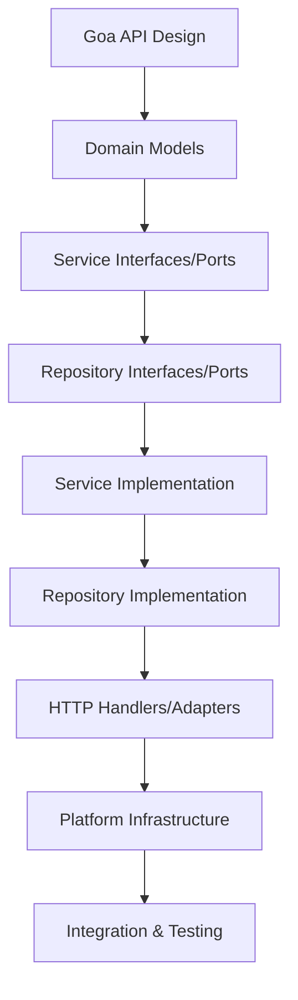

# Awo ERP Service Implementation Checklist
## *Hexagonal Architecture (Ports & Adapters) Edition*

*A comprehensive todo list for implementing any new domain module in Go-based ERP systems following Hexagonal Architecture principles*

## **🔍 1. Analysis & Design Phase**
- [ ] **Domain Analysis**
  - [ ] Identify bounded context and core business capabilities
  - [ ] Map domain entities and value objects
  - [ ] Define aggregates and their invariants
  - [ ] Establish domain events for inter-module communication
- [ ] **Data Modeling**
  - [ ] Create Entity Relationship Diagram (ERD)
  - [ ] Define Go structs with proper tags (`json`, `db`, `validate`)
  - [ ] Plan multi-tenant data isolation strategy
  - [ ] Design audit trail requirements
- [ ] **API Design**
  - [ ] Create OpenAPI 3.0 specification
  - [ ] Define request/response DTOs
  - [ ] Plan API versioning strategy (`/v1/`, `/v2/`)
  - [ ] Document error response formats
- [ ] **Integration Planning**
  - [ ] Map dependencies on other ERP modules
  - [ ] Define message/event schemas (JSON/Protobuf)
  - [ ] Plan external system integrations
  - [ ] Establish idempotency keys for critical operations

## **🧱 2. Core Go Implementation**
- [ ] **Hexagonal Architecture Structure**
  ```
  internal/
  ├── api/
  │   ├── design/             # Goa DSL - API contracts (source of truth)
  │   └── handlers/           # HTTP handlers (Primary Adapters)
  ├── core/
  │   └── {domain}/           # Self-contained domain module
  │       ├── models/         # Domain entities & value objects
  │       ├── services/       # Business logic (Application Core)
  │       ├── repository/     # Persistence adapter implementation
  │       ├── interfaces.go   # Service & repository interfaces (Ports)
  │       └── errors.go       # Domain-specific errors
  ├── platform/               # Infrastructure adapters
  │   ├── database/           # DB connection & migrations
  │   ├── middleware/         # Cross-cutting concerns
  │   ├── cache/             # Caching implementation
  │   └── config/            # Configuration management
  └── shared/                 # Common utilities
      ├── logger/
      ├── errors/
      └── context.go
  ```
- [ ] **Domain Layer (Application Core)**
  - [ ] Define domain entities with rich behavior (`internal/core/{domain}/models/`)
  - [ ] Create value objects with validation methods
  - [ ] Build aggregates that enforce business invariants
  - [ ] Define domain events for inter-module communication
  - [ ] Create domain-specific error types (`internal/core/{domain}/errors.go`)
- [ ] **Port Definitions (Interfaces)**
  - [ ] Define service interfaces (Primary Ports) in `interfaces.go`
  - [ ] Define repository interfaces (Secondary Ports) in `interfaces.go`
  - [ ] Ensure interfaces depend only on domain models
  - [ ] Keep interfaces focused and cohesive (Interface Segregation)
- [ ] **Service Implementation (Business Logic)**
  - [ ] Implement service interfaces in `internal/core/{domain}/services/`
  - [ ] Orchestrate business operations and workflows
  - [ ] Enforce business rules and validation
  - [ ] Handle domain events and cross-aggregate operations
  - [ ] Depend only on repository interfaces, never implementations
- [ ] **Error Handling**
  - [ ] Create custom error types (`type ErrNotFound struct`)
  - [ ] Implement error wrapping with context
  - [ ] Build error translation for API responses
  - [ ] Add validation error aggregation

## **🗄️ 3. Data Layer (Go-Specific)**
- [ ] **Database Setup**
  - [ ] Choose ORM/Query Builder (GORM, Ent, Squirrel, or raw SQL)
  - [ ] Design migration system (`golang-migrate` or custom)
  - [ ] Configure connection pooling (`sql.DB` settings)
  - [ ] Setup read/write database splitting if needed
- [ ] **Repository Adapter Implementation**
  - [ ] Implement repository interfaces in `internal/core/{domain}/repository/`
  - [ ] Use sqlc-generated Store for type-safe database operations
  - [ ] Create model converters (domain ↔ database models)
  - [ ] Handle database-specific errors and translate to domain errors
  - [ ] Implement transaction management with proper rollback
- [ ] **Database Integration (sqlc)**
  - [ ] Write SQL queries in `db/queries/{domain}.sql`
  - [ ] Generate type-safe Go code with `sqlc generate`
  - [ ] Create database migrations in `db/migrations/`
  - [ ] Setup connection pooling in `internal/platform/database/`
- [ ] **Data Access Patterns**
  - [ ] Implement soft delete for ERP data retention
  - [ ] Add optimistic locking for concurrent updates
  - [ ] Create batch operations for bulk data processing
  - [ ] Implement audit trails for all data modifications
- [ ] **Caching Strategy**
  - [ ] Implement Redis integration with `go-redis`
  - [ ] Add cache-aside pattern for frequently accessed data
  - [ ] Build cache invalidation for data mutations
  - [ ] Setup distributed cache for multi-instance deployments

## **🔌 4. Integration & Messaging**
- [ ] **Internal Communication**
  - [ ] Implement event bus (NATS, RabbitMQ, or Kafka)
  - [ ] Create event publishers with guaranteed delivery
  - [ ] Build event consumers with retry logic
  - [ ] Add dead letter queue handling
- [ ] **External Integrations**
  - [ ] Build HTTP clients with timeouts and retries
  - [ ] Implement circuit breaker pattern (go-kit or hystrix-go)
  - [ ] Add rate limiting for outbound requests
  - [ ] Create webhook receivers with signature verification
- [ ] **gRPC Services** (if applicable)
  - [ ] Define .proto files
  - [ ] Generate Go code with protoc
  - [ ] Implement server and client with interceptors
  - [ ] Add load balancing for service discovery

## **🛡️ 5. Security & Compliance (ERP-Focused)**
- [ ] **Authentication & Authorization**
  - [ ] Integrate with JWT/OAuth2 providers
  - [ ] Implement RBAC with Go middleware
  - [ ] Add tenant isolation checks
  - [ ] Build permission caching layer
- [ ] **Data Protection**
  - [ ] Implement field-level encryption for sensitive data
  - [ ] Add data masking for non-production environments
  - [ ] Setup audit logging with `logrus` or `zap`
  - [ ] Implement GDPR compliance (data export/deletion)
- [ ] **Input Security**
  - [ ] Add request validation with `validator/v10`
  - [ ] Implement SQL injection protection
  - [ ] Build XSS protection for web interfaces
  - [ ] Add rate limiting per user/tenant

## **📡 6. API & Transport Layer**
- [ ] **Goa API Design (Source of Truth)**
  - [ ] Define API contracts in `internal/api/design/` using Goa DSL
  - [ ] Specify request/response payloads with validation rules
  - [ ] Define error responses and HTTP status codes
  - [ ] Document API endpoints with descriptions and examples
  - [ ] Generate OpenAPI specification from Goa design
- [ ] **HTTP Handlers (Primary Adapters)**
  - [ ] Implement handlers in `internal/api/handlers/`
  - [ ] Extract and validate request data
  - [ ] Convert request DTOs to domain models
  - [ ] Call appropriate core service methods
  - [ ] Convert domain responses to API DTOs
  - [ ] Handle errors and return appropriate HTTP status codes
- [ ] **Security & Authorization Integration**
  - [ ] Integrate ABAC policy evaluation in middleware
  - [ ] Add audit logging for all security decisions
  - [ ] Implement feature flag-based security controls
  - [ ] Add dynamic permission updates through feature flags
- [ ] **API Documentation**
  - [ ] Generate Swagger/OpenAPI docs
  - [ ] Create Postman collections
  - [ ] Build API testing suite
  - [ ] Add example requests/responses
- [ ] **WebSocket Support** (if real-time needed)
  - [ ] Implement WebSocket handlers with gorilla/websocket
  - [ ] Add connection management and broadcasting
  - [ ] Build authentication for WebSocket connections

## **⚙️ 7. Operational Excellence**
- [ ] **Platform Infrastructure Setup**
  - [ ] Configure database connections in `internal/platform/database/`
  - [ ] Setup Redis cache client in `internal/platform/cache/`
  - [ ] Create configuration loader in `internal/platform/config/`
  - [ ] Implement cross-cutting middleware in `internal/platform/middleware/`
- [ ] **Dependency Injection**
  - [ ] Wire dependencies in main.go following dependency rule
  - [ ] Platform adapters → Repository implementations → Core services → API handlers
  - [ ] Ensure all dependencies point inward toward the core
  - [ ] Use interface injection for testability
- [ ] **Health & Monitoring**
  - [ ] Implement `/health` and `/ready` endpoints
  - [ ] Add dependency health checks (DB, cache, external APIs)
  - [ ] Build metrics with Prometheus client
  - [ ] Implement structured logging with request IDs
- [ ] **Observability**
  - [ ] Add distributed tracing with OpenTelemetry
  - [ ] Implement custom metrics for business KPIs
  - [ ] Build performance profiling endpoints (`net/http/pprof`)
  - [ ] Setup log aggregation (ELK, Loki)

## **🧪 8. Testing Strategy (Go-Specific)**
- [ ] **Core Business Logic Testing**
  - [ ] Unit test domain models and value objects
  - [ ] Test services with mocked repository interfaces
  - [ ] Verify business rules and invariants
  - [ ] Test error handling and edge cases
  - [ ] Achieve >90% coverage on core business logic
- [ ] **Adapter Testing**
  - [ ] Test repository implementations with testcontainers
  - [ ] Test API handlers with mocked services
  - [ ] Verify model conversions (domain ↔ database)
  - [ ] Test middleware and cross-cutting concerns
- [ ] **Integration Testing**
  - [ ] Test complete request flows (API → Service → Repository → DB)
  - [ ] Verify tenant isolation and multi-tenancy
  - [ ] Test transaction boundaries and rollback scenarios
  - [ ] Validate API contract compliance
- [ ] **Performance Testing**
  - [ ] Benchmark critical paths with `go test -bench`
  - [ ] Load test APIs with k6 or similar
  - [ ] Profile memory and CPU usage
  - [ ] Test concurrent access patterns

## **🚀 9. Deployment & DevOps**
- [ ] **Containerization**
  - [ ] Create multi-stage Dockerfile
  - [ ] Optimize image size (Alpine base, scratch for static)
  - [ ] Add non-root user for security
  - [ ] Setup health checks in container
- [ ] **CI/CD Pipeline**
  - [ ] Setup Go module caching
  - [ ] Add linting (golangci-lint)
  - [ ] Build and push container images
  - [ ] Run automated tests in pipeline
- [ ] **Kubernetes Deployment** (if applicable)
  - [ ] Create deployment, service, and ingress manifests
  - [ ] Setup horizontal pod autoscaler
  - [ ] Add resource limits and requests
  - [ ] Configure liveness and readiness probes

## **📊 10. ERP-Specific Considerations**
- [ ] **Multi-Tenancy**
  - [ ] Implement tenant context propagation
  - [ ] Add tenant-based data filtering
  - [ ] Setup tenant-specific configurations
  - [ ] Build tenant onboarding automation
- [ ] **Business Intelligence**
  - [ ] Create data export capabilities
  - [ ] Build reporting APIs
  - [ ] Add data warehouse integration
  - [ ] Implement real-time dashboards
- [ ] **Audit Service Integration**
  - [ ] Implement audit logging for INSERT operations
  - [ ] Implement audit logging for UPDATE operations (with field changes)
  - [ ] Implement audit logging for DELETE operations (with soft delete tracking)
  - [ ] Add VIEW action logging for sensitive data access
  - [ ] Create audit log repository with time-series optimization
  - [ ] Implement audit log retention policies
  - [ ] Add audit log export capabilities for compliance
  - [ ] Build audit trail visualization and reporting
- [ ] **ABAC (Attribute-Based Access Control)**
  - [ ] Define ABAC resources in JSON configuration files
  - [ ] Define ABAC actions (create, read, update, delete, export, etc.)
  - [ ] Create ABAC policies with attribute-based rules
  - [ ] Implement policy evaluation engine
  - [ ] Add dynamic policy updates without service restart
  - [ ] Create policy testing and validation tools
  - [ ] Build policy audit trails and compliance reporting
- [ ] **Feature Flags System**
  - [ ] Implement feature flag configuration (JSON/YAML)
  - [ ] Create feature flag evaluation service
  - [ ] Add dependency mapping between feature flags
  - [ ] Implement gradual rollout capabilities (percentage-based)
  - [ ] Add user/tenant-specific feature flag overrides
  - [ ] Create feature flag admin UI/API
  - [ ] Build feature flag usage analytics and monitoring
  - [ ] Implement feature flag cleanup and lifecycle management

## **🏗️ 11. Advanced ERP Integration Patterns**
- [ ] **Audit Service Integration**
  - [ ] Create audit event producers in service layer
  - [ ] Implement async audit logging with message queues
  - [ ] Add audit log correlation with business transactions
  - [ ] Build audit log aggregation for compliance reporting
- [ ] **ABAC Policy Engine**
  - [ ] Define JSON schema for resources, actions, and policies
  - [ ] Implement policy evaluation with attribute matching
  - [ ] Add policy inheritance and hierarchical rules
  - [ ] Create policy conflict resolution mechanisms
- [ ] **Feature Flag Dependencies**
  - [ ] Map feature flag dependencies in configuration
  - [ ] Implement dependency validation on flag updates  
  - [ ] Add circular dependency detection
  - [ ] Create feature flag impact analysis tools
- [ ] **Cross-Service Communication**
  - [ ] Implement event-driven audit notifications
  - [ ] Add ABAC policy synchronization across services
  - [ ] Build feature flag propagation mechanisms
  - [ ] Create service health checks with audit integration

### **Hexagonal Architecture Libraries**
```go
// Core Domain (No external dependencies)
"context"
"time"
"errors"

// Goa Framework (API Design & Generation)
"goa.design/goa/v3/dsl"
"goa.design/goa/v3/http"

// Database (sqlc)
"github.com/lib/pq"           // PostgreSQL driver
"database/sql"

// Platform Infrastructure
"github.com/spf13/viper"      // Configuration
"github.com/redis/go-redis/v9" // Caching
"go.uber.org/zap"            // Structured logging

// Testing with Architecture
"github.com/stretchr/testify/mock"  // Interface mocking
"github.com/testcontainers/testcontainers-go" // Integration testing
```

### **Development Tools**
```bash
# Goa code generation
goa gen ./internal/api/design

# sqlc code generation  
sqlc generate

# Database migrations
migrate -path db/migrations -database "postgres://..." up

# ABAC policy validation
casbin validate ./configs/abac/policies.json

# Feature flag validation
go run ./cmd/validate-flags ./configs/feature-flags/

# Testing with architecture boundaries
go test -race -cover ./internal/core/...  # Core business logic
go test -race ./internal/api/handlers/... # API adapters  
go test -race ./internal/platform/...    # Infrastructure

# Audit service specific tests
go test -race ./internal/core/audit/...   # Audit domain tests
go test -race ./internal/core/abac/...    # ABAC policy tests

# Architecture validation
go mod graph | grep "internal/core" | grep -E "(internal/(api|platform))" && echo "❌ Dependency violation!"

# Feature flag dependency analysis
go run ./cmd/analyze-flag-deps ./configs/feature-flags/
```

## **📈 Progressive Implementation Path**



## **🎯 Success Criteria**
- [ ] Service starts and serves traffic within 30 seconds
- [ ] API response times < 200ms for 95th percentile
- [ ] Zero-downtime deployments achieved
- [ ] Test coverage > 80% with meaningful tests
- [ ] All security scanning passes (gosec, nancy)
- [ ] Documentation is complete and up-to-date
- [ ] Monitoring alerts are configured and tested
- [ ] Service handles expected load with <1% error rate
- [ ] **Audit Integration Success**
  - [ ] All CUD operations are audited within 100ms
  - [ ] Audit logs are searchable and exportable
  - [ ] Audit retention policies are enforced
  - [ ] Compliance reports generate successfully
- [ ] **ABAC Policy Success**
  - [ ] All API endpoints are protected by ABAC policies
  - [ ] Policy evaluation completes within 10ms
  - [ ] Dynamic policy updates work without service restart
  - [ ] Policy conflicts are detected and resolved
- [ ] **Feature Flag Success**
  - [ ] Feature flags control service behavior correctly
  - [ ] Flag dependencies are validated and enforced
  - [ ] Gradual rollouts work as expected
  - [ ] Flag usage is monitored and analyzed

## **🏗️ Hexagonal Architecture Anti-Patterns to Avoid**

### **❌ Dependency Rule Violations**
```go
// In internal/core/{domain}/services/service.go
import "internal/api/handlers"        // ❌ Core cannot depend on API layer
import "internal/platform/database"   // ❌ Core cannot depend on platform
import "project/db/sqlc"             // ❌ Core cannot depend on sqlc models
```

### **❌ Business Logic in Adapters**
```go
// In internal/api/handlers/handler.go
func (h *Handler) CreateTenant(ctx context.Context, req *CreateTenantRequest) {
    // ❌ Validation belongs in the core service
    if len(req.Name) < 3 {
        return nil, errors.New("name too short")
    }
}
```

### **❌ Leaking Implementation Details**
```go
// In internal/core/{domain}/interfaces.go
import "project/db/sqlc"

type TenantRepository interface {
    Create(ctx context.Context, tenant *sqlc.Tenant) error  // ❌ Should use domain models
}
```

### **❌ Audit Service Anti-Patterns**
```go
// In internal/core/{domain}/services/service.go
func (s *service) UpdateUser(ctx context.Context, user *models.User) error {
    // ❌ Audit logging in business logic - should be in adapter/middleware
    s.auditLogger.Log("user_updated", user.ID)
    return s.repo.Update(ctx, user)
}
```

### **❌ ABAC Policy Violations**
```go
// In internal/api/handlers/handler.go
func (h *Handler) GetUser(ctx context.Context, req *GetUserRequest) {
    // ❌ Hard-coded authorization - should use ABAC policy engine
    if req.UserID != getCurrentUser(ctx).ID {
        return nil, errors.New("access denied")
    }
}
```

### **❌ Feature Flag Misuse**
```go
// In internal/core/{domain}/services/service.go
import "internal/platform/featureflags"  // ❌ Core depending on platform

func (s *service) ProcessOrder(ctx context.Context, order *models.Order) error {
    // ❌ Feature flag check in core business logic
    if featureflags.IsEnabled("new_order_flow") {
        return s.processNewFlow(ctx, order)
    }
}
```

## **✅ Hexagonal Architecture Best Practices**

### **1. Define Ports Before Adapters**
```go
// First: Define the interface in internal/core/{domain}/interfaces.go
type TenantService interface {
    Create(ctx context.Context, req CreateTenantRequest) (*models.Tenant, error)
}

// Second: Implement in internal/core/{domain}/services/
type service struct {
    repo TenantRepository  // Depends on interface, not implementation
}
```

### **2. Keep Core Pure**
```go
// ✅ Good: Core service only uses domain types
func (s *service) Create(ctx context.Context, req CreateTenantRequest) (*models.Tenant, error) {
    tenant := models.NewTenant(req.Name, req.Domain)
    if err := tenant.Validate(); err != nil {
        return nil, err
    }
    return s.repo.Save(ctx, tenant)
}
```

### **3. Convert Models at Boundaries**
```go
// In internal/core/{domain}/repository/repository.go
func (r *Repository) Save(ctx context.Context, tenant *models.Tenant) (*models.Tenant, error) {
    // Convert domain model to database model
    dbTenant := r.toDBModel(tenant)
    
    result, err := r.store.CreateTenant(ctx, dbTenant)
    if err != nil {
        return nil, r.handleDBError(err)
    }
    
    // Convert back to domain model
    return r.toDomainModel(result), nil
}
```

### **4. Dependency Injection in main.go**
```go
func main() {
    // 1. Platform adapters
    dbConn := database.Connect(cfg.Database)
    store := sqlc.NewStore(dbConn)
    
    // 2. Repository adapter (implements core port)
    tenantRepo := tenant_repository.New(store)
    
    // 3. Core service (depends on repository interface)
    tenantService := tenant_service.New(tenantRepo)
    
    // 4. API adapter (depends on service interface)
    tenantHandler := handlers.NewTenantHandler(tenantService)
    
    // 5. Wire up routes
    server.Setup(tenantHandler)
}
```

## **📝 Notes**
- **Hexagonal Architecture**: Protects business logic from external concerns
- **Goa Integration**: API design as source of truth with generated code
- **sqlc Integration**: Type-safe database operations with SQL-first approach
- **Testability**: Core logic testable without external dependencies
- **ERP Optimized**: Multi-tenancy, compliance, and business intelligence ready
