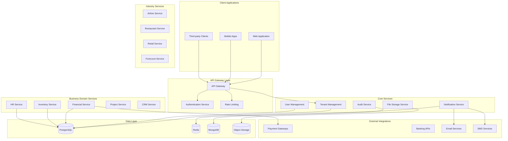

# System Architecture

## 🏗️ Overview

The ERP system is built on a modern, cloud-native architecture using microservices patterns, event-driven design, and multi-tenant capabilities. The system is designed to be highly scalable, maintainable, and extensible for various industry-specific requirements.

## 🎯 Architecture Principles

### 1. Multi-Tenancy
- **Tenant Isolation**: Complete data separation between organizations
- **Resource Sharing**: Efficient resource utilization across tenants
- **Customization**: Per-tenant configuration and feature enablement

### 2. Microservices Architecture
- **Domain-Driven Design**: Services organized around business domains
- **Loose Coupling**: Independent deployment and scaling
- **API-First**: RESTful APIs with GraphQL support

### 3. Event-Driven Design
- **Asynchronous Processing**: Non-blocking operations for better performance
- **Event Sourcing**: Complete audit trail and state reconstruction
- **Saga Pattern**: Distributed transaction management

## 🏢 High-Level Architecture



## 🗄️ Data Architecture

### Database Strategy

#### Primary Database: PostgreSQL
- **Transactional Data**: Financial records, inventory transactions, user data
- **ACID Compliance**: Ensuring data consistency for critical business operations
- **JSON Support**: Flexible schema for tenant-specific customizations
- **Partitioning**: Table partitioning by tenant for performance isolation

#### Cache Layer: Redis
- **Session Management**: User sessions and authentication tokens
- **Real-time Data**: Live inventory levels, notification queues
- **Rate Limiting**: API throttling and abuse prevention
- **Pub/Sub**: Real-time notifications and event broadcasting

#### Document Store: MongoDB
- **Audit Logs**: Complete transaction history and user activity
- **File Metadata**: Document management and version control
- **Analytics Data**: Aggregated reports and business intelligence
- **Configuration**: Tenant-specific settings and customizations

### Data Partitioning Strategy

```sql
-- Example: Partitioned table by tenant
CREATE TABLE sales_orders (
    id UUID DEFAULT gen_random_uuid(),
    tenant_id UUID NOT NULL,
    order_number VARCHAR(50) NOT NULL,
    customer_id UUID,
    order_date DATE NOT NULL,
    total_amount DECIMAL(15,2),
    created_at TIMESTAMPTZ DEFAULT NOW()
) PARTITION BY HASH (tenant_id);

-- Partition for tenant performance isolation
CREATE TABLE sales_orders_p1 PARTITION OF sales_orders
    FOR VALUES WITH (MODULUS 4, REMAINDER 0);
CREATE TABLE sales_orders_p2 PARTITION OF sales_orders
    FOR VALUES WITH (MODULUS 4, REMAINDER 1);
CREATE TABLE sales_orders_p3 PARTITION OF sales_orders
    FOR VALUES WITH (MODULUS 4, REMAINDER 2);
CREATE TABLE sales_orders_p4 PARTITION OF sales_orders
    FOR VALUES WITH (MODULUS 4, REMAINDER 3);
```

## 🔐 Security Architecture

### Authentication & Authorization

#### Multi-Factor Authentication
```yaml
authentication:
  methods:
    - password_based
    - oauth2_sso
    - saml_sso
    - api_keys
  
  mfa_options:
    - totp_authenticator
    - sms_otp
    - email_otp
    - hardware_tokens
  
  password_policy:
    min_length: 8
    require_uppercase: true
    require_lowercase: true
    require_numbers: true
    require_symbols: true
    max_age_days: 90
    history_count: 12
```

#### Role-Based Access Control (RBAC)
```json
{
  "roles": {
    "system_admin": {
      "description": "Full system access",
      "permissions": ["*"]
    },
    "tenant_admin": {
      "description": "Tenant-wide administration",
      "permissions": [
        "tenant:manage",
        "users:manage",
        "modules:configure"
      ]
    },
    "financial_manager": {
      "description": "Financial operations management",
      "permissions": [
        "accounts:read",
        "accounts:write",
        "transactions:approve",
        "reports:financial"
      ]
    },
    "employee": {
      "description": "Standard employee access",
      "permissions": [
        "profile:manage",
        "timesheets:submit",
        "expenses:submit"
      ]
    }
  }
}
```

### Data Protection

#### Encryption at Rest
- **Database Encryption**: PostgreSQL TDE (Transparent Data Encryption)
- **File Storage**: AES-256 encryption for all stored files
- **Backup Encryption**: Encrypted database backups with key rotation

#### Encryption in Transit
- **TLS 1.3**: All client-server communication
- **Certificate Pinning**: Mobile applications
- **API Security**: JWT tokens with short expiration

## 🚀 Deployment Architecture

### Container Strategy

#### Kubernetes Deployment
```yaml
apiVersion: apps/v1
kind: Deployment
metadata:
  name: financial-service
  namespace: erp-production
spec:
  replicas: 3
  selector:
    matchLabels:
      app: financial-service
  template:
    metadata:
      labels:
        app: financial-service
    spec:
      containers:
      - name: financial-service
        image: erp/financial-service:v1.2.3
        ports:
        - containerPort: 8080
        env:
        - name: DATABASE_URL
          valueFrom:
            secretKeyRef:
              name: db-credentials
              key: url
        resources:
          requests:
            memory: "256Mi"
            cpu: "200m"
          limits:
            memory: "512Mi"
            cpu: "500m"
        livenessProbe:
          httpGet:
            path: /health
            port: 8080
          initialDelaySeconds: 30
          periodSeconds: 10
```

### Environment Strategy

#### Development Environment
- **Local Development**: Docker Compose for complete stack
- **Feature Branches**: Automated deployment for testing
- **Mock Services**: External service simulation

#### Staging Environment
- **Production Mirror**: Identical configuration to production
- **Integration Testing**: End-to-end test automation
- **Performance Testing**: Load testing and benchmarking

#### Production Environment
- **High Availability**: Multi-region deployment
- **Auto-scaling**: Horizontal pod autoscaling
- **Disaster Recovery**: Automated backup and recovery

## 📊 Monitoring & Observability

### Application Monitoring

#### Metrics Collection
```yaml
monitoring:
  metrics:
    - name: http_requests_total
      type: counter
      labels: [method, status, endpoint]
    
    - name: database_connections_active
      type: gauge
      labels: [service, database]
    
    - name: tenant_operations_duration
      type: histogram
      labels: [tenant_id, operation]
    
    - name: business_metrics_revenue
      type: gauge
      labels: [tenant_id, period]
```

#### Logging Strategy
```json
{
  "log_format": "structured_json",
  "log_levels": {
    "development": "debug",
    "staging": "info",
    "production": "warn"
  },
  "log_retention": {
    "application_logs": "30_days",
    "audit_logs": "7_years",
    "security_logs": "1_year"
  },
  "sensitive_data_filtering": [
    "password",
    "credit_card",
    "ssn",
    "api_key"
  ]
}
```

### Distributed Tracing
- **Jaeger Integration**: Request tracing across microservices
- **Performance Monitoring**: Identify bottlenecks and optimization opportunities
- **Error Tracking**: Centralized error reporting with context

## 🔄 Event Architecture

### Event-Driven Communication

#### Event Categories
```yaml
events:
  domain_events:
    - invoice_created
    - payment_received
    - inventory_updated
    - employee_hired
    - project_completed
  
  system_events:
    - user_logged_in
    - backup_completed
    - maintenance_scheduled
    - security_alert
  
  integration_events:
    - external_payment_processed
    - bank_transaction_received
    - email_sent
    - sms_delivered
```

#### Event Schema
```json
{
  "event_id": "uuid",
  "event_type": "invoice_created",
  "tenant_id": "uuid",
  "aggregate_id": "uuid",
  "aggregate_type": "invoice",
  "event_version": 1,
  "timestamp": "2025-07-01T10:30:00Z",
  "user_id": "uuid",
  "correlation_id": "uuid",
  "data": {
    "invoice_number": "INV-2025-001",
    "customer_id": "uuid",
    "amount": 1500.00,
    "currency": "USD",
    "due_date": "2025-07-31"
  },
  "metadata": {
    "source": "financial_service",
    "version": "1.2.3",
    "ip_address": "192.168.1.100"
  }
}
```

### Message Queues

#### Queue Configuration
```yaml
message_queues:
  financial_events:
    type: persistent
    max_size: 10000
    retention: 7_days
    dlq_enabled: true
    
  notification_queue:
    type: temporary
    max_size: 1000
    retention: 1_hour
    priority_levels: 3
    
  integration_queue:
    type: persistent
    max_size: 5000
    retention: 3_days
    retry_policy:
      max_attempts: 5
      backoff_strategy: exponential
```

## 🔧 Technology Stack

### Backend Services
- **Language**: Go 1.21+ / Node.js 18+
- **Framework**: Gin/Echo (Go) or Express.js (Node)
- **Database**: PostgreSQL 14+, Redis 6+, MongoDB 5+
- **Message Queue**: Apache Kafka / RabbitMQ
- **Search**: Elasticsearch 8+

### Frontend Applications
- **Web**: React 18+ with TypeScript
- **Mobile**: React Native / Flutter
- **State Management**: Redux Toolkit / Zustand
- **UI Components**: Material-UI / Ant Design

### Infrastructure
- **Containerization**: Docker & Kubernetes
- **Cloud Provider**: AWS / Azure / GCP
- **CDN**: CloudFlare / AWS CloudFront
- **Monitoring**: Prometheus + Grafana
- **Logging**: ELK Stack (Elasticsearch, Logstash, Kibana)

### Development Tools
- **Version Control**: Git with GitFlow
- **CI/CD**: GitHub Actions / GitLab CI
- **Code Quality**: SonarQube, ESLint, Prettier
- **Testing**: Jest, Cypress, k6 (performance)
- **Documentation**: OpenAPI 3.0, Swagger UI

## 📈 Performance & Scalability

### Performance Targets
```yaml
performance_sla:
  api_response_time:
    p50: 200ms
    p95: 500ms
    p99: 1000ms
  
  database_queries:
    simple_queries: 50ms
    complex_reports: 5s
    batch_operations: 30s
  
  availability:
    uptime: 99.9%
    planned_maintenance: 4h/month
    recovery_time: 15min
```

### Scaling Strategy
- **Horizontal Scaling**: Auto-scaling based on CPU/memory usage
- **Database Sharding**: Tenant-based sharding for large deployments
- **Caching**: Multi-level caching (Redis, CDN, application-level)
- **Load Balancing**: Geographic and service-based load distribution

---

This architecture provides a solid foundation for a modern, scalable ERP system that can grow with business needs while maintaining security, performance, and reliability standards.
