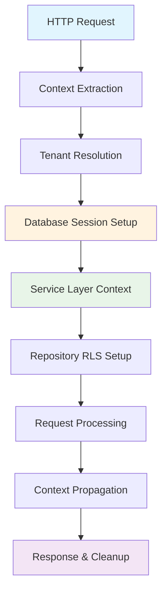

# Tenant Context Lifecycle Management

## 🎯 Overview

This document provides a comprehensive guide to tenant context lifecycle management in our ERP system. It covers how tenant context is established, propagated, managed, and cleaned up throughout the entire request lifecycle, ensuring complete data isolation and security in our multi-tenant architecture.

**Key Implementation Details:**
- Uses SQLC-generated functions for all database operations
- Implements Row Level Security (RLS) with `application_role` and `admin_role` policies
- Tenant queries are primarily done by UUID (Tenant ID)
- Database session context management through PostgreSQL `set_config()` function
- Service layer provides centralized tenant context management (`SetTenant`, `GetCurrentTenant`, `ResetTenant`)
- Repository layer handles database session context via store operations
- Clean separation between specific tenant access (`GetTenantByID`) and current context access (`GetCurrentTenant`)

## 🔧 Tenant Context Management Functions

### Service Layer API
The tenant service provides the primary interface that other system services should use for tenant context management:

```go
// Core tenant context management methods
SetTenant(ctx context.Context, tenantID uuid.UUID) error         // Set tenant context in database session
GetTenantByID(ctx context.Context, id uuid.UUID) (*Tenant, error) // Get specific tenant by ID
GetCurrentTenant(ctx context.Context) (*Tenant, error)           // Get current tenant from database session context
ResetTenant(ctx context.Context) error                          // Clear tenant context from database session

// Validation and utility methods
ValidateCurrentTenant(ctx context.Context) error                // Validate current tenant context exists
ValidateTenantAccess(ctx context.Context, tenantID uuid.UUID) error // Validate access to specific tenant
ResolveTenantID(ctx context.Context, subdomain string) (uuid.UUID, error) // Resolve subdomain to tenant ID
ExistsTenant(ctx context.Context, tenantID uuid.UUID) (bool, error) // Check if tenant exists
```

### Method Distinctions

#### `GetTenantByID` vs `GetCurrentTenant`
- **`GetTenantByID(ctx, id)`**: Retrieves a specific tenant by UUID. Used when you need to access a particular tenant's data (e.g., admin operations, cross-tenant references).
- **`GetCurrentTenant(ctx)`**: Retrieves the tenant currently set in the database session context. Used for normal operations within the current tenant's scope.

#### Database Session Context vs Go Context
- **Database Session Context**: Uses PostgreSQL session variables (`app.current_tenant_id`) that persist across the database connection and automatically enforce RLS policies.
- **Go Context**: Traditional context values that exist only in the application layer and don't automatically enforce database-level isolation.

Our implementation prioritizes **database session context** for security and automatic RLS enforcement.

## 🔄 Tenant Context Lifecycle Phases

### Phase Overview


### 1. **Context Extraction Phase**

#### 1.1 HTTP Request Interception
```go
// Middleware intercepts incoming requests
func TenantMiddleware(tenantService tenant.Service) gin.HandlerFunc {
    return func(c *gin.Context) {
        // Extract tenant identifier from various sources
        tenantID := extractTenantContext(c)
        
        if tenantID == "" {
            c.JSON(400, gin.H{"error": "Tenant context required"})
            c.Abort()
            return
        }
        
        // Continue to next phase...
    }
}
```

#### 1.2 Multiple Extraction Methods
```go
// Priority order for tenant identification (returns UUID)
func extractTenantContext(c *gin.Context) string {
    // Method 1: HTTP Header with Tenant UUID (highest priority)
    if tenantID := c.GetHeader("X-Tenant-ID"); tenantID != "" {
        // Validate UUID format
        if _, err := uuid.Parse(tenantID); err == nil {
            return tenantID
        }
    }
    
    // Method 2: JWT Token Claims
    if claims := getJWTClaims(c); claims != nil {
        return claims.TenantID.String()
    }
    
    // Method 3: Subdomain-based (resolve to UUID)
    if subdomain := extractSubdomain(c.Request.Host); subdomain != "" {
        // Resolve subdomain to tenant UUID via repository
        if tenantID := resolveTenantFromSubdomain(c.Request.Context(), subdomain); tenantID != uuid.Nil {
            return tenantID.String()
        }
    }
    
    // Method 4: Query Parameter (for testing only)
    if tenantID := c.Query("tenant_id"); tenantID != "" {
        if _, err := uuid.Parse(tenantID); err == nil {
            return tenantID
        }
    }
    
    return ""
}

// Subdomain extraction logic
func extractSubdomain(host string) string {
    // Handle localhost and dev environments
    if strings.Contains(host, "localhost") || strings.Contains(host, "127.0.0.1") {
        return "dev" // Default for local development
    }
    
    parts := strings.Split(host, ".")
    if len(parts) >= 3 { // subdomain.domain.tld
        return parts[0]
    }
    
    return ""
}
```

### 2. **Tenant Resolution Phase**

#### 2.1 Tenant Validation and Loading
```go
func (middleware *TenantMiddleware) resolveTenant(ctx context.Context, tenantID uuid.UUID) (*Tenant, error) {
    // Try cache first for performance
    cacheKey := fmt.Sprintf("tenant:id:%s", tenantID.String())
    var tenant Tenant
    if err := middleware.cache.Get(ctx, cacheKey, &tenant); err == nil {
        return &tenant, nil
    }
    
    // Cache miss - resolve from database using SQLC
    // First check if tenant exists for security
    exists, err := middleware.store.CheckTenantExists(ctx, tenantID)
    if err != nil {
        return nil, fmt.Errorf("failed to check tenant existence: %w", err)
    }
    if !exists {
        return nil, errors.ErrTenantNotFound
    }
    
    // Get tenant by ID using SQLC generated function
    sqlcTenant, err := middleware.store.GetTenantByID(ctx, tenantID)
    if err != nil {
        return nil, fmt.Errorf("tenant not found: %w", err)
    }
    
    // Convert SQLC model to domain model
    tenant, err := tenant.FromSQLCTenant(sqlcTenant)
    if err != nil {
        return nil, fmt.Errorf("failed to convert tenant model: %w", err)
    }
    
    // Validate tenant status
    if err := middleware.validateTenantStatus(tenant); err != nil {
        return nil, err
    }
    
    // Cache successful resolution
    middleware.cache.Set(ctx, cacheKey, tenant, 15*time.Minute)
    
    return tenant, nil
}

func (middleware *TenantMiddleware) validateTenantStatus(tenant *Tenant) error {
    switch tenant.Status {
    case "active":
        return nil
    case "suspended":
        return errors.New("tenant account is suspended")
    case "terminated":
        return errors.New("tenant account is terminated")
    case "trial_expired":
        return errors.New("tenant trial period has expired")
    default:
        return errors.New("invalid tenant status")
    }
}
```

#### 2.2 Tenant Hierarchy Resolution
```go
// Resolve complete tenant hierarchy for complex operations
func (middleware *TenantMiddleware) resolveTenantHierarchy(ctx context.Context, tenant *Tenant) (*TenantHierarchy, error) {
    hierarchy := &TenantHierarchy{
        Root:          tenant,
        Organizations: []Organization{},
        Entities:      []Entity{},
    }
    
    // Load tenant organizations
    orgs, err := middleware.organizationService.GetTenantOrganizations(ctx, tenant.ID)
    if err != nil {
        return nil, fmt.Errorf("failed to load tenant organizations: %w", err)
    }
    hierarchy.Organizations = orgs
    
    // Load entity hierarchy
    entities, err := middleware.entityService.GetTenantEntities(ctx, tenant.ID)
    if err != nil {
        return nil, fmt.Errorf("failed to load tenant entities: %w", err)
    }
    hierarchy.Entities = entities
    
    return hierarchy, nil
}
```

### 3. **Context Injection Phase**

#### 3.1 Request Context Enhancement
```go
func (middleware *TenantMiddleware) injectTenantContext(c *gin.Context, tenant *Tenant) {
    // Create enhanced context with tenant information
    ctx := c.Request.Context()
    
    // Primary tenant context
    ctx = context.WithValue(ctx, "tenant_id", tenant.ID)
    ctx = context.WithValue(ctx, "tenant", tenant)
    ctx = context.WithValue(ctx, "tenant_slug", tenant.Slug)
    
    // Additional context for convenience
    ctx = context.WithValue(ctx, "tenant_name", tenant.Name)
    ctx = context.WithValue(ctx, "tenant_status", tenant.Status)
    ctx = context.WithValue(ctx, "tenant_timezone", tenant.Timezone)
    ctx = context.WithValue(ctx, "tenant_currency", tenant.CurrencyCode)
    
    // Tenant hierarchy context (if loaded)
    if hierarchy := tenant.Hierarchy; hierarchy != nil {
        ctx = context.WithValue(ctx, "tenant_hierarchy", hierarchy)
    }
    
    // Tenant feature flags
    ctx = context.WithValue(ctx, "tenant_features", tenant.FeatureFlags)
    
    // Security context
    ctx = context.WithValue(ctx, "tenant_security_level", tenant.SecurityLevel)
    ctx = context.WithValue(ctx, "tenant_compliance_flags", tenant.ComplianceFlags)
    
    // Replace request context
    c.Request = c.Request.WithContext(ctx)
    
    // Also set in Gin context for convenience
    c.Set("tenant_id", tenant.ID)
    c.Set("tenant", tenant)
}
```

#### 3.2 Database Session Context Setup
```go
func (middleware *TenantMiddleware) prepareDatabaseContext(ctx context.Context, tenantID uuid.UUID) error {
    // Use tenant service layer for session context management
    if err := middleware.tenantService.SetTenant(ctx, tenantID); err != nil {
        return fmt.Errorf("failed to set tenant context: %w", err)
    }
    
    // Verify context was set correctly
    currentTenant, err := middleware.tenantService.GetCurrentTenant(ctx)
    if err != nil {
        return fmt.Errorf("failed to verify tenant context: %w", err)
    }
    
    if currentTenant.ID != tenantID {
        return fmt.Errorf("tenant context mismatch: expected %s, got %s", 
            tenantID.String(), currentTenant.ID.String())
    }
    
    // Log successful context setup for audit
    middleware.logger.Debug("Tenant context set successfully", 
        "tenant_id", tenantID.String(),
        "tenant_name", currentTenant.Name,
        "isolation_method", "database_session_rls",
    )
    
    return nil
}
```

### 4. **Service Layer Context Management**

#### 4.1 Tenant Service Interface
Our system provides a comprehensive service layer for tenant context management, ensuring other services use this centralized interface rather than directly accessing repositories.

```go
// Service interface methods for tenant context management
type Service interface {
    // Context operations for middleware and other services
    SetTenant(ctx context.Context, tenantID uuid.UUID) error
    GetTenantByID(ctx context.Context, id uuid.UUID) (*Tenant, error)       // Get specific tenant by ID
    GetCurrentTenant(ctx context.Context) (*Tenant, error)                   // Get current tenant from database session context
    ResetTenant(ctx context.Context) error
    
    // Validation and access control
    ValidateCurrentTenant(ctx context.Context) error
    ValidateTenantAccess(ctx context.Context, tenantID uuid.UUID) error
    
    // Resolution and utility methods
    ResolveTenantID(ctx context.Context, subdomain string) (uuid.UUID, error)
    ExistsTenant(ctx context.Context, tenantID uuid.UUID) (bool, error)
}
```

#### 4.2 Database Session Context Management
```go
// SetTenant sets the tenant context in the database session
func (s *service) SetTenant(ctx context.Context, tenantID uuid.UUID) error {
    ctx, span := s.tracer.StartSpan(ctx, "tenant.service.SetTenant")
    defer span.End()
    
    // Validate tenant exists before setting context
    exists, err := s.repo.Exists(ctx, tenantID)
    if err != nil {
        return fmt.Errorf("failed to validate tenant: %w", err)
    }
    if !exists {
        return errors.ErrTenantNotFound
    }
    
    // Set tenant context in database session via repository
    if err := s.repo.SetTenant(ctx, tenantID); err != nil {
        return fmt.Errorf("failed to set tenant context: %w", err)
    }
    
    // Clear cache for the tenant to ensure fresh data
    s.clearTenantCache(ctx, tenantID)
    
    return nil
}

// GetCurrentTenant gets the current tenant from database session context
func (s *service) GetCurrentTenant(ctx context.Context) (*Tenant, error) {
    ctx, span := s.tracer.StartSpan(ctx, "tenant.service.GetCurrentTenant")
    defer span.End()
    
    // Get current tenant from database session context
    tenant, err := s.repo.GetCurrentTenant(ctx)
    if err != nil {
        return nil, fmt.Errorf("failed to get current tenant: %w", err)
    }
    
    return tenant, nil
}

// ResetTenant clears the tenant context from database session
func (s *service) ResetTenant(ctx context.Context) error {
    ctx, span := s.tracer.StartSpan(ctx, "tenant.service.ResetTenant")
    defer span.End()
    
    return s.repo.ResetTenant(ctx)
}
```

### 5. **Repository Layer Context Implementation**

#### 5.1 Database Session Context Methods
The repository layer provides the low-level database session context management that the service layer uses.

```go
// Repository interface for database session context management
type Repository interface {
    // Database session context management
    SetTenant(ctx context.Context, tenantID uuid.UUID) error
    GetTenant(ctx context.Context) (uuid.UUID, error)              // Returns current tenant ID from session
    ResetTenant(ctx context.Context) error
    GetCurrentTenant(ctx context.Context) (*Tenant, error)         // Returns full tenant object from session context
    ValidateCurrentTenant(ctx context.Context) error
}

// SetTenant sets the tenant context in the database session
func (r *repository) SetTenant(ctx context.Context, tenantID uuid.UUID) error {
    // Use store's SetTenantContext method which executes:
    // SELECT set_config('app.current_tenant_id', $1, false)
    return r.store.SetTenantContext(ctx, tenantID)
}

// GetTenant gets the current tenant ID from database session context
func (r *repository) GetTenant(ctx context.Context) (uuid.UUID, error) {
    // Use SQLC-generated GetCurrentTenantID function
    tenantIDInterface, err := r.store.GetCurrentTenantID(ctx)
    if err != nil {
        return uuid.Nil, fmt.Errorf("failed to get current tenant ID: %w", err)
    }
    
    // Handle type conversion from interface{} to UUID
    return convertToUUID(tenantIDInterface)
}

// ResetTenant clears the tenant context from database session
func (r *repository) ResetTenant(ctx context.Context) error {
    // Reset tenant context by setting it to NULL
    _, err := r.store.GetPool().Exec(ctx, "SELECT set_config('app.current_tenant_id', NULL, false)")
    return err
}
```

#### 5.2 SQLC Integration and Store Layer
The store layer manages the actual PostgreSQL session variables and SQLC integration.

```go
// Store interface methods for tenant context
type Store interface {
    SetTenantContext(ctx context.Context, tenantID uuid.UUID) error
    WithTenant(ctx context.Context, tenantID uuid.UUID, fn func(context.Context, Store) error) error
    GetCurrentTenantID(ctx context.Context) (interface{}, error)    // SQLC-generated
    GetCurrentTenant(ctx context.Context) (Tenant, error)           // SQLC-generated
}

// SetTenantContext sets session-level tenant context
func (s *SQLStore) SetTenantContext(ctx context.Context, tenantID uuid.UUID) error {
    // Session-level (false) makes it persist across transactions
    _, err := s.connPool.Exec(ctx, "SELECT set_config('app.current_tenant_id', $1, false)", tenantID.String())
    return err
}
```

### 6. **Request Processing Phase**

#### 6.1 Context Propagation Through Layers
```go
// Handler Layer - Updated to use tenant service
func (h *UserHandler) CreateUser(c *gin.Context) {
    ctx := c.Request.Context()
    
    // Get current tenant from database session context via tenant service
    currentTenant, err := h.tenantService.GetCurrentTenant(ctx)
    if err != nil {
        c.JSON(500, gin.H{"error": "Failed to get current tenant context"})
        return
    }
    
    // Validate tenant permissions for operation
    if !currentTenant.HasPermission("user.create") {
        c.JSON(403, gin.H{"error": "Operation not permitted for tenant"})
        return
    }
    
    // Pass context to service layer - tenant context flows automatically
    user, err := h.userService.CreateUser(ctx, req)
    if err != nil {
        handleError(c, err)
        return
    }
    
    c.JSON(201, user)
}

// Service Layer - Using tenant service for context access
func (s *userService) CreateUser(ctx context.Context, req CreateUserRequest) (*User, error) {
    // Get current tenant from database session context
    currentTenant, err := s.tenantService.GetCurrentTenant(ctx)
    if err != nil {
        return nil, fmt.Errorf("failed to get current tenant: %w", err)
    }
    
    // Apply tenant-specific business rules
    if err := s.validateTenantUserLimits(ctx, currentTenant.ID); err != nil {
        return nil, err
    }
    
    // Create user with tenant context
    user := &User{
        ID:       uuid.New(),
        TenantID: currentTenant.ID,
        Name:     req.Name,
        Email:    req.Email,
        // ... other fields
    }
    
    // Pass to repository layer - RLS handles tenant isolation
    return s.userRepository.Create(ctx, user)
}

// Repository Layer - Database operations with tenant context using SQLC
func (r *userRepository) Create(ctx context.Context, user *User) (*User, error) {
    // Convert domain model to SQLC parameters
    params := db.CreateUserParams{
        ID:       user.ID,
        TenantID: user.TenantID,  // Still include tenant_id for explicit assignment
        Name:     user.Name,
        Email:    user.Email,
        // ... other fields
    }
    
    // Use SQLC generated function - RLS automatically enforces tenant isolation
    sqlcUser, err := r.store.CreateUser(ctx, params)
    if err != nil {
        return nil, fmt.Errorf("failed to create user: %w", err)
    }
    
    // Convert SQLC model back to domain model
    domainUser, err := r.convertFromSQLCUser(sqlcUser)
    if err != nil {
        return nil, fmt.Errorf("failed to convert user model: %w", err)
    }
    
    return domainUser, nil
}

// Example of querying with automatic tenant isolation
func (r *userRepository) GetByID(ctx context.Context, userID uuid.UUID) (*User, error) {
    // RLS policy automatically restricts this query to current tenant
    // No manual tenant_id filtering needed in application code
    sqlcUser, err := r.store.GetUserByID(ctx, userID)
    if err != nil {
        if err == sql.ErrNoRows {
            return nil, errors.ErrUserNotFound
        }
        return nil, fmt.Errorf("failed to get user: %w", err)
    }
    
    return r.convertFromSQLCUser(sqlcUser)
}
```

#### 6.2 Service Layer Integration Pattern
```go
// Example: How other services integrate with tenant service
func (s *inventoryService) CreateItem(ctx context.Context, req CreateItemRequest) (*Item, error) {
    // Validate current tenant has access
    if err := s.tenantService.ValidateCurrentTenant(ctx); err != nil {
        return nil, fmt.Errorf("invalid tenant context: %w", err)
    }
    
    // Get current tenant for business logic
    currentTenant, err := s.tenantService.GetCurrentTenant(ctx)
    if err != nil {
        return nil, fmt.Errorf("failed to get current tenant: %w", err)
    }
    
    // Apply tenant-specific validation
    if !currentTenant.HasFeature("inventory_management") {
        return nil, errors.New("inventory management not enabled for tenant")
    }
    
    // Repository operations automatically use RLS
    return s.itemRepository.Create(ctx, item)
}

// Example: Cross-tenant operations (admin functions)
func (s *adminService) SwitchTenantContext(ctx context.Context, targetTenantID uuid.UUID) error {
    // Verify admin permissions
    if err := s.validateAdminAccess(ctx); err != nil {
        return err
    }
    
    // Switch to target tenant context
    if err := s.tenantService.SetTenant(ctx, targetTenantID); err != nil {
        return fmt.Errorf("failed to switch tenant context: %w", err)
    }
    
    // Verify switch was successful
    currentTenant, err := s.tenantService.GetCurrentTenant(ctx)
    if err != nil {
        return fmt.Errorf("failed to verify tenant switch: %w", err)
    }
    
    if currentTenant.ID != targetTenantID {
        return errors.New("tenant context switch failed")
    }
    
    return nil
}
```

#### 6.3 Context Validation and Security Checks
```go
// Continuous context validation throughout request lifecycle
func ValidateTenantContext(ctx context.Context) error {
    // Check if tenant context exists
    tenantID := GetTenantIDFromContext(ctx)
    if tenantID == uuid.Nil {
        return errors.New("tenant context missing")
    }
    
    // Verify database context matches
    var dbTenantID uuid.UUID
    query := "SELECT current_setting('app.current_tenant_id')::uuid"
    
    db := database.GetConnection(ctx)
    if err := db.QueryRowContext(ctx, query).Scan(&dbTenantID); err != nil {
        return fmt.Errorf("failed to verify database tenant context: %w", err)
    }
    
    if tenantID != dbTenantID {
        return errors.New("tenant context mismatch between application and database")
    }
    
    return nil
}

// Security audit for sensitive operations
func (middleware *TenantMiddleware) auditTenantAccess(ctx context.Context, operation string) {
    tenant := GetTenantFromContext(ctx)
    if tenant == nil {
        return
    }
    
    auditLog := AuditLog{
        TenantID:    tenant.ID,
        Operation:   operation,
        Timestamp:   time.Now(),
        UserAgent:   getUserAgent(ctx),
        IPAddress:   getClientIP(ctx),
        SecurityLevel: tenant.SecurityLevel,
    }
    
    // Async audit logging
    go middleware.auditService.LogTenantAccess(context.Background(), auditLog)
}
```

### 5. **Transaction Management Phase**

#### 5.1 Tenant-Aware Transactions
```go
// Store already provides WithTenant method for tenant-aware transactions
func (s *userService) CreateUserWithProfile(ctx context.Context, req CreateUserRequest) error {
    tenantID := GetTenantIDFromContext(ctx)
    
    // Use store's built-in WithTenant method which automatically sets tenant context
    return s.store.WithTenant(ctx, tenantID, func(ctx context.Context, txStore Store) error {
        // Create user - tenant context is already set in transaction
        userParams := db.CreateUserParams{
            ID:       uuid.New(),
            TenantID: tenantID,  // Explicitly set for clarity
            Name:     req.Name,
            Email:    req.Email,
            // ... other fields
        }
        
        user, err := txStore.CreateUser(ctx, userParams)
        if err != nil {
            return fmt.Errorf("failed to create user: %w", err)
        }
        
        // Create profile (same tenant context automatically applied)
        profileParams := db.CreateUserProfileParams{
            UserID:   user.ID,
            TenantID: tenantID,
            // ... profile fields
        }
        
        if err := txStore.CreateUserProfile(ctx, profileParams); err != nil {
            return fmt.Errorf("failed to create user profile: %w", err)
        }
        
        // Create initial permissions
        permParams := db.CreateDefaultUserPermissionsParams{
            UserID:   user.ID,
            TenantID: tenantID,
        }
        
        return txStore.CreateDefaultUserPermissions(ctx, permParams)
    })
}

// Alternative: Using BeginTxWithTenant for manual transaction management
func (s *userService) CreateUserWithProfileManual(ctx context.Context, req CreateUserRequest) error {
    tenantID := GetTenantIDFromContext(ctx)
    
    // Begin transaction with tenant context already set
    tx, txStore, err := s.store.BeginTxWithTenant(ctx, tenantID)
    if err != nil {
        return fmt.Errorf("failed to begin transaction: %w", err)
    }
    defer tx.Rollback(ctx)
    
    // All operations within this transaction are automatically tenant-isolated
    user, err := txStore.CreateUser(ctx, userParams)
    if err != nil {
        return err
    }
    
    // ... other operations
    
    return tx.Commit(ctx)
}
```

#### 5.2 Cross-Tenant Operations (Administrative)
```go
// Special handling for system-level operations using admin_role
func (middleware *TenantMiddleware) handleCrossTenantOperation(c *gin.Context) {
    // Verify administrative privileges
    user := GetUserFromContext(c.Request.Context())
    if !user.IsSuperAdmin() {
        c.JSON(403, gin.H{"error": "Insufficient privileges for cross-tenant operation"})
        c.Abort()
        return
    }
    
    // Create system-level context
    ctx := context.WithValue(c.Request.Context(), "cross_tenant_mode", true)
    ctx = context.WithValue(ctx, "system_operation", true)
    ctx = context.WithValue(ctx, "database_role", "admin_role")
    
    // Enhanced audit logging for cross-tenant operations
    middleware.auditCrossTenantOperation(ctx, c.Request.URL.Path)
    
    c.Request = c.Request.WithContext(ctx)
    c.Next()
}

// Repository method for admin operations that bypass RLS
func (r *tenantRepository) AdminGetAllTenants(ctx context.Context) ([]*Tenant, error) {
    // This should be called with admin_role context
    // admin_role has policy: FOR ALL TO admin_role USING (true)
    // which bypasses tenant isolation
    
    sqlcTenants, err := r.store.GetAllTenantsAdmin(ctx) // Special admin query
    if err != nil {
        return nil, fmt.Errorf("failed to get all tenants (admin): %w", err)
    }
    
    var tenants []*Tenant
    for _, sqlcTenant := range sqlcTenants {
        tenant, err := FromSQLCTenant(sqlcTenant)
        if err != nil {
            return nil, fmt.Errorf("failed to convert tenant: %w", err)
        }
        tenants = append(tenants, tenant)
    }
    
    return tenants, nil
}

// Admin operations use different database role instead of disabling RLS
func (s *tenantService) AdminBulkUpdateTenantStatus(ctx context.Context, tenantIDs []uuid.UUID, status Status) error {
    // Verify admin context
    if !IsAdminContext(ctx) {
        return errors.ErrUnauthorized
    }
    
    // Use bulk operation which works with admin_role RLS policy
    params := db.BulkUpdateTenantStatusParams{
        Status: string(status),
        ID:     tenantIDs,
    }
    
    return s.store.BulkUpdateTenantStatus(ctx, params)
}
```

### 6. **Context Cleanup Phase**

#### 6.1 Request Completion Cleanup
```go
func (middleware *TenantMiddleware) cleanupTenantContext(c *gin.Context) {
    ctx := c.Request.Context()
    
    // Get database connection for cleanup
    if db := database.GetConnection(ctx); db != nil {
        // Reset session variables
        cleanupQueries := []string{
            "RESET app.current_tenant_id",
            "RESET app.tenant_context_set",
            "RESET app.request_timestamp",
            "RESET app.isolation_level",
        }
        
        for _, query := range cleanupQueries {
            if _, err := db.ExecContext(ctx, query); err != nil {
                middleware.logger.Warn("Failed to reset session variable", 
                    "query", query, "error", err)
            }
        }
        
        // Ensure RLS is re-enabled
        if _, err := db.ExecContext(ctx, "SET row_security = on"); err != nil {
            middleware.logger.Error("Critical: Failed to re-enable row security", 
                "error", err)
        }
    }
    
    // Clear any cached tenant data if needed
    if tenant := GetTenantFromContext(ctx); tenant != nil {
        middleware.cleanupTenantCache(ctx, tenant.ID)
    }
    
    // Final security audit
    middleware.auditRequestCompletion(ctx)
}

// Defer cleanup to ensure it always runs
func (middleware *TenantMiddleware) middlewareWithCleanup() gin.HandlerFunc {
    return func(c *gin.Context) {
        defer middleware.cleanupTenantContext(c)
        
        // Process request...
        c.Next()
    }
}
```

#### 6.2 Error Handling and Recovery
```go
func (middleware *TenantMiddleware) handleTenantContextError(c *gin.Context, err error) {
    // Log error with context
    middleware.logger.Error("Tenant context error", 
        "error", err,
        "host", c.Request.Host,
        "path", c.Request.URL.Path,
        "method", c.Request.Method,
    )
    
    // Determine error type and response
    switch {
    case errors.Is(err, ErrTenantNotFound):
        c.JSON(404, gin.H{
            "error": "Tenant not found",
            "code":  "TENANT_NOT_FOUND",
        })
    case errors.Is(err, ErrTenantSuspended):
        c.JSON(403, gin.H{
            "error": "Tenant account is suspended",
            "code":  "TENANT_SUSPENDED",
        })
    case errors.Is(err, ErrTenantInactive):
        c.JSON(403, gin.H{
            "error": "Tenant account is inactive",
            "code":  "TENANT_INACTIVE",
        })
    default:
        c.JSON(500, gin.H{
            "error": "Tenant context error",
            "code":  "TENANT_CONTEXT_ERROR",
        })
    }
    
    // Ensure cleanup even on error
    middleware.cleanupTenantContext(c)
    c.Abort()
}
```

## 🛡️ Security Considerations

### 1. **Tenant Isolation Verification**
```go
// Continuous verification of tenant isolation
func (middleware *TenantMiddleware) verifyTenantIsolation(ctx context.Context) error {
    // Verify RLS is enabled
    var rlsEnabled bool
    query := "SHOW row_security"
    
    db := database.GetConnection(ctx)
    if err := db.QueryRowContext(ctx, query).Scan(&rlsEnabled); err != nil {
        return fmt.Errorf("failed to check RLS status: %w", err)
    }
    
    if !rlsEnabled {
        return errors.New("row level security is disabled - security breach risk")
    }
    
    // Verify tenant context is set
    var tenantContext string
    query = "SELECT current_setting('app.current_tenant_id', true)"
    
    if err := db.QueryRowContext(ctx, query).Scan(&tenantContext); err != nil {
        return fmt.Errorf("failed to verify tenant context: %w", err)
    }
    
    if tenantContext == "" {
        return errors.New("tenant context not set in database session")
    }
    
    return nil
}
```

### 2. **Context Tampering Prevention**
```go
// Prevent context tampering through request manipulation
func (middleware *TenantMiddleware) validateContextIntegrity(c *gin.Context) error {
    // Check for conflicting tenant identifiers
    subdomainTenant := extractSubdomain(c.Request.Host)
    headerTenant := c.GetHeader("X-Tenant-ID")
    
    if subdomainTenant != "" && headerTenant != "" && subdomainTenant != headerTenant {
        return errors.New("conflicting tenant identifiers detected")
    }
    
    // Validate JWT claims match extracted tenant
    if claims := getJWTClaims(c); claims != nil {
        if claims.TenantID != subdomainTenant {
            return errors.New("JWT tenant claim does not match request context")
        }
    }
    
    return nil
}
```

## 📊 Performance Optimization

### 1. **Context Caching Strategy**
```go
// Intelligent caching to reduce tenant resolution overhead
type TenantContextCache struct {
    primary   cache.Cache          // Redis for distributed caching
    local     *sync.Map           // In-memory for ultra-fast access
    ttl       time.Duration
    localTTL  time.Duration
}

func (tcc *TenantContextCache) GetTenant(identifier string) (*Tenant, error) {
    // L1: Check local cache first (sub-millisecond)
    if cached, found := tcc.local.Load(identifier); found {
        if entry, ok := cached.(*cacheEntry); ok && !entry.IsExpired() {
            return entry.Tenant, nil
        }
        tcc.local.Delete(identifier) // Remove expired entry
    }
    
    // L2: Check Redis cache (few milliseconds)
    var tenant Tenant
    cacheKey := fmt.Sprintf("tenant:id:%s", identifier)
    if err := tcc.primary.Get(context.Background(), cacheKey, &tenant); err == nil {
        // Store in local cache for next request
        tcc.local.Store(identifier, &cacheEntry{
            Tenant:    &tenant,
            ExpiresAt: time.Now().Add(tcc.localTTL),
        })
        return &tenant, nil
    }
    
    // L3: Database lookup (database latency)
    return nil, errors.New("cache miss - database lookup required")
}
```

### 2. **Connection Pool Optimization**
```go
// Tenant-aware connection pooling for better performance
func (middleware *TenantMiddleware) optimizeConnectionPool(tenantID uuid.UUID) {
    // Get tenant-specific connection pool settings
    poolConfig := middleware.getPoolConfig(tenantID)
    
    // Adjust pool size based on tenant usage patterns
    if stats := middleware.getTenantUsageStats(tenantID); stats != nil {
        if stats.HighVolumeOperations {
            poolConfig.MaxConnections *= 2
        }
        if stats.LongRunningQueries {
            poolConfig.IdleTimeout = time.Hour
        }
    }
    
    // Apply optimizations
    middleware.connectionManager.UpdatePoolConfig(tenantID, poolConfig)
}
```

## 🔧 Development and Testing

### 1. **Context Testing Utilities**
```go
// Testing utilities for tenant context
func WithTestTenantContext(ctx context.Context, tenantID uuid.UUID) context.Context {
    tenant := &Tenant{
        ID:     tenantID,
        Name:   "Test Tenant",
        Slug:   "test-tenant",
        Status: "active",
    }
    
    ctx = context.WithValue(ctx, "tenant_id", tenantID)
    ctx = context.WithValue(ctx, "tenant", tenant)
    ctx = context.WithValue(ctx, "test_mode", true)
    
    return ctx
}

// Test helper for multiple tenant scenarios
func TestWithMultipleTenants(t *testing.T, testFn func(t *testing.T, tenantID uuid.UUID)) {
    tenantIDs := []uuid.UUID{
        uuid.MustParse("123e4567-e89b-12d3-a456-426614174001"),
        uuid.MustParse("123e4567-e89b-12d3-a456-426614174002"),
        uuid.MustParse("123e4567-e89b-12d3-a456-426614174003"),
    }
    
    for i, tenantID := range tenantIDs {
        t.Run(fmt.Sprintf("Tenant%d", i+1), func(t *testing.T) {
            testFn(t, tenantID)
        })
    }
}
```

### 2. **Local Development Configuration**
```go
// Development-friendly tenant context for local testing
func (middleware *TenantMiddleware) developmentMode(c *gin.Context) {
    if !middleware.config.IsDevelopment() {
        return
    }
    
    // Allow default tenant for localhost
    if c.Request.Host == "localhost" || strings.Contains(c.Request.Host, "127.0.0.1") {
        defaultTenant := &Tenant{
            ID:     uuid.MustParse("00000000-0000-0000-0000-000000000001"),
            Name:   "Development Tenant",
            Slug:   "dev",
            Status: "active",
        }
        
        middleware.injectTenantContext(c, defaultTenant)
        return
    }
    
    // Continue with normal flow for other hosts
}
```

## 📋 Monitoring and Observability

### 1. **Context Lifecycle Metrics**
```yaml
# Tenant context metrics to monitor
tenant_context_metrics:
  extraction_duration: 
    description: "Time to extract tenant from request"
    type: histogram
    labels: [method, success]
    
  resolution_duration:
    description: "Time to resolve tenant from identifier"
    type: histogram
    labels: [cache_hit, tenant_status]
    
  context_injection_duration:
    description: "Time to inject tenant context"
    type: histogram
    
  database_context_setup_duration:
    description: "Time to setup database tenant context"
    type: histogram
    
  tenant_cache_hit_rate:
    description: "Cache hit rate for tenant resolution"
    type: gauge
    labels: [cache_level]
    
  active_tenant_contexts:
    description: "Number of active tenant contexts"
    type: gauge
    
  context_errors:
    description: "Count of tenant context errors"
    type: counter
    labels: [error_type, tenant_id]
```

### 2. **Distributed Tracing Integration**
```go
// Tenant context tracing for observability
func (middleware *TenantMiddleware) addTracing(ctx context.Context, tenantID uuid.UUID) context.Context {
    span := trace.SpanFromContext(ctx)
    if span != nil {
        span.SetAttributes(
            attribute.String("tenant.id", tenantID.String()),
            attribute.String("tenant.isolation.method", "rls"),
            attribute.Bool("tenant.context.active", true),
        )
    }
    
    // Add tenant ID to trace metadata for filtering
    ctx = trace.WithSpanContext(ctx, trace.SpanContextFromContext(ctx))
    
    return ctx
}
```

## 🗄️ Database Integration Patterns

### 1. **SQLC Integration**

Our implementation uses SQLC-generated functions for all database operations, ensuring type safety and performance:

```go
// Example SQLC queries for tenant operations
// -- name: GetTenantByID :one
// SELECT * FROM tenants WHERE id = $1 AND deleted_at IS NULL;

// -- name: CheckTenantExists :one  
// SELECT EXISTS(SELECT 1 FROM tenants WHERE id = $1 AND deleted_at IS NULL);

// -- name: BulkUpdateTenantStatus :exec
// UPDATE tenants SET status = $1, updated_at = NOW() 
// WHERE id = ANY($2::UUID[]) AND deleted_at IS NULL;

// Generated SQLC functions automatically available:
func (r *tenantRepository) GetByID(ctx context.Context, id uuid.UUID) (*Tenant, error) {
    sqlcTenant, err := r.store.GetTenantByID(ctx, id)
    if err != nil {
        return nil, r.handleDatabaseError(err, "get tenant by ID")
    }
    return FromSQLCTenant(sqlcTenant)
}
```

### 2. **Row Level Security (RLS) Implementation**

Our RLS policies use two database roles for different access levels:

```sql
-- Application role - restricted to current tenant
CREATE POLICY tenant_isolation_policy ON tenants
    FOR ALL TO application_role
    USING (
        current_tenant_id() IS NOT NULL 
        AND tenant_id = current_tenant_id()
    )
    WITH CHECK (
        current_tenant_id() IS NOT NULL 
        AND tenant_id = current_tenant_id()
    );

-- Admin role - full access across all tenants  
CREATE POLICY admin_full_access_policy ON tenants
    FOR ALL TO admin_role
    USING (true);
```

### 3. **Tenant Context Functions**

Database functions manage tenant context at the session level:

```sql
-- Set tenant context for RLS
CREATE OR REPLACE FUNCTION set_tenant_context(tenant_id UUID)
RETURNS VOID AS $$
BEGIN
    -- Validate tenant exists and is active
    IF NOT EXISTS (
        SELECT 1 FROM tenants
        WHERE id = tenant_id AND status = 'active' AND deleted_at IS NULL
    ) THEN
        RAISE EXCEPTION 'Invalid or inactive tenant: %', tenant_id;
    END IF;

    -- Set session variable for tenant context
    PERFORM set_config('app.current_tenant_id', tenant_id::text, true);
END;
$$ LANGUAGE plpgsql SECURITY DEFINER;

-- Get current tenant ID from session
CREATE OR REPLACE FUNCTION current_tenant_id() RETURNS UUID AS $$
BEGIN
    RETURN COALESCE(nullif(current_setting('app.current_tenant_id', true), ''), NULL)::UUID;
EXCEPTION
    WHEN OTHERS THEN
        RETURN NULL;
END;
$$ LANGUAGE plpgsql;
```

### 4. **Store-Level Context Management**

The store provides built-in tenant context management:

```go
// Store interface with tenant-aware methods
type Store interface {
    Querier
    // Tenant context methods
    SetTenantContext(ctx context.Context, tenantID uuid.UUID) error
    WithTenant(ctx context.Context, tenantID uuid.UUID, fn func(context.Context, Store) error) error
    BeginTxWithTenant(ctx context.Context, tenantID uuid.UUID) (pgx.Tx, Store, error)
    WithTx(ctx context.Context, fn func(context.Context, Store) error) error
    // Connection management
    Close()
    GetPool() *pgxpool.Pool
}

// Implementation automatically handles tenant context in transactions
func (s *SQLStore) WithTenant(ctx context.Context, tenantID uuid.UUID, fn func(context.Context, Store) error) error {
    tx, err := s.connPool.Begin(ctx)
    if err != nil {
        return err
    }
    defer tx.Rollback(ctx)

    // Set tenant context using database function
    _, err = tx.Exec(ctx, "SELECT set_config('app.current_tenant_id', $1, true)", tenantID.String())
    if err != nil {
        return err
    }

    // Create store instance with transaction
    txStore := &SQLStore{
        connPool: s.connPool,
        Queries:  s.Queries.WithTx(tx),
    }

    // Execute function with tenant context
    if err := fn(ctx, txStore); err != nil {
        return err
    }

    return tx.Commit(ctx)
}
```

### 5. **Repository Pattern with RLS**

Repositories use SQLC functions with automatic tenant isolation:

```go
// Repository implementation using SQLC and RLS
type repository struct {
    store   db.Store
    tracer  tracing.TracingService  // Optional tracing
}

func (r *repository) Create(ctx context.Context, tenant *Tenant) error {
    // Convert domain model to SQLC parameters
    params := db.CreateTenantParams{
        ID:           tenant.ID,
        Name:         tenant.Name,
        Slug:         tenant.Slug,
        Email:        tenant.Email,
        Subdomain:    tenant.Subdomain,
        Status:       string(tenant.Status),
        // ... other fields
    }

    // SQLC function with automatic RLS enforcement
    _, err := r.store.CreateTenant(ctx, params)
    return r.handleDatabaseError(err, "create tenant")
}

// Queries automatically respect tenant isolation
func (r *repository) GetByID(ctx context.Context, id uuid.UUID) (*Tenant, error) {
    // RLS policy automatically filters by current tenant
    sqlcTenant, err := r.store.GetTenantByID(ctx, id)
    if err != nil {
        return nil, r.handleDatabaseError(err, "get tenant")
    }
    return FromSQLCTenant(sqlcTenant)
}
```

### 6. **Available SQLC Functions**

Key tenant management functions generated by SQLC:

```go
// Core CRUD operations
GetTenantByID(ctx context.Context, id uuid.UUID) (*Tenant, error)
CreateTenant(ctx context.Context, arg CreateTenantParams) (*Tenant, error)  
UpdateTenant(ctx context.Context, arg UpdateTenantParams) (*Tenant, error)
BulkSoftDeleteTenants(ctx context.Context, tenantIds []uuid.UUID) error

// Existence and validation checks
CheckTenantExists(ctx context.Context, id uuid.UUID) (bool, error)
CheckSubdomainExists(ctx context.Context, subdomain *string) (bool, error)
CheckTenantNameExists(ctx context.Context, name string) (bool, error)
CheckCurrentTenantExists(ctx context.Context) (bool, error)

// Bulk operations
BulkUpdateTenantStatus(ctx context.Context, arg BulkUpdateTenantStatusParams) error

// Counting and statistics
CountTenants(ctx context.Context) (int64, error)
CountFilteredTenants(ctx context.Context, arg CountFilteredTenantsParams) (int64, error)

// Admin operations (bypass RLS with admin_role)
GetAllTenantsAdmin(ctx context.Context) ([]*Tenant, error)  // Custom admin query
```

## 🚀 Best Practices and Guidelines

### 1. **Do's and Don'ts**

#### ✅ **Do's:**
- Always use SQLC-generated functions for database operations
- Rely on Row Level Security (RLS) for automatic tenant isolation
- Use tenant UUID for all tenant identification (not subdomains/slugs)
- Leverage store's WithTenant method for transactions
- Cache tenant resolution results for performance
- Use application_role and admin_role appropriately
- Propagate context through all application layers
- Implement comprehensive audit logging
- Test tenant isolation thoroughly with both roles
- Monitor context lifecycle metrics

#### ❌ **Don'ts:**
- Don't manually add tenant_id filters in WHERE clauses (RLS handles this)
- Don't bypass RLS by disabling row_security (use admin_role instead)
- Don't mix domain models with SQLC models in business logic
- Don't cache sensitive tenant information insecurely
- Don't forget to convert between SQLC and domain models
- Don't ignore tenant context errors
- Don't use subdomain/slug as primary tenant identifier (use UUID)
- Don't manually manage transactions when store methods are available

### 2. **Implementation Checklist**

#### Database Layer
- [ ] SQLC queries are generated and up-to-date
- [ ] RLS policies are enabled with application_role and admin_role
- [ ] Tenant context functions (set_tenant_context, current_tenant_id) are available
- [ ] Database migrations include proper RLS setup
- [ ] All tables have appropriate tenant_id columns and policies

#### Repository Layer  
- [ ] Repository uses SQLC-generated functions exclusively
- [ ] Proper conversion between SQLC and domain models
- [ ] Error handling converts database errors to domain errors
- [ ] Repository interface focuses on tenant UUID-based operations
- [ ] No manual tenant_id filtering in queries (RLS handles it)

#### Service Layer
- [ ] Services use store's WithTenant method for transactions
- [ ] Tenant context validation at service boundaries
- [ ] Proper tenant status checking before operations
- [ ] Business logic operates on domain models only
- [ ] Caching strategy optimizes tenant resolution

#### API Layer
- [ ] Middleware properly extracts tenant UUID from requests
- [ ] Tenant resolution includes status validation  
- [ ] Context propagation works through all layers
- [ ] Error handling includes proper cleanup
- [ ] Admin endpoints use appropriate role context

#### Security & Monitoring
- [ ] Security audit trails are implemented
- [ ] Context lifecycle metrics are monitored
- [ ] Testing covers multi-tenant scenarios with both roles
- [ ] No tenant data leakage between tenants verified

---

This comprehensive tenant context lifecycle management ensures complete data isolation, optimal performance, and robust security throughout the entire request processing pipeline in our multi-tenant ERP system.