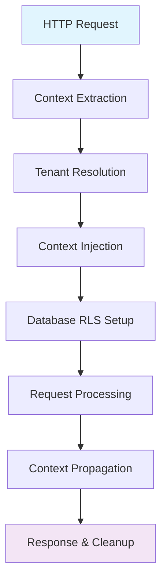

# Tenant Context Lifecycle Management

## 🎯 Overview

This document provides a comprehensive guide to tenant context lifecycle management in our ERP system. It covers how tenant context is established, propagated, managed, and cleaned up throughout the entire request lifecycle, ensuring complete data isolation and security in our multi-tenant architecture.

## 🔄 Tenant Context Lifecycle Phases

### Phase Overview


### 1. **Context Extraction Phase**

#### 1.1 HTTP Request Interception
```go
// Middleware intercepts incoming requests
func TenantMiddleware(tenantService tenant.Service) gin.HandlerFunc {
    return func(c *gin.Context) {
        // Extract tenant identifier from various sources
        tenantID := extractTenantContext(c)
        
        if tenantID == "" {
            c.JSON(400, gin.H{"error": "Tenant context required"})
            c.Abort()
            return
        }
        
        // Continue to next phase...
    }
}
```

#### 1.2 Multiple Extraction Methods
```go
// Priority order for tenant identification
func extractTenantContext(c *gin.Context) string {
    // Method 1: Subdomain-based (highest priority)
    if subdomain := extractSubdomain(c.Request.Host); subdomain != "" {
        return subdomain
    }
    
    // Method 2: HTTP Header
    if tenantID := c.GetHeader("X-Tenant-ID"); tenantID != "" {
        return tenantID
    }
    
    // Method 3: Query Parameter (for testing)
    if tenantID := c.Query("tenant_id"); tenantID != "" {
        return tenantID
    }
    
    // Method 4: JWT Token Claims
    if claims := getJWTClaims(c); claims != nil {
        return claims.TenantID
    }
    
    return ""
}

// Subdomain extraction logic
func extractSubdomain(host string) string {
    // Handle localhost and dev environments
    if strings.Contains(host, "localhost") || strings.Contains(host, "127.0.0.1") {
        return "dev" // Default for local development
    }
    
    parts := strings.Split(host, ".")
    if len(parts) >= 3 { // subdomain.domain.tld
        return parts[0]
    }
    
    return ""
}
```

### 2. **Tenant Resolution Phase**

#### 2.1 Tenant Validation and Loading
```go
func (middleware *TenantMiddleware) resolveTenant(ctx context.Context, identifier string) (*Tenant, error) {
    // Try cache first for performance
    cacheKey := fmt.Sprintf("tenant:identifier:%s", identifier)
    var tenant Tenant
    if err := middleware.cache.Get(ctx, cacheKey, &tenant); err == nil {
        return &tenant, nil
    }
    
    // Cache miss - resolve from database
    tenant, err := middleware.tenantService.GetTenantByIdentifier(ctx, identifier)
    if err != nil {
        return nil, fmt.Errorf("tenant not found: %w", err)
    }
    
    // Validate tenant status
    if err := middleware.validateTenantStatus(&tenant); err != nil {
        return nil, err
    }
    
    // Cache successful resolution
    middleware.cache.Set(ctx, cacheKey, &tenant, 15*time.Minute)
    
    return &tenant, nil
}

func (middleware *TenantMiddleware) validateTenantStatus(tenant *Tenant) error {
    switch tenant.Status {
    case "active":
        return nil
    case "suspended":
        return errors.New("tenant account is suspended")
    case "terminated":
        return errors.New("tenant account is terminated")
    case "trial_expired":
        return errors.New("tenant trial period has expired")
    default:
        return errors.New("invalid tenant status")
    }
}
```

#### 2.2 Tenant Hierarchy Resolution
```go
// Resolve complete tenant hierarchy for complex operations
func (middleware *TenantMiddleware) resolveTenantHierarchy(ctx context.Context, tenant *Tenant) (*TenantHierarchy, error) {
    hierarchy := &TenantHierarchy{
        Root:          tenant,
        Organizations: []Organization{},
        Entities:      []Entity{},
    }
    
    // Load tenant organizations
    orgs, err := middleware.organizationService.GetTenantOrganizations(ctx, tenant.ID)
    if err != nil {
        return nil, fmt.Errorf("failed to load tenant organizations: %w", err)
    }
    hierarchy.Organizations = orgs
    
    // Load entity hierarchy
    entities, err := middleware.entityService.GetTenantEntities(ctx, tenant.ID)
    if err != nil {
        return nil, fmt.Errorf("failed to load tenant entities: %w", err)
    }
    hierarchy.Entities = entities
    
    return hierarchy, nil
}
```

### 3. **Context Injection Phase**

#### 3.1 Request Context Enhancement
```go
func (middleware *TenantMiddleware) injectTenantContext(c *gin.Context, tenant *Tenant) {
    // Create enhanced context with tenant information
    ctx := c.Request.Context()
    
    // Primary tenant context
    ctx = context.WithValue(ctx, "tenant_id", tenant.ID)
    ctx = context.WithValue(ctx, "tenant", tenant)
    ctx = context.WithValue(ctx, "tenant_slug", tenant.Slug)
    
    // Additional context for convenience
    ctx = context.WithValue(ctx, "tenant_name", tenant.Name)
    ctx = context.WithValue(ctx, "tenant_status", tenant.Status)
    ctx = context.WithValue(ctx, "tenant_timezone", tenant.Timezone)
    ctx = context.WithValue(ctx, "tenant_currency", tenant.CurrencyCode)
    
    // Tenant hierarchy context (if loaded)
    if hierarchy := tenant.Hierarchy; hierarchy != nil {
        ctx = context.WithValue(ctx, "tenant_hierarchy", hierarchy)
    }
    
    // Tenant feature flags
    ctx = context.WithValue(ctx, "tenant_features", tenant.FeatureFlags)
    
    // Security context
    ctx = context.WithValue(ctx, "tenant_security_level", tenant.SecurityLevel)
    ctx = context.WithValue(ctx, "tenant_compliance_flags", tenant.ComplianceFlags)
    
    // Replace request context
    c.Request = c.Request.WithContext(ctx)
    
    // Also set in Gin context for convenience
    c.Set("tenant_id", tenant.ID)
    c.Set("tenant", tenant)
}
```

#### 3.2 Database Context Preparation
```go
func (middleware *TenantMiddleware) prepareDatabaseContext(ctx context.Context, tenantID uuid.UUID) error {
    // Get database connection
    db := database.GetConnection(ctx)
    
    // Set tenant context for Row Level Security
    query := "SELECT set_tenant_context($1)"
    if _, err := db.ExecContext(ctx, query, tenantID); err != nil {
        return fmt.Errorf("failed to set tenant context: %w", err)
    }
    
    // Set additional session variables for audit logging
    sessionVars := map[string]interface{}{
        "app.current_tenant_id":   tenantID.String(),
        "app.tenant_context_set":  true,
        "app.request_timestamp":   time.Now(),
        "app.isolation_level":     "tenant_strict",
    }
    
    for key, value := range sessionVars {
        query := fmt.Sprintf("SET %s = $1", key)
        if _, err := db.ExecContext(ctx, query, value); err != nil {
            return fmt.Errorf("failed to set session variable %s: %w", key, err)
        }
    }
    
    return nil
}
```

### 4. **Request Processing Phase**

#### 4.1 Context Propagation Through Layers
```go
// Handler Layer - Context usage example
func (h *UserHandler) CreateUser(c *gin.Context) {
    ctx := c.Request.Context()
    
    // Extract tenant context
    tenant := GetTenantFromContext(ctx)
    if tenant == nil {
        c.JSON(500, gin.H{"error": "Tenant context not found"})
        return
    }
    
    // Validate tenant permissions for operation
    if !tenant.HasPermission("user.create") {
        c.JSON(403, gin.H{"error": "Operation not permitted for tenant"})
        return
    }
    
    // Pass context to service layer
    user, err := h.userService.CreateUser(ctx, req)
    if err != nil {
        handleError(c, err)
        return
    }
    
    c.JSON(201, user)
}

// Service Layer - Context propagation
func (s *userService) CreateUser(ctx context.Context, req CreateUserRequest) (*User, error) {
    // Tenant context is automatically available
    tenantID := GetTenantIDFromContext(ctx)
    
    // Apply tenant-specific business rules
    if err := s.validateTenantUserLimits(ctx, tenantID); err != nil {
        return nil, err
    }
    
    // Create user with tenant context
    user := &User{
        ID:       uuid.New(),
        TenantID: tenantID,
        Name:     req.Name,
        Email:    req.Email,
        // ... other fields
    }
    
    // Pass to repository layer
    return s.userRepository.Create(ctx, user)
}

// Repository Layer - Database operations with tenant context
func (r *userRepository) Create(ctx context.Context, user *User) (*User, error) {
    // Tenant context is automatically enforced by RLS
    // No need to manually add tenant_id to WHERE clauses
    
    query := `
        INSERT INTO users (id, tenant_id, name, email, created_at)
        VALUES ($1, $2, $3, $4, $5)
        RETURNING *
    `
    
    var createdUser User
    err := r.db.QueryRowContext(ctx, query,
        user.ID,
        user.TenantID,
        user.Name,
        user.Email,
        time.Now(),
    ).Scan(
        &createdUser.ID,
        &createdUser.TenantID,
        &createdUser.Name,
        &createdUser.Email,
        &createdUser.CreatedAt,
    )
    
    if err != nil {
        return nil, fmt.Errorf("failed to create user: %w", err)
    }
    
    return &createdUser, nil
}
```

#### 4.2 Context Validation and Security Checks
```go
// Continuous context validation throughout request lifecycle
func ValidateTenantContext(ctx context.Context) error {
    // Check if tenant context exists
    tenantID := GetTenantIDFromContext(ctx)
    if tenantID == uuid.Nil {
        return errors.New("tenant context missing")
    }
    
    // Verify database context matches
    var dbTenantID uuid.UUID
    query := "SELECT current_setting('app.current_tenant_id')::uuid"
    
    db := database.GetConnection(ctx)
    if err := db.QueryRowContext(ctx, query).Scan(&dbTenantID); err != nil {
        return fmt.Errorf("failed to verify database tenant context: %w", err)
    }
    
    if tenantID != dbTenantID {
        return errors.New("tenant context mismatch between application and database")
    }
    
    return nil
}

// Security audit for sensitive operations
func (middleware *TenantMiddleware) auditTenantAccess(ctx context.Context, operation string) {
    tenant := GetTenantFromContext(ctx)
    if tenant == nil {
        return
    }
    
    auditLog := AuditLog{
        TenantID:    tenant.ID,
        Operation:   operation,
        Timestamp:   time.Now(),
        UserAgent:   getUserAgent(ctx),
        IPAddress:   getClientIP(ctx),
        SecurityLevel: tenant.SecurityLevel,
    }
    
    // Async audit logging
    go middleware.auditService.LogTenantAccess(context.Background(), auditLog)
}
```

### 5. **Transaction Management Phase**

#### 5.1 Tenant-Aware Transactions
```go
// Transaction wrapper that preserves tenant context
func (store *Store) WithTenant(ctx context.Context, tenantID uuid.UUID, fn func(context.Context, Store) error) error {
    return store.WithTx(ctx, func(ctx context.Context, tx Store) error {
        // Set tenant context in transaction
        if err := tx.SetTenantContext(ctx, tenantID); err != nil {
            return fmt.Errorf("failed to set tenant context in transaction: %w", err)
        }
        
        // Execute function with tenant-aware transaction
        return fn(ctx, tx)
    })
}

// Example usage in service layer
func (s *userService) CreateUserWithProfile(ctx context.Context, req CreateUserRequest) error {
    tenantID := GetTenantIDFromContext(ctx)
    
    return s.store.WithTenant(ctx, tenantID, func(ctx context.Context, tx Store) error {
        // Create user
        user, err := tx.CreateUser(ctx, req.User)
        if err != nil {
            return err
        }
        
        // Create profile (same tenant context)
        profile := req.Profile
        profile.UserID = user.ID
        
        if err := tx.CreateUserProfile(ctx, profile); err != nil {
            return err
        }
        
        // Create initial permissions
        return tx.CreateDefaultUserPermissions(ctx, user.ID)
    })
}
```

#### 5.2 Cross-Tenant Operations (Administrative)
```go
// Special handling for system-level operations that may cross tenant boundaries
func (middleware *TenantMiddleware) handleCrossTenantOperation(c *gin.Context) {
    // Verify administrative privileges
    user := GetUserFromContext(c.Request.Context())
    if !user.IsSuperAdmin() {
        c.JSON(403, gin.H{"error": "Insufficient privileges for cross-tenant operation"})
        c.Abort()
        return
    }
    
    // Create system-level context
    ctx := context.WithValue(c.Request.Context(), "cross_tenant_mode", true)
    ctx = context.WithValue(ctx, "system_operation", true)
    
    // Disable tenant isolation for this request
    db := database.GetConnection(ctx)
    if _, err := db.ExecContext(ctx, "SET row_security = off"); err != nil {
        c.JSON(500, gin.H{"error": "Failed to configure cross-tenant mode"})
        c.Abort()
        return
    }
    
    // Enhanced audit logging for cross-tenant operations
    middleware.auditCrossTenantOperation(ctx, c.Request.URL.Path)
    
    c.Request = c.Request.WithContext(ctx)
    c.Next()
    
    // Re-enable tenant isolation after request
    if _, err := db.ExecContext(ctx, "SET row_security = on"); err != nil {
        // Log error but don't fail the response
        middleware.logger.Error("Failed to re-enable row security", "error", err)
    }
}
```

### 6. **Context Cleanup Phase**

#### 6.1 Request Completion Cleanup
```go
func (middleware *TenantMiddleware) cleanupTenantContext(c *gin.Context) {
    ctx := c.Request.Context()
    
    // Get database connection for cleanup
    if db := database.GetConnection(ctx); db != nil {
        // Reset session variables
        cleanupQueries := []string{
            "RESET app.current_tenant_id",
            "RESET app.tenant_context_set",
            "RESET app.request_timestamp",
            "RESET app.isolation_level",
        }
        
        for _, query := range cleanupQueries {
            if _, err := db.ExecContext(ctx, query); err != nil {
                middleware.logger.Warn("Failed to reset session variable", 
                    "query", query, "error", err)
            }
        }
        
        // Ensure RLS is re-enabled
        if _, err := db.ExecContext(ctx, "SET row_security = on"); err != nil {
            middleware.logger.Error("Critical: Failed to re-enable row security", 
                "error", err)
        }
    }
    
    // Clear any cached tenant data if needed
    if tenant := GetTenantFromContext(ctx); tenant != nil {
        middleware.cleanupTenantCache(ctx, tenant.ID)
    }
    
    // Final security audit
    middleware.auditRequestCompletion(ctx)
}

// Defer cleanup to ensure it always runs
func (middleware *TenantMiddleware) middlewareWithCleanup() gin.HandlerFunc {
    return func(c *gin.Context) {
        defer middleware.cleanupTenantContext(c)
        
        // Process request...
        c.Next()
    }
}
```

#### 6.2 Error Handling and Recovery
```go
func (middleware *TenantMiddleware) handleTenantContextError(c *gin.Context, err error) {
    // Log error with context
    middleware.logger.Error("Tenant context error", 
        "error", err,
        "host", c.Request.Host,
        "path", c.Request.URL.Path,
        "method", c.Request.Method,
    )
    
    // Determine error type and response
    switch {
    case errors.Is(err, ErrTenantNotFound):
        c.JSON(404, gin.H{
            "error": "Tenant not found",
            "code":  "TENANT_NOT_FOUND",
        })
    case errors.Is(err, ErrTenantSuspended):
        c.JSON(403, gin.H{
            "error": "Tenant account is suspended",
            "code":  "TENANT_SUSPENDED",
        })
    case errors.Is(err, ErrTenantInactive):
        c.JSON(403, gin.H{
            "error": "Tenant account is inactive",
            "code":  "TENANT_INACTIVE",
        })
    default:
        c.JSON(500, gin.H{
            "error": "Tenant context error",
            "code":  "TENANT_CONTEXT_ERROR",
        })
    }
    
    // Ensure cleanup even on error
    middleware.cleanupTenantContext(c)
    c.Abort()
}
```

## 🛡️ Security Considerations

### 1. **Tenant Isolation Verification**
```go
// Continuous verification of tenant isolation
func (middleware *TenantMiddleware) verifyTenantIsolation(ctx context.Context) error {
    // Verify RLS is enabled
    var rlsEnabled bool
    query := "SHOW row_security"
    
    db := database.GetConnection(ctx)
    if err := db.QueryRowContext(ctx, query).Scan(&rlsEnabled); err != nil {
        return fmt.Errorf("failed to check RLS status: %w", err)
    }
    
    if !rlsEnabled {
        return errors.New("row level security is disabled - security breach risk")
    }
    
    // Verify tenant context is set
    var tenantContext string
    query = "SELECT current_setting('app.current_tenant_id', true)"
    
    if err := db.QueryRowContext(ctx, query).Scan(&tenantContext); err != nil {
        return fmt.Errorf("failed to verify tenant context: %w", err)
    }
    
    if tenantContext == "" {
        return errors.New("tenant context not set in database session")
    }
    
    return nil
}
```

### 2. **Context Tampering Prevention**
```go
// Prevent context tampering through request manipulation
func (middleware *TenantMiddleware) validateContextIntegrity(c *gin.Context) error {
    // Check for conflicting tenant identifiers
    subdomainTenant := extractSubdomain(c.Request.Host)
    headerTenant := c.GetHeader("X-Tenant-ID")
    
    if subdomainTenant != "" && headerTenant != "" && subdomainTenant != headerTenant {
        return errors.New("conflicting tenant identifiers detected")
    }
    
    // Validate JWT claims match extracted tenant
    if claims := getJWTClaims(c); claims != nil {
        if claims.TenantID != subdomainTenant {
            return errors.New("JWT tenant claim does not match request context")
        }
    }
    
    return nil
}
```

## 📊 Performance Optimization

### 1. **Context Caching Strategy**
```go
// Intelligent caching to reduce tenant resolution overhead
type TenantContextCache struct {
    primary   cache.Cache          // Redis for distributed caching
    local     *sync.Map           // In-memory for ultra-fast access
    ttl       time.Duration
    localTTL  time.Duration
}

func (tcc *TenantContextCache) GetTenant(identifier string) (*Tenant, error) {
    // L1: Check local cache first (sub-millisecond)
    if cached, found := tcc.local.Load(identifier); found {
        if entry, ok := cached.(*cacheEntry); ok && !entry.IsExpired() {
            return entry.Tenant, nil
        }
        tcc.local.Delete(identifier) // Remove expired entry
    }
    
    // L2: Check Redis cache (few milliseconds)
    var tenant Tenant
    cacheKey := fmt.Sprintf("tenant:id:%s", identifier)
    if err := tcc.primary.Get(context.Background(), cacheKey, &tenant); err == nil {
        // Store in local cache for next request
        tcc.local.Store(identifier, &cacheEntry{
            Tenant:    &tenant,
            ExpiresAt: time.Now().Add(tcc.localTTL),
        })
        return &tenant, nil
    }
    
    // L3: Database lookup (database latency)
    return nil, errors.New("cache miss - database lookup required")
}
```

### 2. **Connection Pool Optimization**
```go
// Tenant-aware connection pooling for better performance
func (middleware *TenantMiddleware) optimizeConnectionPool(tenantID uuid.UUID) {
    // Get tenant-specific connection pool settings
    poolConfig := middleware.getPoolConfig(tenantID)
    
    // Adjust pool size based on tenant usage patterns
    if stats := middleware.getTenantUsageStats(tenantID); stats != nil {
        if stats.HighVolumeOperations {
            poolConfig.MaxConnections *= 2
        }
        if stats.LongRunningQueries {
            poolConfig.IdleTimeout = time.Hour
        }
    }
    
    // Apply optimizations
    middleware.connectionManager.UpdatePoolConfig(tenantID, poolConfig)
}
```

## 🔧 Development and Testing

### 1. **Context Testing Utilities**
```go
// Testing utilities for tenant context
func WithTestTenantContext(ctx context.Context, tenantID uuid.UUID) context.Context {
    tenant := &Tenant{
        ID:     tenantID,
        Name:   "Test Tenant",
        Slug:   "test-tenant",
        Status: "active",
    }
    
    ctx = context.WithValue(ctx, "tenant_id", tenantID)
    ctx = context.WithValue(ctx, "tenant", tenant)
    ctx = context.WithValue(ctx, "test_mode", true)
    
    return ctx
}

// Test helper for multiple tenant scenarios
func TestWithMultipleTenants(t *testing.T, testFn func(t *testing.T, tenantID uuid.UUID)) {
    tenantIDs := []uuid.UUID{
        uuid.MustParse("123e4567-e89b-12d3-a456-426614174001"),
        uuid.MustParse("123e4567-e89b-12d3-a456-426614174002"),
        uuid.MustParse("123e4567-e89b-12d3-a456-426614174003"),
    }
    
    for i, tenantID := range tenantIDs {
        t.Run(fmt.Sprintf("Tenant%d", i+1), func(t *testing.T) {
            testFn(t, tenantID)
        })
    }
}
```

### 2. **Local Development Configuration**
```go
// Development-friendly tenant context for local testing
func (middleware *TenantMiddleware) developmentMode(c *gin.Context) {
    if !middleware.config.IsDevelopment() {
        return
    }
    
    // Allow default tenant for localhost
    if c.Request.Host == "localhost" || strings.Contains(c.Request.Host, "127.0.0.1") {
        defaultTenant := &Tenant{
            ID:     uuid.MustParse("00000000-0000-0000-0000-000000000001"),
            Name:   "Development Tenant",
            Slug:   "dev",
            Status: "active",
        }
        
        middleware.injectTenantContext(c, defaultTenant)
        return
    }
    
    // Continue with normal flow for other hosts
}
```

## 📋 Monitoring and Observability

### 1. **Context Lifecycle Metrics**
```yaml
# Tenant context metrics to monitor
tenant_context_metrics:
  extraction_duration: 
    description: "Time to extract tenant from request"
    type: histogram
    labels: [method, success]
    
  resolution_duration:
    description: "Time to resolve tenant from identifier"
    type: histogram
    labels: [cache_hit, tenant_status]
    
  context_injection_duration:
    description: "Time to inject tenant context"
    type: histogram
    
  database_context_setup_duration:
    description: "Time to setup database tenant context"
    type: histogram
    
  tenant_cache_hit_rate:
    description: "Cache hit rate for tenant resolution"
    type: gauge
    labels: [cache_level]
    
  active_tenant_contexts:
    description: "Number of active tenant contexts"
    type: gauge
    
  context_errors:
    description: "Count of tenant context errors"
    type: counter
    labels: [error_type, tenant_id]
```

### 2. **Distributed Tracing Integration**
```go
// Tenant context tracing for observability
func (middleware *TenantMiddleware) addTracing(ctx context.Context, tenantID uuid.UUID) context.Context {
    span := trace.SpanFromContext(ctx)
    if span != nil {
        span.SetAttributes(
            attribute.String("tenant.id", tenantID.String()),
            attribute.String("tenant.isolation.method", "rls"),
            attribute.Bool("tenant.context.active", true),
        )
    }
    
    // Add tenant ID to trace metadata for filtering
    ctx = trace.WithSpanContext(ctx, trace.SpanContextFromContext(ctx))
    
    return ctx
}
```

## 🚀 Best Practices and Guidelines

### 1. **Do's and Don'ts**

#### ✅ **Do's:**
- Always validate tenant context at middleware level
- Use Row Level Security (RLS) for database isolation
- Cache tenant resolution results for performance
- Propagate context through all application layers
- Implement comprehensive audit logging
- Test tenant isolation thoroughly
- Monitor context lifecycle metrics

#### ❌ **Don'ts:**
- Don't rely solely on application-level filtering
- Don't bypass tenant context validation
- Don't mix tenant data in the same query results
- Don't cache sensitive tenant information insecurely
- Don't forget to clean up context after requests
- Don't ignore tenant context errors

### 2. **Implementation Checklist**
- [ ] Middleware properly extracts tenant identifier
- [ ] Tenant resolution includes status validation
- [ ] Database RLS policies are correctly configured
- [ ] Context propagation works through all layers
- [ ] Transaction management preserves tenant context
- [ ] Error handling includes proper cleanup
- [ ] Caching strategy optimizes performance
- [ ] Monitoring and alerting are configured
- [ ] Testing covers multi-tenant scenarios
- [ ] Security audit trails are implemented

---

This comprehensive tenant context lifecycle management ensures complete data isolation, optimal performance, and robust security throughout the entire request processing pipeline in our multi-tenant ERP system.