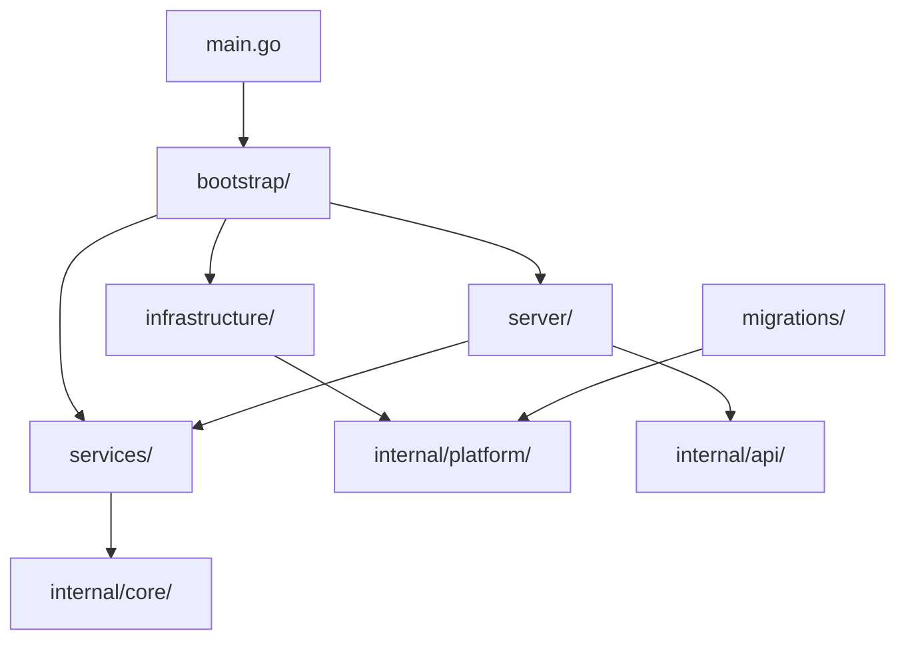

# CMD Structure & Development Guide

This document outlines the new clean architecture for the `/cmd/server/` directory and provides guidelines for adding new code following our established patterns.

## 📁 Current Structure

```
cmd/server/
├── main.go                     # Application entry point (104 lines)
├── bootstrap/                  # Application lifecycle management
│   ├── app.go                 # Core application initialization & HTTP server setup
│   └── dependencies.go        # Dependency injection and validation
├── infrastructure/             # Infrastructure layer setup
│   ├── database.go            # Database & Redis connection management
│   ├── observability.go       # Metrics, tracing, and logging configuration
│   └── temporal.go            # Temporal workflow platform setup
├── server/                     # HTTP server configuration
│   └── goa.go                 # GOA server, middleware, and route mounting
├── services/                   # Business service initialization
│   ├── core.go               # Core business services setup
│   └── finance.go            # Finance module service initialization
└── migrations/                 # Database utilities
    └── migrate.go            # Database migration execution logic
```

## 🏗️ Architecture Principles

### 1. Single Responsibility Principle
Each package has one clear purpose:
- **bootstrap**: Application lifecycle
- **infrastructure**: External system setup
- **server**: HTTP layer configuration
- **services**: Business logic wiring
- **migrations**: Database operations

### 2. Clean Architecture Layers
```
┌─────────────────────────────────────┐
│               main.go               │ ← Entry Point
├─────────────────────────────────────┤
│             bootstrap/              │ ← Application Layer
├─────────────────────────────────────┤
│       server/     services/         │ ← Interface Layer
├─────────────────────────────────────┤
│           infrastructure/           │ ← Infrastructure Layer
└─────────────────────────────────────┘
```

### 3. Dependency Flow
- Dependencies flow inward (infrastructure → services → application)
- No circular dependencies between packages
- Clear separation of concerns

## 📝 Adding New Code

### Adding New Infrastructure Components

**Location**: `cmd/server/infrastructure/`

**Example**: Adding a new message queue service

```go
// infrastructure/messagequeue.go
package infrastructure

import (
    "context"
    "github.com/niiniyare/erp/internal/platform/queue"
    "github.com/niiniyare/erp/internal/platform/config"
    "github.com/niiniyare/erp/internal/shared/logger"
)

type MessageQueue struct {
    Client queue.Service
}

func InitializeMessageQueue(cfg *config.Config, logger logger.Logger) (*MessageQueue, error) {
    client, err := queue.NewClient(queue.Config{
        Broker: cfg.MessageQueue.Broker,
        Topic:  cfg.MessageQueue.Topic,
    })
    if err != nil {
        return nil, err
    }

    logger.Info("Message queue initialized", logger.Fields{
        "broker": cfg.MessageQueue.Broker,
        "topic":  cfg.MessageQueue.Topic,
    })

    return &MessageQueue{
        Client: client,
    }, nil
}

func (mq *MessageQueue) Shutdown(ctx context.Context) error {
    return mq.Client.Close()
}
```

**Integration steps**:
1. Add to `bootstrap/dependencies.go`
2. Wire into services that need it
3. Add shutdown logic to main application lifecycle

### Adding New Business Services

**Location**: `cmd/server/services/`

**Example**: Adding a new inventory module

```go
// services/inventory.go
package services

import (
    db "github.com/niiniyare/erp/db/sqlc"
    "github.com/niiniyare/erp/internal/core/inventory/service"
    "github.com/niiniyare/erp/internal/core/inventory/repository"
    "github.com/niiniyare/erp/internal/platform/cache"
    loggerPkg "github.com/niiniyare/erp/internal/shared/logger"
    "github.com/niiniyare/erp/internal/shared/metrics"
    "github.com/niiniyare/erp/internal/shared/tracing"
)

func InitializeInventoryServices(
    store db.Store,
    cacheService cache.Service,
    logger loggerPkg.Logger,
    metricsService *metrics.MetricsService,
    tracingService tracing.TracingService,
    coreServices *CoreServices,
) (*service.Services, error) {
    logger.Info("Initializing Inventory services", loggerPkg.Fields{
        "module": "inventory",
        "status": "initializing_services",
    })

    // Create inventory repositories
    productRepo := repository.NewProductRepository(store, cacheService, tracingService)
    stockRepo := repository.NewStockRepository(store, tracingService)

    // Create inventory service dependencies
    inventoryServiceDeps := service.Dependencies{
        ProductRepo:        productRepo,
        StockRepo:          stockRepo,
        Tracing:            tracingService,
        Metrics:            metricsService,
        AuditService:       coreServices.AuditService,
        FeatureFlagService: coreServices.FeatureFlagService,
    }

    // Validate dependencies
    if err := inventoryServiceDeps.Validate(); err != nil {
        logger.Error("Inventory service dependencies validation failed", loggerPkg.Fields{
            "error": err.Error(),
        })
        return nil, err
    }

    // Create inventory services
    inventoryServices := service.NewServices(inventoryServiceDeps)

    logger.Info("✅ Inventory services initialized successfully", loggerPkg.Fields{
        "module":   "inventory",
        "services": []string{"product", "stock", "warehouse"},
        "status":   "ready",
    })

    return inventoryServices, nil
}
```

**Integration steps**:
1. Add to `CoreServices` struct if it's a core service
2. Initialize in `InitializeCoreServices` function
3. Wire into GOA server in `server/goa.go`

### Adding New API Endpoints

**Location**: `cmd/server/server/goa.go`

**Steps to add a new service to GOA**:

1. **Import the generated types**:
```go
import (
    inventoryGen "github.com/niiniyare/erp/internal/api/gen/inventory"
    inventorysvr "github.com/niiniyare/erp/internal/api/gen/http/inventory/server"
)
```

2. **Add to service variables**:
```go
var (
    // ... existing services
    inventorySvc inventory.Service
)
```

3. **Initialize the service**:
```go
inventorySvc = handlers.NewInventoryGoaHandler(
    inventoryServices.ProductService,
    inventoryServices.StockService,
    tracingService,
    metricsService,
)
```

4. **Create endpoints**:
```go
inventoryEndpoints := inventoryGen.NewEndpoints(inventorySvc)
inventoryEndpoints.Use(debug.LogPayloads())
inventoryEndpoints.Use(clueLog.Endpoint)
```

5. **Create and mount server**:
```go
inventoryServer := inventorysvr.New(inventoryEndpoints, mux, dec, enc, eh, nil)
inventorysvr.Mount(mux, inventoryServer)
```

6. **Add endpoint logging**:
```go
logMountedEndpoints(inventoryServer.Mounts, "Inventory")
```

### Adding Database Migrations

**Location**: `cmd/server/migrations/migrate.go`

The migration logic is centralized. To add new migration capabilities:

1. **Extend the migration runner**:
```go
// Add to migrate.go
func RunSpecificMigration(migrationURL string, dbSource string, targetVersion uint) {
    // Implementation for running to specific version
}

func RollbackMigration(migrationURL string, dbSource string, steps int) {
    // Implementation for rollback functionality
}
```

2. **Add migration utilities**:
```go
func ValidateMigrationIntegrity(migrationURL string, dbSource string) error {
    // Validate migration files and database state
}
```

### Adding New Bootstrap Components

**Location**: `cmd/server/bootstrap/`

**Example**: Adding configuration validation

```go
// bootstrap/validation.go
package bootstrap

import (
    "fmt"
    "github.com/niiniyare/erp/internal/platform/config"
    "github.com/niiniyare/erp/internal/shared/logger"
)

type ValidationResult struct {
    Valid    bool
    Errors   []string
    Warnings []string
}

func ValidateConfiguration(cfg *config.Config) *ValidationResult {
    result := &ValidationResult{
        Valid:    true,
        Errors:   []string{},
        Warnings: []string{},
    }

    // Database validation
    if cfg.Database.Host == "" {
        result.Errors = append(result.Errors, "database host is required")
        result.Valid = false
    }

    // Redis validation
    if cfg.Redis.Host == "" {
        result.Warnings = append(result.Warnings, "redis host not configured, caching disabled")
    }

    return result
}
```

## 🔧 Development Patterns

### 1. Service Bridge Pattern
When you need to adapt between interfaces, use simple inline bridges instead of complex adapters:

```go
// Simple bridge for interface compatibility
type serviceBridge struct {
    originalService original.Service
}

func (s *serviceBridge) RequiredMethod(ctx context.Context, input Input) (*Output, error) {
    originalOutput, err := s.originalService.OriginalMethod(ctx, input.Field)
    if err != nil {
        return nil, err
    }
    
    return &Output{
        ConvertedField: originalOutput.Field,
    }, nil
}
```

### 2. Dependency Injection Pattern
All dependencies should be injected through constructors:

```go
func InitializeNewService(
    store db.Store,
    cache cache.Service,
    logger logger.Logger,
    metrics *metrics.MetricsService,
    tracing tracing.TracingService,
) (*NewService, error) {
    // Validation
    if store == nil {
        return nil, errors.New("store is required")
    }
    
    // Initialization
    service := &NewService{
        store:   store,
        cache:   cache,
        logger:  logger,
        metrics: metrics,
        tracing: tracing,
    }
    
    return service, nil
}
```

### 3. Error Handling Pattern
Consistent error handling with structured logging:

```go
func InitializeComponent() error {
    logger.Info("Initializing component", logger.Fields{
        "component": "component_name",
        "status":    "starting",
    })
    
    if err := validateConfig(); err != nil {
        logger.Error("Component initialization failed", logger.Fields{
            "component": "component_name",
            "error":     err.Error(),
            "status":    "failed",
        })
        return fmt.Errorf("failed to initialize component: %w", err)
    }
    
    logger.Info("✅ Component initialized successfully", logger.Fields{
        "component": "component_name",
        "status":    "ready",
    })
    
    return nil
}
```

## 🚀 Best Practices

### DO's ✅
- **Keep packages focused** - One responsibility per package
- **Use dependency injection** - Pass dependencies through constructors
- **Add comprehensive logging** - Log initialization, errors, and success states
- **Validate dependencies** - Check required dependencies in service constructors
- **Follow naming conventions** - Use consistent naming across packages
- **Add graceful shutdown** - Implement proper cleanup in shutdown handlers

### DON'Ts ❌
- **Don't create circular dependencies** - Keep dependency flow unidirectional
- **Don't put business logic in cmd/** - Keep cmd/ focused on wiring and configuration
- **Don't hardcode configurations** - Use config structs and environment variables
- **Don't ignore errors** - Always handle and log errors appropriately
- **Don't create complex adapters** - Use simple bridges when interface adaptation is needed
- **Don't mix concerns** - Keep infrastructure, services, and application layers separate

## 📊 Package Dependencies



## 🔄 Adding New Modules Checklist

When adding a new business module (e.g., inventory, HR, CRM):

- [ ] Create domain models in `internal/core/[module]/`
- [ ] Create service in `cmd/server/services/[module].go`
- [ ] Add to `CoreServices` struct if needed
- [ ] Wire into `InitializeCoreServices`
- [ ] Create GOA design in `internal/api/design/services/[module].go`
- [ ] Generate GOA code: `make goa`
- [ ] Create handlers in `internal/api/handlers/[module]/`
- [ ] Add to GOA server in `server/goa.go`
- [ ] Add database migrations if needed
- [ ] Add tests for service initialization
- [ ] Update documentation

## 📚 Related Documentation

- [Clean Architecture Guidelines](./architecture.md)
- [Service Development Guide](./services.md)
- [API Development Guide](./api-development.md)
- [Database Migration Guide](./migrations.md)

---

**Last Updated**: $(date)  
**Maintainer**: Development Team  
**Review Cycle**: Monthly