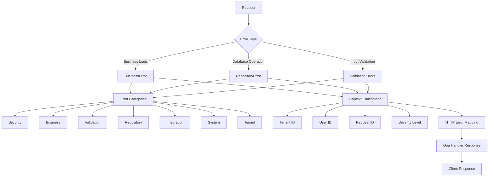

# Awo ERP Error Handling Guide
## *Enhanced Error Management with BusinessError, ValidationErrors, and Repository Patterns*

*Comprehensive error handling strategies for building resilient Awo ERP applications with proper error propagation, classification, and observability using our enhanced error system*

> **📚 Related Documentation:**
> - `docs/contributing/architecture.md` - System architecture and context patterns
> - `docs/contributing/01-best-practices.md` - Development guidelines and patterns
> - `docs/contributing/goa.md` - API design and handler architecture

## 🎯 Error Handling Philosophy

Awo ERP uses an enhanced error system with structured error types and categories:

1. **Enhanced Error Types**: BusinessError, RepositoryError, ValidationErrors with rich metadata
2. **Category-based Classification**: Security, Business, Validation, Repository, Integration, System, Tenant
3. **Severity Levels**: Info, Warning, Error, Critical for proper prioritization
4. **Context Propagation**: Tenant ID, User ID, Request ID automatically captured
5. **User-friendly Suggestions**: Built-in suggestions for error resolution
6. **HTTP Status Mapping**: Automatic mapping to appropriate HTTP status codes

## 📊 Awo ERP Error Architecture



## 🏗️ Enhanced Error Type System

### 1. **BusinessError - Core Domain Errors**

BusinessError represents business rule violations with rich context and user-friendly suggestions.

```go
// internal/shared/errors/errors.go - Real implementation
package errors

// Predefined BusinessErrors with full context
var (
    // Tenant errors with suggestions and HTTP mapping
    ErrTenantNotFound = NewBusinessError("TENANT_NOT_FOUND", "Tenant not found").
        WithHTTPStatus(http.StatusNotFound).
        WithCategory(CategoryTenant).
        WithSuggestion("Verify the tenant ID or slug is correct").
        WithSuggestion("Contact support if you believe this tenant should exist")

    ErrSubdomainAlreadyExists = NewBusinessError("SUBDOMAIN_EXISTS", "Subdomain already exists").
        WithHTTPStatus(http.StatusConflict).
        WithCategory(CategoryTenant).
        WithSuggestion("Choose a different subdomain").
        WithSuggestion("Try adding numbers or variations to make it unique")

    // User errors with authentication context
    ErrInvalidCredentials = NewBusinessError("INVALID_CREDENTIALS", "Invalid email or password").
        WithHTTPStatus(http.StatusUnauthorized).
        WithCategory(CategorySecurity).
        WithSuggestion("Check your email and password").
        WithSuggestion("Use the 'Forgot Password' option if needed").
        WithSuggestion("Ensure caps lock is not enabled")

    // ABAC specific errors
    ErrPolicyNotFound = NewBusinessError("POLICY_NOT_FOUND", "ABAC policy not found").
        WithHTTPStatus(http.StatusNotFound).
        WithCategory(CategorySecurity).
        WithSuggestion("Verify the policy ID is correct").
        WithSuggestion("Check if the policy exists and is active")
)

// Enhanced constructors with context
func NewUserNotFoundError(userID string) *BusinessError {
    return NewBusinessError("USER_NOT_FOUND", "User not found").
        WithHTTPStatus(http.StatusNotFound).
        WithCategory(CategorySecurity).
        WithDetail("user_id", userID).
        WithSuggestion("Verify the user ID is correct").
        WithSuggestion("Check if the user exists in your tenant")
}

// BusinessError structure with full metadata
type BusinessError struct {
    Code        string         `json:"code"`
    Message     string         `json:"message"`
    Details     map[string]any `json:"details,omitempty"`
    Suggestions []string       `json:"suggestions,omitempty"`
    HTTPStatus  int            `json:"-"`
    Severity    Severity       `json:"severity"`
    Category    Category       `json:"category"`
    TenantID    string         `json:"tenant_id,omitempty"`
    UserID      string         `json:"user_id,omitempty"`
    Retryable   bool           `json:"retryable"`
    Err         error          `json:"-"`
}
```

### 2. **Enhanced ValidationErrors**

ValidationErrors provide detailed field-level error information with codes and value sanitization.

```go
// internal/shared/errors/codes.go - Real implementation
package errors

// Enhanced ValidationError with codes and safe value handling
type ValidationError struct {
    Field   string `json:"field"`
    Message string `json:"message"`
    Code    string `json:"code,omitempty"`  // e.g., "REQUIRED", "INVALID_FORMAT"
    Value   any    `json:"value,omitempty"` // The invalid value (sanitized)
}

func (e ValidationError) Error() string {
    if e.Code != "" {
        return fmt.Sprintf("%s: %s (%s)", e.Field, e.Message, e.Code)
    }
    return fmt.Sprintf("%s: %s", e.Field, e.Message)
}

// ValidationErrors collection with enhanced methods
type ValidationErrors []ValidationError

func (ve ValidationErrors) Error() string {
    if len(ve) == 0 {
        return ""
    }
    if len(ve) == 1 {
        return ve[0].Error()
    }
    return fmt.Sprintf("validation failed with %d errors", len(ve))
}

// Enhanced methods for ValidationErrors
func (ve *ValidationErrors) Add(field, message string) {
    *ve = append(*ve, ValidationError{Field: field, Message: message})
}

func (ve *ValidationErrors) AddWithCode(field, message, code string) {
    *ve = append(*ve, ValidationError{Field: field, Message: message, Code: code})
}

func (ve *ValidationErrors) AddWithValue(field, message, code string, value any) {
    *ve = append(*ve, ValidationError{
        Field:   field,
        Message: message,
        Code:    code,
        Value:   sanitizeValue(value), // Automatically sanitizes sensitive data
    })
}

func (ve ValidationErrors) HasErrors() bool {
    return len(ve) > 0
}

// Convert to map for API responses
func (ve ValidationErrors) ToMap() map[string][]string {
    result := make(map[string][]string)
    for _, err := range ve {
        result[err.Field] = append(result[err.Field], err.Message)
    }
    return result
}
```

### 3. **RepositoryError - Database Layer Errors**

RepositoryError represents database and infrastructure errors with operation context.

```go
// internal/shared/errors/codes.go - Real implementation
type RepositoryError struct {
    Code      string         `json:"code"`    // e.g., "REJECT_FAILED"
    Message   string         `json:"message"` // e.g., "Failed to reject access request"
    Err       error          `json:"-"`       // Underlying cause (not serialized)
    Details   map[string]any `json:"details,omitempty"`
    Operation string         `json:"operation,omitempty"` // Database operation
    Table     string         `json:"table,omitempty"`     // Affected table
    TenantID  string         `json:"tenant_id,omitempty"`
}

func (e *RepositoryError) Error() string {
    var parts []string
    if e.Code != "" {
        parts = append(parts, fmt.Sprintf("[%s]", e.Code))
    }
    if e.Message != "" {
        parts = append(parts, e.Message)
    }
    if e.Operation != "" && e.Table != "" {
        parts = append(parts, fmt.Sprintf("(operation: %s, table: %s)", e.Operation, e.Table))
    }
    result := strings.Join(parts, " ")
    if e.Err != nil {
        result += fmt.Sprintf(": %v", e.Err)
    }
    return result
}

// Constructor with context awareness
func NewRepositoryErrorWithContext(ctx context.Context, code, message string, err error) *RepositoryError {
    repoErr := &RepositoryError{
        Code:    code,
        Message: message,
        Err:     err,
        Details: make(map[string]any),
    }
    if tenantID := getTenantIDFromContext(ctx); tenantID != "" {
        repoErr.TenantID = tenantID
    }
    return repoErr
}
```

### 4. **HTTP Error Mapping**

Awo ERP provides automatic conversion of all error types to HTTP responses:

```go
// internal/shared/errors/http.go - Real implementation
func ToHTTPError(err error) *HTTPError {
    if err == nil {
        return nil
    }

    httpErr := &HTTPError{
        Status:    http.StatusInternalServerError,
        Code:      "INTERNAL_ERROR",
        Message:   "An internal error occurred",
        Details:   make(map[string]any),
        Timestamp: time.Now(),
    }

    // Handle different error types
    switch e := err.(type) {
    case *BusinessError:
        httpErr.Status = e.HTTPStatus
        httpErr.Code = e.Code
        httpErr.Message = e.Message
        httpErr.Details = e.Details

    case *RepositoryError:
        httpErr.Status = http.StatusInternalServerError
        httpErr.Code = e.Code
        httpErr.Message = "A database error occurred"
        // Don't expose internal database details

    case ValidationErrors:
        httpErr.Status = http.StatusBadRequest
        httpErr.Code = "VALIDATION_FAILED"
        httpErr.Message = "Validation failed"
        httpErr.Details["validation_errors"] = e.ToMap()

    default:
        // Keep default internal server error
        httpErr.Details["original_error"] = err.Error()
    }

    return httpErr
}
```

## 🔄 Error Handling by Layer

### 1. **Repository Layer Error Handling**

Repository layer converts database errors to domain errors using the actual patterns.

```go
// Example from internal/core/finance/repository/accounts.go
func (r *chartOfAccountsRepository) Create(ctx context.Context, account *domain.Accounts) error {
    ctx, span := r.tracing.StartSpan(ctx, "AccountsRepository.Create")
    defer span.End()

    // Get tenant ID from context (WithTenant pattern)
    tenantID, ok := shared.GetTenantID(ctx)
    if !ok {
        return fmt.Errorf("tenant ID not found in context")
    }

    // Use tenant-aware transaction for proper isolation
    return r.store.WithTenant(ctx, tenantID, func(ctx context.Context, s db.Store) error {
        // Map domain account to SQLC parameters
        params, err := mapDomainAccountToSQLCCreateDirect(account)
        if err != nil {
            return fmt.Errorf("failed to map create account request: %w", err)
        }

        // Execute SQLC query within tenant context
        sqlcAccount, err := s.CreateAccount(ctx, params)
        if err != nil {
            return r.mapDatabaseError(err, "create_account")
        }

        // Update the account with generated fields
        account.ID = sqlcAccount.ID
        account.TenantID = sqlcAccount.TenantID
        account.CreatedAt = sqlcAccount.CreatedAt
        account.UpdatedAt = sqlcAccount.UpdatedAt

        return nil
    })
}

// Database error mapping
func (r *repository) mapDatabaseError(err error, operation string) error {
    // Check for specific database errors
    if isDuplicateKeyError(err) {
        if strings.Contains(err.Error(), "accounts_code_tenant_id_key") {
            return errors.NewBusinessError("ACCOUNT_CODE_EXISTS", "Account code already exists").
                WithCategory(errors.CategoryBusiness).
                WithHTTPStatus(http.StatusConflict)
        }
    }
    
    // General repository error
    return errors.NewRepositoryErrorWithContext(r.ctx, "DATABASE_ERROR", 
        "Database operation failed", err).
        WithOperation(operation)
}
```

### 2. **Service Layer Error Handling**

Service layer handles business logic errors and orchestrates error responses.

```go
// Service layer with BusinessError usage
func (s *service) CreateAccount(ctx context.Context, req *CreateAccountRequest) (*Account, error) {
    ctx, span := s.tracing.StartSpan(ctx, "service.create_account")
    defer span.End()
    
    // Business validation using ValidationErrors
    validationErrors := ValidationErrors{}
    
    if req.Code == "" {
        validationErrors.AddWithCode("code", "Account code is required", "REQUIRED")
    }
    
    if req.Name == "" {
        validationErrors.AddWithCode("name", "Account name is required", "REQUIRED")
    }
    
    if validationErrors.HasErrors() {
        span.RecordError(validationErrors)
        return nil, validationErrors
    }
    
    // Business rules validation
    if exists, err := s.repo.CodeExists(ctx, req.Code); err != nil {
        return nil, fmt.Errorf("failed to check account code existence: %w", err)
    } else if exists {
        return nil, errors.NewBusinessError("ACCOUNT_CODE_EXISTS", "Account code already exists").
            WithDetail("code", req.Code).
            WithCategory(errors.CategoryBusiness).
            WithHTTPStatus(http.StatusConflict)
    }
    
    // Create account
    account := &domain.Accounts{
        Code:        req.Code,
        Name:        req.Name,
        AccountType: req.AccountType,
        Description: req.Description,
    }
    
    if err := s.repo.Create(ctx, account); err != nil {
        // Repository errors bubble up with context
        span.RecordError(err)
        return nil, fmt.Errorf("service: failed to create account: %w", err)
    }
    
    span.SetStatus(codes.Ok, "Account created successfully")
    return account, nil
}
```

### 3. **Goa Handler Error Handling**

Goa handlers convert errors to appropriate HTTP responses using the ToHTTPError function.

```go
// internal/api/handlers/finance/account_handler.go
func (h *AccountHandler) CreateAccount(ctx context.Context, p *goaFinance.CreateAccountPayload) (*goaFinance.Account, error) {
    ctx, span := h.tracing.Start(ctx, "http.create_account")
    defer span.End()
    
    // Convert Goa payload to domain request
    req := &finance.CreateAccountRequest{
        Code:        p.Code,
        Name:        p.Name,
        AccountType: finance.AccountType(p.AccountType),
        Description: p.Description,
    }
    
    // Call service layer
    account, err := h.financeService.Account().Create(ctx, req)
    if err != nil {
        // Convert to HTTP error automatically
        httpErr := errors.ToHTTPError(err)
        span.RecordError(err)
        span.SetAttributes(
            attribute.String("error.type", httpErr.Code),
            attribute.Int("http.status_code", httpErr.Status),
        )
        
        // Return Goa error based on HTTP status
        switch httpErr.Status {
        case http.StatusBadRequest:
            return nil, goaFinance.MakeBadRequest(errors.New(httpErr.Message))
        case http.StatusConflict:
            return nil, goaFinance.MakeConflict(errors.New(httpErr.Message))
        case http.StatusNotFound:
            return nil, goaFinance.MakeNotFound(errors.New(httpErr.Message))
        default:
            return nil, goaFinance.MakeInternalError(errors.New("Internal server error"))
        }
    }
    
    // Convert domain model to Goa response
    response := h.accountToGoaResponse(account)
    
    span.SetStatus(codes.Ok, "Account created successfully")
    return response, nil
}
```

## 📊 Error Type Checking and Classification

### Error Type Checking Helpers

```go
// internal/shared/errors/errors.go - Real implementation
func IsBusinessErrorCode(err error, code string) bool {
    var be *BusinessError
    if errors.As(err, &be) {
        return be.Code == code
    }
    return false
}

// Convenience functions for common checks
func IsTenantNotFound(err error) bool {
    return IsBusinessErrorCode(err, "TENANT_NOT_FOUND")
}

func IsConflict(err error) bool {
    conflictCodes := []string{
        "USER_EXISTS", "ENTITY_NAME_EXISTS", "ENTITY_CODE_EXISTS",
        "ROLE_EXISTS", "TENANT_EXISTS", "EMAIL_EXISTS", "USERNAME_EXISTS",
        "SUBDOMAIN_EXISTS", "ACCOUNT_CODE_EXISTS",
    }
    
    for _, code := range conflictCodes {
        if IsBusinessErrorCode(err, code) {
            return true
        }
    }
    return false
}

func IsValidationError(err error) bool {
    if _, ok := err.(ValidationErrors); ok {
        return true
    }
    if _, ok := err.(ValidationError); ok {
        return true
    }
    if be, ok := err.(*BusinessError); ok {
        return be.Category == CategoryValidation
    }
    return false
}
```

## 🚨 Best Practices

### 1. **Use Appropriate Error Types**

```go
// ✅ Business logic violations -> BusinessError
if account.Balance.IsNegative() {
    return errors.NewBusinessError("NEGATIVE_BALANCE", "Account balance cannot be negative").
        WithDetail("account_id", account.ID).
        WithCategory(errors.CategoryBusiness)
}

// ✅ Input validation -> ValidationErrors
func (s *service) validateCreateRequest(req *CreateAccountRequest) ValidationErrors {
    var errors ValidationErrors
    
    if req.Code == "" {
        errors.AddWithCode("code", "Account code is required", "REQUIRED")
    }
    
    if len(req.Name) < 3 {
        errors.AddWithCode("name", "Name must be at least 3 characters", "MIN_LENGTH")
    }
    
    return errors
}

// ✅ Database errors -> RepositoryError (automatically handled by repositories)
```

### 2. **Context Propagation**

```go
// ✅ Always use context for tenant isolation
func (s *service) CreateAccount(ctx context.Context, req *CreateAccountRequest) (*Account, error) {
    // Context automatically contains tenant ID, user ID, trace spans
    return s.repository.Create(ctx, account)
}

// ❌ Don't create service methods without context
func (s *service) CreateAccount(req *CreateAccountRequest) (*Account, error) {
    // No context = no tenant isolation, audit, or tracing
}
```

### 3. **Error Testing**

```go
func TestAccountService_CreateAccount_CodeExists(t *testing.T) {
    // Test error types and structure
    mockRepo := new(mocks.MockAccountRepository)
    service := NewAccountService(mockRepo, logger.NewTestLogger())
    
    // Setup: code already exists
    mockRepo.On("CodeExists", mock.Anything, "1000").Return(true, nil)
    
    req := &CreateAccountRequest{
        Code: "1000",
        Name: "Cash",
    }
    
    // Execute
    _, err := service.CreateAccount(context.Background(), req)
    
    // Verify error type and structure
    require.Error(t, err)
    
    var be *errors.BusinessError
    require.True(t, errors.As(err, &be))
    assert.Equal(t, "ACCOUNT_CODE_EXISTS", be.Code)
    assert.Equal(t, errors.CategoryBusiness, be.Category)
    assert.Equal(t, http.StatusConflict, be.HTTPStatus)
    assert.Equal(t, "1000", be.Details["code"])
    
    mockRepo.AssertExpectations(t)
}
```

## 🔗 Error Helper Functions

### Categories and Severity Levels

```go
// internal/shared/errors/codes.go - Real implementation
type Category string

const (
    CategoryValidation  Category = "validation"
    CategoryRepository  Category = "repository"
    CategoryBusiness    Category = "business"
    CategorySecurity    Category = "security"
    CategoryIntegration Category = "integration"
    CategorySystem      Category = "system"
    CategoryTenant      Category = "tenant"
)

type Severity string

const (
    SeverityInfo     Severity = "info"
    SeverityWarning  Severity = "warning"
    SeverityError    Severity = "error"
    SeverityCritical Severity = "critical"
)
```

---

📚 **Next Steps**:
- [Architecture Overview](./architecture.md) - Understanding system design and context flow
- [Best Practices](./01-best-practices.md) - Development guidelines and standards
- [Database Transactions](./database-transactions.md) - WithTenant patterns and tenant isolation
- [Goa API Development](./goa.md) - Handler patterns and API design