# Mermaid.js Diagrams Guide

## Overview

AWO ERP Documentation supports Mermaid.js for creating diagrams, flowcharts, and visualizations directly in Markdown. This guide covers all supported diagram types and provides examples for common use cases.

## Basic Syntax

Mermaid diagrams are created using fenced code blocks with the `mermaid` language identifier:

````markdown
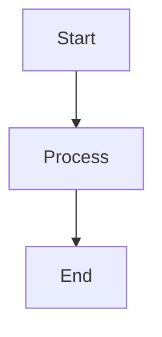
````

## Supported Diagram Types

### 1. Flowcharts

Perfect for showing process flows, decision trees, and system workflows.

#### Basic Flowchart
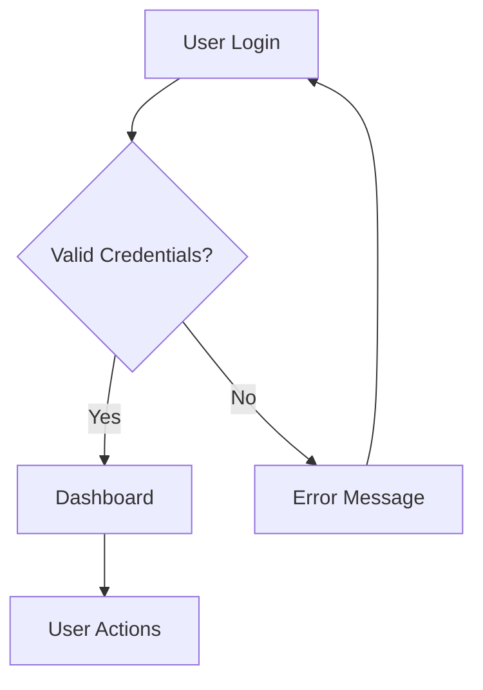

#### ERP Process Flow
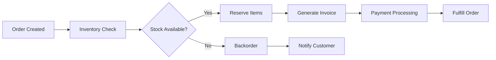

### 2. Sequence Diagrams

Ideal for showing API interactions, user flows, and system communications.

#### API Authentication Flow
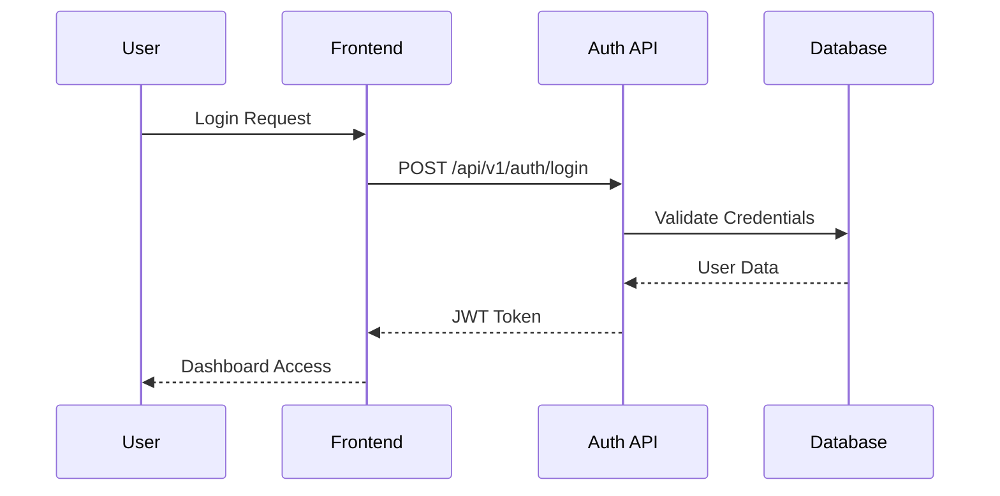

#### ABAC Authorization Flow
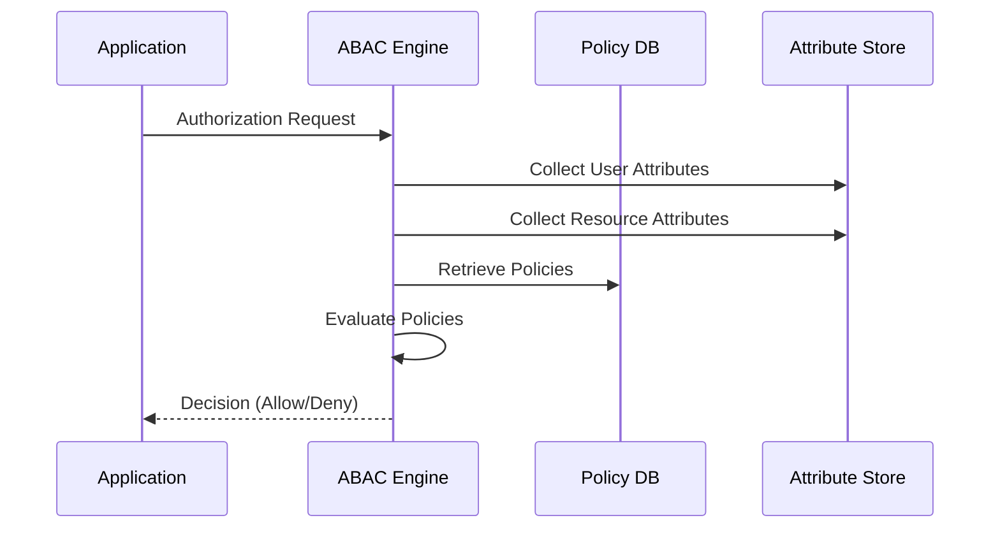

### 3. Class Diagrams

Great for showing object relationships and system architecture.

#### Finance Module Classes
```mermaid
classDiagram
    class Account {
        +String accountCode
        +String accountName
        +AccountType type
        +RootType rootType
        +Decimal currentBalance
        +Boolean isActive
        +validateAccount()
        +updateBalance()
    }
    
    class Transaction {
        +UUID transactionId
        +Date postingDate
        +String description
        +TransactionStatus status
        +List~TransactionEntry~ entries
        +post()
        +reverse()
    }
    
    class TransactionEntry {
        +UUID entryId
        +Account account
        +Decimal debitAmount
        +Decimal creditAmount
        +String description
    }
    
    Account ||--o{ TransactionEntry : "has many"
    Transaction ||--o{ TransactionEntry : "contains"
```

### 4. State Diagrams

Perfect for showing entity states and transitions.

#### Transaction State Machine
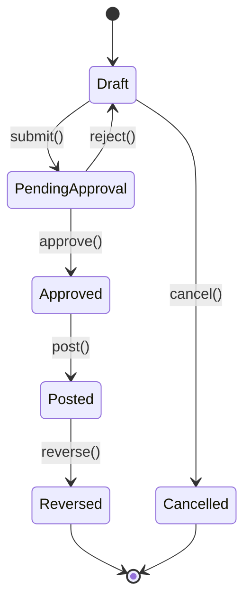

#### User Account States
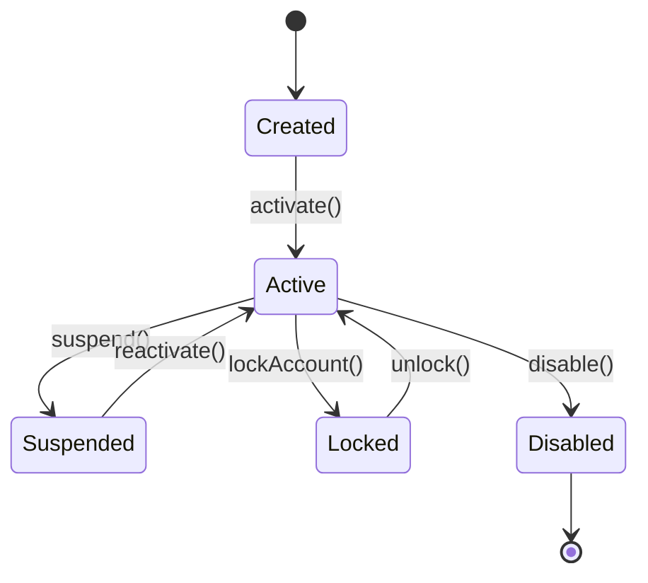

### 5. Entity Relationship Diagrams

Excellent for database schema visualization.

#### Finance Schema
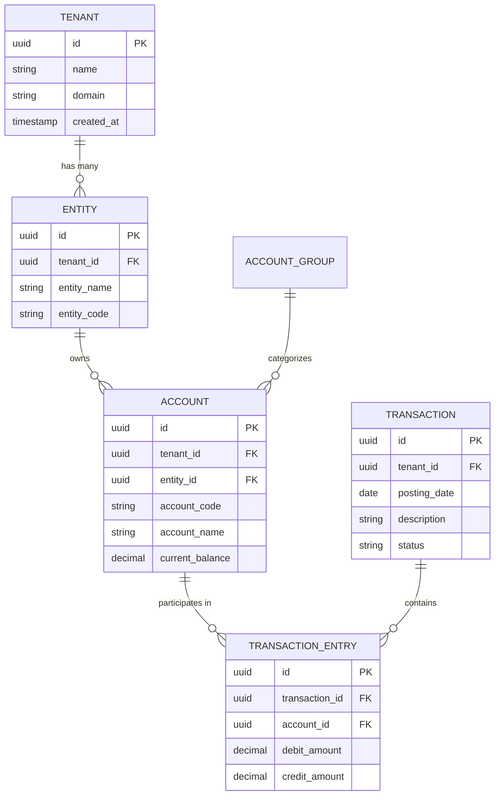

### 6. Gantt Charts

Great for project timelines and implementation phases.

#### ERP Implementation Timeline
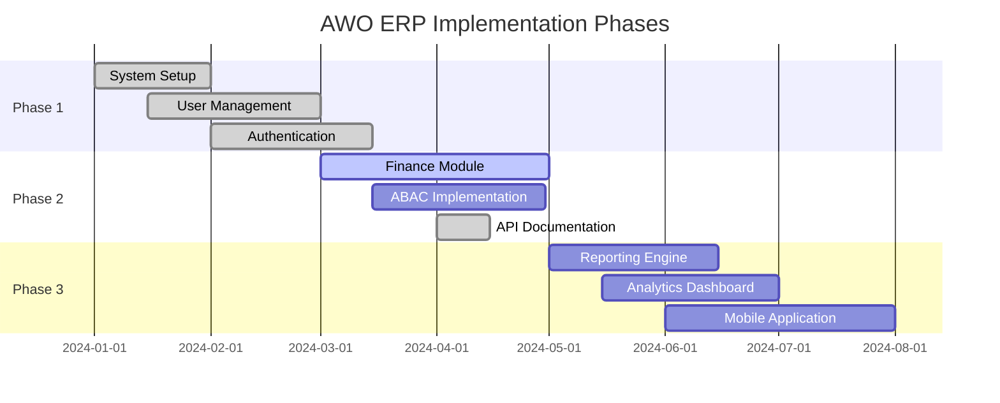

### 7. Git Graphs

Useful for showing repository workflows and branching strategies.

#### Git Flow Strategy
```mermaid
gitgraph
    commit id: "Initial"
    branch develop
    checkout develop
    commit id: "Feature A"
    branch feature/user-auth
    checkout feature/user-auth
    commit id: "Auth implementation"
    commit id: "Tests added"
    checkout develop
    merge feature/user-auth
    commit id: "Integration tests"
    checkout main
    merge develop
    commit id: "Release v1.0"
```

### 8. User Journey Maps

Perfect for documenting user experiences and workflows.

#### User Onboarding Journey
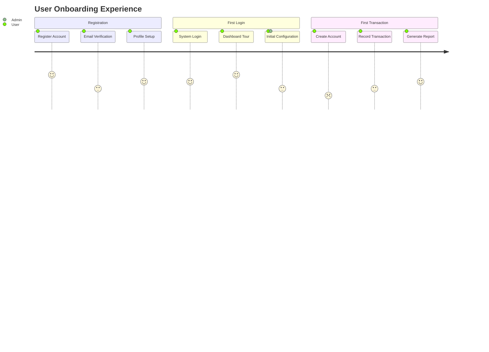

## Advanced Features

### 1. Subgraphs and Clusters

Group related nodes for better organization:

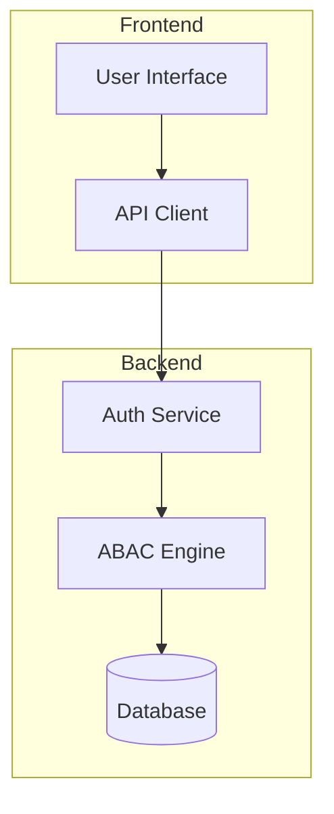

### 2. Styling and Themes

Custom styling for better visual appeal:

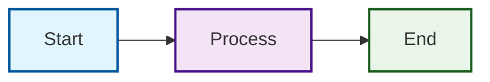

### 3. Click Events and Links

Add interactivity to diagrams:

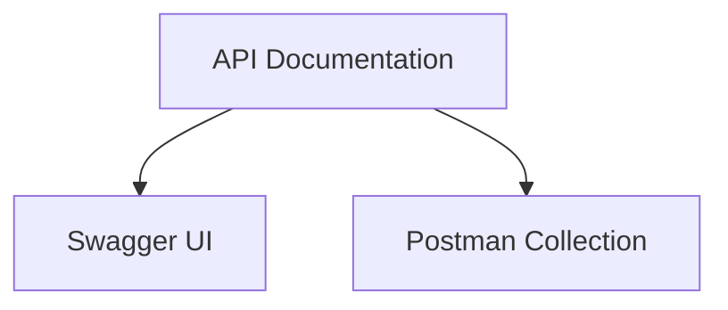

## Best Practices

### 1. Diagram Organization
- **Keep it Simple**: Focus on key elements, avoid clutter
- **Consistent Naming**: Use clear, descriptive labels
- **Logical Flow**: Organize from left-to-right or top-to-bottom
- **Color Coding**: Use colors to group related elements

### 2. Code Structure
```markdown
<!-- title: System Architecture Overview -->
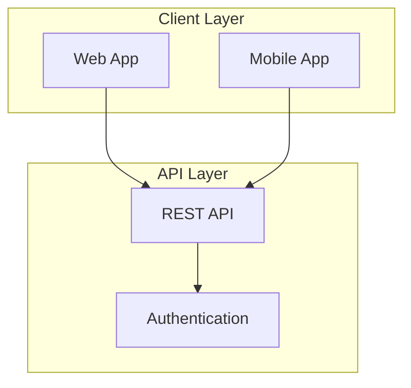
```

### 3. Documentation Integration
- **Context**: Provide context before the diagram
- **Explanation**: Explain key elements after the diagram  
- **Cross-references**: Link to related documentation
- **Updates**: Keep diagrams in sync with code changes

## Common Use Cases

### 1. System Architecture
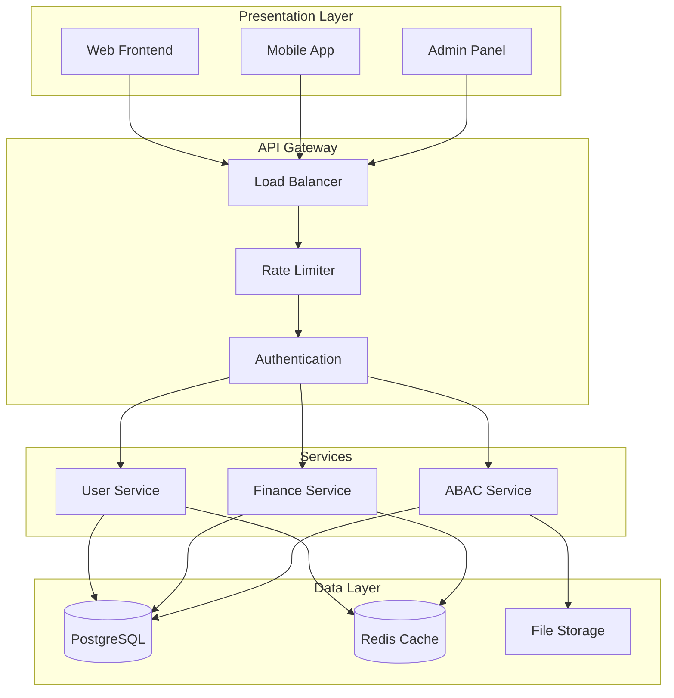

### 2. API Request Flow
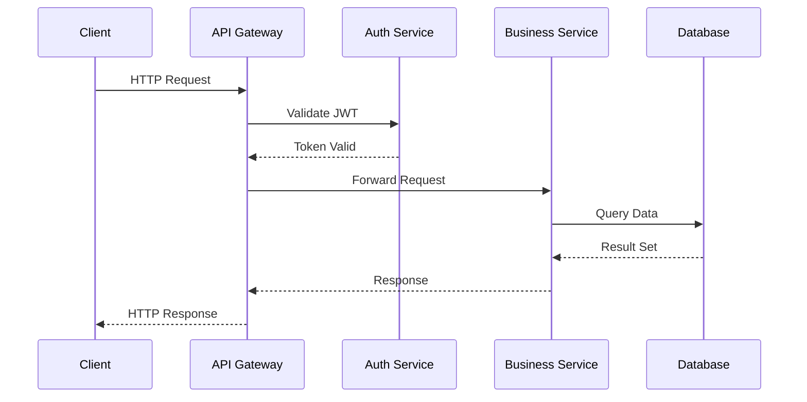

### 3. Database Relationships
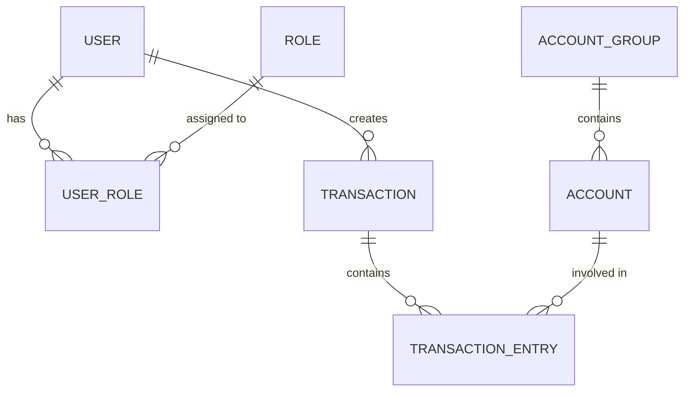

## Troubleshooting

### Common Issues

#### 1. Diagram Not Rendering
- Check syntax errors in the Mermaid code
- Ensure proper fenced code block format
- Verify JavaScript is enabled

#### 2. Layout Problems
- Use subgraphs to organize complex diagrams
- Adjust node spacing with graph configuration
- Consider splitting large diagrams into smaller ones

#### 3. Mobile Display Issues
- Test diagrams on mobile devices
- Use shorter labels for better mobile display
- Consider horizontal layouts for wide screens

### Debug Tips

1. **Syntax Validation**: Use [Mermaid Live Editor](https://mermaid.live/) to test syntax
2. **Browser Console**: Check for JavaScript errors
3. **Progressive Enhancement**: Start simple, add complexity gradually

## Examples Repository

For more examples and templates, check:
- `docs/examples/mermaid-samples.md` (when available)
- [Mermaid.js Official Documentation](https://mermaid.js.org/)
- Architecture diagrams in existing documentation

## Theme Support

Diagrams automatically adapt to the documentation theme:
- **Light Mode**: Clean, professional styling
- **Dark Mode**: Dark background with contrasting colors
- **Print Mode**: Optimized for printing and PDFs

---

**Related**: [Documentation Guide](documentation-guide.md) | **Up**: [Contributing](../contributing/)