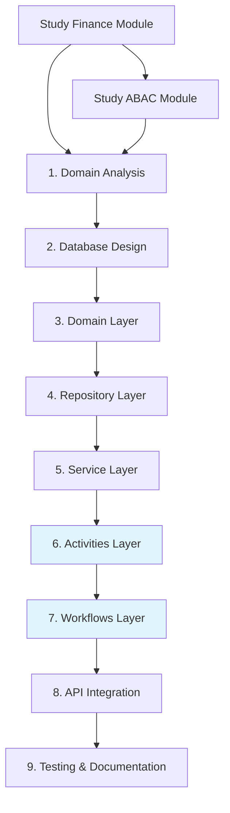

# Awo ERP Service Implementation Guide
## *Clean Architecture + Temporal Workflows Edition*

*A guide for implementing domain modules in Awo ERP following Clean Architecture principles, Temporal workflow orchestration, and modern ERP patterns*

> **📚 Essential Reading:** This guide focuses on `internal/core/` module development. For detailed implementation patterns, also review:
> - `docs/contributing/database-transactions.md` - Database and SQLC patterns
> - `docs/contributing/goa.md` - API design and code generation  
> - `docs/contributing/general-testing.md` - Testing strategies and patterns
> - `docs/contributing/error-handling.md` - Error handling best practices
> - `docs/contributing/observability.md` - Logging, metrics, and tracing

## **🔍 1. Analysis & Design Phase**
- [ ] **Domain Analysis**
  - [ ] Identify bounded context and core business capabilities
  - [ ] Map domain entities and value objects
  - [ ] Define aggregates and their invariants
  - [ ] Establish domain events for inter-module communication
- [ ] **Data Modeling**
  - [ ] Create Entity Relationship Diagram (ERD)
  - [ ] Define Go structs with proper tags (`json`, `validate`) etc...
  - [ ] Design audit trail requirements
- [ ] **API Design**
  - [ ] Create OpenAPI 3.0 specification
  - [ ] Define request/response DTOs
  - [ ] Plan API versioning strategy (`/v1/`, `/v2/`)
  - [ ] Document error response formats
- [ ] **Integration Planning**
  - [ ] Map dependencies on other ERP modules
  - [ ] Define message/event schemas (JSON/Protobuf)
  - [ ] Plan external system integrations
  - [ ] Establish idempotency keys for critical operations

## **🧱 2. Core Go Implementation**
- [ ] **Module Structure in `internal/core/`** 
  ```
  internal/core/
  └── {your-module}/          # New module (stock, payroll, hr, etc.)
      ├── service.go          # 🔥 MAIN MODULE ENTRY POINT - External interface
      ├── domain/             # Business entities and rules
      │   ├── entities.go     # Core business entities  
      │   ├── types.go        # Value objects and enums
      │   ├── errors.go       # Domain-specific errors
      │   ├── constants.go    # Business rule constants
      │   └── validation.go   # Business validation rules
      ├── repository/         # Data access layer
      │   ├── interfaces.go   # Repository interfaces
      │   ├── {entity}.go     # SQLC-based implementations
      │   └── mappers.go      # Domain ↔ DB model conversions
      ├── {feature}/          # Feature-specific submodules
      │   ├── service.go      # Feature service implementation
      │   ├── models.go       # Feature-specific models
      │   └── handlers.go     # Feature business logic
      ├── activities/         # Temporal activities (NEW)
      │   ├── activity_registry.go   # Activity registration
      │   ├── {domain}_activities.go # Domain activities
      │   └── integration_activities.go # Cross-service activities
      └── workflows/          # Temporal workflows (NEW)
          ├── {process}_workflow.go   # Business process workflows
          └── bulk_operations_workflow.go # Bulk processing
  ```

  **Reference existing modules:**
  - **Finance Module**: `internal/core/finance/` - Complete implementation example
  - **ABAC Module**: `internal/core/abac/` - Complex service with activities/workflows
  - **Settings Module**: `internal/core/settings/` - Configuration management pattern
  - **Entity Module**: `internal/core/entity/` - Multi-tenancy isolation pattern
- [ ] **Domain Layer (`internal/core/{domain}/domain/`)**
  - [ ] Define domain entities with rich behavior and business rules
  - [ ] Create value objects with validation methods
  - [ ] Build aggregates that enforce business invariants
  - [ ] Define domain events for inter-module communication
  - [ ] Create domain-specific error types and constants
  - [ ] Define configuration structs for workflow behavior
- [ ] **Service Layer (Module Root + Submodules)**
  - [ ] **Create `{module}/service.go` as main entry point** - This is the ONLY file external modules import
  - [ ] **Implement module-level facade pattern** - Provide unified interface to all features
  - [ ] **Build feature submodules** - Create `{feature}/service.go` for each feature
  - [ ] **Add essential service dependencies** - Entity, Settings, FeatureFlag, Audit, ABAC services
  - [ ] **Maintain clean module interfaces** - Hide internal feature complexity from consumers
- [ ] **Activities Layer (`internal/core/{domain}/activities/`) - NEW**
  - [ ] Create activity registry to manage all domain activities
  - [ ] Implement validation activities that wrap existing services
  - [ ] Create CRUD activities for database operations
  - [ ] Build approval activities with business rule evaluation
  - [ ] Add cross-service integration activities (tenant, IAM, settings)
  - [ ] Implement notification and audit activities
  - [ ] Use dependency injection for all service dependencies
  - [ ] Add error handling and retries
- [ ] **Workflows Layer (`internal/core/{domain}/workflows/`) - NEW**
  - [ ] Define workflow input/output types with validation
  - [ ] Implement creation workflows with multi-step validation
  - [ ] Build approval workflows with timeout handling
  - [ ] Create bulk operation workflows with concurrency control
  - [ ] Add long-running process workflows (month-end closing)
  - [ ] Implement saga patterns for complex transactions
  - [ ] Add child workflow orchestration for complex processes
  - [ ] Use configuration-driven timeouts and retry policies
- [ ] **Error Handling & Configuration**
  - [ ] Create custom error types with business context
  - [ ] Implement error wrapping with correlation IDs
  - [ ] Build error translation for API responses
  - [ ] Add validation error aggregation and reporting
  - [ ] Define domain constants for business rules
  - [ ] Create configuration structs for workflow behavior
  - [ ] Implement environment-specific configuration loading

## **🗄️ 3. Data Layer (Go-Specific)**
- [ ] **Database Setup**
  - [ ] Choose ORM/Query Builder (GORM, Ent, Squirrel, or raw SQL)
  - [ ] Design migration system (`golang-migrate` or custom)
  - [ ] Configure connection pooling (`sql.DB` settings)
  - [ ] Setup read/write database splitting if needed
- [ ] **Repository Adapter Implementation**
  - [ ] Implement repository interfaces in `internal/core/{domain}/repository/`
  - [ ] Use sqlc-generated Store for type-safe database operations
  - [ ] Create model converters (domain ↔ database models)
  - [ ] Handle database-specific errors and translate to domain errors
  - [ ] Implement transaction management with proper rollback
- [ ] **Database Integration (sqlc)**
  - [ ] Write SQL queries in `db/queries/{domain}.sql`
  - [ ] Generate type-safe Go code with `sqlc generate`
  - [ ] Create database migrations in `db/migrations/`
  - [ ] Setup connection pooling in `internal/platform/database/`
- [ ] **Data Access Patterns**
  - [ ] Implement soft delete for ERP data retention
  - [ ] Add optimistic locking for concurrent updates
  - [ ] Create batch operations for bulk data processing
  - [ ] Implement audit trails for all data modifications
- [ ] **Caching Strategy**
  - [ ] Implement Redis integration with `go-redis`
  - [ ] Add cache-aside pattern for frequently accessed data
  - [ ] Build cache invalidation for data mutations
  - [ ] Setup distributed cache for multi-instance deployments

## **🌊 4. Temporal Workflow Integration - NEW**
- [ ] **Temporal Infrastructure Setup**
  - [ ] Add Temporal configuration to `internal/platform/config/config.go`
  - [ ] Create Temporal client in `internal/platform/temporal/client.go`
  - [ ] Setup worker management in `internal/platform/temporal/worker.go`
  - [ ] Configure task queues by domain (`finance-task-queue`, `inventory-task-queue`)
  - [ ] Add Temporal health checks and monitoring
- [ ] **Activity Development Pattern**
  - [ ] Create activity registry pattern for each domain
  - [ ] Wrap existing services as activities (don't rewrite business logic)
  - [ ] Implement activity input/output types with validation
  - [ ] Add cross-service dependencies via dependency injection
  - [ ] Use configuration structs instead of hard-coded values
  - [ ] Implement proper error handling and timeout management
  - [ ] Add structured logging and metrics to all activities
- [ ] **Workflow Implementation**
  - [ ] Define workflow interfaces and registration patterns
  - [ ] Implement async alternatives to synchronous operations
  - [ ] Create approval workflows with human task integration
  - [ ] Build bulk operation workflows with controlled concurrency
  - [ ] Add long-running business process workflows
  - [ ] Implement saga patterns for distributed transactions
  - [ ] Use child workflows for complex orchestration
- [ ] **Service Layer Integration**
  - [ ] Create service interfaces (sync + async methods)
  - [ ] Implement smart routing (simple ops → sync, complex → async)
  - [ ] Add workflow status tracking and monitoring
  - [ ] Build workflow result polling mechanisms
  - [ ] Maintain backward compatibility with existing API contracts
- [ ] **Configuration-Driven Workflows**
  - [ ] Define domain constants for business rules and thresholds
  - [ ] Create configuration structs for timeouts and retry policies
  - [ ] Implement environment-specific workflow behavior
  - [ ] Add feature flag integration for workflow switching
  - [ ] Build tenant-specific workflow configuration
- [ ] **Testing Temporal Components**
  - [ ] Test activities with mocked service dependencies
  - [ ] Use Temporal test framework for workflow testing
  - [ ] Test workflow timeouts and error scenarios
  - [ ] Verify activity retry and compensation logic
  - [ ] Test cross-service activity integration

## **🔌 5. Integration & Messaging**
- [ ] **Internal Communication**
  - [ ] Implement event bus (NATS, RabbitMQ, or Kafka)
  - [ ] Create event publishers with guaranteed delivery
  - [ ] Build event consumers with retry logic
  - [ ] Add dead letter queue handling
- [ ] **External Integrations**
  - [ ] Build HTTP clients with timeouts and retries
  - [ ] Implement circuit breaker pattern (go-kit or hystrix-go)
  - [ ] Add rate limiting for outbound requests
  - [ ] Create webhook receivers with signature verification
- [ ] **gRPC Services** (if applicable)
  - [ ] Define .proto files
  - [ ] Generate Go code with protoc
  - [ ] Implement server and client with interceptors
  - [ ] Add load balancing for service discovery

## **🛡️ 5. Security & Compliance (ERP-Focused)**
- [ ] **Authentication & Authorization**
  - [ ] Integrate with JWT/OAuth2 providers
  - [ ] Implement RBAC with Go middleware
  - [ ] Add tenant isolation checks
  - [ ] Build permission caching layer
- [ ] **Data Protection**
  - [ ] Implement field-level encryption for sensitive data
  - [ ] Add data masking for non-production environments
  - [ ] Setup audit logging with `logrus` or `zap`
  - [ ] Implement GDPR compliance (data export/deletion)
- [ ] **Input Security**
  - [ ] Add request validation with `validator/v10`
  - [ ] Implement SQL injection protection
  - [ ] Build XSS protection for web interfaces
  - [ ] Add rate limiting per user/tenant

## **📡 6. API & Transport Layer**
- [ ] **Goa API Design (Source of Truth)**
  - [ ] Define API contracts in `internal/api/design/` using Goa DSL
  - [ ] Specify request/response payloads with validation rules
  - [ ] Define error responses and HTTP status codes
  - [ ] Document API endpoints with descriptions and examples
  - [ ] Generate OpenAPI specification from Goa design
  - [ ] Add async operation endpoints with workflow tracking
- [ ] **HTTP Handlers (Primary Adapters)**
  - [ ] Implement synchronous handlers in `internal/api/handlers/`
  - [ ] Extract and validate request data
  - [ ] Convert request DTOs to domain models
  - [ ] Call appropriate core service methods (sync or async routing)
  - [ ] Convert domain responses to API DTOs
  - [ ] Handle errors and return appropriate HTTP status codes
- [ ] **Async API Patterns - NEW**
  - [ ] Add async alternatives for complex operations
  - [ ] Return workflow execution details (workflow_id, status, check_url)
  - [ ] Implement workflow status polling endpoints
  - [ ] Add workflow cancellation endpoints
  - [ ] Build webhook integration for workflow completion
  - [ ] Create batch operation APIs with progress tracking
- [ ] **Security & Authorization Integration**
  - [ ] Integrate ABAC policy evaluation in middleware
  - [ ] Add audit logging for all security decisions
  - [ ] Implement feature flag-based security controls
  - [ ] Add dynamic permission updates through feature flags
- [ ] **API Documentation**
  - [ ] Generate Swagger/OpenAPI docs
  - [ ] Create Postman collections
  - [ ] Build API testing suite
  - [ ] Add example requests/responses
- [ ] **WebSocket Support** (if real-time needed)
  - [ ] Implement WebSocket handlers with gorilla/websocket
  - [ ] Add connection management and broadcasting
  - [ ] Build authentication for WebSocket connections

## **⚙️ 7. Operational Excellence**
- [ ] **Platform Infrastructure Setup**
  - [ ] Configure database connections in `internal/platform/database/`
  - [ ] Setup Redis cache client in `internal/platform/cache/`
  - [ ] Create configuration loader in `internal/platform/config/`
  - [ ] Implement cross-cutting middleware in `internal/platform/middleware/`
- [ ] **Dependency Injection**
  - [ ] Wire dependencies in main.go following dependency rule
  - [ ] Platform adapters → Repository implementations → Core services → API handlers
  - [ ] Ensure all dependencies point inward toward the core
  - [ ] Use interface injection for testability
- [ ] **Health & Monitoring**
  - [ ] Implement `/health` and `/ready` endpoints
  - [ ] Add dependency health checks (DB, cache, external APIs)
  - [ ] Build metrics with Prometheus client
  - [ ] Implement structured logging with request IDs
- [ ] **Observability**
  - [ ] Add distributed tracing with OpenTelemetry
  - [ ] Implement custom metrics for business KPIs
  - [ ] Build performance profiling endpoints (`net/http/pprof`)
  - [ ] Setup log aggregation (ELK, Loki)

## **🧪 8. Testing Strategy (Go + Temporal)**
- [ ] **Core Business Logic Testing**
  - [ ] Unit test domain models and value objects
  - [ ] Test services with mocked repository interfaces
  - [ ] Verify business rules and invariants
  - [ ] Test error handling and edge cases
  - [ ] Achieve >90% coverage on core business logic
- [ ] **Temporal Components Testing - NEW**
  - [ ] Test activities with mocked service dependencies
  - [ ] Use `testsuite.TestSuite` for workflow testing
  - [ ] Test workflow decision points and branching logic
  - [ ] Verify timeout handling and retry behavior
  - [ ] Test child workflow orchestration
  - [ ] Mock external service calls in activities
  - [ ] Test workflow cancellation and compensation
- [ ] **Adapter Testing**
  - [ ] Test repository implementations with testcontainers
  - [ ] Test API handlers with mocked services (sync + async)
  - [ ] Verify model conversions (domain ↔ database)
  - [ ] Test middleware and cross-cutting concerns
  - [ ] Test async API response patterns
- [ ] **Integration Testing**
  - [ ] Test complete request flows (API → Service → Repository → DB)
  - [ ] Test end-to-end workflow execution
  - [ ] Verify tenant isolation and multi-tenancy
  - [ ] Test transaction boundaries and rollback scenarios
  - [ ] Validate API contract compliance
  - [ ] Test workflow-database integration patterns
- [ ] **Performance Testing**
  - [ ] Benchmark critical paths with `go test -bench`
  - [ ] Load test APIs with k6 or similar (sync + async endpoints)
  - [ ] Profile memory and CPU usage
  - [ ] Test concurrent access patterns
  - [ ] Benchmark workflow throughput and latency

<!-- ## **🚀 9. Deployment & DevOps** -->
<!-- - [ ] **Containerization** -->
<!--   - [ ] Create multi-stage Dockerfile -->
<!--   - [ ] Optimize image size (Alpine base, scratch for static) -->
<!--   - [ ] Add non-root user for security -->
<!--   - [ ] Setup health checks in container -->
<!-- - [ ] **CI/CD Pipeline** -->
<!--   - [ ] Setup Go module caching -->
<!--   - [ ] Add linting (golangci-lint) -->
<!--   - [ ] Build and push container images -->
<!--   - [ ] Run automated tests in pipeline -->
<!-- - [ ] **Kubernetes Deployment** (if applicable) -->
<!--   - [ ] Create deployment, service, and ingress manifests -->
<!--   - [ ] Setup horizontal pod autoscaler -->
<!--   - [ ] Add resource limits and requests -->
<!--   - [ ] Configure liveness and readiness probes -->
<!---->
## **📊 10. ERP-Specific Considerations**
#### **Multi-Tenancy**
  - [ ] Implement tenant context propagation
  - [ ] Add tenant-based data filtering
  - [ ] Add Entity-based (company-based) data filtering
  - [ ] Setup tenant/company specific configurations
  - [ ] Build tenant onboarding automation

#### **Business Intelligence**
  - [ ] Create data export capabilities
  - [ ] Build reporting APIs
  - [ ] Add data warehouse integration
  - [ ] Implement real-time dashboards
- [ ] **Audit Service Integration**
  - [ ] Implement audit logging for INSERT operations
  - [ ] Implement audit logging for UPDATE operations (with field changes)
  - [ ] Implement audit logging for DELETE operations (with soft delete tracking)
  - [ ] Add VIEW action logging for sensitive data access
  - [ ] Create audit log repository with time-series optimization
  - [ ] Implement audit log retention policies
  - [ ] Add audit log export capabilities for compliance
  - [ ] Build audit trail visualization and reporting
- [ ] **ABAC (Attribute-Based Access Control)**
  - [ ] Define ABAC resources in JSON configuration files
  - [ ] Define ABAC actions (create, read, update, delete, export, etc.)
  - [ ] Create ABAC policies with attribute-based rules
  - [ ] Implement policy evaluation engine
  - [ ] Add dynamic policy updates without service restart
  - [ ] Create policy testing and validation tools
  - [ ] Build policy audit trails and compliance reporting
- [ ] **Feature Flags System**
  - [ ] Implement feature flag configuration (JSON/YAML)
  - [ ] Create feature flag evaluation service
  - [ ] Add dependency mapping between feature flags
  - [ ] Implement gradual rollout capabilities (percentage-based)
  - [ ] Add user/tenant-specific feature flag overrides
  - [ ] Create feature flag admin UI/API
  - [ ] Build feature flag usage analytics and monitoring
  - [ ] Implement feature flag cleanup and lifecycle management

## **🏗️ 11. Advanced ERP Integration Patterns**
- [ ] **Audit Service Integration**
  - [ ] Create audit event producers in service layer
  - [ ] Implement async audit logging with message queues
  - [ ] Add audit log correlation with business transactions
  - [ ] Build audit log aggregation for compliance reporting
- [ ] **ABAC Policy Engine**
  - [ ] Define JSON schema for resources, actions, and policies
  - [ ] Implement policy evaluation with attribute matching
  - [ ] Add policy inheritance and hierarchical rules
  - [ ] Create policy conflict resolution mechanisms
- [ ] **Feature Flag Dependencies**
  - [ ] Map feature flag dependencies in configuration
  - [ ] Implement dependency validation on flag updates  
  - [ ] Add circular dependency detection
  - [ ] Create feature flag impact analysis tools
- [ ] **Cross-Service Communication**
  - [ ] Implement event-driven audit notifications
  - [ ] Add ABAC policy synchronization across services
  - [ ] Build feature flag propagation mechanisms
  - [ ] Create service health checks with audit integration

### **Hexagonal Architecture Libraries**
```go
// Core Domain (No external dependencies)
"context"
"time"
"errors"

// Goa Framework (API Design & Generation)
"goa.design/goa/v3/dsl"
"goa.design/goa/v3/http"

// Platform Infrastructure
"github.com/spf13/viper"      // Configuration
"github.com/redis/go-redis/v9"// Caching
"github.com/rs/zerolog/log"   // Structured logging

// Testing with Architecture
"go.uber.org/mockt"  // Interface mocking
"github.com/stretchr/testify/require"
"github.com/stretchr/testify/suite"

```

### **Development Tools**
```bash
# Code generation pipeline
make sqlc                    # Generate SQLC code from SQL queries
make goa                     # Generate Goa framework code from design
make proto                   # Generate gRPC and gateway files (if needed)
make mock                    # Generate mocks for interfaces
make gen                     # Generate all (sqlc + goa + proto + mock)

# Database operations
make migrateup              # Run database migrations
make migratedown            # Rollback last migration
make createdb               # Create PostgreSQL database

# Development workflow
make ci                     # Run all essential checks (fmt, lint, test, proto, sqlc)
make test-unit              # Run unit tests only
make test-integration       # Run integration tests with Docker
make dev-test               # Quick development test cycle

# Temporal-specific testing
go test -race ./internal/core/{domain}/activities/...  # Activity tests
go test -race ./internal/core/{domain}/workflows/...   # Workflow tests
go test ./internal/platform/temporal/...               # Temporal infrastructure tests

# Architecture validation
go test -race -cover ./internal/core/...               # Core business logic
go test -race ./internal/api/handlers/...              # API adapters  
go test -race ./internal/platform/...                  # Infrastructure

# Configuration validation
go run ./cmd/validate-config                           # Validate configuration files
go run ./cmd/validate-workflows                        # Validate workflow definitions

# Development server
make run                    # Run the app server (includes Temporal worker)

# Architecture dependency validation
go mod graph | grep "internal/core" | grep -E "(internal/(api|platform))" && echo "❌ Dependency violation!"
```

## **🏗️ Essential Service Dependencies**

Every new module in `internal/core/` MUST integrate with these core services for proper multi-tenancy and system cohesion:

### **Context Propagation Pattern**
```go
// Every service method must receive context with tenant isolation data
// Example from internal/core/finance/service/transaction_service.go
func (s *transactionService) CreateTransaction(
    ctx context.Context, 
    req domain.CreateTransactionRequest,
) (*domain.Transaction, error) {
    // Context automatically contains: tenantID, entityID, userID
    // These are injected by middleware and available via shared.GetTenantID(ctx)
    
    // Tenant isolation is enforced at database level via RLS
    // Entity isolation allows multiple companies per tenant
    // User context enables audit trails and permissions
}
```

## **🏗️ Service Facade Pattern**

**Every module MUST implement a service facade at the root level `{module}/service.go` as the single entry point:**

```go
// Example from internal/core/iam/service.go
package iam

// Service defines the unified module interface that consolidates 
// all feature functionality into a single entry point
type Service interface {
    // Access to feature-specific services
    Authentication() authn.Service
    Authorization() authz.Service
    Policy() policy.Service
}

// service implements the unified module service
type service struct {
    // Feature-specific services (internal implementations)
    authnService  authn.Service
    authzService  authz.Service  
    policyService policy.Service
    
    // Essential service dependencies (REQUIRED for all modules)
    tenantService      tenant.Service
    auditService       audit.Service
    featureFlagService featureflag.Service
    entityService      entity.Service      // Add this
    settingsService    settings.Service    // Add this
    abacService        abac.Service        // Add this (for non-ABAC modules)
    
    // Infrastructure dependencies
    cache   cache.Service
    logger  logger.Logger
    metrics metrics.MetricsProvider
    tracer  tracing.TracingService
}

// NewService creates a new unified module service instance
func NewService(
    // Feature services (created internally)
    authnService authn.Service,
    authzService authz.Service,
    policyService policy.Service,
    
    // Essential dependencies (REQUIRED for all modules)
    tenantService tenant.Service,
    auditService audit.Service,
    featureFlagService featureflag.Service,
    entityService entity.Service,
    settingsService settings.Service,
    abacService abac.Service,
    
    // Infrastructure
    cache cache.Service,
    logger logger.Logger,
    metrics metrics.MetricsProvider,
    tracer tracing.TracingService,
) Service {
    return &service{
        authnService:       authnService,
        authzService:       authzService,
        policyService:      policyService,
        tenantService:      tenantService,
        auditService:       auditService,
        featureFlagService: featureFlagService,
        entityService:      entityService,
        settingsService:    settingsService,
        abacService:        abacService,
        cache:              cache,
        logger:             logger,
        metrics:            metrics,
        tracer:             tracer,
    }
}

// Feature service access methods
func (s *service) Authentication() authn.Service { return s.authnService }
func (s *service) Authorization() authz.Service   { return s.authzService }
func (s *service) Policy() policy.Service         { return s.policyService }
```

**External modules import ONLY the module root:**
```go
// ✅ CORRECT: Import only the module package
import "github.com/niiniyare/erp/internal/core/iam"

iamService := iam.NewService(
    authnService,      // Created from iam/authn submodule
    authzService,      // Created from iam/authz submodule
    policyService,     // Created from iam/policy submodule
    tenantService,     // Essential dependency
    auditService,      // Essential dependency
    featureFlagService, // Essential dependency
    entityService,     // Essential dependency
    settingsService,   // Essential dependency
    abacService,       // Essential dependency
    cache, logger, metrics, tracer,
)

// Use through the facade
user, err := iamService.Authentication().GetUser(ctx, userID)
hasPermission, err := iamService.Authorization().HasPermission(ctx, req)

// ❌ WRONG: Never import submodules directly
// import "github.com/niiniyare/erp/internal/core/iam/authn"
// import "github.com/niiniyare/erp/internal/core/iam/authz"
```

### **Mandatory Service Dependencies**

**1. Entity Service** - Company/Organization isolation within tenant
```go
// Example from existing modules - every service needs entity access
type YourModuleService struct {
    entityService entity.Service  // REQUIRED for multi-entity data filtering
    // ... other dependencies
}

// Usage pattern from internal/core/finance/service/account_service.go
func (s *accountService) validateEntityAccess(ctx context.Context, accountID uuid.UUID) error {
    entityID := shared.GetEntityID(ctx)
    account, err := s.repo.GetByID(ctx, accountID)
    if err != nil {
        return err
    }
    // RLS automatically filters by tenant, but entity check may be needed for business logic
    if account.EntityID != entityID {
        return domain.ErrUnauthorizedAccess
    }
    return nil
}
```

**2. Settings Service** - Customer-facing configuration
```go
// Get tenant/entity-specific settings for your module
// Example from internal/core/finance/service/settings_helper.go
func (s *financeService) getModuleSettings(ctx context.Context) (*ModuleSettings, error) {
    config, err := s.settingsService.GetConfiguration(ctx, "finance", "default_settings")
    if err != nil {
        return nil, err
    }
    // Settings are automatically tenant/entity scoped
    return parseSettings(config), nil
}
```

**3. Feature Flag Service** - Dynamic feature control  
```go
// Check feature availability before executing business logic
// Pattern used across all modules
func (s *yourService) processWithFeatureGate(ctx context.Context, req Request) error {
    userID := shared.GetUserID(ctx)
    tenantID := shared.GetTenantID(ctx)
    
    enabled, err := s.featureFlagService.IsEnabled(ctx, "new_algorithm_v2", userID, tenantID)
    if err != nil {
        // Fall back to default behavior on error
        return s.processDefault(ctx, req)
    }
    
    if enabled {
        return s.processNewAlgorithm(ctx, req)
    }
    return s.processDefault(ctx, req)
}
```

**4. Audit Service** - Compliance and change tracking
```go
// Audit integration is handled automatically via middleware
// See: docs/contributing/audit-integration.md for implementation details
// All CUD operations are audited with:
// - Who: UserID from context
// - What: Operation type and resource
// - When: Timestamp
// - Where: TenantID and EntityID from context
```

**5. ABAC Service** - Authorization decisions
```go
// Permission checks for all operations
// Example from internal/core/finance/service/transaction_service.go
func (s *transactionService) checkPermission(ctx context.Context, action string, resourceID *uuid.UUID) error {
    userID := shared.GetUserID(ctx)
    entityID := shared.GetEntityID(ctx)
    
    hasPermission, err := s.abacService.EvaluatePermission(ctx, abac.PermissionRequest{
        UserID:       userID,
        ResourceType: "finance_transaction",
        ResourceID:   resourceID,
        Action:       action, // "create", "read", "update", "delete"
        EntityID:     entityID,
        Context: map[string]interface{}{
            "amount": req.Amount, // Business context for policies
        },
    })
    
    if err != nil || !hasPermission {
        return domain.ErrUnauthorizedAccess
    }
    return nil
}
```

## **📈 Progressive Implementation Path**

**Development sequence for any new module (Stock, Payroll, HR, etc.) in `internal/core/`:**



### **Implementation Phases**

**Phase 1: Foundation**
- **Domain Analysis** - Study existing modules (finance, abac, settings) for patterns
- **Database Design** - Create migrations with RLS policies (see `docs/contributing/database-transactions.md`)
- **Domain Layer** - Build entities and value objects following domain patterns

**Phase 2: Core Implementation**
- **Repository Layer** - Implement with SQLC integration (see `docs/contributing/sqlc-integration.md`)
- **Service Layer** - Add essential dependencies and business logic
- **Integration** - Connect with entity, settings, feature flags, audit, ABAC services

**Phase 3: Workflow Enhancement**  
- **Activities Layer** - Wrap services as Temporal activities
- **Workflows Layer** - Implement business process orchestration
- **Advanced Features** - Add async operations and complex workflows

**Phase 4: API & Production**
- **API Integration** - Connect with Goa design (see `docs/contributing/goa.md`)
- **Testing** -  test suite (see `docs/contributing/general-testing.md`)
- **Documentation** - API docs and module guides

## **🎯 Success Criteria**
- [ ] Service starts and serves traffic within 30 seconds
- [ ] API response times < 200ms for 95th percentile
- [ ] Zero-downtime deployments achieved
- [ ] Test coverage > 80% with meaningful tests
- [ ] All security scanning passes (gosec, nancy)
- [ ] Documentation is complete and up-to-date
- [ ] Monitoring alerts are configured and tested
- [ ] Service handles expected load with <1% error rate
- [ ] **Audit Integration Success**
  - [ ] All CUD operations are audited within 100ms
  - [ ] Audit logs are searchable and exportable
  - [ ] Audit retention policies are enforced
  - [ ] Compliance reports generate successfully
- [ ] **ABAC Policy Success**
  - [ ] All API endpoints are protected by ABAC policies
  - [ ] Policy evaluation completes within 10ms
  - [ ] Dynamic policy updates work without service restart
  - [ ] Policy conflicts are detected and resolved
- [ ] **Feature Flag Success**
  - [ ] Feature flags control service behavior correctly
  - [ ] Flag dependencies are validated and enforced
  - [ ] Gradual rollouts work as expected
  - [ ] Flag usage is monitored and analyzed

## **🏗️ Hexagonal Architecture Anti-Patterns to Avoid**

### **❌ Service Import Violations**
```go
// ❌ WRONG: Importing submodules directly
import "github.com/niiniyare/erp/internal/core/iam/authn"
import "github.com/niiniyare/erp/internal/core/iam/authz"
import "github.com/niiniyare/erp/internal/core/finance/service"

func main() {
    // ❌ BAD: Bypassing the module facade  
    authSvc := authn.NewService(...)
    authzSvc := authz.NewService(...)
}
```

### **❌ Dependency Rule Violations**
```go
// In internal/core/{domain}/service/service.go
import "internal/api/handlers"        // ❌ Core cannot depend on API layer
import "project/db/sqlc"             // ❌ Core cannot depend on sqlc models
```

### **❌ Business Logic in Adapters**
```go
// In internal/api/handlers/handler.go
func (h *Handler) CreateTenant(ctx context.Context, req *CreateTenantRequest) {
    // ❌ Validation belongs in the core service
    if len(req.Name) < 3 {
        return nil, errors.New("name too short")
    }
}
```

### **❌ Leaking Implementation Details**
```go
// In internal/core/{domain}/interfaces.go
import "project/db/sqlc"

type TenantRepository interface {
    Create(ctx context.Context, tenant *sqlc.Tenant) error  // ❌ Should use domain models
}
```

### **❌ Audit Service Anti-Patterns**
```go
// In internal/core/{domain}/services/service.go
func (s *service) UpdateUser(ctx context.Context, user *models.User) error {
    // ❌ Audit logging in business logic - should be in adapter/middleware
    s.auditLogger.Log("user_updated", user.ID)
    return s.repo.Update(ctx, user)
}
```

### **❌ ABAC Policy Violations**
```go
// In internal/api/handlers/handler.go
func (h *Handler) GetUser(ctx context.Context, req *GetUserRequest) {
    // ❌ Hard-coded authorization - should use ABAC policy engine
    if req.UserID != getCurrentUser(ctx).ID {
        return nil, errors.New("access denied")
    }
}
```

### **❌ Feature Flag Misuse**
```go
// In internal/core/{domain}/services/service.go
import "internal/platform/featureflags"  // ❌ Core depending on platform

func (s *service) ProcessOrder(ctx context.Context, order *models.Order) error {
    // ❌ Feature flag check in core business logic
    if featureflags.IsEnabled("new_order_flow") {
        return s.processNewFlow(ctx, order)
    }
}
```

## **✅ Hexagonal Architecture Best Practices**

### **1. Define Ports Before Adapters**
```go
// First: Define the interface in internal/core/{domain}/interfaces.go
type TenantService interface {
    Create(ctx context.Context, req CreateTenantRequest) (*models.Tenant, error)
}

// Second: Implement in internal/core/{domain}/services/
type service struct {
    repo TenantRepository  // Depends on interface, not implementation
}
```

### **2. Keep Core Pure**
```go
// ✅ Good: Core service only uses domain types
func (s *service) Create(ctx context.Context, req CreateTenantRequest) (*models.Tenant, error) {
    tenant := models.NewTenant(req.Name, req.Domain)
    if err := tenant.Validate(); err != nil {
        return nil, err
    }
    return s.repo.Save(ctx, tenant)
}
```

### **3. Convert Models at Boundaries**
```go
// In internal/core/{domain}/repository/repository.go
func (r *Repository) Save(ctx context.Context, tenant *models.Tenant) (*models.Tenant, error) {
    // Convert domain model to database model
    dbTenant := r.toDBModel(tenant)
    
    result, err := r.store.CreateTenant(ctx, dbTenant)
    if err != nil {
        return nil, r.handleDBError(err)
    }
    
    // Convert back to domain model
    return r.toDomainModel(result), nil
}
```

### **4. Dependency Injection in main.go**
```go
func main() {
    // 1. Platform adapters
    dbConn := database.Connect(cfg.Database)
    store := sqlc.NewStore(dbConn)
    
    // 2. Repository adapter (implements core port)
    tenantRepo := tenant_repository.New(store)
    
    // 3. Core service (depends on repository interface)
    tenantService := tenant_service.New(tenantRepo)
    
    // 4. API adapter (depends on service interface)
    tenantHandler := handlers.NewTenantHandler(tenantService)
    
    // 5. Wire up routes
    server.Setup(tenantHandler)
}
```

## **📝 Implementation Notes**

### **Module Template Usage**
This guide serves as a template for implementing **any new module** in `internal/core/`:
- **Stock Management** (`internal/core/stock/`)
- **Payroll System** (`internal/core/payroll/`) 
- **Human Resources** (`internal/core/hr/`)
- **Customer Relationship Management** (`internal/core/crm/`)
- **Project Management** (`internal/core/project/`)

### **Architecture Principles**
- **Clean Architecture**: Business logic isolated from infrastructure concerns
- **Multi-Tenancy**: Tenant/Entity isolation enforced at database and service levels
- **Temporal Integration**: Complex business processes handled via workflows
- **ABAC Authorization**: Fine-grained permission control for all operations
- **Configuration-Driven**: Feature flags and settings control module behavior

### **Essential Dependencies**
Every new module MUST integrate with these core services:
- **Entity Service** - Multi-company isolation within tenants
- **Settings Service** - Customer-facing configuration management
- **Feature Flag Service** - Dynamic feature control and gradual rollouts  
- **Audit Service** - Compliance and change tracking (via middleware)
- **ABAC Service** - Authorization decisions and policy evaluation

### **Development Best Practices**
- **Study Existing Modules**: Start by examining `finance/`, `abac/`, and `settings/` modules
- **Follow Context Patterns**: Always propagate tenant/entity/user context
- **Use Real Examples**: Adapt patterns from existing implementations
- **Test Thoroughly**: Unit, integration, and workflow testing required
- **Document APIs**: Keep OpenAPI specifications current
