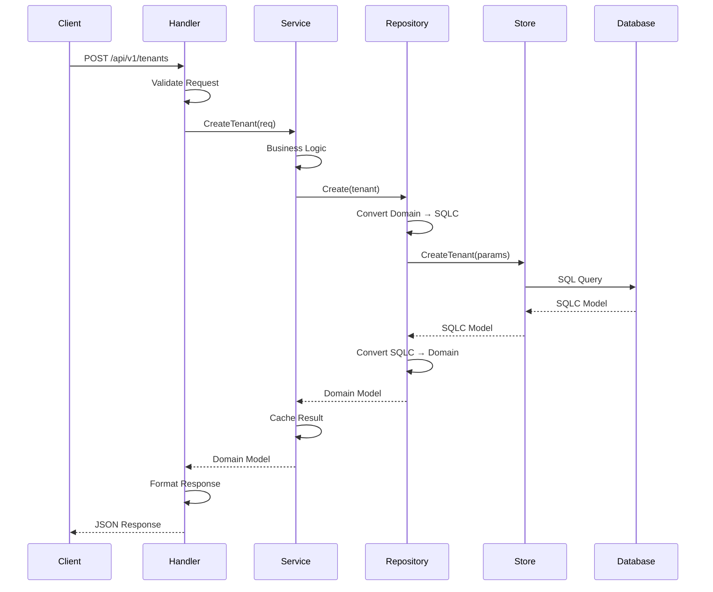
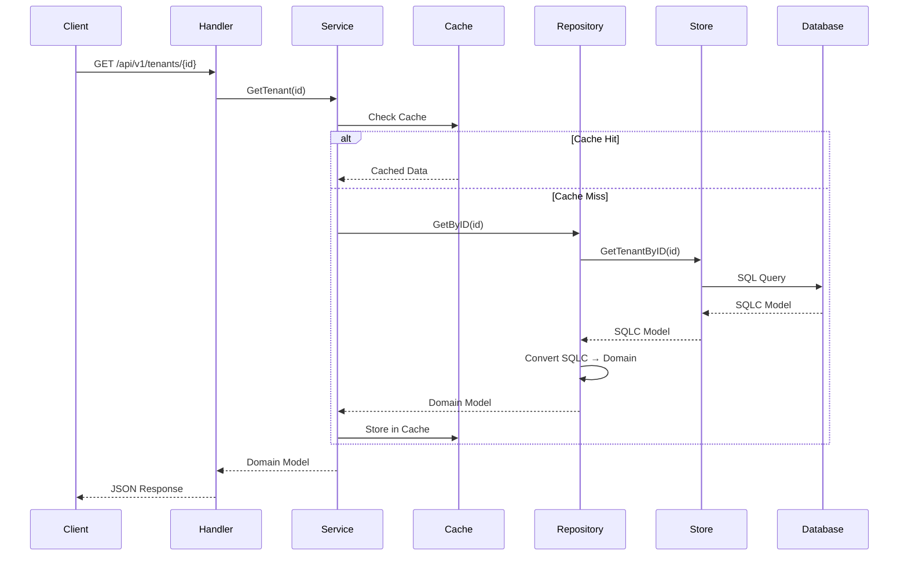

# Data Flow Pattern Guide

This document describes the data flow architecture and patterns used in our ERP system. It serves as a guide for new developers to understand how data moves through the application layers.

## 📋 Table of Contents

1. [Architecture Overview](#architecture-overview)
2. [Layer Responsibilities](#layer-responsibilities)
3. [Data Flow Patterns](#data-flow-patterns)
4. [SQLC Integration](#sqlc-integration)
5. [Code Examples](#code-examples)
6. [Best Practices](#best-practices)
7. [Common Patterns](#common-patterns)
8. [Error Handling](#error-handling)

## 🏗️ Architecture Overview

Our ERP system follows a **Clean Architecture** pattern with clear separation of concerns:

```
┌─────────────────────────────────────────────────────────────┐
│                    API Layer                                │
│  ┌─────────────┐  ┌─────────────┐  ┌─────────────┐        │
│  │   Handlers  │  │   Routers   │  │ Middleware  │        │
│  └─────────────┘  └─────────────┘  └─────────────┘        │
└─────────────────────────────────────────────────────────────┘
                              │
                              ▼
┌─────────────────────────────────────────────────────────────┐
│                  Core Business Layer                        │
│  ┌─────────────┐  ┌─────────────┐  ┌─────────────┐        │
│  │   Services  │  │   Models    │  │ Interfaces  │        │
│  └─────────────┘  └─────────────┘  └─────────────┘        │
└─────────────────────────────────────────────────────────────┘
                              │
                              ▼
┌─────────────────────────────────────────────────────────────┐
│                 Repository Layer                            │
│  ┌─────────────┐  ┌─────────────┐  ┌─────────────┐        │
│  │ Repositories│  │ Converters  │  │ SQLC Store  │        │
│  └─────────────┘  └─────────────┘  └─────────────┘        │
└─────────────────────────────────────────────────────────────┘
                              │
                              ▼
┌─────────────────────────────────────────────────────────────┐
│                Infrastructure Layer                         │
│  ┌─────────────┐  ┌─────────────┐  ┌─────────────┐        │
│  │  Database   │  │    Cache    │  │  External   │        │
│  │   (pgx)     │  │   (Redis)   │  │  Services   │        │
│  └─────────────┘  └─────────────┘  └─────────────┘        │
└─────────────────────────────────────────────────────────────┘
```

## 🎯 Layer Responsibilities

### **API Layer** (`/internal/api/`)
- **Handlers**: HTTP request/response handling, input validation, output formatting
- **Middleware**: Authentication, logging, rate limiting, tenant context
- **Routers**: Route definition and grouping

### **Core Business Layer** (`/internal/core/`)
- **Services**: Business logic, orchestration, caching, external service integration
- **Models**: Domain entities, value objects, request/response types
- **Interfaces**: Repository contracts, service interfaces

### **Repository Layer** (`/internal/core/*/repository.go`)
- **Repositories**: Data access abstraction, SQLC integration, error handling
- **Converters**: Transform between domain models and SQLC models

### **Infrastructure Layer** (`/internal/platform/`)
- **Database**: Connection management, transaction handling
- **Cache**: Redis integration, caching strategies
- **Configuration**: Environment-based configuration

## 🔄 Data Flow Patterns

### **1. Request Flow (Create Operation)**



### **2. Query Flow (Read Operation)**



## 🔧 SQLC Integration

### **Store Interface Pattern**

We use the SQLC-generated `Store` interface which provides:

```go
type Store interface {
    Querier                    // All SQLC generated methods
    SetTenantContext(ctx context.Context, tenantID uuid.UUID) error
    WithTenant(ctx context.Context, tenantID uuid.UUID, fn func(context.Context, Store) error) error
    WithTx(ctx context.Context, fn func(context.Context, Store) error) error
    Close()
}
```

### **Repository Integration**

```go
type repository struct {
    store db.Store  // SQLC Store interface
}

func (r *repository) Create(ctx context.Context, tenant *Tenant) error {
    // Convert domain model to SQLC params
    params := db.CreateTenantParams{
        Name:      tenant.Name,
        Slug:      tenant.Slug,
        Email:     tenant.Email,
        // ... other fields
    }
    
    // Use SQLC generated method
    _, err := r.store.CreateTenant(ctx, params)
    return err
}
```

## 💻 Code Examples

### **1. Handler Layer Example**

```go
// internal/api/handlers/tenant.go
func (h *TenantHandler) CreateTenant(c *gin.Context) {
    // 1. Parse and validate request
    var req tenant.CreateTenantRequest
    if err := c.ShouldBindJSON(&req); err != nil {
        c.JSON(http.StatusBadRequest, gin.H{"error": err.Error()})
        return
    }
    
    // 2. Call service layer
    newTenant, err := h.service.CreateTenant(c.Request.Context(), req)
    if err != nil {
        // 3. Handle business errors
        switch {
        case errors.Is(err, sharedErrors.ErrSubdomainAlreadyExists):
            c.JSON(http.StatusConflict, gin.H{"error": "Subdomain already exists"})
        default:
            c.JSON(http.StatusInternalServerError, gin.H{"error": "Internal server error"})
        }
        return
    }
    
    // 4. Return success response
    c.JSON(http.StatusCreated, newTenant)
}
```

### **2. Service Layer Example**

```go
// internal/core/tenant/service.go
func (s *service) CreateTenant(ctx context.Context, req CreateTenantRequest) (*Tenant, error) {
    // 1. Business validation
    if req.Subdomain != nil {
        exists, err := s.repo.Exists(ctx, *req.Subdomain)
        if err != nil {
            return nil, fmt.Errorf("failed to check subdomain: %w", err)
        }
        if exists {
            return nil, errors.ErrSubdomainAlreadyExists
        }
    }
    
    // 2. Create domain entity with business logic
    tenant := &Tenant{
        ID:           uuid.New(),
        Name:         req.Name,
        Slug:         req.Slug,
        Email:        req.Email,
        Subdomain:    req.Subdomain,
        Status:       StatusActive,
        Timezone:     "UTC",
        CurrencyCode: "USD",
        // ... apply business rules
    }
    
    // 3. Persist to repository
    if err := s.repo.Create(ctx, tenant); err != nil {
        return nil, fmt.Errorf("failed to create tenant: %w", err)
    }
    
    // 4. Cache the result
    if tenant.Subdomain != nil {
        cacheKey := fmt.Sprintf("tenant:subdomain:%s", *tenant.Subdomain)
        s.cache.Set(ctx, cacheKey, tenant, 30*time.Minute)
    }
    
    return tenant, nil
}
```

### **3. Repository Layer Example**

```go
// internal/core/tenant/repository.go
func (r *repository) Create(ctx context.Context, tenant *Tenant) error {
    // 1. Convert domain model to SQLC parameters
    params := db.CreateTenantParams{
        Name:      tenant.Name,
        Slug:      tenant.Slug,
        Email:     tenant.Email,
        Subdomain: tenant.Subdomain,
        Status:    string(tenant.Status),
        Industry:  tenant.Industry,
    }
    
    // 2. Use SQLC generated method
    _, err := r.store.CreateTenant(ctx, params)
    if err != nil {
        return fmt.Errorf("failed to create tenant: %w", err)
    }
    
    return nil
}

func (r *repository) GetByID(ctx context.Context, id uuid.UUID) (*Tenant, error) {
    // 1. Use SQLC generated method
    sqlcTenant, err := r.store.GetTenantByID(ctx, id)
    if err != nil {
        if err.Error() == "no rows in result set" {
            return nil, errors.ErrTenantNotFound
        }
        return nil, fmt.Errorf("failed to get tenant: %w", err)
    }
    
    // 2. Convert SQLC model to domain model
    return FromSQLCTenant(sqlcTenant)
}
```

### **4. Model Conversion Example**

```go
// internal/core/tenant/model.go
func FromSQLCTenant(sqlcTenant *db.Tenant) (*Tenant, error) {
    // Handle JSONB fields
    var metadata map[string]interface{}
    if len(sqlcTenant.Metadata) > 0 {
        if err := json.Unmarshal(sqlcTenant.Metadata, &metadata); err != nil {
            return nil, err
        }
    }
    
    var settings map[string]interface{}
    if len(sqlcTenant.Settings) > 0 {
        if err := json.Unmarshal(sqlcTenant.Settings, &settings); err != nil {
            return nil, err
        }
    }
    
    // Handle nullable fields
    var deletedAt *time.Time
    if sqlcTenant.DeletedAt.Valid {
        deletedAt = &sqlcTenant.DeletedAt.Time
    }
    
    return &Tenant{
        ID:                 sqlcTenant.ID,
        Slug:               sqlcTenant.Slug,
        Name:               sqlcTenant.Name,
        Email:              sqlcTenant.Email,
        Subdomain:          sqlcTenant.Subdomain,
        Status:             Status(sqlcTenant.Status),
        Timezone:           sqlcTenant.Timezone,
        CurrencyCode:       sqlcTenant.CurrencyCode,
        Metadata:           metadata,
        Settings:           settings,
        CreatedAt:          sqlcTenant.CreatedAt,
        UpdatedAt:          sqlcTenant.UpdatedAt,
        DeletedAt:          deletedAt,
    }, nil
}
```

## ✅ Best Practices

### **1. Dependency Direction**
- **Never import lower layers from higher layers**
- API layer can import Core layer
- Core layer cannot import API layer
- Repository layer uses dependency injection

### **2. Error Handling**
```go
// Use domain-specific errors
if err != nil {
    if err.Error() == "no rows in result set" {
        return nil, errors.ErrTenantNotFound  // Domain error
    }
    return nil, fmt.Errorf("failed to get tenant: %w", err)  // Wrap infrastructure error
}
```

### **3. Model Conversion**
- **Always convert at repository boundaries**
- Domain models stay in core layer
- SQLC models stay in repository layer
- Handle nullable fields properly

### **4. Transaction Handling**
```go
// Use Store.WithTx for transactions
err := store.WithTx(ctx, func(ctx context.Context, tx Store) error {
    // Multiple operations in transaction
    tenant, err := tx.CreateTenant(ctx, params)
    if err != nil {
        return err
    }
    
    return tx.CreateTenantConfiguration(ctx, configParams)
})
```

### **5. Tenant Context**
```go
// Use Store.WithTenant for multi-tenant operations
err := store.WithTenant(ctx, tenantID, func(ctx context.Context, store Store) error {
    // Operations with tenant context
    return store.CreateEntity(ctx, params)
})
```

## 🔄 Common Patterns

### **1. CRUD Operations Pattern**

```go
// Service Layer
func (s *service) CreateEntity(ctx context.Context, req CreateEntityRequest) (*Entity, error) {
    // Validation → Repository → Cache
}

func (s *service) GetEntity(ctx context.Context, id uuid.UUID) (*Entity, error) {
    // Cache → Repository → Cache Miss Handling
}

func (s *service) UpdateEntity(ctx context.Context, id uuid.UUID, req UpdateEntityRequest) error {
    // Repository → Cache Invalidation
}

func (s *service) DeleteEntity(ctx context.Context, id uuid.UUID) error {
    // Repository (Soft Delete) → Cache Invalidation
}
```

### **2. Caching Pattern**

```go
func (s *service) GetTenantBySubdomain(ctx context.Context, subdomain string) (*Tenant, error) {
    // 1. Check cache
    cacheKey := fmt.Sprintf("tenant:subdomain:%s", subdomain)
    var tenant Tenant
    if err := s.cache.Get(ctx, cacheKey, &tenant); err == nil {
        return &tenant, nil
    }
    
    // 2. Cache miss - get from repository
    dbTenant, err := s.repo.GetBySubdomain(ctx, subdomain)
    if err != nil {
        return nil, err
    }
    
    // 3. Cache the result
    s.cache.Set(ctx, cacheKey, dbTenant, 30*time.Minute)
    
    return dbTenant, nil
}
```

### **3. Validation Pattern**

```go
// Input validation at API layer
if err := c.ShouldBindJSON(&req); err != nil {
    return BadRequestError(err)
}

// Business validation at service layer
if req.Subdomain != nil {
    if len(*req.Subdomain) < 3 {
        return errors.ErrInvalidSubdomain
    }
}
```

## ⚠️ Error Handling

### **Error Flow Pattern**

```
Database Error → Repository (Wrap) → Service (Handle) → Handler (Format) → Client
```

### **Error Types**

1. **Domain Errors** (Business Logic)
   ```go
   var (
       ErrTenantNotFound          = errors.New("tenant not found")
       ErrSubdomainAlreadyExists  = errors.New("subdomain already exists")
       ErrInvalidTenantStatus     = errors.New("invalid tenant status")
   )
   ```

2. **Infrastructure Errors** (Technical)
   ```go
   // Always wrap with context
   return fmt.Errorf("failed to connect to database: %w", err)
   ```

3. **Validation Errors** (Input)
   ```go
   // Return structured validation errors
   type ValidationError struct {
       Field   string `json:"field"`
       Message string `json:"message"`
   }
   ```

### **Error Handling Example**

```go
// Repository Layer
func (r *repository) GetByID(ctx context.Context, id uuid.UUID) (*Tenant, error) {
    tenant, err := r.store.GetTenantByID(ctx, id)
    if err != nil {
        if err.Error() == "no rows in result set" {
            return nil, errors.ErrTenantNotFound  // Domain error
        }
        return nil, fmt.Errorf("failed to get tenant by ID: %w", err)  // Infrastructure error
    }
    return FromSQLCTenant(tenant)
}

// Service Layer
func (s *service) GetTenant(ctx context.Context, id uuid.UUID) (*Tenant, error) {
    tenant, err := s.repo.GetByID(ctx, id)
    if err != nil {
        // Let domain errors bubble up, wrap others
        if errors.Is(err, errors.ErrTenantNotFound) {
            return nil, err
        }
        return nil, fmt.Errorf("service: failed to get tenant: %w", err)
    }
    return tenant, nil
}

// Handler Layer
func (h *TenantHandler) GetTenant(c *gin.Context) {
    tenant, err := h.service.GetTenant(c.Request.Context(), id)
    if err != nil {
        switch {
        case errors.Is(err, errors.ErrTenantNotFound):
            c.JSON(http.StatusNotFound, gin.H{"error": "Tenant not found"})
        default:
            c.JSON(http.StatusInternalServerError, gin.H{"error": "Internal server error"})
        }
        return
    }
    c.JSON(http.StatusOK, tenant)
}
```

## 📚 Additional Resources

- [Clean Architecture by Robert C. Martin](https://blog.cleancoder.com/uncle-bob/2012/08/13/the-clean-architecture.html)
- [SQLC Documentation](https://docs.sqlc.dev/)
- [Domain-Driven Design](https://martinfowler.com/bliki/DomainDrivenDesign.html)
- [Go Project Layout](https://github.com/golang-standards/project-layout)

---

**Note**: This guide should be updated as the architecture evolves. Always refer to the actual code for the most current implementation details.