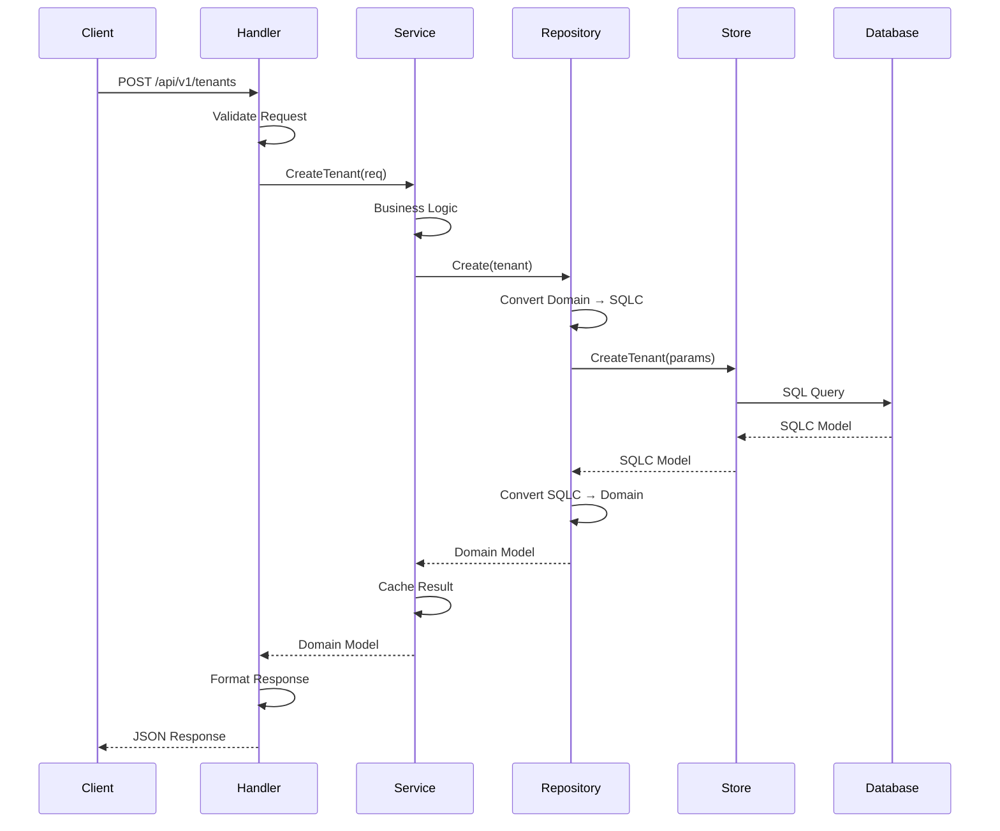
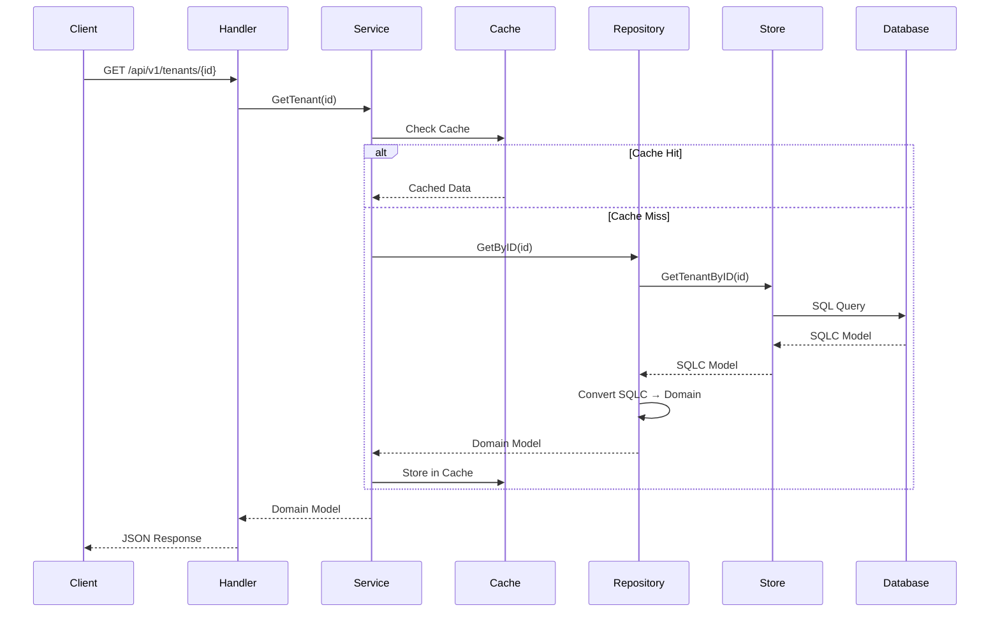
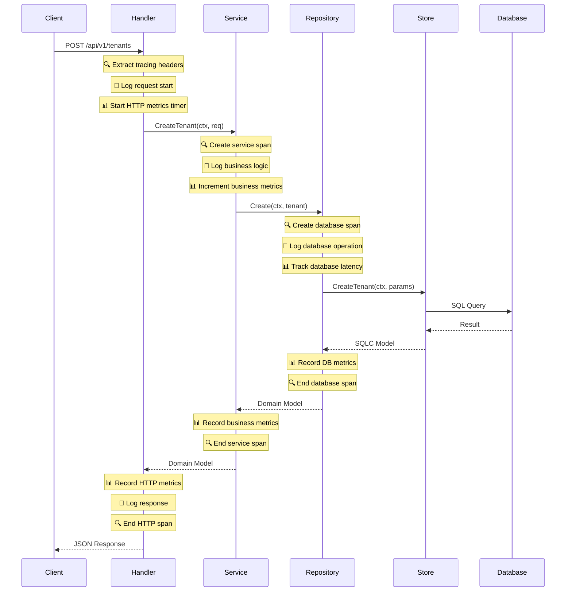

# Data Flow Pattern Guide

This document describes the data flow architecture and patterns used in our ERP system. It serves as a guide for new developers to understand how data moves through the application layers.

## 📋 Table of Contents

1. [Architecture Overview](#architecture-overview)
2. [Layer Responsibilities](#layer-responsibilities)
3. [Data Flow Patterns](#data-flow-patterns)
4. [SQLC Integration](#sqlc-integration)
5. [Observability Integration](#observability-integration)
6. [Code Examples](#code-examples)
7. [Best Practices](#best-practices)
8. [Common Patterns](#common-patterns)
9. [Error Handling](#error-handling)

## 🏗️ Architecture Overview

Our ERP system follows a **Clean Architecture** pattern with clear separation of concerns:

```
┌─────────────────────────────────────────────────────────────┐
│                    API Layer                                │
│  ┌─────────────┐  ┌─────────────┐  ┌─────────────┐        │
│  │   Handlers  │  │   Routers   │  │ Middleware  │        │
│  └─────────────┘  └─────────────┘  └─────────────┘        │
└─────────────────────────────────────────────────────────────┘
                              │
                              ▼
┌─────────────────────────────────────────────────────────────┐
│                  Core Business Layer                        │
│  ┌─────────────┐  ┌─────────────┐  ┌─────────────┐        │
│  │   Services  │  │   Models    │  │ Interfaces  │        │
│  └─────────────┘  └─────────────┘  └─────────────┘        │
└─────────────────────────────────────────────────────────────┘
                              │
                              ▼
┌─────────────────────────────────────────────────────────────┐
│                 Repository Layer                            │
│  ┌─────────────┐  ┌─────────────┐  ┌─────────────┐        │
│  │ Repositories│  │ Converters  │  │ SQLC Store  │        │
│  └─────────────┘  └─────────────┘  └─────────────┘        │
└─────────────────────────────────────────────────────────────┘
                              │
                              ▼
┌─────────────────────────────────────────────────────────────┐
│                Infrastructure Layer                         │
│  ┌─────────────┐  ┌─────────────┐  ┌─────────────┐        │
│  │  Database   │  │    Cache    │  │  External   │        │
│  │   (pgx)     │  │   (Redis)   │  │  Services   │        │
│  └─────────────┘  └─────────────┘  └─────────────┘        │
└─────────────────────────────────────────────────────────────┘
```

## 🎯 Layer Responsibilities

### **API Layer** (`/internal/api/`)
- **Handlers**: HTTP request/response handling, input validation, output formatting
- **Middleware**: Authentication, logging, rate limiting, tenant context
- **Routers**: Route definition and grouping

### **Core Business Layer** (`/internal/core/`)
- **Services**: Business logic, orchestration, caching, external service integration
- **Models**: Domain entities, value objects, request/response types
- **Interfaces**: Repository contracts, service interfaces

### **Repository Layer** (`/internal/core/*/repository.go`)
- **Repositories**: Data access abstraction, SQLC integration, error handling
- **Converters**: Transform between domain models and SQLC models

### **Infrastructure Layer** (`/internal/platform/`)
- **Database**: Connection management, transaction handling
- **Cache**: Redis integration, caching strategies
- **Configuration**: Environment-based configuration

## 🔄 Data Flow Patterns

### **1. Request Flow (Create Operation)**



### **2. Query Flow (Read Operation)**



## 🔧 SQLC Integration

### **Store Interface Pattern**

We use the SQLC-generated `Store` interface which provides:

```go
type Store interface {
    Querier                    // All SQLC generated methods
    SetTenantContext(ctx context.Context, tenantID uuid.UUID) error
    WithTenant(ctx context.Context, tenantID uuid.UUID, fn func(context.Context, Store) error) error
    WithTx(ctx context.Context, fn func(context.Context, Store) error) error
    Close()
}
```

### **Repository Integration**

```go
type repository struct {
    store db.Store  // SQLC Store interface
}

func (r *repository) Create(ctx context.Context, tenant *Tenant) error {
    // Convert domain model to SQLC params
    params := db.CreateTenantParams{
        Name:      tenant.Name,
        Slug:      tenant.Slug,
        Email:     tenant.Email,
        // ... other fields
    }
    
    // Use SQLC generated method
    _, err := r.store.CreateTenant(ctx, params)
    return err
}
```

## 📊 Observability Integration

Our system includes comprehensive observability through structured logging, distributed tracing, and metrics collection. All observability components are located in `internal/shared/` and are integrated throughout the application layers.

### **Logging Architecture**

We use a structured logging approach with multiple backend support:

```go
// internal/shared/logger/logger.go
type Logger interface {
    Debug(msg string, fields ...Fields)
    Info(msg string, fields ...Fields)
    Warn(msg string, fields ...Fields)
    Error(msg string, fields ...Fields)
    Fatal(msg string, fields ...Fields)
    
    DebugContext(ctx context.Context, msg string, fields ...Fields)
    InfoContext(ctx context.Context, msg string, fields ...Fields)
    WarnContext(ctx context.Context, msg string, fields ...Fields)
    ErrorContext(ctx context.Context, msg string, fields ...Fields)
    
    WithFields(fields Fields) Logger
    WithContext(ctx context.Context) Logger
}
```

**Supported Logger Types:**
- **Zap**: High-performance structured logging
- **Zerolog**: Zero-allocation JSON logger
- **Slog**: Go's standard structured logging (default)

### **Distributed Tracing**

OpenTelemetry-based tracing for request correlation and performance monitoring:

```go
// internal/shared/tracing/tracing.go
type TracingService struct {
    config   TracingConfig
    tracer   trace.Tracer
    provider *sdktrace.TracerProvider
}

// Start a new span
func (ts *TracingService) StartSpan(ctx context.Context, name string, opts ...SpanOption) (context.Context, Span)

// Extract/Inject HTTP headers for distributed tracing
func (ts *TracingService) InjectHTTPHeaders(ctx context.Context, headers http.Header)
func (ts *TracingService) ExtractHTTPHeaders(ctx context.Context, headers http.Header) context.Context
```

**Supported Exporters:**
- **Jaeger**: For development and testing
- **OTLP GRPC/HTTP**: For production observability platforms
- **Stdout**: For debugging and development

### **Metrics Collection**

Prometheus and OpenTelemetry metrics for performance monitoring:

```go
// internal/shared/metrics/metrics.go
type MetricsProvider interface {
    Counter(name, help string, labelKeys ...string) Counter
    Gauge(name, help string, labelKeys ...string) Gauge
    Histogram(name, help string, buckets []float64, labelKeys ...string) Histogram
    Timer(name string, labels Fields) Timer
}
```

**Supported Providers:**
- **Prometheus**: Industry-standard metrics collection
- **OpenTelemetry**: OTLP-compatible metrics

### **Observability in Data Flow**

Here's how observability is integrated into our data flow patterns:



### **Layer-Specific Observability Patterns**

#### **API Layer Observability**
```go
// HTTP request tracing and metrics
func (h *TenantHandler) CreateTenant(c *gin.Context) {
    // Extract tracing context
    ctx := h.tracing.ExtractHTTPHeaders(c.Request.Context(), c.Request.Header)
    
    // Start HTTP span
    ctx, span := h.tracing.StartSpan(ctx, "http.create_tenant", 
        tracing.WithSpanKind(tracing.SpanKindServer),
        tracing.WithAttributes(
            attribute.String("http.method", c.Request.Method),
            attribute.String("http.url", c.Request.URL.String()),
        ))
    defer span.End()
    
    // Start metrics timer
    timer := h.metrics.Timer("http_request_duration", metrics.Fields{
        "method": c.Request.Method,
        "endpoint": "/api/v1/tenants",
    })
    defer timer.Stop()
    
    // Log request
    logger.InfoContext(ctx, "Processing create tenant request", 
        logger.Fields{
            "method": c.Request.Method,
            "path": c.Request.URL.Path,
            "user_agent": c.Request.UserAgent(),
        })
    
    // Business logic...
    tenant, err := h.service.CreateTenant(ctx, req)
    if err != nil {
        // Record error in span
        h.tracing.RecordError(ctx, err, tracing.WithErrorStatus())
        
        // Increment error counter
        h.metrics.IncrementCounter("http_errors_total", metrics.Fields{
            "method": c.Request.Method,
            "endpoint": "/api/v1/tenants",
            "error_type": "business_error",
        })
        
        // Log error
        logger.ErrorContext(ctx, "Failed to create tenant", 
            logger.Fields{"error": err.Error()})
        
        // Handle error response...
        return
    }
    
    // Success metrics
    h.metrics.IncrementCounter("http_requests_total", metrics.Fields{
        "method": c.Request.Method,
        "endpoint": "/api/v1/tenants",
        "status": "success",
    })
    
    // Success response
    c.JSON(http.StatusCreated, tenant)
}
```

#### **Service Layer Observability**
```go
func (s *service) CreateTenant(ctx context.Context, req CreateTenantRequest) (*Tenant, error) {
    // Start service span
    ctx, span := s.tracing.StartSpan(ctx, "service.create_tenant",
        tracing.WithSpanKind(tracing.SpanKindInternal))
    defer span.End()
    
    // Add service attributes
    span.SetAttributes(
        attribute.String("tenant.name", req.Name),
        attribute.String("tenant.slug", req.Slug),
    )
    
    // Log business operation
    logger.InfoContext(ctx, "Starting tenant creation", 
        logger.Fields{
            "tenant_name": req.Name,
            "tenant_slug": req.Slug,
        })
    
    // Business validation with tracing
    if req.Subdomain != nil {
        ctx, validationSpan := s.tracing.StartSpan(ctx, "service.validate_subdomain")
        exists, err := s.repo.Exists(ctx, *req.Subdomain)
        if err != nil {
            validationSpan.RecordError(err)
            validationSpan.End()
            return nil, fmt.Errorf("failed to validate subdomain: %w", err)
        }
        validationSpan.End()
        
        if exists {
            // Record business metric
            s.metrics.IncrementCounter("tenant_creation_errors", metrics.Fields{
                "error_type": "subdomain_exists",
            })
            
            logger.WarnContext(ctx, "Subdomain already exists", 
                logger.Fields{"subdomain": *req.Subdomain})
                
            return nil, errors.ErrSubdomainAlreadyExists
        }
    }
    
    // Create tenant entity
    tenant := &Tenant{
        ID:   uuid.New(),
        Name: req.Name,
        Slug: req.Slug,
        // ... other fields
    }
    
    // Repository operation with metrics
    timer := s.metrics.Timer("repository_operation_duration", metrics.Fields{
        "operation": "create_tenant",
    })
    
    if err := s.repo.Create(ctx, tenant); err != nil {
        timer.Stop()
        s.metrics.IncrementCounter("repository_errors", metrics.Fields{
            "operation": "create_tenant",
        })
        
        logger.ErrorContext(ctx, "Failed to persist tenant", 
            logger.Fields{"error": err.Error()})
            
        return nil, fmt.Errorf("failed to create tenant: %w", err)
    }
    duration := timer.Stop()
    
    // Success metrics
    s.metrics.IncrementCounter("tenant_created_total", metrics.Fields{
        "status": "success",
    })
    
    s.metrics.ObserveHistogram("tenant_creation_duration", 
        duration.Seconds(), metrics.Fields{})
    
    logger.InfoContext(ctx, "Tenant created successfully", 
        logger.Fields{
            "tenant_id": tenant.ID.String(),
            "tenant_name": tenant.Name,
            "duration_ms": duration.Milliseconds(),
        })
    
    return tenant, nil
}
```

#### **Repository Layer Observability**
```go
func (r *repository) Create(ctx context.Context, tenant *Tenant) error {
    // Start database span
    ctx, span := r.tracing.StartSpan(ctx, "repository.create_tenant",
        tracing.WithSpanKind(tracing.SpanKindClient),
        tracing.WithAttributes(
            attribute.String("db.system", "postgresql"),
            attribute.String("db.operation", "create"),
            attribute.String("db.table", "tenants"),
        ))
    defer span.End()
    
    // Log database operation
    logger.DebugContext(ctx, "Creating tenant in database", 
        logger.Fields{
            "tenant_id": tenant.ID.String(),
            "operation": "create",
        })
    
    // Convert domain model to SQLC params
    params := db.CreateTenantParams{
        Name:      tenant.Name,
        Slug:      tenant.Slug,
        Email:     tenant.Email,
        Subdomain: tenant.Subdomain,
        Status:    string(tenant.Status),
    }
    
    // Execute database operation with metrics
    timer := r.metrics.Timer("database_query_duration", metrics.Fields{
        "operation": "create_tenant",
        "table": "tenants",
    })
    
    _, err := r.store.CreateTenant(ctx, params)
    duration := timer.Stop()
    
    if err != nil {
        // Database error metrics
        r.metrics.IncrementCounter("database_errors_total", metrics.Fields{
            "operation": "create_tenant",
            "error_type": "sql_error",
        })
        
        // Record error in span
        span.RecordError(err)
        span.SetStatus(codes.Error, "Database operation failed")
        
        logger.ErrorContext(ctx, "Database operation failed", 
            logger.Fields{
                "error": err.Error(),
                "operation": "create_tenant",
                "duration_ms": duration.Milliseconds(),
            })
        
        return fmt.Errorf("failed to create tenant: %w", err)
    }
    
    // Success metrics
    r.metrics.IncrementCounter("database_operations_total", metrics.Fields{
        "operation": "create_tenant",
        "status": "success",
    })
    
    r.metrics.ObserveHistogram("database_query_duration", 
        duration.Seconds(), metrics.Fields{
            "operation": "create_tenant",
        })
    
    logger.DebugContext(ctx, "Tenant created successfully in database", 
        logger.Fields{
            "tenant_id": tenant.ID.String(),
            "duration_ms": duration.Milliseconds(),
        })
    
    return nil
}
```

### **Configuration Examples**

#### **Logger Configuration**
```go
// Initialize logger from environment
logger.InitializeFromEnv()

// Or with custom config
config := logger.Config{
    Type:        logger.ZapLogger,
    Level:       logger.InfoLevel,
    Format:      "json",
    ServiceName: "erp-api",
    Version:     "1.0.0",
    Development: false,
}
logger.Initialize(config)
```

#### **Tracing Configuration**
```go
tracingConfig := tracing.TracingConfig{
    ServiceName:    "erp-api",
    ServiceVersion: "1.0.0",
    Environment:    "production",
    ExporterType:   tracing.OTLPGRPCExporter,
    SamplingRatio:  0.1, // 10% sampling
    Enabled:        true,
    ExporterConfig: tracing.ExporterConfig{
        OTLPEndpoint: "http://jaeger:14268/api/traces",
    },
}

tracingService, err := tracing.NewTracingService(tracingConfig)
```

#### **Metrics Configuration**
```go
metricsConfig := metrics.MetricsConfig{
    Provider:  "prometheus",
    Namespace: "erp",
    Subsystem: "api",
    Enabled:   true,
}

metricsService, err := metrics.NewMetricsService(metricsConfig)
```

### **Environment Variables**

```bash
# Logging
LOG_TYPE=zap                    # zap, zerolog, slog
LOG_LEVEL=info                  # debug, info, warn, error, fatal
LOG_FORMAT=json                 # json, text, console
LOG_DEVELOPMENT=false
SERVICE_NAME=erp-api
SERVICE_VERSION=1.0.0

# Tracing
OTEL_SERVICE_NAME=erp-api
OTEL_SERVICE_VERSION=1.0.0
OTEL_EXPORTER_OTLP_ENDPOINT=http://jaeger:14268
OTEL_RESOURCE_ATTRIBUTES=environment=production

# Metrics
METRICS_PROVIDER=prometheus
METRICS_ENABLED=true
METRICS_NAMESPACE=erp
METRICS_SUBSYSTEM=api
```

## 💻 Code Examples

### **1. Handler Layer Example**

```go
// internal/api/handlers/tenant.go
func (h *TenantHandler) CreateTenant(c *gin.Context) {
    // 1. Parse and validate request
    var req tenant.CreateTenantRequest
    if err := c.ShouldBindJSON(&req); err != nil {
        c.JSON(http.StatusBadRequest, gin.H{"error": err.Error()})
        return
    }
    
    // 2. Call service layer
    newTenant, err := h.service.CreateTenant(c.Request.Context(), req)
    if err != nil {
        // 3. Handle business errors
        switch {
        case errors.Is(err, sharedErrors.ErrSubdomainAlreadyExists):
            c.JSON(http.StatusConflict, gin.H{"error": "Subdomain already exists"})
        default:
            c.JSON(http.StatusInternalServerError, gin.H{"error": "Internal server error"})
        }
        return
    }
    
    // 4. Return success response
    c.JSON(http.StatusCreated, newTenant)
}
```

### **2. Service Layer Example**

```go
// internal/core/tenant/service.go
func (s *service) CreateTenant(ctx context.Context, req CreateTenantRequest) (*Tenant, error) {
    // 1. Business validation
    if req.Subdomain != nil {
        exists, err := s.repo.Exists(ctx, *req.Subdomain)
        if err != nil {
            return nil, fmt.Errorf("failed to check subdomain: %w", err)
        }
        if exists {
            return nil, errors.ErrSubdomainAlreadyExists
        }
    }
    
    // 2. Create domain entity with business logic
    tenant := &Tenant{
        ID:           uuid.New(),
        Name:         req.Name,
        Slug:         req.Slug,
        Email:        req.Email,
        Subdomain:    req.Subdomain,
        Status:       StatusActive,
        Timezone:     "UTC",
        CurrencyCode: "USD",
        // ... apply business rules
    }
    
    // 3. Persist to repository
    if err := s.repo.Create(ctx, tenant); err != nil {
        return nil, fmt.Errorf("failed to create tenant: %w", err)
    }
    
    // 4. Cache the result
    if tenant.Subdomain != nil {
        cacheKey := fmt.Sprintf("tenant:subdomain:%s", *tenant.Subdomain)
        s.cache.Set(ctx, cacheKey, tenant, 30*time.Minute)
    }
    
    return tenant, nil
}
```

### **3. Repository Layer Example**

```go
// internal/core/tenant/repository.go
func (r *repository) Create(ctx context.Context, tenant *Tenant) error {
    // 1. Convert domain model to SQLC parameters
    params := db.CreateTenantParams{
        Name:      tenant.Name,
        Slug:      tenant.Slug,
        Email:     tenant.Email,
        Subdomain: tenant.Subdomain,
        Status:    string(tenant.Status),
        Industry:  tenant.Industry,
    }
    
    // 2. Use SQLC generated method
    _, err := r.store.CreateTenant(ctx, params)
    if err != nil {
        return fmt.Errorf("failed to create tenant: %w", err)
    }
    
    return nil
}

func (r *repository) GetByID(ctx context.Context, id uuid.UUID) (*Tenant, error) {
    // 1. Use SQLC generated method
    sqlcTenant, err := r.store.GetTenantByID(ctx, id)
    if err != nil {
        if err.Error() == "no rows in result set" {
            return nil, errors.ErrTenantNotFound
        }
        return nil, fmt.Errorf("failed to get tenant: %w", err)
    }
    
    // 2. Convert SQLC model to domain model
    return FromSQLCTenant(sqlcTenant)
}
```

### **4. Model Conversion Example**

```go
// internal/core/tenant/model.go
func FromSQLCTenant(sqlcTenant *db.Tenant) (*Tenant, error) {
    // Handle JSONB fields
    var metadata map[string]interface{}
    if len(sqlcTenant.Metadata) > 0 {
        if err := json.Unmarshal(sqlcTenant.Metadata, &metadata); err != nil {
            return nil, err
        }
    }
    
    var settings map[string]interface{}
    if len(sqlcTenant.Settings) > 0 {
        if err := json.Unmarshal(sqlcTenant.Settings, &settings); err != nil {
            return nil, err
        }
    }
    
    // Handle nullable fields
    var deletedAt *time.Time
    if sqlcTenant.DeletedAt.Valid {
        deletedAt = &sqlcTenant.DeletedAt.Time
    }
    
    return &Tenant{
        ID:                 sqlcTenant.ID,
        Slug:               sqlcTenant.Slug,
        Name:               sqlcTenant.Name,
        Email:              sqlcTenant.Email,
        Subdomain:          sqlcTenant.Subdomain,
        Status:             Status(sqlcTenant.Status),
        Timezone:           sqlcTenant.Timezone,
        CurrencyCode:       sqlcTenant.CurrencyCode,
        Metadata:           metadata,
        Settings:           settings,
        CreatedAt:          sqlcTenant.CreatedAt,
        UpdatedAt:          sqlcTenant.UpdatedAt,
        DeletedAt:          deletedAt,
    }, nil
}
```

## ✅ Best Practices

### **1. Dependency Direction**
- **Never import lower layers from higher layers**
- API layer can import Core layer
- Core layer cannot import API layer
- Repository layer uses dependency injection

### **2. Error Handling**
```go
// Use domain-specific errors
if err != nil {
    if err.Error() == "no rows in result set" {
        return nil, errors.ErrTenantNotFound  // Domain error
    }
    return nil, fmt.Errorf("failed to get tenant: %w", err)  // Wrap infrastructure error
}
```

### **3. Model Conversion**
- **Always convert at repository boundaries**
- Domain models stay in core layer
- SQLC models stay in repository layer
- Handle nullable fields properly

### **4. Transaction Handling**
```go
// Use Store.WithTx for transactions
err := store.WithTx(ctx, func(ctx context.Context, tx Store) error {
    // Multiple operations in transaction
    tenant, err := tx.CreateTenant(ctx, params)
    if err != nil {
        return err
    }
    
    return tx.CreateTenantConfiguration(ctx, configParams)
})
```

### **5. Tenant Context**
```go
// Use Store.WithTenant for multi-tenant operations
err := store.WithTenant(ctx, tenantID, func(ctx context.Context, store Store) error {
    // Operations with tenant context
    return store.CreateEntity(ctx, params)
})
```

### **6. Observability Integration**
```go
// Always use context-aware logging
logger.InfoContext(ctx, "Processing request", logger.Fields{
    "operation": "create_tenant",
    "tenant_id": tenantID,
})

// Include tracing in all service operations
ctx, span := tracing.StartSpan(ctx, "service.operation")
defer span.End()

// Record metrics for all key operations
timer := metrics.Timer("operation_duration", metrics.Fields{
    "operation": "create_tenant",
})
defer timer.Stop()
```

## 🔄 Common Patterns

### **1. CRUD Operations Pattern**

```go
// Service Layer
func (s *service) CreateEntity(ctx context.Context, req CreateEntityRequest) (*Entity, error) {
    // Validation → Repository → Cache
}

func (s *service) GetEntity(ctx context.Context, id uuid.UUID) (*Entity, error) {
    // Cache → Repository → Cache Miss Handling
}

func (s *service) UpdateEntity(ctx context.Context, id uuid.UUID, req UpdateEntityRequest) error {
    // Repository → Cache Invalidation
}

func (s *service) DeleteEntity(ctx context.Context, id uuid.UUID) error {
    // Repository (Soft Delete) → Cache Invalidation
}
```

### **2. Caching Pattern with Observability**

```go
func (s *service) GetTenantBySubdomain(ctx context.Context, subdomain string) (*Tenant, error) {
    // Start service span
    ctx, span := s.tracing.StartSpan(ctx, "service.get_tenant_by_subdomain")
    defer span.End()
    
    span.SetAttributes(attribute.String("tenant.subdomain", subdomain))
    
    // 1. Check cache with metrics
    cacheKey := fmt.Sprintf("tenant:subdomain:%s", subdomain)
    var tenant Tenant
    
    cacheTimer := s.metrics.Timer("cache_operation_duration", metrics.Fields{
        "operation": "get",
        "cache_key": "tenant_subdomain",
    })
    
    if err := s.cache.Get(ctx, cacheKey, &tenant); err == nil {
        cacheTimer.Stop()
        
        // Cache hit metrics
        s.metrics.IncrementCounter("cache_hits_total", metrics.Fields{
            "cache_key": "tenant_subdomain",
        })
        
        logger.DebugContext(ctx, "Cache hit for tenant subdomain", 
            logger.Fields{"subdomain": subdomain})
            
        return &tenant, nil
    }
    cacheTimer.Stop()
    
    // Cache miss metrics
    s.metrics.IncrementCounter("cache_misses_total", metrics.Fields{
        "cache_key": "tenant_subdomain",
    })
    
    logger.DebugContext(ctx, "Cache miss for tenant subdomain", 
        logger.Fields{"subdomain": subdomain})
    
    // 2. Cache miss - get from repository
    dbTenant, err := s.repo.GetBySubdomain(ctx, subdomain)
    if err != nil {
        logger.ErrorContext(ctx, "Failed to get tenant by subdomain", 
            logger.Fields{
                "subdomain": subdomain,
                "error": err.Error(),
            })
        return nil, err
    }
    
    // 3. Cache the result
    s.cache.Set(ctx, cacheKey, dbTenant, 30*time.Minute)
    
    logger.InfoContext(ctx, "Tenant retrieved and cached", 
        logger.Fields{
            "tenant_id": dbTenant.ID.String(),
            "subdomain": subdomain,
        })
    
    return dbTenant, nil
}
```

### **3. Validation Pattern**

```go
// Input validation at API layer
if err := c.ShouldBindJSON(&req); err != nil {
    return BadRequestError(err)
}

// Business validation at service layer
if req.Subdomain != nil {
    if len(*req.Subdomain) < 3 {
        return errors.ErrInvalidSubdomain
    }
}
```

## ⚠️ Error Handling

### **Error Flow Pattern**

```
Database Error → Repository (Wrap) → Service (Handle) → Handler (Format) → Client
```

### **Error Types**

1. **Domain Errors** (Business Logic)
   ```go
   var (
       ErrTenantNotFound          = errors.New("tenant not found")
       ErrSubdomainAlreadyExists  = errors.New("subdomain already exists")
       ErrInvalidTenantStatus     = errors.New("invalid tenant status")
   )
   ```

2. **Infrastructure Errors** (Technical)
   ```go
   // Always wrap with context
   return fmt.Errorf("failed to connect to database: %w", err)
   ```

3. **Validation Errors** (Input)
   ```go
   // Return structured validation errors
   type ValidationError struct {
       Field   string `json:"field"`
       Message string `json:"message"`
   }
   ```

### **Error Handling Example**

```go
// Repository Layer
func (r *repository) GetByID(ctx context.Context, id uuid.UUID) (*Tenant, error) {
    tenant, err := r.store.GetTenantByID(ctx, id)
    if err != nil {
        if err.Error() == "no rows in result set" {
            return nil, errors.ErrTenantNotFound  // Domain error
        }
        return nil, fmt.Errorf("failed to get tenant by ID: %w", err)  // Infrastructure error
    }
    return FromSQLCTenant(tenant)
}

// Service Layer
func (s *service) GetTenant(ctx context.Context, id uuid.UUID) (*Tenant, error) {
    tenant, err := s.repo.GetByID(ctx, id)
    if err != nil {
        // Let domain errors bubble up, wrap others
        if errors.Is(err, errors.ErrTenantNotFound) {
            return nil, err
        }
        return nil, fmt.Errorf("service: failed to get tenant: %w", err)
    }
    return tenant, nil
}

// Handler Layer
func (h *TenantHandler) GetTenant(c *gin.Context) {
    tenant, err := h.service.GetTenant(c.Request.Context(), id)
    if err != nil {
        switch {
        case errors.Is(err, errors.ErrTenantNotFound):
            c.JSON(http.StatusNotFound, gin.H{"error": "Tenant not found"})
        default:
            c.JSON(http.StatusInternalServerError, gin.H{"error": "Internal server error"})
        }
        return
    }
    c.JSON(http.StatusOK, tenant)
}
```

## 📚 Additional Resources

- [Clean Architecture by Robert C. Martin](https://blog.cleancoder.com/uncle-bob/2012/08/13/the-clean-architecture.html)
- [SQLC Documentation](https://docs.sqlc.dev/)
- [Domain-Driven Design](https://martinfowler.com/bliki/DomainDrivenDesign.html)
- [Go Project Layout](https://github.com/golang-standards/project-layout)

---

**Note**: This guide should be updated as the architecture evolves. Always refer to the actual code for the most current implementation details.