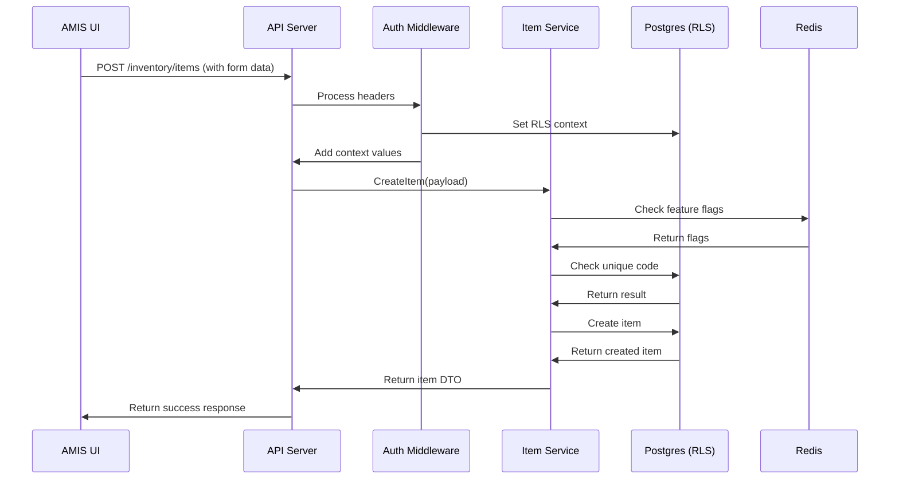

Let's implement the "Create Item" feature step-by-step, covering all layers of the application from database to UI. This will demonstrate how the components work together in our multi-tenant ERP system.

### 1. Database Migration
**File:** `migrations/202309011300_create_items_table.sql`
```sql
CREATE TABLE items (
  uuid UUID PRIMARY KEY DEFAULT gen_random_uuid(),
  tenant_id INT NOT NULL REFERENCES tenants(id) ON DELETE CASCADE,
  entity_id UUID NOT NULL REFERENCES entities(uuid) ON DELETE CASCADE,
  code VARCHAR(50) NOT NULL, -- Unique within tenant and entity
  name VARCHAR(255) NOT NULL,
  description TEXT,
  unit VARCHAR(20) CHECK (unit IN ('each', 'kg', 'm', 'L')),
  item_type VARCHAR(20) CHECK (item_type IN ('inventory', 'service', 'non-inventory')),
  created_at TIMESTAMPTZ NOT NULL DEFAULT NOW(),
  updated_at TIMESTAMPTZ NOT NULL DEFAULT NOW(),
  
  UNIQUE (tenant_id, entity_id, code)
);

-- Enable RLS and create policy
ALTER TABLE items ENABLE ROW LEVEL SECURITY;

CREATE POLICY items_tenant_isolation ON items
USING (
  tenant_id = current_setting('app.current_tenant')::INT
  AND entity_id IN (
    SELECT descendant FROM entity_closure
    WHERE path LIKE current_setting('app.entity_path') || '%'
  )
);
```

### 2. SQLC Queries
**File:** `sqlc/items.sql`
```sql
-- name: CreateItem :one
INSERT INTO items (
  tenant_id,
  entity_id,
  code,
  name,
  description,
  unit,
  item_type
) VALUES (
  $1, $2, $3, $4, $5, $6, $7
) RETURNING *;

-- name: GetItemByCode :one
SELECT * FROM items 
WHERE tenant_id = $1 AND entity_id = $2 AND code = $3;
```

### 3. Goa API Design
**File:** `design/inventory.go`
```go
package design

import . "goa.design/goa/v3/dsl"

var _ = Service("inventory", func() {
  Description("Inventory management")
  
  HTTP(func() {
    Path("/inventory")
  })

  Method("create_item", func() {
    Payload(func() {
      Attribute("entity_id", String, "Entity ID")
      Attribute("code", String, "Item code")
      Attribute("name", String, "Item name")
      Attribute("description", String, "Description")
      Attribute("unit", String, "Unit of measure")
      Attribute("item_type", String, "Item type")
      Required("entity_id", "code", "name", "item_type")
    })
    
    Result(func() {
      Attribute("uuid", String)
      Attribute("code", String)
      // ... other fields
    })
    
    HTTP(func() {
      POST("/items")
    })
    
    GRPC(func() {})
  })
})
```

### 4. Service Implementation
**File:** `internal/domain/inventory/item_service.go`
```go
package inventory

import (
  "context"
  "errors"
  
  "github.com/google/uuid"
  "yourproject/gen/inventory"
  "yourproject/internal/storage/postgres"
  "yourproject/internal/authz"
)

type ItemService struct {
  repo  *postgres.Queries
  authz *authz.Enforcer
}

func (s *ItemService) CreateItem(ctx context.Context, payload *inventory.CreateItemPayload) (*inventory.Item, error) {
  // Get context values
  tenantID := ctx.Value(authz.TenantKey).(int)
  userID := ctx.Value(authz.UserKey).(uuid.UUID)
  
  // Check permission
  if !s.authz.Enforce(userID, "item", "create", payload.EntityID) {
    return nil, inventory.MakeUnauthorized(
      errors.New("unauthorized item creation"))
  }
  
  // Check if code exists
  existing, _ := s.repo.GetItemByCode(ctx, postgres.GetItemByCodeParams{
    TenantID: int32(tenantID),
    EntityID: uuid.MustParse(payload.EntityID),
    Code:     payload.Code,
  })
  if existing != nil {
    return nil, inventory.MakeBadRequest(
      errors.New("item code must be unique"))
  }
  
  // Create item
  item, err := s.repo.CreateItem(ctx, postgres.CreateItemParams{
    TenantID:  int32(tenantID),
    EntityID:  uuid.MustParse(payload.EntityID),
    Code:      payload.Code,
    Name:      payload.Name,
    Description: payload.Description,
    Unit:      payload.Unit,
    ItemType:  payload.ItemType,
  })
  
  if err != nil {
    return nil, err
  }
  
  // Return created item
  return &inventory.Item{
    Uuid:        item.UUID.String(),
    EntityId:    item.EntityID.String(),
    Code:        item.Code,
    Name:        item.Name,
    Description: item.Description,
    Unit:        item.Unit,
    ItemType:    item.ItemType,
  }, nil
}
```

### 5. Authorization Middleware
**File:** `internal/authz/middleware.go`
```go
func AuthorizationMiddleware(next http.Handler) http.Handler {
  return http.HandlerFunc(func(w http.ResponseWriter, r *http.Request) {
    // Extract from JWT
    tenantID := r.Header.Get("X-Tenant-ID")
    userID := r.Header.Get("X-User-ID")
    entityID := r.Header.Get("X-Entity-Context")
    
    // Set context values
    ctx := context.WithValue(r.Context(), TenantKey, tenantID)
    ctx = context.WithValue(ctx, UserKey, userID)
    ctx = context.WithValue(ctx, EntityKey, entityID)
    
    // Set RLS context
    db := database.FromContext(ctx)
    db.Exec(`SET app.current_tenant = $1`, tenantID)
    db.Exec(`SET app.entity_path = (
      SELECT path FROM entity_closure 
      WHERE descendant = $1
    )`, entityID)
    
    next.ServeHTTP(w, r.WithContext(ctx))
  })
}
```

### 6. AMIS UI Configuration
**File:** `web-ui/items/create.json`
```json
{
  "type": "page",
  "title": "Create New Item",
  "body": [
    {
      "type": "form",
      "api": {
        "method": "POST",
        "url": "/inventory/items",
        "data": {
          "entity_id": "${entity_id}",
          "code": "${code}",
          "name": "${name}",
          "description": "${description}",
          "unit": "${unit}",
          "item_type": "${item_type}"
        }
      },
      "controls": [
        {
          "type": "text",
          "name": "code",
          "label": "Item Code",
          "required": true
        },
        {
          "type": "text",
          "name": "name",
          "label": "Item Name",
          "required": true
        },
        {
          "type": "textarea",
          "name": "description",
          "label": "Description"
        },
        {
          "type": "select",
          "name": "unit",
          "label": "Unit",
          "options": [
            {"label": "Each", "value": "each"},
            {"label": "Kilogram", "value": "kg"},
            {"label": "Meter", "value": "m"},
            {"label": "Liter", "value": "L"}
          ]
        },
        {
          "type": "select",
          "name": "item_type",
          "label": "Item Type",
          "options": [
            {"label": "Inventory", "value": "inventory"},
            {"label": "Service", "value": "service"},
            {"label": "Non-Inventory", "value": "non-inventory"}
          ],
          "required": true
        },
        {
          "type": "submit",
          "label": "Create Item"
        }
      ]
    }
  ]
}
```

### 7. Testing the Feature
#### Step 1: Apply Migration
```bash
migrator apply
```

#### Step 2: Generate Code
```bash
goa gen ./design
sqlc generate
```

#### Step 3: Start Services
```bash
# Start API server
go run cmd/api-server/main.go

# Start Temporal worker
go run cmd/temporal-worker/main.go
```

#### Step 4: Test with cURL
```bash
curl -X POST http://localhost:8080/inventory/items \
  -H "Content-Type: application/json" \
  -H "X-Tenant-ID: 123" \
  -H "X-User-ID: a0eebc99-9c0b-4ef8-bb6d-6bb9bd380a11" \
  -H "X-Entity-Context: 550e8400-e29b-41d4-a716-446655440000" \
  -d '{
    "entity_id": "550e8400-e29b-41d4-a716-446655440000",
    "code": "LAPTOP-001",
    "name": "Premium Laptop",
    "description": "15-inch business laptop",
    "unit": "each",
    "item_type": "inventory"
  }'
```

#### Step 5: Verify in UI
1. Navigate to `/items/create`
2. Fill the form
3. Submit and verify success notification
4. Check database: `SELECT * FROM items WHERE code = 'LAPTOP-001'`

### Implementation Workflow


### Generic Feature Implementation Guide
1. **Database Layer**:
   - Create migration script
   - Define RLS policies
   - Add SQLC queries

2. **API Contract**:
   - Define Goa DSL design
   - Generate interfaces with `goa gen`

3. **Business Logic**:
   - Implement service in `internal/domain`
   - Add authorization checks
   - Include feature flag gates
   - Add Temporal workflows if needed

4. **UI Layer**:
   - Create AMIS JSON configuration
   - Add context-sensitive elements
   - Implement validation rules

5. **Testing**:
   - Unit tests for business logic
   - Integration tests for API endpoints
   - Manual verification in UI
   - Verify RLS enforcement

6. **Deployment**:
   - Add feature flag toggle in admin UI
   - Run migrations before deployment
   - Monitor Temporal workflows

### Key Best Practices
1. **Context Propagation**:
   - Always pass context through all layers
   - Store tenant/user/entity in context
   - Use context for timeouts and cancellation

2. **Error Handling**:
   - Use domain-specific error types
   - Convert DB errors to user-friendly messages
   - Log errors with sufficient context

3. **Validation**:
   - Database constraints as first defense
   - Business logic validation as second layer
   - Client-side validation in UI

4. **Observability**:
   - Add tracing to Temporal workflows
   - Log feature flag evaluations
   - Monitor RLS policy violations

5. **Security**:
   - Always verify tenant context
   - Use RLS as final enforcement layer
   - Audit sensitive operations

This implementation follows clean architecture principles with clear separation between:
- Infrastructure (DB, Redis)
- Application logic (services)
- Interfaces (API, UI)
- Domain models

The pattern ensures that your ERP system remains maintainable as it grows from a single-person project to a scalable solution.
