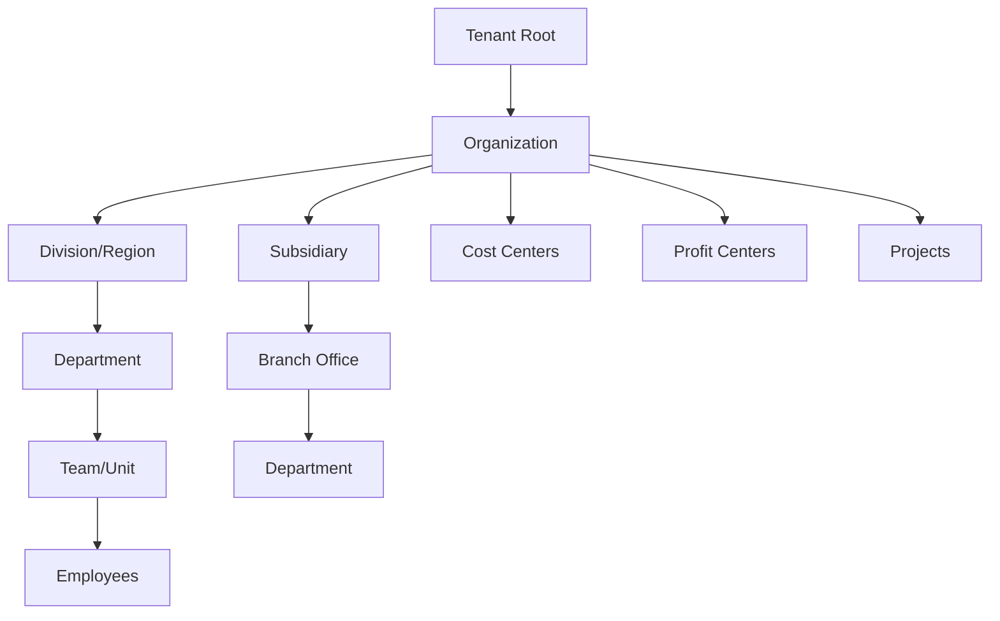

# Tenant Management

## 🏢 Overview

The ERP system is built on a sophisticated multi-tenant architecture that allows multiple organizations to share the same application infrastructure while maintaining complete data isolation and customization capabilities. Each tenant represents a distinct business entity with its own users, data, and configuration.

## 🎯 Multi-Tenancy Strategy

### Tenant Isolation Models

#### 1. Database-Level Isolation (Schema per Tenant)
```sql
-- Each tenant gets its own database schema
CREATE SCHEMA tenant_acme_corp;
CREATE SCHEMA tenant_global_ltd;

-- Tables are created within tenant schemas
CREATE TABLE tenant_acme_corp.sales_orders (
    id UUID PRIMARY KEY,
    order_number VARCHAR(50) NOT NULL,
    customer_id UUID,
    total_amount DECIMAL(15,2),
    created_at TIMESTAMPTZ DEFAULT NOW()
);
```

#### 2. Row-Level Security (Shared Tables)
```sql
-- Enable RLS on shared tables
ALTER TABLE sales_orders ENABLE ROW LEVEL SECURITY;

-- Create tenant-specific policies
CREATE POLICY tenant_isolation ON sales_orders
    FOR ALL TO application_user
    USING (tenant_id = current_setting('app.current_tenant_id')::UUID);

-- Set tenant context in application
SET app.current_tenant_id = 'acme-corp-uuid-here';
```

#### 3. Hybrid Approach (Recommended)
- **Core tables**: Row-level security for better resource utilization
- **High-volume tables**: Schema separation for performance
- **Sensitive data**: Complete schema isolation

## 🏗️ Tenant Hierarchy & Structure

### Organization Hierarchy



### Data Model

```sql
-- Tenant root entity
CREATE TABLE tenants (
    id UUID PRIMARY KEY DEFAULT gen_random_uuid(),
    name VARCHAR(255) NOT NULL,
    slug VARCHAR(100) UNIQUE NOT NULL,
    domain VARCHAR(255),
    status VARCHAR(20) DEFAULT 'active', -- active, suspended, terminated
    created_at TIMESTAMPTZ DEFAULT NOW(),
    subscription_plan VARCHAR(50),
    settings JSONB DEFAULT '{}',
    
    -- Compliance and legal
    country_code CHAR(2),
    currency_code CHAR(3),
    timezone VARCHAR(50),
    fiscal_year_start DATE,
    
    -- Billing information
    billing_email VARCHAR(255),
    billing_address JSONB,
    payment_method_id VARCHAR(255),
    
    CONSTRAINT valid_status CHECK (status IN ('active', 'suspended', 'terminated')),
    CONSTRAINT valid_country CHECK (country_code ~ '^[A-Z]{2}$'),
    CONSTRAINT valid_currency CHECK (currency_code ~ '^[A-Z]{3}$')
);

-- Organization hierarchy
CREATE TABLE organizations (
    id UUID PRIMARY KEY DEFAULT gen_random_uuid(),
    tenant_id UUID NOT NULL REFERENCES tenants(id) ON DELETE CASCADE,
    parent_id UUID REFERENCES organizations(id),
    name VARCHAR(255) NOT NULL,
    org_type VARCHAR(50) NOT NULL, -- company, division, department, team
    code VARCHAR(20) UNIQUE,
    description TEXT,
    
    -- Address and contact
    address JSONB,
    phone VARCHAR(20),
    email VARCHAR(255),
    website VARCHAR(255),
    
    -- Financial settings
    cost_center_code VARCHAR(20),
    profit_center_code VARCHAR(20),
    budget_allocated DECIMAL(15,2),
    
    -- Operational details
    manager_id UUID,
    is_active BOOLEAN DEFAULT true,
    created_at TIMESTAMPTZ DEFAULT NOW(),
    updated_at TIMESTAMPTZ DEFAULT NOW(),
    
    CONSTRAINT valid_org_type CHECK (org_type IN ('company', 'division', 'department', 'team', 'subsidiary', 'branch'))
);

-- Create indexes for performance
CREATE INDEX idx_organizations_tenant_id ON organizations(tenant_id);
CREATE INDEX idx_organizations_parent_id ON organizations(parent_id);
CREATE INDEX idx_organizations_manager_id ON organizations(manager_id);
```

## ⚙️ Tenant Configuration

### Feature Configuration

```yaml
# Tenant-specific feature configuration
tenant_features:
  modules:
    financial_management:
      enabled: true
      features:
        multi_currency: true
        budget_management: true
        advanced_reporting: false
    
    inventory_management:
      enabled: true
      features:
        multi_warehouse: true
        serial_tracking: true
        batch_tracking: false
    
    hr_management:
      enabled: true
      features:
        payroll_processing: true
        performance_management: false
        recruitment: true
    
    industry_modules:
      airline_reservation: false
      restaurant_management: false
      retail_management: true
      forecourt_management: false

  integrations:
    payment_gateways:
      stripe: true
      paypal: false
      square: true
    
    accounting_software:
      quickbooks: true
      xero: false
      sage: false
    
    communication:
      slack: true
      microsoft_teams: false
      email_notifications: true
```

### Customization Framework

```typescript
interface TenantSettings {
  branding: {
    logo_url: string;
    primary_color: string;
    secondary_color: string;
    font_family: string;
    custom_css?: string;
  };
  
  business_rules: {
    approval_workflows: ApprovalWorkflow[];
    number_sequences: NumberSequence[];
    validation_rules: ValidationRule[];
    custom_fields: CustomField[];
  };
  
  localization: {
    language: string;
    country: string;
    currency: string;
    date_format: string;
    number_format: string;
    timezone: string;
  };
  
  security: {
    password_policy: PasswordPolicy;
    session_timeout: number;
    ip_restrictions: string[];
    two_factor_required: boolean;
  };
  
  notifications: {
    email_settings: EmailSettings;
    sms_settings: SmsSettings;
    push_notification_settings: PushSettings;
  };
}
```

## 🔐 Tenant Security

### Data Isolation

#### Context-Based Security
```go
// Tenant context middleware
func TenantContextMiddleware() gin.HandlerFunc {
    return func(c *gin.Context) {
        // Extract tenant from subdomain, header, or JWT
        tenantID := extractTenantID(c)
        
        if tenantID == "" {
            c.JSON(401, gin.H{"error": "Tenant not found"})
            c.Abort()
            return
        }
        
        // Validate tenant status
        tenant, err := tenantService.GetTenant(tenantID)
        if err != nil || tenant.Status != "active" {
            c.JSON(403, gin.H{"error": "Tenant access denied"})
            c.Abort()
            return
        }
        
        // Set tenant context
        c.Set("tenant_id", tenantID)
        c.Set("tenant", tenant)
        
        // Set database context for RLS
        db := database.GetConnection()
        db.Exec("SET app.current_tenant_id = ?", tenantID)
        
        c.Next()
    }
}
```

#### Database Query Enforcement
```go
// Repository pattern with automatic tenant filtering
type BaseRepository struct {
    db       *gorm.DB
    tenantID string
}

func (r *BaseRepository) Find(dest interface{}, conditions ...interface{}) error {
    // Automatically add tenant filter to all queries
    return r.db.Where("tenant_id = ?", r.tenantID).Find(dest, conditions...).Error
}

func (r *BaseRepository) Create(value interface{}) error {
    // Automatically set tenant_id before creating
    if model, ok := value.(TenantModel); ok {
        model.SetTenantID(r.tenantID)
    }
    return r.db.Create(value).Error
}
```

### Access Control

#### Tenant-Level Permissions
```json
{
  "tenant_permissions": {
    "tenant_admin": [
      "tenant:settings:read",
      "tenant:settings:write",
      "tenant:users:manage",
      "tenant:modules:configure",
      "tenant:integrations:manage"
    ],
    "organization_admin": [
      "organization:settings:read",
      "organization:settings:write",
      "organization:users:read",
      "organization:users:invite"
    ],
    "department_manager": [
      "department:view",
      "department:users:read",
      "department:reports:generate"
    ]
  }
}
```

## 🚀 Tenant Provisioning

### Automated Tenant Setup

```yaml
# Tenant provisioning workflow
tenant_provisioning:
  steps:
    1. tenant_creation:
        - validate_tenant_data
        - create_tenant_record
        - generate_tenant_slug
        - setup_default_organization
    
    2. database_setup:
        - create_tenant_schema
        - run_schema_migrations
        - setup_default_data
        - configure_row_level_security
    
    3. user_setup:
        - create_admin_user
        - setup_default_roles
        - send_welcome_email
        - generate_setup_wizard_token
    
    4. configuration:
        - apply_plan_features
        - setup_default_workflows
        - configure_number_sequences
        - setup_default_chart_of_accounts
    
    5. integration_setup:
        - configure_email_service
        - setup_notification_channels
        - initialize_audit_logging
        - setup_backup_schedule

  rollback_procedures:
    - cleanup_database_schema
    - remove_user_accounts
    - delete_tenant_record
    - cleanup_file_storage
```

### Tenant Onboarding API

```typescript
interface TenantProvisioningRequest {
  company_name: string;
  admin_email: string;
  admin_first_name: string;
  admin_last_name: string;
  country_code: string;
  industry: string;
  company_size: number;
  subscription_plan: string;
  
  customization?: {
    custom_domain?: string;
    branding?: BrandingConfig;
    features?: FeatureConfig;
  };
}

// POST /api/v1/tenants/provision
async function provisionTenant(request: TenantProvisioningRequest): Promise<TenantProvisioningResponse> {
  // Step 1: Validate request
  await validateProvisioningRequest(request);
  
  // Step 2: Create tenant in transaction
  const tenant = await database.transaction(async (tx) => {
    const tenant = await createTenant(tx, request);
    await setupTenantSchema(tx, tenant.id);
    await createAdminUser(tx, tenant.id, request);
    return tenant;
  });
  
  // Step 3: Initialize tenant data
  await initializeTenantData(tenant.id, request);
  
  // Step 4: Send welcome email
  await sendTenantWelcomeEmail(tenant, request.admin_email);
  
  return {
    tenant_id: tenant.id,
    tenant_slug: tenant.slug,
    admin_setup_url: `https://${tenant.slug}.erp-system.com/setup`,
    status: 'provisioned'
  };
}
```

## 📊 Tenant Analytics & Monitoring

### Usage Metrics

```yaml
tenant_metrics:
  usage_tracking:
    - active_users_daily
    - active_users_monthly
    - api_requests_count
    - storage_usage_gb
    - data_transfer_gb
    - feature_usage_stats
  
  business_metrics:
    - transactions_processed
    - invoices_generated
    - orders_processed
    - projects_completed
    - employees_managed
  
  performance_metrics:
    - average_response_time
    - error_rate_percentage
    - uptime_percentage
    - database_query_performance
```

### Tenant Health Dashboard

```typescript
interface TenantHealthMetrics {
  tenant_id: string;
  period: 'daily' | 'weekly' | 'monthly';
  
  usage: {
    active_users: number;
    api_calls: number;
    storage_used_gb: number;
    bandwidth_used_gb: number;
  };
  
  performance: {
    avg_response_time_ms: number;
    error_rate: number;
    uptime_percentage: number;
  };
  
  business: {
    transactions_count: number;
    revenue_processed: number;
    documents_created: number;
  };
  
  alerts: TenantAlert[];
  recommendations: TenantRecommendation[];
}
```

## 💰 Billing & Subscription Management

### Subscription Plans

```yaml
subscription_plans:
  starter:
    name: "Starter"
    price: 29
    billing_cycle: monthly
    limits:
      users: 5
      storage_gb: 10
      api_calls_monthly: 10000
    features:
      - core_modules
      - basic_reporting
      - email_support
  
  professional:
    name: "Professional"
    price: 99
    billing_cycle: monthly
    limits:
      users: 25
      storage_gb: 100
      api_calls_monthly: 100000
    features:
      - all_core_modules
      - advanced_reporting
      - workflow_automation
      - priority_support
  
  enterprise:
    name: "Enterprise"
    price: 299
    billing_cycle: monthly
    limits:
      users: unlimited
      storage_gb: 1000
      api_calls_monthly: 1000000
    features:
      - all_modules
      - custom_integrations
      - dedicated_support
      - sla_guarantee
```

### Usage-Based Billing

```typescript
interface UsageBillingRules {
  base_price: number;
  
  usage_tiers: {
    users: {
      included: number;
      overage_price_per_user: number;
    };
    
    storage: {
      included_gb: number;
      overage_price_per_gb: number;
    };
    
    api_calls: {
      included_monthly: number;
      overage_price_per_1000: number;
    };
    
    transactions: {
      included_monthly: number;
      overage_price_per_transaction: number;
    };
  };
  
  feature_addons: {
    advanced_analytics: number;
    custom_branding: number;
    priority_support: number;
    additional_integrations: number;
  };
}
```

## 🔄 Tenant Migration & Backup

### Data Migration

```typescript
interface TenantMigrationPlan {
  source_tenant_id: string;
  target_tenant_id: string;
  migration_type: 'full' | 'selective' | 'merge';
  
  data_selection: {
    include_users: boolean;
    include_transactions: boolean;
    include_historical_data: boolean;
    date_range?: DateRange;
    entity_filters?: EntityFilter[];
  };
  
  mapping_rules: {
    user_mapping: UserMapping[];
    organization_mapping: OrganizationMapping[];
    account_mapping: AccountMapping[];
  };
  
  validation_rules: ValidationRule[];
  rollback_plan: RollbackPlan;
}
```

### Backup Strategy

```yaml
backup_configuration:
  database_backups:
    frequency: daily
    retention: 90_days
    compression: true
    encryption: true
    
  file_backups:
    frequency: daily
    retention: 30_days
    incremental: true
    
  point_in_time_recovery:
    enabled: true
    retention: 7_days
    granularity: 15_minutes
    
  cross_region_replication:
    enabled: true
    regions: [us-east-1, eu-west-1]
    sync_frequency: hourly
```

## 🛠️ Tenant Management API

### Core Operations

```typescript
// Tenant management endpoints
interface TenantManagementAPI {
  // Tenant CRUD operations
  GET    /api/v1/tenants/{tenant_id}
  PUT    /api/v1/tenants/{tenant_id}
  DELETE /api/v1/tenants/{tenant_id}
  
  // Organization management
  GET    /api/v1/tenants/{tenant_id}/organizations
  POST   /api/v1/tenants/{tenant_id}/organizations
  PUT    /api/v1/tenants/{tenant_id}/organizations/{org_id}
  DELETE /api/v1/tenants/{tenant_id}/organizations/{org_id}
  
  // Configuration management
  GET    /api/v1/tenants/{tenant_id}/settings
  PUT    /api/v1/tenants/{tenant_id}/settings
  GET    /api/v1/tenants/{tenant_id}/features
  PUT    /api/v1/tenants/{tenant_id}/features
  
  // User management
  GET    /api/v1/tenants/{tenant_id}/users
  POST   /api/v1/tenants/{tenant_id}/users/invite
  PUT    /api/v1/tenants/{tenant_id}/users/{user_id}
  DELETE /api/v1/tenants/{tenant_id}/users/{user_id}
  
  // Analytics and monitoring
  GET    /api/v1/tenants/{tenant_id}/metrics
  GET    /api/v1/tenants/{tenant_id}/usage
  GET    /api/v1/tenants/{tenant_id}/health
}
```

This comprehensive tenant management system ensures secure, scalable, and customizable multi-tenant operations while maintaining data isolation and providing flexibility for diverse business needs.
