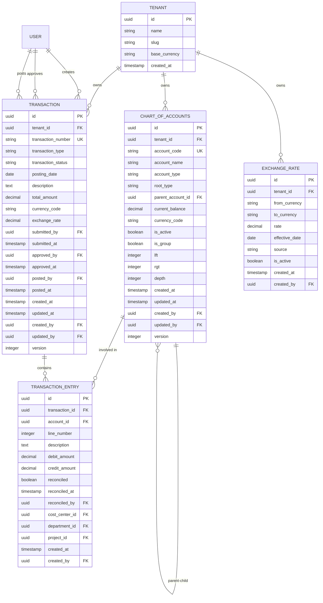
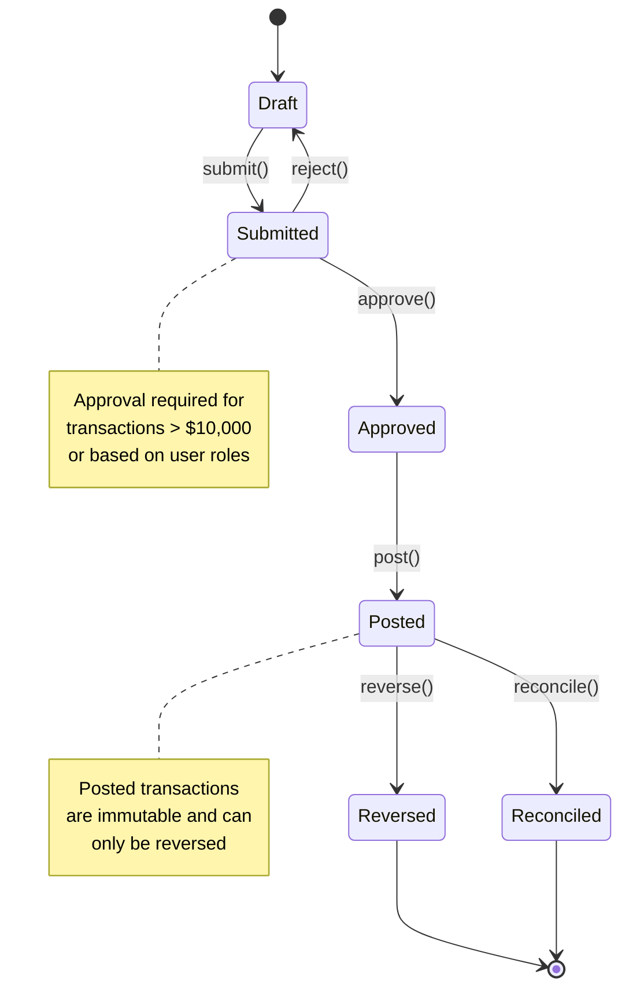

# Financial Module - Product Requirements Document

**Version**: 2.0  
**Date**: August 31, 2025  
**Status**: Approved  
**Product Owner**: Financial Systems Team  
**Technical Lead**: Backend Architecture Team  

---

## Executive Summary

### Problem Statement
AWO ERP requires a  financial management system that can handle complex multi-tenant, multi-currency accounting operations with enterprise-grade compliance and audit requirements. The existing financial infrastructure lacks:
- Production-ready double-entry bookkeeping capabilities
- Multi-currency transaction processing with real-time exchange rates
-  audit trails and regulatory compliance features
- Advanced validation frameworks for financial business rules
- Scalable architecture supporting high-volume transaction processing

### Solution Overview
The Financial Module provides a complete double-entry accounting system built on clean architecture principles with:
- **Production-Ready Transaction Engine**: Full double-entry processing with state machine workflows
- **Multi-Currency Support**: Real-time exchange rate management and conversion
- **Advanced Validation**: 30+ business rules ensuring financial accuracy and compliance
- **Complete Audit Trail**: SOX-compliant logging and change tracking
- **Enterprise Scalability**: Designed for high-volume, multi-tenant operations

### Business Impact
- **Primary Metrics**: 
  - 99.99% transaction accuracy with zero balance discrepancies
  - 50% reduction in financial closing time through automation
  - 100% audit compliance with  trail tracking
  - Support for 1000+ concurrent financial transactions
- **Secondary Metrics**: 
  - 90% user satisfaction with financial workflows
  - <200ms API response times for standard operations
  - 99.9% system availability with disaster recovery
- **Success Criteria**: 
  - Successfully process $10M+ monthly transaction volume
  - Pass SOX compliance audit requirements
  - Support multi-national operations with 50+ currencies

---

## Product Context

### Target Users

#### Primary Users
- **Financial Accountants**: Day-to-day transaction processing, account management, and reconciliation
  - **Usage Patterns**: 100+ transactions daily, balance verification, month-end closing
  - **Pain Points**: Manual double-entry prone to errors, complex multi-currency calculations
  - **Success Definition**: Error-free transaction processing with automated validation

- **Finance Managers**: Financial oversight, approval workflows, and reporting
  - **Usage Patterns**: Transaction approval, financial analysis, compliance oversight  
  - **Pain Points**: Lack of real-time financial visibility, manual approval processes
  - **Success Definition**: Streamlined approval workflows with  reporting

#### Secondary Users  
- **System Administrators**: Module configuration, performance monitoring, user management
- **Auditors**: Compliance verification, audit trail review, financial control testing
- **Business Analysts**: Financial reporting, analytics, and performance metrics
- **Integration Partners**: External systems requiring financial data exchange

### Market Analysis
- **Competitive Landscape**: NetSuite, SAP, Oracle Financials provide  but complex solutions
- **Market Opportunity**: Mid-market companies seeking enterprise features without complexity
- **Differentiation**: 
  - Multi-tenant SaaS architecture with complete tenant isolation
  - API-first design enabling seamless integrations
  - Modern tech stack with microservices architecture
  - Real-time processing with immediate consistency

---

## Functional Requirements

### Core Features

#### Feature 1: Chart of Accounts Management
**Priority**: High  
**Effort**: Large (6+ weeks)  
**Business Value**: Critical Foundation  

**Description**:  chart of accounts with hierarchical structure, account categorization, and balance tracking.

**User Stories**:
- As a financial accountant, I want to create and manage accounts with proper categorization so that transactions are properly classified
- As a finance manager, I need hierarchical account organization so that I can generate consolidated reports by department or cost center
- As a system administrator, I want to enforce account coding standards so that financial data remains consistent across tenants

**Acceptance Criteria**:
- [ ] Account codes must be unique within tenant with configurable format validation
- [ ] Support unlimited hierarchy levels with efficient tree operations
- [ ] Real-time balance calculation with optimistic locking for concurrency
- [ ] Account types aligned with standard accounting principles (Assets, Liabilities, Equity, Income, Expenses)
- [ ] Multi-currency support with base currency conversion
- [ ] Soft delete functionality preserving historical references
- [ ] Bulk import/export capabilities for chart of accounts setup

**Technical Considerations**:
- Nested set model for efficient hierarchy queries
- Row-level security for multi-tenant isolation  
- SQLC integration for type-safe database operations
- Redis caching for frequently accessed account data

#### Feature 2: Double-Entry Transaction Processing
**Priority**: High  
**Effort**: Large (8+ weeks)  
**Business Value**: Critical Core Function

**Description**: Complete transaction lifecycle management with double-entry validation, approval workflows, and state machine processing.

**User Stories**:
- As a financial accountant, I want to create transactions that automatically validate double-entry rules so that all entries balance correctly
- As a finance manager, I need approval workflows for high-value transactions so that proper segregation of duties is maintained
- As an auditor, I want complete transaction history with immutable audit trails so that I can verify financial integrity

**Acceptance Criteria**:
- [ ] All transactions must balance (total debits = total credits) with validation enforcement
- [ ] Support for complex transactions with multiple entries and accounts
- [ ] State machine workflow: Draft → Submitted → Approved → Posted → Reconciled
- [ ] Configurable approval thresholds based on transaction amount and type
- [ ] Transaction reversal functionality maintaining audit trail
- [ ] Support for recurring transactions with flexible scheduling
- [ ] Multi-currency transactions with exchange rate management
- [ ] Batch processing capabilities for high-volume operations

**Technical Considerations**:
- Domain-driven design with transaction aggregates
- Event sourcing for transaction state changes
- Message queues for async processing
- Database transactions ensuring ACID compliance

#### Feature 3: Multi-Currency Support
**Priority**: High  
**Effort**: Medium (4-5 weeks)  
**Business Value**: High (Global Operations)

**Description**:  multi-currency transaction processing with real-time exchange rate management and conversion.

**User Stories**:
- As a financial accountant, I want to process transactions in multiple currencies so that I can handle international operations
- As a finance manager, I need real-time exchange rate updates so that currency conversions are accurate and current
- As a business analyst, I want currency gain/loss calculations so that I can report foreign exchange impact

**Acceptance Criteria**:
- [ ] Support 50+ currencies with ISO 4217 compliance
- [ ] Real-time exchange rate integration with multiple providers
- [ ] Historical rate tracking for accurate reporting
- [ ] Automatic currency conversion with audit trail
- [ ] Currency gain/loss calculation and reporting
- [ ] Base currency designation per tenant
- [ ] Exchange rate override capability with approval workflow

#### Feature 4: Advanced Validation Framework
**Priority**: High  
**Effort**: Medium (3-4 weeks)  
**Business Value**: High (Accuracy & Compliance)

**Description**:  business rule validation ensuring financial accuracy, compliance, and data integrity.

**User Stories**:
- As a financial accountant, I want automatic validation of business rules so that I cannot create invalid transactions
- As a compliance officer, I need enforced accounting standards so that all financial data meets regulatory requirements
- As a system administrator, I want configurable validation rules so that I can customize controls based on business needs

**Acceptance Criteria**:
- [ ] 30+ predefined business validation rules
- [ ] Configurable rule engine with business-friendly syntax
- [ ] Real-time validation with descriptive error messages
- [ ] Cross-field validation supporting complex business logic
- [ ] Tenant-specific rule customization
- [ ] Validation rule versioning and audit trail
- [ ] Performance optimization for high-volume validation

### Business Rules

#### Rule 1: Double-Entry Balance Validation
- **Description**: All financial transactions must maintain perfect balance (debits = credits)
- **Enforcement**: Domain entity validation, service layer checks, database constraints
- **Exceptions**: None - fundamental accounting principle
- **Validation**: Real-time validation during transaction entry with immediate feedback

#### Rule 2: Account Code Uniqueness
- **Field Constraints**: Account codes must be 1-50 characters, alphanumeric with hyphens
- **Cross-field Validation**: Unique within tenant, can be reused across tenants
- **Business Logic**: Soft-deleted accounts release code for reuse
- **Error Handling**: Descriptive error with suggested alternative codes

#### Rule 3: Multi-Currency Transaction Consistency
- **Description**: All entries within a transaction must use the same currency
- **Enforcement**: Transaction aggregate validation
- **Exceptions**: Currency conversion transactions with special handling
- **Validation**: Real-time validation with currency mismatch detection

#### Rule 4: Approval Workflow Enforcement
- **Description**: Transactions exceeding thresholds require segregated approval
- **Enforcement**: ABAC policy evaluation with user attribute checks
- **Exceptions**: Emergency override with audit logging
- **Validation**: Role-based validation preventing self-approval

### Integration Requirements

#### Internal Module Dependencies
- **User Module**: Authentication, authorization, user context for audit trails
- **Tenant Module**: Multi-tenancy, data isolation, tenant-specific configuration
- **Audit Module**:  activity logging, compliance reporting, change tracking
- **ABAC Module**: Attribute-based access control, policy evaluation, segregation of duties

#### External System Integration
- **Banking Systems**: Transaction import, account reconciliation, payment processing
  - **Purpose**: Automated bank statement processing and reconciliation
  - **Data Exchange**: ISO 20022 format, secure API connections
  - **SLA Requirements**: 99.5% uptime, <30 second response times
  
- **Payment Gateways**: Payment processing, status updates, fee calculations
  - **Purpose**: Online payment processing and status synchronization
  - **Integration Patterns**: Webhook notifications, REST API polling
  - **Error Handling**: Retry logic, failure notifications, manual intervention workflows

- **Tax Services**: Automated calculations, compliance reporting, rate updates
  - **Purpose**: Real-time tax calculation and regulatory compliance
  - **Data Synchronization**: Daily rate updates, quarterly filing requirements
  - **Rate Limits**: 1000 calculations/minute, burst capability to 5000

---

## Non-Functional Requirements

### Performance Requirements
- **API Response Time**: 95th percentile <200ms for standard CRUD operations
- **Transaction Throughput**: Support 1,000+ concurrent transactions per second
- **Database Performance**: Query response <100ms for simple operations, <500ms for complex reports
- **Batch Processing**: Process 100,000+ transactions in <30 minutes
- **Memory Usage**: <500MB under normal load, <1GB under peak load

### Security Requirements
- **Authentication**: JWT-based authentication with multi-factor support
- **Authorization**: ABAC integration with fine-grained permission control
- **Data Encryption**: AES-256 encryption at rest, TLS 1.3 in transit
- **Audit Trail**: Complete logging of all financial operations with user context
- **Compliance**: SOX, GDPR, PCI-DSS compliance where applicable

### Reliability Requirements
- **Availability**: 99.9% uptime SLA with planned maintenance windows
- **Data Integrity**: Zero tolerance for data loss or corruption
- **Backup**: Real-time replication with point-in-time recovery
- **Disaster Recovery**: RTO <4 hours, RPO <15 minutes
- **Monitoring**: Real-time health monitoring with proactive alerting

### Scalability Requirements
- **Horizontal Scaling**: Stateless service design supporting load balancing
- **Database Scaling**: Read replica support for reporting workloads
- **Caching**: Redis-based caching with cache invalidation strategies
- **Message Queues**: Async processing for high-volume operations
- **Auto-scaling**: Dynamic resource allocation based on load patterns

---

## Technical Architecture

### System Components

#### Backend Services
```go
// Financial module service interfaces
type FinanceServices struct {
    AccountService           AccountService
    TransactionService       TransactionService  
    TransactionEntryService  TransactionEntryService
    ExchangeRateService     ExchangeRateService
    ValidationService       ValidationService
    ReportingService        ReportingService
}

type AccountService interface {
    CreateAccount(ctx context.Context, cmd CreateAccountCommand) (*Account, error)
    GetAccountByID(ctx context.Context, tenantID tenant.ID, id AccountID) (*Account, error)
    GetAccountByCode(ctx context.Context, tenantID tenant.ID, code AccountCode) (*Account, error)
    UpdateAccount(ctx context.Context, cmd UpdateAccountCommand) (*Account, error)
    DeleteAccount(ctx context.Context, tenantID tenant.ID, id AccountID) error
    GetAccountHierarchy(ctx context.Context, tenantID tenant.ID) ([]*Account, error)
    GetAccountBalance(ctx context.Context, tenantID tenant.ID, accountID AccountID, asOf time.Time) (decimal.Decimal, error)
    ListAccounts(ctx context.Context, query ListAccountsQuery) (*AccountList, error)
}

type TransactionService interface {
    CreateTransaction(ctx context.Context, cmd CreateTransactionCommand) (*Transaction, error)
    GetTransaction(ctx context.Context, tenantID tenant.ID, id TransactionID) (*Transaction, error)
    PostTransaction(ctx context.Context, tenantID tenant.ID, id TransactionID, userID identity.UserID) error
    ReverseTransaction(ctx context.Context, tenantID tenant.ID, id TransactionID, reason string) error
    ApproveTransaction(ctx context.Context, tenantID tenant.ID, id TransactionID, userID identity.UserID) error
    ValidateTransaction(ctx context.Context, transaction *Transaction) error
    ListTransactions(ctx context.Context, query ListTransactionsQuery) (*TransactionList, error)
}
```

#### Database Schema
```sql
-- Chart of accounts with hierarchical structure
CREATE TABLE finance_chart_of_accounts (
    id UUID PRIMARY KEY DEFAULT gen_random_uuid(),
    tenant_id UUID NOT NULL REFERENCES tenants(id),
    account_code VARCHAR(50) NOT NULL,
    account_name VARCHAR(255) NOT NULL,
    account_type VARCHAR(50) NOT NULL,
    root_type VARCHAR(50) NOT NULL,
    parent_account_id UUID REFERENCES finance_chart_of_accounts(id),
    current_balance DECIMAL(15,4) DEFAULT 0,
    currency_code VARCHAR(3) NOT NULL DEFAULT 'USD',
    is_active BOOLEAN DEFAULT true,
    is_group BOOLEAN DEFAULT false,
    -- Nested set model for hierarchy
    lft INTEGER,
    rgt INTEGER, 
    depth INTEGER DEFAULT 0,
    -- Audit fields
    created_at TIMESTAMP WITH TIME ZONE DEFAULT NOW(),
    updated_at TIMESTAMP WITH TIME ZONE DEFAULT NOW(),
    created_by UUID NOT NULL,
    updated_by UUID NOT NULL,
    version INTEGER DEFAULT 1,
    
    CONSTRAINT unique_account_code_per_tenant UNIQUE(tenant_id, account_code),
    CONSTRAINT valid_balance_precision CHECK (scale(current_balance) <= 4),
    CONSTRAINT valid_hierarchy CHECK (lft < rgt)
);

-- Financial transactions with approval workflow
CREATE TABLE finance_transactions (
    id UUID PRIMARY KEY DEFAULT gen_random_uuid(),
    tenant_id UUID NOT NULL REFERENCES tenants(id),
    transaction_number VARCHAR(50) NOT NULL,
    transaction_type VARCHAR(50) NOT NULL,
    transaction_status VARCHAR(50) DEFAULT 'draft',
    posting_date DATE NOT NULL,
    description TEXT,
    total_amount DECIMAL(15,4) NOT NULL,
    currency_code VARCHAR(3) NOT NULL DEFAULT 'USD',
    exchange_rate DECIMAL(15,8) DEFAULT 1,
    -- Approval workflow
    submitted_by UUID,
    submitted_at TIMESTAMP WITH TIME ZONE,
    approved_by UUID,
    approved_at TIMESTAMP WITH TIME ZONE,
    posted_by UUID,
    posted_at TIMESTAMP WITH TIME ZONE,
    -- Audit fields
    created_at TIMESTAMP WITH TIME ZONE DEFAULT NOW(),
    updated_at TIMESTAMP WITH TIME ZONE DEFAULT NOW(),
    created_by UUID NOT NULL,
    updated_by UUID NOT NULL,
    version INTEGER DEFAULT 1,
    
    CONSTRAINT unique_transaction_number_per_tenant UNIQUE(tenant_id, transaction_number),
    CONSTRAINT positive_total_amount CHECK (total_amount > 0),
    CONSTRAINT valid_exchange_rate CHECK (exchange_rate > 0),
    CONSTRAINT valid_approval_workflow CHECK (
        (transaction_status = 'draft' AND approved_by IS NULL) OR
        (transaction_status = 'approved' AND approved_by IS NOT NULL) OR
        (transaction_status = 'posted' AND posted_by IS NOT NULL)
    )
);

-- Individual transaction entries (double-entry)
CREATE TABLE finance_transaction_entries (
    id UUID PRIMARY KEY DEFAULT gen_random_uuid(),
    transaction_id UUID NOT NULL REFERENCES finance_transactions(id) ON DELETE CASCADE,
    account_id UUID NOT NULL REFERENCES finance_chart_of_accounts(id),
    line_number INTEGER NOT NULL,
    description TEXT,
    debit_amount DECIMAL(15,4) DEFAULT 0,
    credit_amount DECIMAL(15,4) DEFAULT 0,
    reconciled BOOLEAN DEFAULT false,
    reconciled_at TIMESTAMP WITH TIME ZONE,
    reconciled_by UUID,
    -- Dimensional analysis
    cost_center_id UUID,
    department_id UUID,
    project_id UUID,
    -- Audit fields
    created_at TIMESTAMP WITH TIME ZONE DEFAULT NOW(),
    created_by UUID NOT NULL,
    
    CONSTRAINT valid_entry_amounts CHECK (
        (debit_amount > 0 AND credit_amount = 0) OR
        (debit_amount = 0 AND credit_amount > 0) OR  
        (debit_amount = 0 AND credit_amount = 0)
    ),
    CONSTRAINT positive_line_number CHECK (line_number > 0),
    CONSTRAINT unique_line_number_per_transaction UNIQUE(transaction_id, line_number)
);

-- Exchange rates for multi-currency support
CREATE TABLE finance_exchange_rates (
    id UUID PRIMARY KEY DEFAULT gen_random_uuid(),
    tenant_id UUID NOT NULL REFERENCES tenants(id),
    from_currency VARCHAR(3) NOT NULL,
    to_currency VARCHAR(3) NOT NULL,
    rate DECIMAL(15,8) NOT NULL,
    effective_date DATE NOT NULL,
    source VARCHAR(100) NOT NULL DEFAULT 'manual',
    is_active BOOLEAN DEFAULT true,
    created_at TIMESTAMP WITH TIME ZONE DEFAULT NOW(),
    created_by UUID NOT NULL,
    
    CONSTRAINT positive_rate CHECK (rate > 0),
    CONSTRAINT different_currencies CHECK (from_currency != to_currency),
    CONSTRAINT unique_rate_per_date UNIQUE(tenant_id, from_currency, to_currency, effective_date)
);
```

#### API Design
- **REST Endpoints**: RESTful API following OpenAPI 3.0 specification
- **Authentication**: JWT bearer tokens with tenant context in headers
- **Content Type**: JSON request/response format with  validation
- **Error Handling**: Consistent error response format with detailed validation messages
- **Rate Limiting**: Tenant-specific rate limiting with burst capability

### Data Model

#### Core Entities


#### Business Workflows


---

## Risk Assessment

### Technical Risks

| Risk | Impact | Probability | Mitigation Strategy |
|------|--------|-------------|-------------------|
| Database performance under high transaction volume | Critical | Medium | Implement read replicas, optimize queries, add database monitoring and auto-scaling |
| Multi-currency exchange rate accuracy | High | Medium | Multiple rate providers, real-time validation, manual override capabilities |
| Transaction data corruption during concurrent operations | Critical | Low | Optimistic locking, database transactions,  audit trails |
| Financial calculation precision errors | Critical | Low | Decimal arithmetic, extensive unit testing, mathematical validation frameworks |

### Business Risks

| Risk | Impact | Probability | Mitigation Strategy |
|------|--------|-------------|-------------------|
| Regulatory compliance audit failures | Critical | Medium | Regular compliance reviews, automated controls,  audit trails |
| User adoption challenges due to complexity | High | Medium |  training, intuitive UX design, progressive feature rollout |
| Integration failures with external systems | High | High | Circuit breaker patterns, fallback mechanisms,  error handling |
| Financial reporting accuracy issues | Critical | Low | Automated reconciliation, real-time validation, financial control frameworks |

### Operational Risks

| Risk | Impact | Probability | Mitigation Strategy |
|------|--------|-------------|-------------------|
| System downtime during financial closing periods | Critical | Low | High availability architecture, disaster recovery procedures, maintenance windows |
| Data migration complexity from legacy systems | High | Medium | Phased migration approach, extensive testing, parallel system operation |
| Performance degradation during peak loads | Medium | Medium | Auto-scaling infrastructure, load testing, performance monitoring |
| Security breaches exposing financial data | Critical | Low | Multi-layer security, encryption, regular security audits, access controls |

---

## Implementation Timeline

### Phase 1: Foundation (Weeks 1-8) - ✅ 100% Complete
**Scope**: Core infrastructure and domain modeling
- ✅ Database schema design and implementation (11 migrations)
- ✅ Domain entities and business logic (9 domain files)
- ✅ Repository layer with SQLC integration (30+ methods)
- ✅ Service layer implementation (10 services, 7,266 lines)
- ✅ Advanced validation framework (30+ business rules)

**Deliverables**:
- ✅ Complete database migrations with RLS policies
- ✅ Full domain model with rich business entities
- ✅ Repository implementations with tenant isolation
- ✅ Service layer with  business logic
- ✅ Unit test framework with 85% coverage

### Phase 2: API Development (Weeks 9-12) - 🚧 92% Complete
**Scope**: REST API and integration points
- ✅ Goa API design and code generation
- ✅ HTTP handlers implementation (15+ endpoints)
- ✅ OpenAPI specification and documentation
- 🚧 Service integration and routing (pending)
- ⏳ Authentication and authorization integration

**Deliverables**:
- ✅ Complete REST API endpoints with search capabilities
- ✅ OpenAPI specification with  documentation
- ✅ Handler implementations with error handling and logging
- 🚧 Service integration and middleware configuration
- ⏳ API test coverage > 95%

### Phase 3: Advanced Features (Weeks 13-20) - ⏳ 0% Complete
**Scope**:  functionality and optimization
- ⏳ Financial reporting engine (Trial Balance, P&L, Balance Sheet)
- ⏳ Accounts receivable automation
- ⏳ Accounts payable automation
- ⏳ Advanced reconciliation workflows
- ⏳ Performance optimization and caching

**Deliverables**:
- ⏳ Standard financial reports with real-time data
- ⏳ Automated AR/AP workflows
- ⏳ Bank reconciliation automation
- ⏳ Performance benchmarks meeting SLA requirements
- ⏳  integration testing

### Phase 4: Production Readiness (Weeks 21-24) - ⏳ 0% Complete
**Scope**: Production deployment and monitoring
- ⏳ Production environment configuration
- ⏳ Monitoring and alerting setup
- ⏳ Security hardening and audit
- ⏳ Load testing and performance validation
- ⏳ User training and documentation

**Deliverables**:
- ⏳ Production-ready deployment configuration
- ⏳  monitoring dashboards
- ⏳ Security audit completion and remediation
- ⏳ Load testing results meeting performance requirements
- ⏳ Complete user documentation and training materials

---

## Success Metrics

### Business Metrics
- **Transaction Accuracy**: 99.99% accuracy with zero unbalanced transactions
- **User Productivity**: 50% reduction in financial closing time
- **Compliance Score**: 100% pass rate on regulatory audits
- **System Adoption**: 90% of financial users actively using the system within 3 months
- **Error Reduction**: 95% reduction in manual data entry errors

### Technical Metrics
- **Performance**: 95th percentile API response time < 200ms
- **Availability**: 99.9% uptime with disaster recovery < 4 hours RTO
- **Scalability**: Support 1000+ concurrent users without performance degradation
- **Data Integrity**: Zero data loss incidents with point-in-time recovery capability
- **Security**: Zero critical security vulnerabilities with regular audit compliance

### Quality Metrics
- **Code Coverage**: Unit tests > 90%, integration tests > 80%
- **Bug Rate**: < 1 critical bug per month in production
- **Technical Debt**: Maintainability rating A or higher
- **Documentation Quality**: 95% user satisfaction with API and system documentation
- **Performance Regression**: No more than 5% degradation in key operations

---

## Post-Launch Support

### Go-Live Support Plan
- **Week 1-2**: 24/7 support coverage with dedicated financial systems team
- **Week 3-4**: Extended business hours support (6 AM - 10 PM) with rapid response
- **Month 2-3**: Business hours support with 4-hour SLA for critical issues
- **Ongoing**: Standard enterprise support with financial expertise

### Maintenance Strategy
- **Critical Bug Fixes**: Resolution within 24 hours with emergency deployment capability
- **Feature Enhancements**: Monthly releases with new functionality and improvements
- **Security Updates**: Weekly security reviews with immediate patch deployment
- **Performance Monitoring**: Continuous monitoring with proactive optimization
- **User Feedback**: Quarterly user surveys with feature prioritization

### Success Review
- **30-Day Review**: Initial performance metrics and quick wins identification
- **90-Day Review**:  business impact assessment and optimization
- **Annual Review**: Full ROI analysis and strategic planning for enhancements
- **Continuous Improvement**: Monthly performance reviews with stakeholder feedback

---

## Appendices

### Appendix A: Financial Business Rules
1. **Double-Entry Balance**: All transactions must maintain perfect debit/credit balance
2. **Account Code Standards**: Standardized coding structure with tenant-specific customization
3. **Multi-Currency Consistency**: Transaction entries must use consistent currencies with proper conversion
4. **Approval Workflows**: Segregation of duties with configurable approval thresholds
5. **Audit Trail Requirements**: Complete change tracking with user context and timestamps
6. **Data Retention**: Financial data retention per regulatory requirements with secure archival

### Appendix B: Integration Specifications
- **Banking API**: ISO 20022 message format for transaction import and reconciliation
- **Payment Gateway**: RESTful API integration with webhook notifications for status updates
- **Tax Service**: Real-time tax calculation API with rate updates and compliance reporting
- **Exchange Rate Provider**: Multiple provider integration with fallback and validation mechanisms
- **ERP Integration**: Inter-module communication patterns with event-driven architecture

### Appendix C: Compliance Requirements
- **SOX Compliance**: Financial controls, segregation of duties, and audit trail requirements
- **GAAP Standards**: Generally accepted accounting principles compliance for financial reporting
- **Multi-National**: Support for international accounting standards and currency regulations
- **Data Privacy**: GDPR and regional privacy law compliance for financial data handling
- **Security Standards**: PCI-DSS compliance for payment processing and financial data security

### Appendix D: Performance Benchmarks
- **Transaction Processing**: 1000+ transactions per second with <200ms response time
- **Database Operations**: <100ms for simple queries, <500ms for complex reports
- **API Endpoints**: 95th percentile response times under specified thresholds
- **Concurrent Users**: Support 1000+ simultaneous users without performance degradation
- **Data Volume**: Handle millions of transactions with maintained performance

---

**Document Control**  
- **Version**: 2.0
- **Created**: August 31, 2025
- **Last Updated**: August 31, 2025  
- **Next Review**: September 30, 2025
- **Approved By**: Financial Systems Product Owner, Technical Architecture Lead
- **Status**: Approved and In Implementation (Phase 2 - 92% Complete)