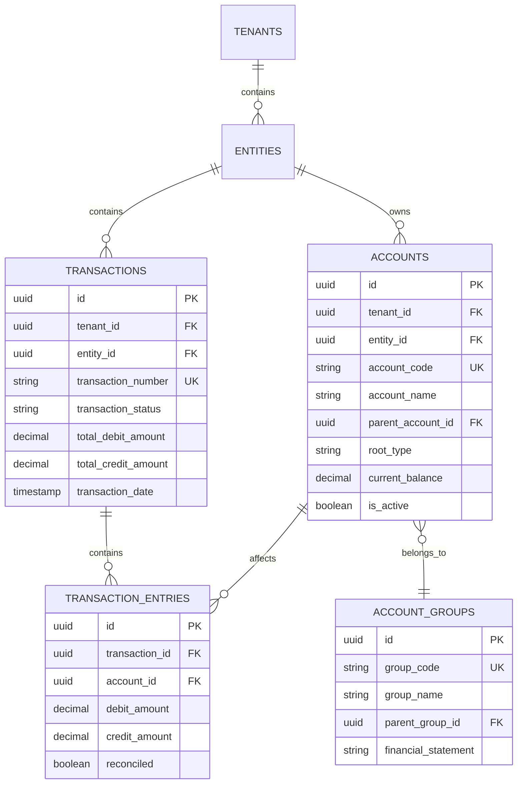

# Financial Module

## Overview

The Financial Module is the core accounting and financial management system of the AWO ERP platform. It provides a production-ready, enterprise-grade double-entry bookkeeping system with sophisticated transaction processing, multi-currency support, and comprehensive compliance frameworks. The module implements robust business rules for financial compliance, immutable audit trails, and real-time reporting capabilities.

## Architecture Overview

### Domain Model
The Financial Module implements a sophisticated domain model based on double-entry bookkeeping principles following Clean Architecture and Domain-Driven Design patterns.

## Core Financial Entities

### 1. Accounts (`domain/accounts.go`)
Chart of accounts with hierarchical structure and comprehensive financial tracking.

**Key Properties:**
- **Identity**: ID, TenantID, EntityID, AccountCode, AccountName
- **Hierarchy**: ParentAccountID, AccountLevel, AccountPath, HasChildren, IsLeafAccount
- **Classification**: RootType (ASSET, LIABILITY, EQUITY, REVENUE, EXPENSE), AccountType, AccountSubtype
- **Financial**: NormalBalance, CurrentBalance, YTDBalance, CurrencyCode, IsMultiCurrency
- **Operational**: IsActive, IsSystemAccount, AllowManualEntries, RequireReference
- **Reporting**: FinancialStatementLine, ReportOrder, ShowInReports, CashFlowType
- **Budgeting**: IsBudgetable, BudgetVarianceThreshold
- **Audit**: Version, ValidationStatus, CreatedAt/UpdatedAt, CreatedBy/UpdatedBy

**Business Rules:**
- Account codes must be unique within tenant/entity
- Hierarchical relationships with circular reference prevention
- Control accounts cannot have direct entries
- System accounts have restricted modifications

### 2. Transactions (`domain/transaction.go`)
Financial transaction headers implementing complete lifecycle management.

**Key Properties:**
- **Identity**: ID, TenantID, EntityID, TransactionNumber, TransactionType
- **Status**: TransactionStatus, ApprovalStatus, ValidationStatus
- **Dates**: TransactionDate, PostingDate, DueDate
- **Financial**: CurrencyCode, ExchangeRate, TotalDebitAmount, TotalCreditAmount
- **Workflow**: ApprovalRequired, ApprovedBy/At, IsRecurring, RecurringFrequency
- **Reversal**: IsReversed, ReversedByTransactionID, ReversalReason
- **Metadata**: SourceModule, SourceDocumentType, AttachmentIds, Tags

**State Machine:**
```
DRAFT → PENDING_APPROVAL → APPROVED → POSTED
  ↓           ↓              ↓         ↓
CANCELLED   REJECTED    CANCELLED   REVERSED
              ↓
            DRAFT (resubmit)
```

### 3. Transaction Entries (`domain/transaction_entry.go`)
Individual journal entry lines implementing double-entry principles.

**Key Properties:**
- **Identity**: ID, TenantID, TransactionID, EntryNumber, AccountID
- **Amounts**: DebitAmount, CreditAmount (mutually exclusive)
- **Dimensional**: CostCenter, Department, ProjectID
- **Currency**: OriginalCurrency, OriginalAmount, ExchangeRate
- **Tax**: TaxCode, TaxRate, TaxAmount
- **Reconciliation**: Reconciled, ReconciledDate, ReconciliationReference

**Business Rules:**
- Each entry has either DebitAmount OR CreditAmount (never both)
- Total debits must equal total credits for each transaction
- Inactive accounts cannot receive new entries
- Multi-currency entries require valid exchange rates

### 4. Account Groups
Hierarchical organization of accounts for reporting and financial statement preparation.

**Features:**
- Financial statement grouping (Balance Sheet, P&L, Cash Flow)
- Hierarchical structure for consolidated reporting
- Cash flow categorization (Operating, Investing, Financing)
- Custom grouping for entity-specific requirements

## Entity Relationships



## Service Layer Architecture

### Core Services

**AccountService** (`service/account_service.go`)
```go
type AccountService interface {
    // Core operations
    Create(ctx context.Context, req *CreateAccountRequest) (*Accounts, error)
    GetByID(ctx context.Context, id uuid.UUID) (*Accounts, error)
    List(ctx context.Context, filter *AccountFilter) ([]*Accounts, error)
    Update(ctx context.Context, id uuid.UUID, req *UpdateAccountRequest) (*Accounts, error)
    Delete(ctx context.Context, id uuid.UUID) error
    
    // Hierarchy operations
    GetAccountHierarchy(ctx context.Context, rootAccountID uuid.UUID) ([]*Accounts, error)
    GetAccountChildrenHierarchy(ctx context.Context, parentAccountID uuid.UUID) ([]*AccountHierarchy, error)
    
    // Financial reporting
    GetTrialBalanceAccounts(ctx context.Context, entityID *uuid.UUID, nonZeroOnly bool) ([]*TrialBalanceSummary, error)
    GetAccountsWithBalances(ctx context.Context, filter *BalanceFilter) ([]*ChartOfAccountsComplete, error)
}
```

**TransactionService** (`service/transaction_service.go`)
```go
type TransactionService interface {
    // Core operations
    Create(ctx context.Context, req *CreateTransactionRequest) (*Transaction, error)
    GetByID(ctx context.Context, id uuid.UUID) (*Transaction, error)
    List(ctx context.Context, filter *TransactionFilter) ([]*Transaction, error)
    
    // Workflow operations
    Submit(ctx context.Context, id uuid.UUID) error
    Approve(ctx context.Context, id uuid.UUID) error
    Post(ctx context.Context, id uuid.UUID) error
    Reverse(ctx context.Context, id uuid.UUID, reason string) error
}
```

### Validation Framework

**Double-Entry Validator** (`service/double_entry_validator.go`)
```go
type DoubleEntryValidator interface {
    ValidateTransaction(ctx context.Context, transaction *Transaction, accounts map[uuid.UUID]*Accounts) *ValidationResult
    ValidateBalance(ctx context.Context, transaction *Transaction) *ValidationResult
    ValidateAccountCompatibility(ctx context.Context, entries []TransactionEntry, accounts map[uuid.UUID]*Accounts) *ValidationResult
    ValidateCurrencyConsistency(ctx context.Context, transaction *Transaction, accounts map[uuid.UUID]*Accounts) *ValidationResult
}
```

## Business Rules and Validation

### Double-Entry Accounting Rules
1. **Fundamental Principle**: Total Debits = Total Credits for every transaction
2. **Entry Constraints**: Each entry has either DebitAmount OR CreditAmount (never both)
3. **Balance Impact**: Posted transactions update account balances immediately
4. **Normal Balance**: Accounts follow standard accounting principles:
   - Assets & Expenses: Debit normal balance
   - Liabilities, Equity & Revenue: Credit normal balance

### Account Hierarchy Rules
- Circular references prevented through validation
- Parent accounts must be compatible RootType
- Leaf accounts only can have transactions (control accounts aggregate)
- Account codes must be unique within tenant/entity scope

### Transaction Lifecycle Rules
- Transactions progress through defined status transitions
- Approval required for manual, adjustment, and closing entries
- Posted transactions become immutable (except reversal)
- Reversals create offsetting transactions maintaining audit trail

### Validation Layers
1. **Field Validation**: Format, length, data type constraints
2. **Entity Validation**: Business rules within single entity
3. **Cross-Entity Validation**: Relationships and dependencies
4. **Business Rule Validation**: Complex accounting rules and compliance

## Compliance & Regulatory Features

### Audit Trail Requirements
- **Immutable Audit Log**: All changes tracked with full context
- **User Tracking**: CreatedBy/UpdatedBy on all financial entities
- **Temporal Tracking**: CreatedAt/UpdatedAt timestamps with nanosecond precision
- **Version Control**: Optimistic locking via version field

### SOX Compliance Support
- **Approval Workflows**: Multi-level approval for sensitive transactions
- **Segregation of Duties**: Different users for creation vs. approval
- **Change Controls**: Complete audit trail for all modifications
- **Access Controls**: IAM integration for role-based permissions

### Financial Standards Compliance
- **Chart of Accounts**: Standard account classification following GAAP/IFRS
- **Financial Statements**: Account grouping for Balance Sheet, P&L, Cash Flow
- **Multi-Currency**: Full support for international operations
- **Period-End Closing**: Automated workflow support for month/year-end processes

### Regulatory Workflows
- **Compliance Audit Workflow**: Automated compliance checking and reporting
- **Regulatory Reporting**: Scheduled financial report generation
- **Data Retention**: Configurable audit trail preservation policies
- **Reconciliation Tracking**: Complete bank reconciliation audit trail

## Money Flow and State Transitions

### Transaction Processing Flow
```
1. CREATION (Draft)
   ├─ User creates transaction with entries
   ├─ Basic validation performed
   └─ No impact on account balances

2. VALIDATION
   ├─ Double-entry validation
   ├─ Account compatibility checks
   ├─ Business rule validation
   └─ Currency conversion validation

3. APPROVAL (if required)
   ├─ Routed to authorized approver
   ├─ Can be approved/rejected/returned to draft
   └─ Approval hierarchy support

4. POSTING
   ├─ Transaction becomes immutable
   ├─ Account balances updated atomically
   ├─ Audit trail created
   └─ Financial statements affected

5. RECONCILIATION (optional)
   ├─ Individual entries marked as reconciled
   ├─ Bank reconciliation support
   └─ Variance tracking and reporting

6. REVERSAL (if needed)
   ├─ Creates offsetting transaction
   ├─ Original transaction marked as reversed
   └─ Maintains complete audit trail
```

### Account Balance Updates
```go
// Entry Processing Logic
if entry.IsDebit() && account.NormalBalance == NormalBalanceDebit {
    account.CurrentBalance = account.CurrentBalance.Add(entry.DebitAmount)
} else if entry.IsCredit() && account.NormalBalance == NormalBalanceCredit {
    account.CurrentBalance = account.CurrentBalance.Add(entry.CreditAmount)
} else {
    account.CurrentBalance = account.CurrentBalance.Sub(entry.GetEffectiveAmount())
}
```

## Integration Points

### IAM Integration
- Role-based access control for financial operations
- Segregation of duties enforcement
- Approval workflow authorization

### Audit Service Integration
- Real-time audit log generation
- Change tracking and compliance reporting
- Immutable audit trail preservation

### Settings Service Integration
- Configurable business rules
- Multi-entity configuration management
- Regulatory compliance settings

### Temporal Workflow Integration
- Long-running business processes
- Reliable transaction processing
- Automated reconciliation workflows

## Performance Considerations

### Caching Strategy
- Account hierarchy caching (15-minute TTL)
- Exchange rate caching for multi-currency operations
- Account balance caching for reporting queries

### Database Optimization
- Tenant isolation via Row-Level Security (RLS)
- Optimized indexes for common query patterns
- Materialized views for complex reporting queries

### Horizontal Scaling
- Tenant-aware database sharding support
- Stateless service design for load balancing
- Event-driven architecture for loose coupling

## Security Features

### Multi-Tenant Isolation
- Complete tenant data isolation via RLS policies
- Tenant-aware service operations
- Cross-tenant access prevention

### Data Protection
- Encryption at rest and in transit
- Secure API endpoints with authentication
- PII handling compliance

### Access Control
- Fine-grained permissions for financial operations
- API rate limiting and abuse prevention
- Audit logging of all access attempts

## Getting Started

### Prerequisites
- Go 1.21+
- PostgreSQL 15+
- Redis for caching
- Temporal for workflows

### Installation
```bash
# Clone the repository
git clone <repository-url>

# Install dependencies
go mod download

# Run database migrations
make migrate-up

# Start the service
make run-finance-service
```

### Basic Usage
```go
// Create account service
accountService := service.NewAccountService(repo, cache, logger)

// Create an asset account
account, err := accountService.Create(ctx, &domain.CreateAccountRequest{
    AccountCode: "1000",
    AccountName: "Cash",
    RootType:    domain.RootTypeAsset,
    IsActive:    true,
})

// Create a transaction
transactionService := service.NewTransactionService(repo, validator, logger)
transaction, err := transactionService.Create(ctx, &domain.CreateTransactionRequest{
    TransactionNumber: "TXN-001",
    TransactionType:   domain.TransactionTypeManual,
    Description:       "Initial cash deposit",
    Entries: []domain.CreateEntryRequest{
        {
            AccountID:    cashAccountID,
            DebitAmount:  decimal.NewFromFloat(1000.00),
            Description:  "Cash deposit",
        },
        {
            AccountID:    equityAccountID,
            CreditAmount: decimal.NewFromFloat(1000.00),
            Description:  "Owner's equity",
        },
    },
})
```

## Support and Documentation

- [API Reference](./api-reference.md)
- [Architecture Guide](./architecture-guide.md)
- [Security & Compliance Guide](./security-compliance-guide.md)
- [Currency Management](./currency-management.md)
- [Integration Guide](./integration-guide.md)
- [Testing Strategy](./testing-strategy.md)