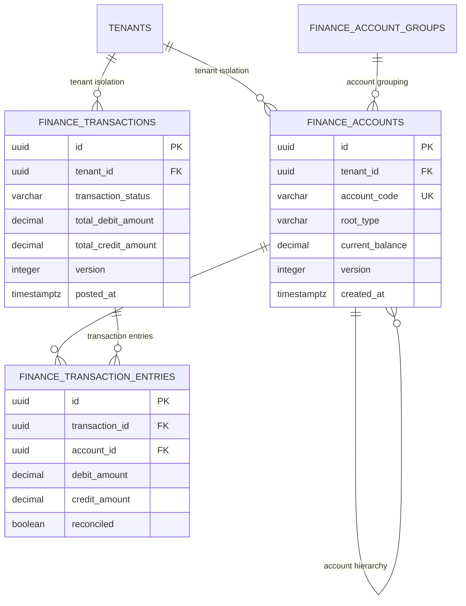
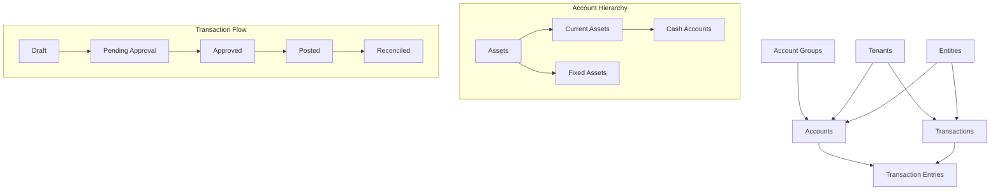
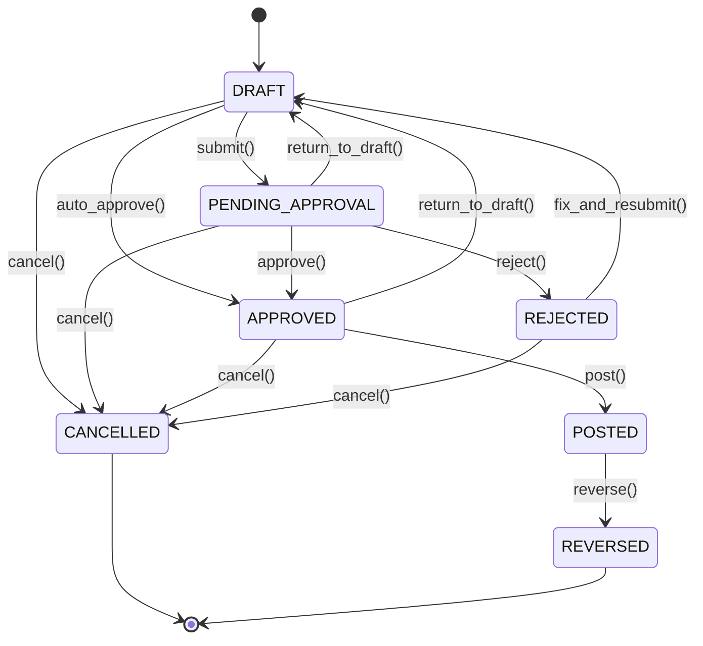

# Financial Management Guide

## Overview

This guide provides comprehensive information about the financial management capabilities of the AWO ERP system, including double-entry bookkeeping, transaction processing, compliance features, and reporting capabilities. The system implements enterprise-grade SQL schema patterns with SQLC code generation for type-safe database operations.

## Advanced Database Implementation

### Enterprise Security Architecture

The financial module implements **military-grade security patterns** at the database level:

**Multi-Tenant Isolation:**
```sql
-- Row Level Security automatically enforces tenant boundaries
ALTER TABLE finance_transactions ENABLE ROW LEVEL SECURITY;

CREATE POLICY tenant_isolation_policy ON finance_transactions 
FOR ALL TO application_role USING (
  current_tenant_id() IS NOT NULL AND tenant_id = current_tenant_id()
);

-- Every query automatically includes tenant filtering
SELECT * FROM finance_transactions 
WHERE id = $1 -- tenant_id automatically filtered by RLS
```

**Audit Trail & Compliance:**
```sql
-- Comprehensive audit pattern across all financial tables
created_at TIMESTAMPTZ NOT NULL DEFAULT NOW(),
updated_at TIMESTAMPTZ NOT NULL DEFAULT NOW(),
deleted_at TIMESTAMPTZ,           -- Soft delete for regulatory compliance
created_by UUID REFERENCES users(id),
updated_by UUID REFERENCES users(id),
posted_by UUID REFERENCES users(id),  -- Financial-specific tracking
posted_at TIMESTAMPTZ,
version INTEGER NOT NULL DEFAULT 1    -- Optimistic locking
```

**Financial Integrity Constraints:**
```sql
-- Double-entry bookkeeping enforced at database level
CONSTRAINT balanced_transaction CHECK (
  CASE WHEN transaction_status IN ('POSTED', 'APPROVED') 
  THEN total_debit_amount = total_credit_amount
  ELSE TRUE END
),

-- Single-sided entry validation
CHECK (NOT (debit_amount > 0 AND credit_amount > 0)),
CHECK (debit_amount > 0 OR credit_amount > 0),

-- State machine enforcement
CHECK (transaction_status IN ('DRAFT', 'PENDING_APPROVAL', 'APPROVED', 'POSTED', 'CANCELLED', 'REVERSED'))
```

### High-Performance Query Architecture

**Strategic Indexing:**
```sql
-- Multi-column indexes for tenant-aware queries
CREATE INDEX idx_finance_transactions_tenant_date 
  ON finance_transactions (tenant_id, transaction_date);

-- Partial indexes for conditional queries
CREATE INDEX idx_finance_transactions_approval 
  ON finance_transactions (tenant_id, approval_status)
  WHERE approval_required = TRUE;

-- Array operations for bulk processing
CREATE INDEX idx_finance_transactions_tags 
  ON finance_transactions USING GIN (tags);
```

**View-Based Optimization:**
The system uses sophisticated database views to pre-compute complex reporting data:
- `v_chart_of_accounts_complete`: Account hierarchy with group classifications
- `v_finance_account_activity`: 30-day activity metrics for performance monitoring
- `v_financial_statement_builder`: Pre-computed data for balance sheet and income statement generation

### SQLC Type-Safe Implementation

**Financial Data Precision:**
```go
// PostgreSQL DECIMAL maps to pgtype.Numeric for financial precision
type FinanceTransaction struct {
    ExchangeRate      pgtype.Numeric `json:"exchange_rate"`
    TotalDebitAmount  pgtype.Numeric `json:"total_debit_amount"`
    TotalCreditAmount pgtype.Numeric `json:"total_credit_amount"`
    AttachmentIds     []string       `json:"attachment_ids"`
    ValidationErrors  []byte         `json:"validation_errors"`
}

// Strongly-typed parameter structures
type CreateTransactionParams struct {
    EntityID          *uuid.UUID     `json:"entity_id"`
    TransactionNumber string         `json:"transaction_number"`
    TotalDebitAmount  pgtype.Numeric `json:"total_debit_amount"`
    CreatedBy         uuid.UUID      `json:"created_by"`
}
```

**Bulk Operations Support:**
```sql
-- Array-based bulk updates for performance
UPDATE finance_transactions 
SET tags = $1::VARCHAR[], updated_by = $2
WHERE id = ANY($3::UUID[]) AND tenant_id = current_tenant_id();

-- Efficient reconciliation operations
UPDATE finance_transaction_entries
SET reconciled = TRUE, reconciled_date = $1
WHERE id = ANY($2::uuid[]) AND tenant_id = current_tenant_id();
```

## Financial Domain Model

### Database Entity Relationships

The financial system implements a sophisticated relational model with proper foreign key constraints:



### Referential Integrity Strategy

**Cascade Patterns:**
```sql
-- Tenant deletion cascades to all financial data
tenant_id UUID NOT NULL REFERENCES tenants(id) ON DELETE CASCADE

-- Transaction deletion cascades to entries
transaction_id UUID NOT NULL REFERENCES finance_transactions(id) ON DELETE CASCADE
```

**Restrict Patterns (Business Logic Protection):**
```sql
-- Cannot delete accounts with existing transactions
account_id UUID NOT NULL REFERENCES finance_accounts(id) ON DELETE RESTRICT

-- Cannot delete parent accounts with children
parent_account_id UUID REFERENCES finance_accounts(id) ON DELETE RESTRICT
```

### Core Entities Overview

The financial system is built around four primary entities that work together to provide complete accounting functionality:



## 1. Chart of Accounts Management

### Account Structure

**Account Entity Properties**:

```yaml
Core Identity:
  - ID: Unique identifier (UUID)
  - TenantID: Multi-tenant isolation
  - EntityID: Multi-entity support
  - AccountCode: Human-readable identifier (e.g., "1000")
  - AccountName: Display name (e.g., "Cash")

Hierarchy Management:
  - ParentAccountID: Parent account reference
  - AccountLevel: Depth in hierarchy (0 = root)
  - AccountPath: Materialized path for queries
  - HasChildren: Whether account has child accounts
  - IsLeafAccount: Whether account can have transactions

Financial Classification:
  - RootType: ASSET, LIABILITY, EQUITY, REVENUE, EXPENSE
  - AccountType: Secondary classification
  - AccountSubtype: Tertiary classification
  - NormalBalance: DEBIT or CREDIT
  - AccountCategory: Grouping for reports
  - SubCategory: Additional grouping

Balance Tracking:
  - CurrentBalance: Real-time balance
  - YTDBalance: Year-to-date balance
  - LastTransactionDate: Last activity

Operational Controls:
  - IsActive: Account accepts transactions
  - IsSystemAccount: Protected system account
  - AllowManualEntries: Accepts manual entries
  - RequireReference: Mandate reference for entries

Multi-Currency Support:
  - CurrencyCode: ISO currency code
  - IsMultiCurrency: Accepts multiple currencies
  - CurrencyRevaluationRequired: Needs periodic revaluation

Reporting Configuration:
  - FinancialStatementLine: Report grouping
  - ReportOrder: Sort order in reports
  - ShowInReports: Include in standard reports
  - CashFlowType: Cash flow classification

Budgeting Features:
  - IsBudgetable: Can have budget allocated
  - BudgetVarianceThreshold: Alert threshold

Audit Trail:
  - Version: Optimistic locking
  - ValidationStatus: Current validation state
  - CreatedAt/UpdatedAt: Timestamps
  - CreatedBy/UpdatedBy: User tracking
```

### Account Hierarchy Rules

**Hierarchical Organization**:
- Accounts form a tree structure with parent-child relationships
- Root accounts have no parent (ParentAccountID = NULL)
- Maximum hierarchy depth: 10 levels
- Circular references are prevented through validation

**Business Rules**:
- Parent accounts must be same or compatible RootType
- Only leaf accounts can have direct transactions
- Control accounts aggregate child account balances
- Account codes must be unique within tenant/entity scope
- System accounts cannot be deleted or deactivated

**Example Hierarchy**:
```
1000 - ASSETS
├─ 1100 - Current Assets
│  ├─ 1110 - Cash and Cash Equivalents
│  │  ├─ 1111 - Petty Cash
│  │  └─ 1112 - Bank Account - Main
│  └─ 1120 - Accounts Receivable
│     ├─ 1121 - Trade Receivables
│     └─ 1129 - Allowance for Doubtful Accounts
└─ 1200 - Fixed Assets
   ├─ 1210 - Property, Plant & Equipment
   └─ 1290 - Accumulated Depreciation
```

### Account Groups

**Purpose**: Organize accounts for financial statement preparation and reporting

**Features**:
- **Financial Statement Grouping**: Balance Sheet, P&L, Cash Flow
- **Hierarchical Structure**: Parent-child relationships for consolidated reporting
- **Cash Flow Categorization**: Operating, Investing, Financing activities
- **Custom Grouping**: Entity-specific organizational requirements

**Example Groups**:
```yaml
Balance Sheet Groups:
  - Current Assets
  - Non-Current Assets
  - Current Liabilities
  - Non-Current Liabilities
  - Equity

P&L Statement Groups:
  - Revenue
  - Cost of Goods Sold
  - Operating Expenses
  - Other Income
  - Other Expenses

Cash Flow Groups:
  - Operating Activities
  - Investing Activities
  - Financing Activities
```

## 2. Advanced Transaction Management

### Database-Level Transaction Control

**State Machine Implementation:**
```sql
-- Transaction status with enforced progression
transaction_status VARCHAR(20) NOT NULL DEFAULT 'DRAFT' CHECK (
  transaction_status IN ('DRAFT', 'PENDING_APPROVAL', 'APPROVED', 'POSTED', 'CANCELLED', 'REVERSED')
),

-- Business logic constraints for state transitions
CONSTRAINT posting_date_logic CHECK (
  CASE WHEN transaction_status = 'POSTED' 
  THEN posting_date IS NOT NULL AND posted_by IS NOT NULL AND posted_at IS NOT NULL
  ELSE TRUE END
),

CONSTRAINT approval_logic CHECK (
  CASE WHEN approval_required = TRUE AND transaction_status IN ('APPROVED', 'POSTED')
  THEN approved_by IS NOT NULL AND approved_at IS NOT NULL
  ELSE TRUE END
)
```

**Atomic State Transitions:**
```sql
-- PostTransaction with validation
-- name: PostTransaction :one
UPDATE finance_transactions 
SET transaction_status = 'POSTED',
    posting_date = COALESCE($1, NOW()::date),
    posted_by = $2,
    posted_at = NOW(),
    updated_at = NOW()
WHERE id = $3 
  AND tenant_id = current_tenant_id()
  AND transaction_status IN ('APPROVED', 'DRAFT')
  AND deleted_at IS NULL
RETURNING *;
```

**Transaction Reversal Tracking:**
```sql
-- Complete audit trail for reversals
is_reversed BOOLEAN DEFAULT false,
reversed_by_transaction_id UUID REFERENCES finance_transactions(id),
reversal_reason TEXT,

-- Ensures reversal integrity
CONSTRAINT reversal_logic CHECK (
  CASE WHEN is_reversed = TRUE 
  THEN reversed_by_transaction_id IS NOT NULL AND reversal_reason IS NOT NULL
  ELSE reversed_by_transaction_id IS NULL END
)
```

### High-Performance Transaction Processing

**Bulk Transaction Operations:**
```go
// SQLC-generated bulk update for transaction tags
type BulkUpdateTransactionTagsParams struct {
    TagArray      []string   `json:"tag_array"`
    UpdatedBy     *uuid.UUID `json:"updated_by"`
    TransactionIds []uuid.UUID `json:"transaction_ids"`
}

func (q *Queries) BulkUpdateTransactionTags(ctx context.Context, 
    arg BulkUpdateTransactionTagsParams) error {
    _, err := q.db.Exec(ctx, bulkUpdateTransactionTags, 
        arg.TagArray, arg.UpdatedBy, arg.TransactionIds)
    return err
}
```

**Efficient Balance Calculations:**
```sql
-- Real-time trial balance with proper aggregation
-- name: GetTrialBalance :many
SELECT a.account_code, a.account_name, a.normal_balance,
       COALESCE(SUM(CASE WHEN te.debit_amount > 0 THEN te.debit_amount ELSE 0 END), 0) AS total_debits,
       COALESCE(SUM(CASE WHEN te.credit_amount > 0 THEN te.credit_amount ELSE 0 END), 0) AS total_credits,
       COALESCE(SUM(CASE WHEN te.debit_amount > 0 THEN te.debit_amount ELSE -te.credit_amount END), 0) AS net_balance
FROM finance_accounts a
LEFT JOIN finance_transaction_entries te ON a.id = te.account_id
LEFT JOIN finance_transactions t ON te.transaction_id = t.id 
  AND t.transaction_status = 'POSTED' 
  AND (sqlc.narg('as_of_date')::date IS NULL OR t.posting_date <= sqlc.narg('as_of_date')::date)
WHERE a.tenant_id = current_tenant_id() AND a.is_active = TRUE
GROUP BY a.id, a.account_code, a.account_name, a.normal_balance
ORDER BY a.account_code;
```

### Transaction Structure

**Enhanced Transaction Entity Properties**:

```yaml
Core Identity:
  - ID: Unique identifier (UUID)
  - TenantID: Multi-tenant isolation  
  - EntityID: Multi-entity support
  - TransactionNumber: Sequential number (e.g., "JE-2024-001")
  - TransactionType: Source/purpose classification

Status Management:
  - TransactionStatus: Current lifecycle status
  - ApprovalStatus: Approval workflow status
  - ValidationStatus: Validation state

Date Management:
  - TransactionDate: When transaction occurred
  - PostingDate: When posted to ledger
  - DueDate: Payment due date (if applicable)

Financial Information:
  - CurrencyCode: ISO currency code
  - ExchangeRate: Rate to base currency
  - TotalDebitAmount: Sum of all debit entries
  - TotalCreditAmount: Sum of all credit entries

Approval Workflow:
  - ApprovalRequired: Needs approval before posting
  - ApprovedBy: User who approved
  - ApprovedAt: Approval timestamp
  - ApprovalNotes: Approval/rejection comments

Recurring Transactions:
  - IsRecurring: Automatic recurrence
  - RecurringFrequency: Frequency pattern
  - NextRecurringDate: Next occurrence

Reversal Support:
  - IsReversed: Has been reversed
  - ReversedByTransactionID: Reversing transaction
  - ReversalReason: Reason for reversal

Source Tracking:
  - SourceModule: Originating module
  - SourceDocumentType: Document that created transaction
  - SourceDocumentID: Source document reference
  - BatchID: Batch processing reference

Metadata:
  - AttachmentIds: Supporting documents
  - Tags: Categorization tags
  - TransactionAttributes: Flexible attributes

Audit Information:
  - Version: Optimistic locking
  - CreatedAt/UpdatedAt: Timestamps
  - CreatedBy/UpdatedBy: User tracking
  - PostedBy/PostedAt: Posting information
```

### Transaction Types

```yaml
Manual Transaction Types:
  - MANUAL: User-created transactions
  - JOURNAL_ENTRY: Manual journal entries
  - ADJUSTMENT: Correcting entries

System Transaction Types:
  - SYSTEM: System-generated transactions
  - IMPORTED: External system imports
  - RECURRING: Auto-generated recurring
  - CLOSING: Period-end closing entries
  - OPENING: Opening balance transactions

Business Transaction Types:
  - INVOICE: Sales/purchase invoices
  - PAYMENT: Payment transactions
  - PURCHASE: Purchase transactions
```

### Transaction Status Lifecycle



**Status Descriptions**:
- **DRAFT**: Initial state, can be edited
- **PENDING_APPROVAL**: Waiting for approval
- **APPROVED**: Approved but not posted to ledger
- **POSTED**: Posted to ledger, affects account balances
- **CANCELLED**: Cancelled before posting
- **REVERSED**: Posted but later reversed with offsetting transaction
- **REJECTED**: Rejected during approval process

### Transaction Entries

**TransactionEntry Entity Properties**:

```yaml
Core Identity:
  - ID: Unique identifier (UUID)
  - TenantID: Multi-tenant isolation
  - TransactionID: Parent transaction
  - EntryNumber: Sequential number within transaction
  - AccountID: Affected account

Double-Entry Amounts:
  - DebitAmount: Debit amount (mutually exclusive with credit)
  - CreditAmount: Credit amount (mutually exclusive with debit)

Entry Details:
  - Description: Entry-specific description
  - Reference: Entry-specific reference

Dimensional Analysis:
  - CostCenter: Cost center code
  - Department: Department code
  - ProjectID: Project reference

Multi-Currency Support:
  - OriginalCurrency: Currency if different from base
  - OriginalAmount: Amount in original currency
  - ExchangeRate: Conversion rate used

Tax Information:
  - TaxCode: Applied tax code
  - TaxRate: Tax rate percentage
  - TaxAmount: Calculated tax amount

Reconciliation:
  - Reconciled: Has been reconciled
  - ReconciledDate: When reconciled
  - ReconciliationReference: Reconciliation batch reference

Audit Information:
  - CreatedAt/UpdatedAt: Timestamps
```

**Entry Validation Rules**:
- Each entry must have either DebitAmount OR CreditAmount (never both)
- Amount must be greater than zero
- Account must be active and allow entries
- Currency and exchange rate validation for multi-currency entries
- Tax information consistency validation

## 3. Double-Entry Accounting Rules

### Fundamental Principles

**The Accounting Equation**: Assets = Liabilities + Equity

**Double-Entry Rule**: For every transaction, total debits must equal total credits

**Normal Balance Rules**:
```yaml
Debit Normal Balance:
  - Assets: Increase with debits, decrease with credits
  - Expenses: Increase with debits, decrease with credits

Credit Normal Balance:
  - Liabilities: Increase with credits, decrease with debits
  - Equity: Increase with credits, decrease with debits
  - Revenue: Increase with credits, decrease with debits
```

### Balance Calculation Logic

```go
// Account balance update logic
func UpdateAccountBalance(account *Account, entry *TransactionEntry) {
    var amount decimal.Decimal
    var isIncrease bool
    
    if entry.IsDebit() {
        amount = entry.DebitAmount
        isIncrease = account.NormalBalance == NormalBalanceDebit
    } else {
        amount = entry.CreditAmount
        isIncrease = account.NormalBalance == NormalBalanceCredit
    }
    
    if isIncrease {
        account.CurrentBalance = account.CurrentBalance.Add(amount)
    } else {
        account.CurrentBalance = account.CurrentBalance.Sub(amount)
    }
}
```

### Validation Framework

**Validation Layers**:
1. **Field Validation**: Data type, format, length constraints
2. **Entity Validation**: Business rules within single entity
3. **Cross-Entity Validation**: Relationships and dependencies
4. **Business Rule Validation**: Complex accounting rules

**Double-Entry Validator**:
```go
type ValidationResult struct {
    IsValid         bool                      `json:"is_valid"`
    ValidationLevel ValidationLevel           `json:"validation_level"`
    Errors          []ValidationError         `json:"errors,omitempty"`
    Warnings        []ValidationWarning       `json:"warnings,omitempty"`
    BalanceCheck    *BalanceValidationResult  `json:"balance_check,omitempty"`
    CurrencyCheck   *CurrencyValidationResult `json:"currency_check,omitempty"`
    AccountCheck    *AccountValidationResult  `json:"account_check,omitempty"`
}
```

**Business Rule Examples**:
- Transaction must have at least 2 entries
- Total debits must equal total credits
- All referenced accounts must exist and be active
- Inactive accounts cannot receive new entries
- Control accounts cannot have direct entries
- Multi-currency entries require valid exchange rates

## 4. Money Flow and State Transitions

### Transaction Processing Flow

**1. Creation Phase (Draft Status)**:
```yaml
Activities:
  - User creates transaction with entries
  - Basic field validation performed
  - Business rule validation executed
  - No impact on account balances yet

Validation Checks:
  - Required fields present
  - Data format validation
  - Double-entry balance check
  - Account existence verification
```

**2. Submission and Approval (If Required)**:
```yaml
Submission:
  - Transaction status changes to PENDING_APPROVAL
  - Approval workflow triggered
  - Notification sent to approvers

Approval Process:
  - Authorized user reviews transaction
  - Can approve, reject, or return to draft
  - Approval hierarchy support for high-value transactions
  - Comments and audit trail maintained

Approval Rules:
  - Manual transactions typically require approval
  - Adjustment and closing entries require approval
  - System transactions may auto-approve
  - Approval limits based on transaction amount
```

**3. Posting Process**:
```yaml
Pre-Posting Validation:
  - Final double-entry validation
  - Account status verification
  - Currency conversion validation
  - Business rule compliance check

Posting Operations:
  - Transaction status changes to POSTED
  - Account balances updated atomically
  - YTD balances recalculated
  - Last transaction dates updated

Post-Posting Activities:
  - Audit trail entries created
  - Financial statement impacts recorded
  - Notification of posting completion
  - Reconciliation status tracking enabled
```

**4. Reconciliation (Optional)**:
```yaml
Bank Reconciliation:
  - Individual entries marked as reconciled
  - Reconciliation reference recorded
  - Variance tracking and reporting
  - Automated matching capabilities

Period Reconciliation:
  - Month-end/year-end reconciliation
  - Account balance verification
  - Audit trail completion
  - Financial statement finalization
```

**5. Reversal Process (If Needed)**:
```yaml
Reversal Creation:
  - Original transaction marked as reversed
  - Offsetting transaction created automatically
  - All entries reversed with opposite amounts
  - Complete audit trail maintained

Reversal Rules:
  - Only posted transactions can be reversed
  - Reversal reason must be provided
  - Original transaction remains in system
  - Account balances adjusted accordingly
```

### Account Balance Updates

**Real-Time Balance Calculation**:
```yaml
Current Balance:
  - Updated immediately when transactions are posted
  - Reflects all posted transactions to date
  - Used for real-time financial reporting

YTD Balance:
  - Year-to-date accumulation of transactions
  - Reset at beginning of fiscal year
  - Used for period-specific reporting

Balance History:
  - Historical balance snapshots maintained
  - Point-in-time balance queries supported
  - Audit trail of all balance changes
```

### Integration Points

**IAM Service Integration**:
- Role-based access control for financial operations
- Segregation of duties enforcement
- Approval workflow authorization
- Entity-level access control

**Audit Service Integration**:
- Real-time audit log generation
- Change tracking and compliance reporting
- Immutable audit trail preservation
- User activity monitoring

**Settings Service Integration**:
- Configurable business rules
- Multi-entity configuration management
- Regulatory compliance settings
- Workflow configuration

**Temporal Workflow Integration**:
- Long-running business processes
- Reliable transaction processing
- Automated reconciliation workflows
- Period-end closing automation

## 5. Compliance and Regulatory Features

### Audit Trail Requirements

**Comprehensive Tracking**:
```yaml
Entity Changes:
  - All financial entity modifications tracked
  - Before/after values recorded
  - User identification and timestamps
  - IP address and user agent tracking

Transaction Lifecycle:
  - Complete transaction lifecycle tracked
  - Status changes and approvals recorded
  - User actions and system actions differentiated
  - Immutable audit records

Data Integrity:
  - Optimistic locking prevents concurrent modifications
  - Version control on all financial entities
  - Database constraints ensure data consistency
  - Backup and recovery procedures documented
```

**SOX Compliance Support**:
```yaml
Segregation of Duties:
  - Different users for creation vs. approval
  - Role-based access control enforcement
  - Approval hierarchy configuration
  - Conflict of interest prevention

Change Controls:
  - All modifications require authorization
  - Approval workflows for sensitive changes
  - Emergency access procedures documented
  - Regular access reviews conducted

Documentation:
  - Business process documentation maintained
  - System configuration documented
  - User training and certification tracked
  - Incident response procedures defined
```

**Financial Standards Compliance**:
```yaml
GAAP/IFRS Support:
  - Standard chart of accounts structure
  - Proper revenue recognition handling
  - Asset depreciation calculations
  - Financial statement preparation

Multi-Jurisdiction Support:
  - Country-specific chart of accounts
  - Local currency and reporting requirements
  - Regulatory reporting formats
  - Tax compliance features

Data Retention:
  - Configurable retention policies
  - Legal hold capabilities
  - Automated data archival
  - Secure data destruction
```

## 6. Multi-Currency Support

### Currency Management

**Exchange Rate Handling**:
- Real-time exchange rate updates
- Historical rate preservation
- Rate effective date management
- Manual rate override capabilities

**Multi-Currency Transactions**:
- Original currency preservation
- Automatic base currency conversion
- Exchange gain/loss calculation
- Currency revaluation support

**Reporting in Multiple Currencies**:
- Base currency financial statements
- Foreign currency subsidiary reporting
- Consolidated multi-currency reporting
- Currency translation adjustments

## 7. Performance and Scalability

### Caching Strategy

**Account Data Caching**:
```yaml
Account Hierarchy:
  - 15-minute TTL for hierarchy queries
  - Tenant-specific cache isolation
  - Automatic cache invalidation on changes

Exchange Rates:
  - 1-minute TTL for real-time rates
  - Historical rates cached longer
  - Rate provider failover support

Account Balances:
  - Cached for reporting queries
  - Real-time updates on posting
  - Point-in-time balance caching
```

**Database Optimization**:
```yaml
Indexing Strategy:
  - Tenant-aware compound indexes
  - Query-specific index optimization
  - Regular index maintenance

Materialized Views:
  - Pre-computed financial reports
  - Account hierarchy views
  - Trial balance calculations

Connection Management:
  - Connection pooling configuration
  - Read/write splitting support
  - Database failover capabilities
```

### Tenant Isolation

**Row-Level Security (RLS)**:
- Database-level tenant isolation
- Automatic tenant context enforcement
- Cross-tenant access prevention
- Performance-optimized RLS policies

**Application-Level Isolation**:
- Tenant context validation
- Service-level isolation
- Cache key isolation
- Audit log separation

## 8. Reporting and Analytics

### Financial Reports

**Standard Reports**:
- Trial Balance
- Balance Sheet
- Profit & Loss Statement
- Cash Flow Statement
- General Ledger
- Account Activity Reports

**Custom Reports**:
- Configurable report builder
- Multi-dimensional analysis
- Drill-down capabilities
- Export to multiple formats

**Real-Time Dashboards**:
- Key financial metrics
- Account balance monitoring
- Transaction volume tracking
- Performance indicators

This comprehensive financial management system provides robust accounting capabilities while maintaining compliance, auditability, and scalability for enterprise-level operations.