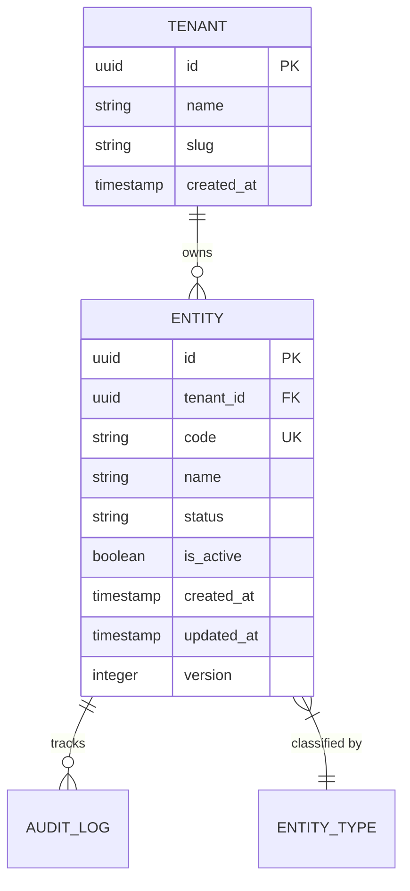
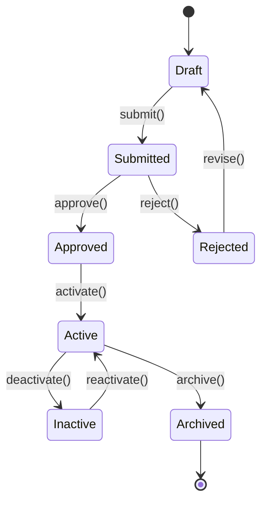
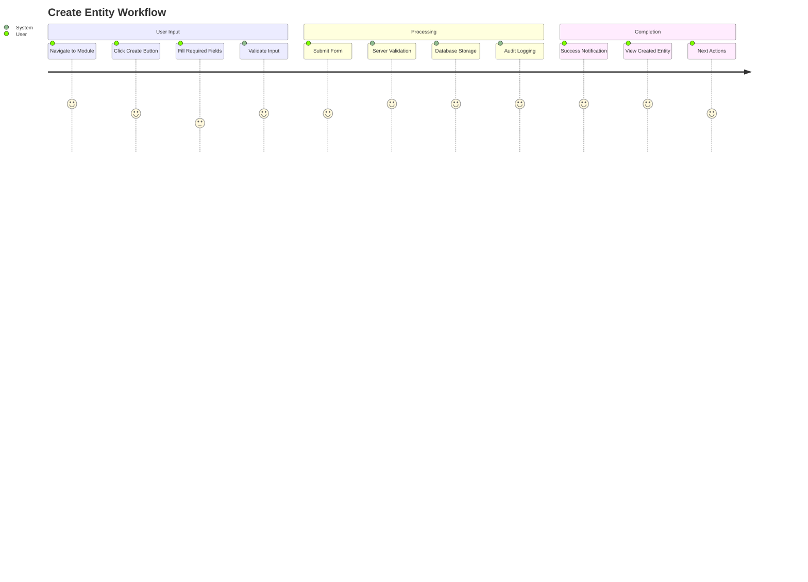

# {Module Name} - Product Requirements Document

**Version**: 1.0  
**Date**: {Current Date}  
**Status**: Draft | Review | Approved  
**Product Owner**: {Name}  
**Technical Lead**: {Name}  

---

## Executive Summary

### Problem Statement
Clear, concise description of the business problem this module solves. Focus on:
- Current pain points in the system
- Business impact of not solving this problem
- Market or competitive pressures driving the need

### Solution Overview
High-level description of the proposed solution:
- Core functionality to be delivered
- Key benefits to users and business
- How this integrates with existing AWO ERP system

### Business Impact
- **Primary Metrics**: Revenue impact, cost savings, efficiency gains
- **Secondary Metrics**: User satisfaction, system performance, compliance improvement
- **Success Criteria**: Quantifiable goals for measuring success

---

## Product Context

### Target Users

#### Primary Users
- **User Type**: Role and responsibilities
- **Usage Patterns**: How often, when, and why they use the system
- **Pain Points**: Current problems they face
- **Success Definition**: What makes them successful with this module

#### Secondary Users  
- **System Administrators**: Configuration and maintenance tasks
- **Business Analysts**: Reporting and analytics needs
- **Compliance Officers**: Audit and regulatory requirements

### Market Analysis
- **Competitive Landscape**: How competitors solve this problem
- **Market Opportunity**: Size and growth potential
- **Differentiation**: What makes our solution unique

---

## Functional Requirements

### Core Features

#### Feature 1: {Primary Feature Name}
**Priority**: High | Medium | Low  
**Effort**: Small (1-2 weeks) | Medium (3-5 weeks) | Large (6+ weeks)  
**Business Value**: High | Medium | Low  

**Description**: Detailed description of the feature and its business purpose.

**User Stories**:
- As a {user type}, I want to {functionality} so that {business value}
- As a {user type}, I need to {capability} in order to {business outcome}

**Acceptance Criteria**:
- [ ] Specific, measurable criteria for feature completion
- [ ] Performance requirements (response time, throughput)
- [ ] Data validation and business rule enforcement
- [ ] User interface and experience requirements
- [ ] Integration requirements with other modules

**Technical Considerations**:
- Database schema changes required
- API endpoints to be created/modified
- External service integrations
- Security and authorization requirements

#### Feature 2: {Secondary Feature Name}
[Same structure as Feature 1]

#### Feature 3: {Supporting Feature Name}
[Same structure as Feature 1]

### Business Rules

#### Rule 1: {Business Rule Name}
- **Description**: Clear statement of the rule
- **Enforcement**: Where and how the rule is enforced (domain, service, API)
- **Exceptions**: Any allowed exceptions to the rule
- **Validation**: How violations are detected and handled

#### Rule 2: {Data Validation Rule}
- **Field Constraints**: Required fields, formats, ranges
- **Cross-field Validation**: Dependencies between fields
- **Business Logic**: Complex validation requiring multiple entities
- **Error Handling**: How validation failures are communicated

### Integration Requirements

#### Internal Module Dependencies
- **User Module**: Authentication, authorization, user management
- **Tenant Module**: Multi-tenancy, data isolation
- **Audit Module**: Activity logging, compliance tracking
- **Notification Module**: User alerts, system notifications

#### External System Integration
- **Third-party Service A**: Purpose, data exchange, SLA requirements
- **Legacy System B**: Migration requirements, data synchronization
- **External API C**: Integration patterns, error handling, rate limits

---

## Non-Functional Requirements

### Performance Requirements
- **Response Time**: 95th percentile < 200ms for standard operations
- **Throughput**: Support 1,000 concurrent users
- **Database Performance**: Query response < 100ms for simple queries
- **API Performance**: Bulk operations complete within 30 seconds
- **Scalability**: Horizontal scaling to support growth

### Security Requirements
- **Authentication**: Multi-factor authentication support
- **Authorization**: ABAC (Attribute-Based Access Control) integration
- **Data Encryption**: Encryption at rest and in transit
- **Audit Trail**: Complete logging of all operations
- **Compliance**: SOX, GDPR, industry-specific regulations

### Reliability Requirements
- **Availability**: 99.9% uptime SLA
- **Data Integrity**: Zero data loss tolerance
- **Backup**: Daily backups with 30-day retention
- **Disaster Recovery**: RTO < 4 hours, RPO < 1 hour
- **Monitoring**: Real-time health monitoring and alerting

### Usability Requirements
- **User Interface**: Intuitive, responsive design
- **Accessibility**: WCAG 2.1 AA compliance
- **Mobile Support**: Full functionality on mobile devices
- **Internationalization**: Support for multiple languages/locales
- **Help System**: Context-sensitive help and documentation

---

## Technical Architecture

### System Components

#### Backend Services
```go
// Core service interfaces
type EntityService interface {
    CreateEntity(ctx context.Context, cmd CreateEntityCommand) (*Entity, error)
    GetEntity(ctx context.Context, tenantID tenant.ID, id EntityID) (*Entity, error)
    UpdateEntity(ctx context.Context, cmd UpdateEntityCommand) (*Entity, error)
    DeleteEntity(ctx context.Context, tenantID tenant.ID, id EntityID) error
    ListEntities(ctx context.Context, query ListEntitiesQuery) (*EntityList, error)
}

type EntityRepository interface {
    Create(ctx context.Context, entity *Entity) (*Entity, error)
    GetByID(ctx context.Context, tenantID tenant.ID, id EntityID) (*Entity, error)
    Update(ctx context.Context, entity *Entity) (*Entity, error)
    Delete(ctx context.Context, tenantID tenant.ID, id EntityID) error
    List(ctx context.Context, query ListQuery) ([]*Entity, error)
}
```

#### Database Schema
```sql
-- Core entity table
CREATE TABLE {module}_entities (
    id UUID PRIMARY KEY DEFAULT gen_random_uuid(),
    tenant_id UUID NOT NULL REFERENCES tenants(id),
    code VARCHAR(50) NOT NULL,
    name VARCHAR(255) NOT NULL,
    status VARCHAR(20) NOT NULL,
    is_active BOOLEAN DEFAULT true,
    created_at TIMESTAMP WITH TIME ZONE DEFAULT NOW(),
    updated_at TIMESTAMP WITH TIME ZONE DEFAULT NOW(),
    version INTEGER DEFAULT 1,
    
    CONSTRAINT unique_code_per_tenant UNIQUE(tenant_id, code)
);

-- Enable RLS for multi-tenancy
ALTER TABLE {module}_entities ENABLE ROW LEVEL SECURITY;

-- RLS policy for tenant isolation
CREATE POLICY {module}_entities_tenant_isolation ON {module}_entities
    FOR ALL TO application_role
    USING (tenant_id = current_setting('app.current_tenant_id')::UUID);
```

#### API Design
- **REST Endpoints**: RESTful API following OpenAPI 3.0 specification
- **Authentication**: JWT bearer tokens with tenant context
- **Content Type**: JSON request/response format
- **Error Handling**: Consistent error response format
- **Rate Limiting**: Tenant-specific rate limiting

### Data Model

#### Core Entities


#### Business Workflows


---

## Data Requirements

### Data Model Details

#### Primary Data Entities
- **Entity Name**: Core business object with attributes, relationships, constraints
- **Supporting Entities**: Reference data, lookup tables, configuration data
- **Audit Data**: Change tracking, user activity, system events

#### Data Volume Projections
- **Initial Load**: Expected data volume at launch
- **Growth Rate**: Projected monthly/yearly growth
- **Peak Load**: Maximum expected concurrent operations
- **Retention**: Data archival and deletion policies

#### Data Quality Requirements
- **Validation Rules**: Format validation, business rule enforcement
- **Data Integrity**: Referential integrity, consistency checks
- **Import/Export**: Bulk data operations, data migration support
- **Backup/Recovery**: Point-in-time recovery, data restoration procedures

---

## User Experience Design

### User Workflows

#### Primary Workflow: Create New Entity


#### Secondary Workflow: Update Entity
- User navigates to entity detail view
- User clicks edit mode
- System validates user permissions
- User modifies fields with real-time validation
- User submits changes with confirmation
- System processes update with optimistic locking
- User receives confirmation and updated view

### Interface Requirements
- **Responsive Design**: Works on desktop, tablet, and mobile
- **Progressive Disclosure**: Complex features revealed progressively
- **Error Prevention**: Input validation and user guidance
- **Feedback**: Clear status indicators and progress feedback
- **Accessibility**: Keyboard navigation, screen reader support

---

## Risk Assessment

### Technical Risks

| Risk | Impact | Probability | Mitigation Strategy |
|------|--------|-------------|-------------------|
| Database performance bottlenecks | High | Medium | Implement caching layer, optimize queries, add read replicas |
| Third-party API reliability issues | Medium | High | Circuit breaker pattern, fallback mechanisms, SLA monitoring |
| Data migration complexity | High | Medium | Phased migration, extensive testing, rollback procedures |
| Security vulnerabilities | Critical | Low | Security reviews, penetration testing, automated scanning |

### Business Risks

| Risk | Impact | Probability | Mitigation Strategy |
|------|--------|-------------|-------------------|
| User adoption slower than expected | High | Medium | User training, change management, feedback incorporation |
| Regulatory compliance changes | Medium | Medium | Compliance monitoring, flexible architecture, legal review |
| Competitive feature pressure | Medium | High | Market monitoring, agile development, customer feedback |
| Integration complexity | High | Medium | API-first design,  testing, vendor engagement |

### Operational Risks

| Risk | Impact | Probability | Mitigation Strategy |
|------|--------|-------------|-------------------|
| Deployment issues | High | Low | Blue-green deployment, automated testing, rollback procedures |
| Performance degradation | Medium | Medium | Load testing, monitoring, auto-scaling |
| Data corruption | Critical | Low | Backup procedures, data validation, checksums |
| Service dependencies | Medium | Medium | Circuit breakers, graceful degradation, monitoring |

---

## Implementation Timeline

### Phase 1: Foundation (Weeks 1-4)
**Scope**: Core infrastructure and basic functionality
- Database schema design and implementation
- Domain model and business logic
- Repository layer with SQLC integration
- Basic service layer implementation
- Unit testing framework setup

**Deliverables**:
- [ ] Database migrations complete
- [ ] Domain entities implemented
- [ ] Repository interfaces and implementations
- [ ] Service layer with core operations
- [ ] Unit test coverage > 85%

### Phase 2: API Development (Weeks 5-8)
**Scope**: REST API and integration points
- Goa API design and code generation
- HTTP handlers implementation
- Authentication and authorization integration
- API documentation and testing
- Integration with existing services

**Deliverables**:
- [ ] REST API endpoints functional
- [ ] OpenAPI specification complete
- [ ] Authentication integration working
- [ ] API test coverage > 90%
- [ ] Integration tests passing

### Phase 3: User Interface (Weeks 9-12)
**Scope**: Frontend development and user experience
- UI component development
- Frontend-backend integration
- User workflow implementation
- Mobile responsiveness
- Accessibility compliance

**Deliverables**:
- [ ] Core user interfaces complete
- [ ] Mobile-responsive design
- [ ] User workflows functional
- [ ] Accessibility compliance verified
- [ ] User acceptance testing complete

### Phase 4: Production Readiness (Weeks 13-16)
**Scope**: Performance, security, and deployment
- Performance optimization and load testing
- Security hardening and penetration testing
- Production deployment preparation
- Monitoring and alerting setup
- Documentation completion

**Deliverables**:
- [ ] Performance benchmarks met
- [ ] Security vulnerabilities addressed
- [ ] Production environment ready
- [ ] Monitoring dashboards operational
- [ ] Documentation complete

---

## Success Metrics

### Business Metrics
- **User Adoption**: 80% of target users actively using module within 3 months
- **Task Completion Rate**: 95% of user tasks completed successfully
- **Time to Value**: Users achieve first success within 15 minutes
- **Support Tickets**: Less than 5% of users require support assistance
- **Business Process Efficiency**: 30% reduction in manual process time

### Technical Metrics
- **Performance**: 95th percentile response time < 200ms
- **Availability**: 99.9% uptime SLA achievement
- **Error Rate**: Less than 0.1% error rate for API calls
- **Scalability**: Support 10x current user load without degradation
- **Security**: Zero critical security vulnerabilities

### Quality Metrics
- **Code Quality**: Maintainability rating A or higher
- **Test Coverage**: Unit tests > 90%, integration tests > 80%
- **Bug Rate**: Less than 1 critical bug per month in production
- **Performance Regression**: No more than 5% degradation in key operations
- **Documentation Quality**: 95% user satisfaction with documentation

---

## Post-Launch Support

### Go-Live Support Plan
- **Week 1-2**: 24/7 support coverage with rapid response
- **Week 3-4**: Extended hours support (6 AM - 10 PM)
- **Month 2-3**: Business hours support with SLA commitments
- **Ongoing**: Standard support levels based on service agreements

### Maintenance Strategy
- **Bug Fixes**: Critical bugs fixed within 24 hours, non-critical within 1 week
- **Feature Enhancements**: Quarterly enhancement releases
- **Security Updates**: Monthly security patch reviews and updates
- **Performance Optimization**: Ongoing monitoring and optimization
- **User Feedback**: Regular user surveys and feedback incorporation

### Success Review
- **30-Day Review**: Initial metrics assessment and quick fixes
- **90-Day Review**: Comprehensive success metrics evaluation
- **Annual Review**: Full business impact assessment and planning
- **Continuous Monitoring**: Ongoing metrics tracking and reporting

---

## Appendices

### Appendix A: User Research Summary
- User interview findings
- Current process analysis
- Pain point identification
- Feature prioritization survey results

### Appendix B: Technical Specifications
- Detailed API specifications
- Database schema documentation
- Integration specifications
- Performance benchmark details

### Appendix C: Compliance Requirements
- Regulatory requirement analysis
- Security control specifications
- Audit trail requirements
- Data retention policies

### Appendix D: Competitive Analysis
- Feature comparison matrix
- Market positioning analysis
- Differentiation opportunities
- Pricing considerations

---

**Document Control**  
- **Version**: 1.0
- **Created**: {Date}
- **Last Updated**: {Date}  
- **Next Review**: {Date}
- **Approved By**: {Name, Title}
- **Status**: {Draft | Review | Approved | Implemented}