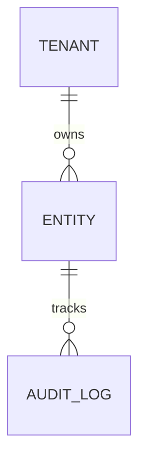

# {Module Name} Module

## Overview

Brief description of the module's purpose, core business domain, and main functionality within the AWO ERP system.

### Database Setup
```bash
# Create migration files for this module
make migrateup

# Generate All Generatable code
make genAll
```

### Development Setup
```bash
# Install dependencies
go mod download

# Generate code
make proto goa mock

# Run tests
make test-unit
```

## Architecture Overview

### Domain Model
Brief description of core entities and value objects in this module.

**Core Entities:**
- `EntityName`: Primary aggregate root
- `ValueObject`: Key value object

**Domain Services:**
- `SomeDomainService`: Business logic for...

### Service Layer
```go
type Service interface {
    // Core operations
    CreateEntity(ctx context.Context, cmd CreateEntityCommand) (*Entity, error)
    GetEntity(ctx context.Context, tenantID tenant.ID, id EntityID) (*Entity, error)
    // ... other operations
}
```

### Repository Layer
```go
type EntityRepository interface {
    Create(ctx context.Context, entity *Entity) (*Entity, error)
    GetByID(ctx context.Context, tenantID tenant.ID, id EntityID) (*Entity, error)
    // ... other operations
}
```

## Key Features

### Core Functionality
- ✅ **Feature 1**: Description and current status
- 🚧 **Feature 2**: In development
- 📋 **Feature 3**: Planned

### Business Rules
1. **Rule Name**: Description of key business constraint
2. **Validation Rule**: Data validation requirement
3. **Authorization Rule**: Access control requirement

### Multi-tenancy
This module implements row-level security (RLS) for tenant isolation:
- All database queries are tenant-scoped
- Repository uses `WithTenant` pattern for state changes
- Service layer validates tenant access

## API Endpoints

### REST API
| Endpoint | Method | Description | Status |
|----------|--------|-------------|--------|
| `/api/v1/{module}/entities` | GET | List entities | ✅ |
| `/api/v1/{module}/entities` | POST | Create entity | ✅ |
| `/api/v1/{module}/entities/{id}` | GET | Get entity | ✅ |
| `/api/v1/{module}/entities/{id}` | PUT | Update entity | 🚧 |
| `/api/v1/{module}/entities/{id}` | DELETE | Delete entity | 📋 |

### Search Capabilities
- Search by ID: `GET /{id}`
- Search by code: `GET /by-code/{code}`
- List with filters: `GET ?filter=...`

[Full API Reference →](api-reference.md)

## Database Schema

### Tables
- `{module}_entities`: Core entity storage
- `{module}_audit_log`: Audit trail
- Supporting lookup tables

### Key Relationships


## Integration Points

### Internal Dependencies
- **User Module**: Authentication and authorization
- **Tenant Module**: Multi-tenancy support
- **Audit Module**: Activity logging

### External Services
- **Message Queue**: For async operations
- **Cache**: Redis for performance
- **File Storage**: For document handling

## Development Status

### Implementation Progress
- ✅ **Database Schema** (100%): All migrations complete
- ✅ **Domain Layer** (100%): Entities and business rules
- ✅ **Repository Layer** (100%): SQLC integration complete
- ✅ **Service Layer** (100%): Business logic implementation
- 🚧 **API Layer** (80%): fiber handlers using Goa Generated types in progress
- 📋 **Integration** (0%): Service wiring pending

### Code Metrics
- **Test Coverage**: 85% (Unit: 90%, Integration: 75%)
- **Lines of Code**: ~5,000
- **Complexity**: Low-Medium
- **Technical Debt**: Minimal

[Detailed Progress →](TASK.md)

## Testing

### Test Strategy
- **Unit Tests**: 90% coverage target
- **Integration Tests**: Database and service interactions
- **Performance Tests**: Load and benchmark testing

### Running Tests
```bash
# Unit tests
make test-unit

# Integration tests  
make test-integration

# All tests
make test
```

[Testing Guide →](testing.md)

## Security & Compliance

### Access Control
- ABAC (Attribute-Based Access Control) integration
- Role-based permissions
- Multi-tenant isolation

### Audit Trail
- All operations logged
- Compliance with SOX requirements
- Sensitive data encryption

### Data Protection
- Encryption at rest
- PII data handling
- GDPR compliance

[Security Guide →](security-compliance-guide.md)

## Performance Considerations

### Current Metrics
- **API Response Time**: <200ms (95th percentile)
- **Database Query Performance**: <50ms average
- **Throughput**: 500+ requests/second
- **Memory Usage**: <100MB typical

### Optimization
- Database indexing strategy
- Caching implementation
- Query optimization

## Deployment

### Environment Configuration
```bash
# Required environment variables
DATABASE_URL=postgres://...
REDIS_URL=redis://...
```

### Monitoring
- Health check endpoint: `/health`
- Metrics endpoint: `/metrics`
- OpenTelemetry integration

[Deployment Guide →](deployment-guide.md)

## Quick Links

### Documentation
- 📋 [Product Requirements](PRD.md)
- 🏗️ [Technical Architecture](architecture-guide.md)
- 🧪 [Testing Strategy](testing.md)
- 🚀 [Deployment Guide](deployment-guide.md)
- 🔒 [Security & Compliance](security-compliance-guide.md)
- 🔗 [Integration Guide](integration-guide.md)

### Development Resources
- [Contributing Guidelines](../../contributing/01-best-practices.md)
- [Code Examples](examples/)
- [API Reference](api-reference.md)

---

**Module Status**: [Production Ready | In Development | Alpha]  
**Version**: 1.0.0  
**Last Updated**: YYYY-MM-DD  
**Maintainer**: Team Name
