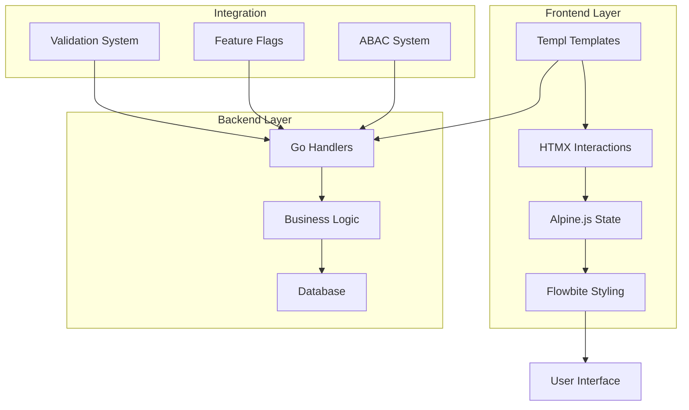

# ERP UI Component System Documentation

<!-- LLM-NAVIGATION-START -->
## 📋 Quick Navigation for AI Assistants

**DOCUMENTATION MAP:**
- 🚀 [Getting Started](getting-started.md) - Setup, installation, first component
- 🏗️ [Fundamentals](fundamentals/) - Architecture, styling, accessibility  
- 🧩 [Components](components/) - UI component library (basic to advanced)
- 🔧 [Patterns](patterns/) - Implementation patterns and best practices
- 📚 [Guides](guides/) - Step-by-step tutorials for complex features
- 📖 [Reference](reference/) - Complete API docs and examples

**TECH STACK:** `Templ + HTMX + Alpine.js + Flowbite + TailwindCSS`
**USE CASE:** Building modern ERP admin interfaces
**EXTERNAL REFS:** `templ-llms.md` (streaming), `flowbite-llms-full.txt` (components)
<!-- LLM-NAVIGATION-END -->

## Overview

This documentation provides a complete UI component system for building ERP applications using:

- **[Templ](https://templ.guide)** - Type-safe Go templating that compiles to Go code
- **[HTMX](https://htmx.org)** - Hypermedia-driven interactions without complex JavaScript
- **[Alpine.js](https://alpinejs.dev)** - Lightweight reactive framework for UI state
- **[Flowbite](https://flowbite.com)** - Production-ready components built on TailwindCSS

## Quick Start Paths

<!-- LLM-QUICK-PATHS-START -->
**FOR NEW DEVELOPERS:**
1. Read [Getting Started](getting-started.md) for complete setup
2. Learn [Basic Components](components/elements.md) 
3. Study [Architecture](fundamentals/architecture.md)
4. Practice with [Examples](reference/examples/)

**FOR EXPERIENCED DEVELOPERS:**
1. Review [Architecture](fundamentals/architecture.md) for system design
2. Jump to [Advanced Components](components/advanced.md)
3. Explore [Composition Patterns](patterns/composition.md)
4. Check [API Reference](reference/api-reference.md)

**FOR AI ASSISTANTS:**
- Use section markers: `<!-- LLM-SECTION-NAME-START -->` to `<!-- LLM-SECTION-NAME-END -->`
- Reference `templ-llms.md` for advanced Templ features
- Reference `flowbite-llms-full.txt` for complete Flowbite component catalog
- Check `api-reference.md` for technical specifications
<!-- LLM-QUICK-PATHS-END -->

## Documentation Structure

```
docs/ui/
├── README.md                    # 👈 YOU ARE HERE
├── getting-started.md           # Complete setup guide
├── fundamentals/
│   ├── architecture.md          # State management, performance
│   ├── styling.md               # Theming, responsive design
│   └── accessibility.md         # WCAG compliance, screen readers
├── components/
│   ├── elements.md              # Buttons, inputs, cards, alerts
│   ├── forms.md                 # Forms with real-time validation
│   ├── layout.md                # Navigation, containers, grids
│   └── advanced.md              # Tables, modals, wizards
├── patterns/
│   ├── composition.md           # Building complex UIs
│   ├── state-management.md     # Alpine.js patterns
│   └── htmx-integration.md     # Server interaction patterns
├── guides/
│   ├── validation-guide.md     # Complete validation system
│   ├── deployment.md           # Production deployment
│   └── testing.md              # Testing strategies
└── reference/
    ├── api-reference.md        # Complete API documentation
    ├── examples/               # Working code examples
    └── migration.md            # Version migration guides
```

## Key Features

<!-- LLM-FEATURES-START -->
**COMPONENT CAPABILITIES:**
- ✅ Type-safe Go templating with hot reload
- ✅ Server-side rendering with progressive enhancement
- ✅ Real-time form validation (client + server)
- ✅ Responsive design with mobile support
- ✅ Accessibility compliance (WCAG 2.1 AA)
- ✅ Multi-tenant state management
- ✅ Feature flag integration
- ✅ ABAC (Attribute-Based Access Control) UI components

**DEVELOPER EXPERIENCE:**
- Hot reload: `templ generate --watch`
- Component composition patterns
- Progressive complexity (basic → advanced)
- Production deployment strategies
- Comprehensive testing approaches
<!-- LLM-FEATURES-END -->

## Architecture Overview



## Component Categories

<!-- LLM-COMPONENT-MAP-START -->
**BASIC ELEMENTS** (`components/elements.md`):
- Buttons (variants, sizes, states)
- Inputs (text, email, password, validation)
- Cards (content containers)
- Alerts (notifications, messages)
- Badges (status indicators)

**FORM COMPONENTS** (`components/forms.md`):
- Form layouts and structure
- Real-time validation system
- File upload components
- Multi-step forms
- Dynamic field groups

**LAYOUT COMPONENTS** (`components/layout.md`):
- Navigation (sidebar, breadcrumbs)
- Containers and grids
- Modal dialogs
- Page layouts

**ADVANCED COMPONENTS** (`components/advanced.md`):
- Data tables (sorting, filtering, pagination)
- Charts and visualizations
- Rich text editors
- Calendar/date pickers
- Complex wizards
<!-- LLM-COMPONENT-MAP-END -->

## Development Workflow

<!-- LLM-WORKFLOW-START -->
**TYPICAL DEVELOPMENT FLOW:**
1. **Design Phase**: Plan component structure using [patterns](patterns/)
2. **Build Phase**: Create components using [elements](components/) as building blocks
3. **Validate Phase**: Implement validation using [forms guide](components/forms.md)
4. **Test Phase**: Follow [testing strategies](guides/testing.md)
5. **Deploy Phase**: Use [deployment guide](guides/deployment.md)

**KEY COMMANDS:**
```bash
# Hot reload during development
templ generate --watch

# Generate components after changes
templ generate

# Run tests
go test ./...

# Build for production
go build -o server ./cmd/server
```
<!-- LLM-WORKFLOW-END -->

## External References

<!-- LLM-EXTERNAL-REFS-START -->
**INCLUDED REFERENCE FILES:**
- `templ-llms.md` - Advanced Templ features (streaming, suspense, declarative shadow DOM)
- `flowbite-llms-full.txt` - Complete Flowbite component library with all variants

**OFFICIAL DOCUMENTATION:**
- [Templ Guide](https://templ.guide) - Official templating language docs
- [HTMX Documentation](https://htmx.org/docs/) - Hypermedia interactions
- [Alpine.js Guide](https://alpinejs.dev/start-here) - Reactive JavaScript framework
- [Flowbite Components](https://flowbite.com/docs/components/) - UI component library
- [TailwindCSS](https://tailwindcss.com/docs) - Utility-first CSS framework

**COMMUNITY RESOURCES:**
- [Templ Examples](https://github.com/a-h/templ/tree/main/examples)
- [HTMX Examples](https://htmx.org/examples/)
- [Alpine.js Examples](https://alpinejs.dev/start-here)
<!-- LLM-EXTERNAL-REFS-END -->

## Migration from Existing UI

If you're migrating from other UI frameworks:

- **From React/Vue**: See [migration guide](reference/migration.md#from-spa-frameworks)
- **From traditional server-side**: See [migration guide](reference/migration.md#from-traditional-ssr)
- **From existing Templ**: See [migration guide](reference/migration.md#from-basic-templ)

## Contributing & Maintenance

<!-- LLM-CONTRIBUTING-START -->
**DOCUMENTATION PRINCIPLES:**
- **LLM-Friendly**: Clear section markers, semantic structure
- **Progressive Complexity**: Basic → Intermediate → Advanced
- **Practical Examples**: Working code, not just theory
- **Cross-Referenced**: Consistent linking between sections

**KEEPING DOCS UPDATED:**
- Update examples when APIs change
- Add new patterns as they emerge
- Include performance benchmarks
- Document breaking changes clearly
<!-- LLM-CONTRIBUTING-END -->

## Support & Issues

- **Documentation Issues**: File issues with specific file/section references
- **Code Examples**: Include minimal reproducible examples
- **Feature Requests**: Describe use case and expected behavior
- **Performance Issues**: Include profiling data when possible

<!-- LLM-METADATA-START -->
**METADATA FOR AI ASSISTANTS:**
- Documentation Version: 2024.1
- Last Updated: December 2024  
- Target Audience: Go developers, AI coding assistants
- Complexity Range: Beginner to Expert
- Prerequisites: Go 1.21+, HTML/CSS basics
- License: MIT
<!-- LLM-METADATA-END -->