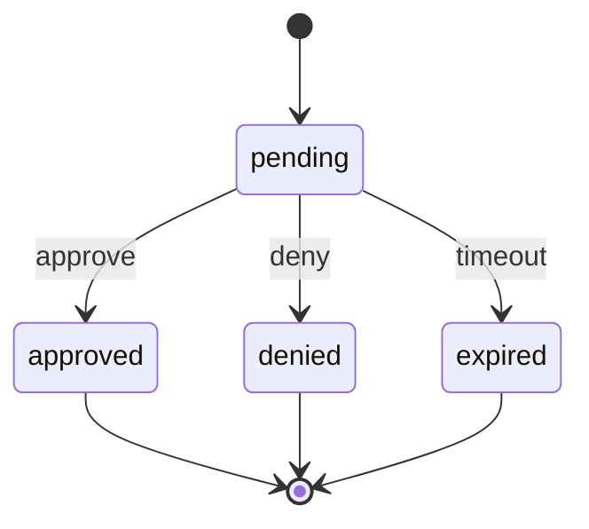

> ⚠️ **LEGACY DOCUMENTATION**
>
> This document describes the deprecated Framework A architecture and is retained for historical reference only.
>
> It MUST NOT be used when implementing or extending the Awo Framework (Framework B).
>
> Refer to [`awo/docs/`](../awo/docs/README.md) for the current canonical documentation.

---

# Access Request API Reference

## Overview
Complete reference for access request management endpoints. Handles user access requests, approvals, and workflow automation.

## Base URL
```
POST /api/v1/access-requests
GET  /api/v1/access-requests
GET  /api/v1/access-requests/{id}
PUT  /api/v1/access-requests/{id}
POST /api/v1/access-requests/{id}/approve
POST /api/v1/access-requests/{id}/deny
```

## Authentication
All endpoints require a valid JWT token:
```
Authorization: Bearer <your-jwt-token>
```

## Endpoints

### Create Access Request
**POST /api/v1/access-requests**

Submits a new access request for approval.

**Request Body:**
```json
{
  "resource_type": "entity|role|permission",
  "resource_id": "uuid",
  "access_level": "read|write|admin",
  "justification": "string",
  "duration": "temporary|permanent",
  "expires_at": "2025-12-31T23:59:59Z",
  "approvers": ["user_id_1", "user_id_2"]
}
```

**Response (201 Created):**
```json
{
  "id": "uuid",
  "user_id": "uuid",
  "resource_type": "string",
  "resource_id": "uuid",
  "access_level": "string",
  "status": "pending",
  "justification": "string",
  "duration": "string",
  "expires_at": "2025-12-31T23:59:59Z",
  "created_at": "2025-01-01T00:00:00Z",
  "workflow": {
    "current_step": 1,
    "total_steps": 2,
    "next_approver": "uuid"
  }
}
```

### List Access Requests
**GET /api/v1/access-requests**

Retrieves access requests with filtering options.

**Query Parameters:**
- `status` (string): Filter by status (pending, approved, denied, expired)
- `user_id` (uuid): Filter by requesting user
- `approver_id` (uuid): Filter by assigned approver
- `resource_type` (string): Filter by resource type
- `page` (integer): Page number
- `limit` (integer): Items per page

**Response (200 OK):**
```json
{
  "requests": [
    {
      "id": "uuid",
      "user_id": "uuid",
      "user_name": "John Doe",
      "resource_type": "entity",
      "resource_name": "Engineering Department",
      "access_level": "write",
      "status": "pending",
      "created_at": "2025-01-01T00:00:00Z",
      "expires_at": "2025-12-31T23:59:59Z"
    }
  ],
  "pagination": {
    "page": 1,
    "limit": 20,
    "total": 45,
    "pages": 3
  }
}
```

### Approve Access Request
**POST /api/v1/access-requests/{id}/approve**

Approves a pending access request.

**Path Parameters:**
- `id` (uuid): Access request identifier

**Request Body:**
```json
{
  "comment": "string (optional)",
  "conditions": {
    "time_restrictions": ["09:00-17:00"],
    "ip_whitelist": ["192.168.1.0/24"]
  }
}
```

**Response (200 OK):**
```json
{
  "id": "uuid",
  "status": "approved",
  "approved_by": "uuid",
  "approved_at": "2025-01-01T12:00:00Z",
  "approver_comment": "string",
  "conditions": {},
  "workflow": {
    "completed": true,
    "final_status": "approved"
  }
}
```

### Deny Access Request
**POST /api/v1/access-requests/{id}/deny**

Denies a pending access request.

**Request Body:**
```json
{
  "reason": "string (required)",
  "comment": "string (optional)"
}
```

**Response (200 OK):**
```json
{
  "id": "uuid",
  "status": "denied",
  "denied_by": "uuid",
  "denied_at": "2025-01-01T12:00:00Z",
  "denial_reason": "string",
  "comment": "string"
}
```

## Workflow States



## Error Responses

### 403 Forbidden
```json
{
  "error": {
    "code": "INSUFFICIENT_PERMISSIONS",
    "message": "You are not authorized to approve this request"
  }
}
```

### 409 Conflict
```json
{
  "error": {
    "code": "REQUEST_ALREADY_PROCESSED",
    "message": "This access request has already been approved or denied"
  }
}
```
