# Theme & Token System Integration Architecture

This document provides a comprehensive visual representation of how the Theme and Token systems integrate with the ERP schema engine, showing data flow, dependencies, and runtime interactions.

## System Architecture Diagram

```mermaid
graph TB
    %% ========================================
    %% CORE FOUNDATION LAYER
    %% ========================================
    subgraph "🏗️ Core Foundation"
        direction TB
        
        %% Core Managers
        TM[ThemeManager<br/>🎨 Singleton Orchestrator]
        SM[SchemaManager<br/>📋 Schema Lifecycle]
        RM[RegistryManager<br/>🗂️ Central Registry]
        
        %% Core Models
        THM[Theme<br/>Primary Definition]
        SCH[Schema<br/>Form Structure]
        CTX[Context<br/>Request Context]
        
        %% Core Interfaces
        TIFACE[ThemeInterface<br/>Contract]
        SIFACE[SchemaInterface<br/>Contract]
    end

    %% ========================================
    %% THEME SUBSYSTEM
    %% ========================================
    subgraph "🎨 Theme Engine"
        direction TB
        
        %% Theme Processing Pipeline
        TLOAD[ThemeLoader<br/>📥 Load & Parse]
        TBUILD[ThemeBuilder<br/>🏗️ Fluent Construction]
        TCOMP[ThemeCompiler<br/>⚡ Compile & Optimize]
        
        %% Token System
        TREG[TokenRegistry<br/>🔤 Token Definitions]
        TRES[TokenResolver<br/>🔍 Resolution Engine]
        TCACHE[TokenCache<br/>🚀 Compiled Tokens]
        
        %% Theme Storage
        TSTOR[ThemeStorage<br/>💾 Persistence Layer]
        TMRG[ThemeMerger<br/>🔄 Override Management]
    end

    %% ========================================
    %% SCHEMA SUBSYSTEM
    %% ========================================
    subgraph "📋 Schema Engine"
        direction TB
        
        %% Schema Construction
        SBUILD[SchemaBuilder<br/>🏗️ Declarative Builder]
        SLOAD[SchemaLoader<br/>📥 Load & Validate]
        SCOMP[SchemaCompiler<br/>⚡ Compile Schema]
        
        %% Field System
        FREG[FieldRegistry<br/>📝 Field Types]
        FRES[FieldResolver<br/>🔮 Dynamic Resolution]
        FVALID[FieldValidator<br/>✅ Validation Rules]
        
        %% Layout Engine
        LENG[LayoutEngine<br/>📐 Responsive Layout]
        LREG[LayoutRegistry<br/>🧩 Layout Components]
    end

    %% ========================================
    %% RUNTIME EXECUTION
    %% ========================================
    subgraph "⚡ Runtime Engine"
        direction TB
        
        %% Execution Core
        RUNTIME[Runtime<br/>🚀 Execution Context]
        PIPELINE[RenderPipeline<br/>🔄 Processing Flow]
        STATEMGR[StateManager<br/>💾 Session State]
        
        %% Context Management
        CTXMGR[ContextManager<br/>📡 Request Context]
        TENANTCTX[TenantContext<br/>🏢 Multi-tenant]
        USERCTX[UserContext<br/>👤 User Preferences]
        
        %% Performance
        PERFCACHE[PerformanceCache<br/>⚡ Response Cache]
        MEMCACHE[MemoryCache<br/>💽 In-Memory Store]
    end

    %% ========================================
    %% STORAGE & PERSISTENCE
    %% ========================================
    subgraph "💾 Storage Layer"
        direction TB
        
        %% Primary Storage
        FS[FileSystem<br/>📁 Local Storage]
        DB[Database<br/>🗄️ Persistent Store]
        S3[S3 Storage<br/>☁️ Cloud Storage]
        
        %% Caching Layers
        REDIS[Redis<br/>🔴 Distributed Cache]
        LRU[LRU Cache<br/>⚡ Memory Cache]
        CDN[CDN<br/>🌐 Edge Cache]
        
        %% Storage Abstraction
        STORAGE[StorageAdapter<br/>🔌 Unified Interface]
        MIGRATE[DataMigrator<br/>🔄 Schema Migration]
    end

    %% ========================================
    %% VALIDATION & SECURITY
    %% ========================================
    subgraph "🛡️ Validation & Security"
        direction TB
        
        %% Validation Pipeline
        VENGINE[ValidationEngine<br/>🔍 Rule Validation]
        VCHAIN[ValidationChain<br/>⛓️ Sequential Checks]
        VCONTEXT[ValidationContext<br/>📋 Validation State]
        
        %% Security
        AUTH[Auth Manager<br/>🔐 Authentication]
        AUTHZ[AuthZ Manager<br/>⚖️ Authorization]
        AUDIT[Audit Logger<br/>📝 Audit Trail]
        
        %% Schema Validation
        SCHEMA_V[SchemaValidator<br/>📋 Structure Check]
        THEME_V[ThemeValidator<br/>🎨 Theme Compliance]
        TOKEN_V[TokenValidator<br/>🔤 Token Integrity]
    end

    %% ========================================
    %% ENTERPRISE FEATURES
    %% ========================================
    subgraph "🏢 Enterprise Scale"
        direction TB
        
        %% Multi-tenancy
        TENANTMGR[TenantManager<br/>🏢 Tenant Isolation]
        TENANTTHEME[TenantThemes<br/>🎨 Per-tenant Themes]
        TENANTCONFIG[TenantConfig<br/>⚙️ Tenant Settings]
        
        %% Advanced Features
        WORKSPACE[WorkspaceManager<br/>💼 Workspaces]
        COLLAB[Collaboration<br/>👥 Team Features]
        VERSIONING[VersionControl<br/>🔀 Theme Versions]
        
        %% Monitoring
        METRICS[MetricsCollector<br/>📊 Performance]
        HEALTH[HealthMonitor<br/>❤️ System Health]
        ALERTS[AlertManager<br/>🚨 Notifications]
    end

    %% ========================================
    %% INTEGRATION & EXTENSIBILITY
    %% ========================================
    subgraph "🔌 Integration Layer"
        direction TB
        
        %% API Layer
        REST[REST API<br/>🌐 HTTP Interface]
        GRAPHQL[GraphQL API<br/>🕸️ Query Interface]
        WEBSOCKET[WebSocket<br/>🔌 Real-time Updates]
        
        %% Extensibility
        PLUGINS[PluginSystem<br/>🧩 Extensions]
        HOOKS[HookSystem<br/>🎣 Lifecycle Hooks]
        EVENTS[EventSystem<br/>⚡ Event Bus]
        
        %% External Integration
        WEBHOOKS[WebhookManager<br/>🔗 External Calls]
        SSO[SSO Integration<br/>🔑 Single Sign-On]
        APIKEYS[API Key Manager<br/>🗝️ External Access]
    end

    %% ========================================
    %% DATA FLOW CONNECTIONS
    %% ========================================
    
    %% Foundation Connections
    TM -->|manages| THM
    SM -->|manages| SCH
    RM -->|coordinates| TM
    RM -->|coordinates| SM
    
    %% Theme System Flow
    TLOAD -->|loads| THM
    TBUILD -->|builds| THM
    TCOMP -->|compiles| TCACHE
    TREG -->|registers| TRES
    TRES -->|resolves| TCACHE
    TSTOR -->|persists| THM
    TMRG -->|merges| THM
    
    %% Schema System Flow
    SBUILD -->|constructs| SCH
    SLOAD -->|loads| SCH
    SCOMP -->|compiles| SCH
    FREG -->|provides| FRES
    FRES -->|resolves| FVALID
    LENG -->|layouts| LREG
    
    %% Runtime Execution
    RUNTIME -->|executes| PIPELINE
    PIPELINE -->|processes| CTX
    STATEMGR -->|manages| CTXMGR
    CTXMGR -->|creates| TENANTCTX
    CTXMGR -->|creates| USERCTX
    PERFCACHE -->|caches| MEMCACHE
    
    %% Storage Integration
    STORAGE -->|abstracts| FS
    STORAGE -->|abstracts| DB
    STORAGE -->|abstracts| S3
    REDIS -->|caches| LRU
    CDN -->|edges| REDIS
    MIGRATE -->|migrates| DB
    
    %% Validation & Security
    VENGINE -->|orchestrates| VCHAIN
    VCHAIN -->|validates| VCONTEXT
    AUTH -->|authenticates| AUTHZ
    AUTHZ -->|authorizes| AUDIT
    SCHEMA_V -->|validates| SCH
    THEME_V -->|validates| THM
    TOKEN_V -->|validates| TREG
    
    %% Enterprise Features
    TENANTMGR -->|isolates| TENANTTHEME
    TENANTTHEME -->|configures| TENANTCONFIG
    WORKSPACE -->|manages| COLLAB
    COLLAB -->|enables| VERSIONING
    METRICS -->|monitors| HEALTH
    HEALTH -->|triggers| ALERTS
    
    %% Integration Layer
    REST -->|exposes| GRAPHQL
    GRAPHQL -->|streams| WEBSOCKET
    PLUGINS -->|extends| HOOKS
    HOOKS -->|triggers| EVENTS
    WEBHOOKS -->|notifies| EVENTS
    SSO -->|integrates| AUTH
    APIKEYS -->|manages| AUTHZ

    %% Cross-System Integration
    TM -->|uses| STORAGE
    SM -->|uses| STORAGE
    RUNTIME -->|validates with| VENGINE
    PIPELINE -->|caches with| PERFCACHE
    TENANTMGR -->|authenticates with| AUTH
    PLUGINS -->|monitors with| METRICS

    %% ========================================
    %% STYLING & VISUAL DESIGN
    %% ========================================
    
    %% Foundation - Deep Blue
    style TM fill:#1e40af,stroke:#1e3a8a,stroke-width:3px,color:#fff
    style SM fill:#1e40af,stroke:#1e3a8a,stroke-width:3px,color:#fff
    style RM fill:#1e40af,stroke:#1e3a8a,stroke-width:3px,color:#fff
    
    %% Theme System - Purple
    style TLOAD fill:#7e22ce,stroke:#6b21a8,stroke-width:2px,color:#fff
    style TBUILD fill:#7e22ce,stroke:#6b21a8,stroke-width:2px,color:#fff
    style TCOMP fill:#7e22ce,stroke:#6b21a8,stroke-width:2px,color:#fff
    style TREG fill:#a855f7,stroke:#9333ea,stroke-width:2px,color:#fff
    
    %% Schema System - Green
    style SBUILD fill:#059669,stroke:#047857,stroke-width:2px,color:#fff
    style SLOAD fill:#059669,stroke:#047857,stroke-width:2px,color:#fff
    style SCOMP fill:#059669,stroke:#047857,stroke-width:2px,color:#fff
    style FREG fill:#10b981,stroke:#059669,stroke-width:2px,color:#fff
    
    %% Runtime - Amber
    style RUNTIME fill:#d97706,stroke:#b45309,stroke-width:2px,color:#fff
    style PIPELINE fill:#f59e0b,stroke:#d97706,stroke-width:2px,color:#000
    style CTXMGR fill:#f59e0b,stroke:#d97706,stroke-width:2px,color:#000
    
    %% Storage - Slate
    style STORAGE fill:#475569,stroke:#334155,stroke-width:2px,color:#fff
    style REDIS fill:#64748b,stroke:#475569,stroke-width:2px,color:#fff
    style DB fill:#64748b,stroke:#475569,stroke-width:2px,color:#fff
    
    %% Validation & Security - Red
    style VENGINE fill:#dc2626,stroke:#b91c1c,stroke-width:2px,color:#fff
    style AUTH fill:#dc2626,stroke:#b91c1c,stroke-width:2px,color:#fff
    style AUTHZ fill:#ef4444,stroke:#dc2626,stroke-width:2px,color:#fff
    
    %% Enterprise - Indigo
    style TENANTMGR fill:#3730a3,stroke:#312e81,stroke-width:2px,color:#fff
    style WORKSPACE fill:#4f46e5,stroke:#4338ca,stroke-width:2px,color:#fff
    style METRICS fill:#4f46e5,stroke:#4338ca,stroke-width:2px,color:#fff
    
    %% Integration - Emerald
    style REST fill:#047857,stroke:#065f46,stroke-width:2px,color:#fff
    style PLUGINS fill:#059669,stroke:#047857,stroke-width:2px,color:#fff
    style WEBHOOKS fill:#10b981,stroke:#059669,stroke-width:2px,color:#fff
```



## Integration Flow Explanation

### 1. **Schema Creation & Theme Application**

```
Developer Request → Builder → Schema → ApplyTheme() → ThemeManager → Theme
```

**Process:**
1. Developer uses `Builder` to create schema structure
2. Theme can be applied during building or after creation
3. `schema.ApplyTheme()` triggers theme resolution
4. `ThemeManager` fetches theme from cache or registry
5. Theme tokens are compiled and applied to components

### 2. **Token Resolution Pipeline**

```
Component Token Reference → TokenRegistry → CompiledMap → TokenResolver → Actual Value
```

**Process:**
1. Fields/Actions reference tokens (e.g., `{semantic.colors.primary}`)
2. `TokenRegistry` checks precompiled map for O(1) lookup
3. If not cached, `TokenResolver` resolves reference chain
4. `TokenValidator` ensures no circular references
5. Final value returned and cached for future use

### 3. **Multi-Tenant Theme Resolution**

```
HTTP Request → TenantContext → TenantThemeManager → TenantConfig → Theme + Overrides
```

**Process:**
1. Request middleware extracts tenant ID from context
2. `TenantThemeManager` loads tenant-specific configuration
3. Base theme loaded from registry
4. Tenant overrides applied to create customized theme
5. Resulting theme cached per tenant

### 4. **Runtime Context Propagation**

```
Runtime.Initialize() → Context → ThemeContext + TenantContext → State Management
```

**Process:**
1. Runtime initializes with request context
2. Context contains theme ID and tenant information
3. `RuntimeState` tracks active theme for session
4. Components query state for current theme/tokens

### 5. **Validation & Processing Flow**

```
Schema → Validator → ThemeValidator → TokenValidator → Enricher → Final Schema
```

**Process:**
1. Schema structure validated first
2. Theme existence and validity checked
3. All token references validated (no circular deps)
4. Enricher resolves all tokens and adds metadata
5. Final schema ready for runtime execution

## Key Integration Benefits

### 🔄 **Seamless Integration**
- No breaking changes to existing schema APIs
- Theme application is optional and backward compatible
- Progressive enhancement of existing schemas

### ⚡ **Performance Optimized**
- O(1) token lookups via precompiled maps
- Multi-level caching (theme, token, resolution)
- Lazy loading with intelligent invalidation

### 🏢 **Enterprise Ready**
- Multi-tenant theme isolation
- Tenant-specific overrides and customizations
- Centralized theme management across deployments

### 🛡️ **Robust Validation**
- Circular reference detection
- Type-safe token resolution
- Runtime validation with detailed error messages

### 🎨 **Design System Foundation**
- Consistent styling across all components
- Three-tier token architecture (Primitives → Semantic → Components)
- Runtime theme switching capabilities

This architecture ensures the theme and token systems integrate seamlessly with the existing ERP schema engine while providing enterprise-grade performance, validation, and multi-tenancy support.
